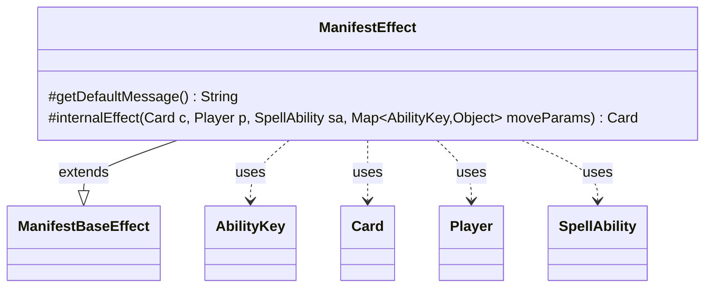

---
aliases:
  - ManifestEffect
tags:
  - java/class
  - module/forge-game
  - pkg/forge/game/ability/effects
fqn: forge.game.ability.effects.ManifestEffect
package: forge.game.ability.effects
module: forge-game
kind: Class
---

# ManifestEffect

**Package:** `forge.game.ability.effects` &nbsp; **Module:** `forge-game` &nbsp; **Kind:** Class



## Relationships
**Extends:**
- [[forge.game.ability.effects.ManifestBaseEffect|ManifestBaseEffect]]
**Uses:**
- [[forge.game.ability.AbilityKey|AbilityKey]]
- [[forge.game.card.Card|Card]]
- [[forge.game.player.Player|Player]]
- [[forge.game.spellability.SpellAbility|SpellAbility]]

## Design Description

Manifest puts a face-down 2/2 creature onto the battlefield that its controller may later turn face up if it is a creature card. As a concrete `ManifestBaseEffect` subclass, `ManifestEffect` supplies only the two pieces of behaviour the template method base leaves abstract: `getDefaultMessage()` returns the localized "choose card to manifest" prompt, and `internalEffect()` performs the actual manifestation by delegating to `Card.manifest()`.

The class is deliberately thin, relying on its superclass to drive card selection and movement while it specifies the manifest-specific step. It collaborates with `Card`, `Player`, and `SpellAbility` to manifest the chosen card for the controller, threading `AbilityKey` move parameters through to the move. Notable design intent is the optional `RememberManifested` parameter: when set and the resulting card is genuinely manifested, the host card remembers it so later linked abilities can reference the manifested permanent.

## Source
`forge-game/src/main/java/forge/game/ability/effects/ManifestEffect.java`

```java
package forge.game.ability.effects;

import java.util.Map;

import forge.game.ability.AbilityKey;
import forge.game.card.Card;
import forge.game.player.Player;
import forge.game.spellability.SpellAbility;
import forge.util.Localizer;

public class ManifestEffect extends ManifestBaseEffect {
    @Override
    protected String getDefaultMessage() {
        return Localizer.getInstance().getMessage("lblChooseCardToManifest");
    }
    @Override
    protected Card internalEffect(Card c, Player p, SpellAbility sa, Map<AbilityKey, Object> moveParams) {
        final Card source = sa.getHostCard();
        Card rem = c.manifest(p, sa, moveParams);
        if (rem != null && sa.hasParam("RememberManifested") && rem.isManifested()) {
            source.addRemembered(rem);
        }
        return rem;
    }
}
```
