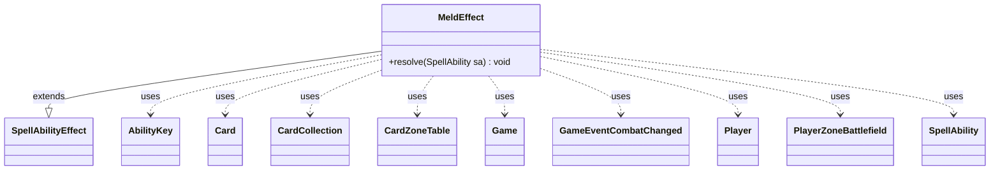

---
aliases:
  - MeldEffect
tags:
  - java/class
  - module/forge-game
  - pkg/forge/game/ability/effects
fqn: forge.game.ability.effects.MeldEffect
package: forge.game.ability.effects
module: forge-game
kind: Class
---

# MeldEffect

**Package:** `forge.game.ability.effects` &nbsp; **Module:** `forge-game` &nbsp; **Kind:** Class



## Relationships
**Extends:**
- [[forge.game.ability.SpellAbilityEffect|SpellAbilityEffect]]
**Uses:**
- [[forge.game.Game|Game]]
- [[forge.game.ability.AbilityKey|AbilityKey]]
- [[forge.game.card.Card|Card]]
- [[forge.game.card.CardCollection|CardCollection]]
- [[forge.game.card.CardZoneTable|CardZoneTable]]
- [[forge.game.event.GameEventCombatChanged|GameEventCombatChanged]]
- [[forge.game.player.Player|Player]]
- [[forge.game.spellability.SpellAbility|SpellAbility]]
- [[forge.game.zone.PlayerZoneBattlefield|PlayerZoneBattlefield]]

## Design Description

MeldEffect implements the resolution logic for Magic's "meld" mechanic, in which two specific cards combine into a single double-faced permanent. As a concrete subclass of `SpellAbilityEffect`, it overrides `resolve(SpellAbility)` to carry out the merge when the host card's ability resolves, integrating with Forge's standard ability-effect dispatch rather than exposing its own API. The effect locates the secondary card—a permanent the activating player owns and controls matching the named `Secondary` (defaulting to a creature)—via `CardLists`/`CardPredicates` filtering, prompting the controller to choose one. It exiles both cards through the game action layer, using `AbilityKey` move-parameter maps and a `CardZoneTable` to batch and fire zone-change triggers. Notably, it validates state defensively after exile—rejecting tokens, clones, renamed, or displaced cards—before melding: switching the primary to its `Meld` face, linking the secondary via `setMeldedWith`, registering it in the battlefield's melded set, moving the result into play, and optionally adding it to combat with a `GameEventCombatChanged` notification.

## Source
`forge-game/src/main/java/forge/game/ability/effects/MeldEffect.java`

```java
package forge.game.ability.effects;

import forge.card.CardStateName;
import forge.game.Game;
import forge.game.ability.AbilityKey;
import forge.game.ability.SpellAbilityEffect;
import forge.game.card.Card;
import forge.game.card.CardCollection;
import forge.game.card.CardLists;
import forge.game.card.CardPredicates;
import forge.game.card.CardZoneTable;
import forge.game.event.GameEventCombatChanged;
import forge.game.player.Player;
import forge.game.spellability.SpellAbility;
import forge.game.zone.PlayerZoneBattlefield;
import forge.game.zone.ZoneType;
import forge.util.Localizer;
import java.util.Arrays;
import java.util.Map;

public class MeldEffect extends SpellAbilityEffect {
    @Override
    public void resolve(SpellAbility sa) {
        Card hostCard = sa.getHostCard();
        String primName = sa.getParam("Primary");
        String secName = sa.getParam("Secondary");
        Game game = hostCard.getGame();
        Player controller = sa.getActivatingPlayer();

        // a permanent you control and own named secondary
        CardCollection field = CardLists.filter(
                controller.getCardsIn(ZoneType.Battlefield),
                CardPredicates.isOwner(controller),
                CardPredicates.nameEquals(secName));
        field = CardLists.getType(field, sa.getParamOrDefault("SecondaryType", "Creature"));
        if (field.isEmpty()) {
            return;
        }

        Card secondary = controller.getController().chooseSingleEntityForEffect(field, sa, Localizer.getInstance().getMessage("lblChooseCardToMeld"), null);

        CardCollection exiled = CardLists.filter(Arrays.asList(hostCard, secondary), CardPredicates.canExiledBy(sa, true));

        Map<AbilityKey, Object> moveParams = AbilityKey.newMap();
        CardZoneTable zoneMovements = AbilityKey.addCardZoneTableParams(moveParams, sa);

        exiled = game.getAction().exile(exiled, sa, moveParams);

        zoneMovements.triggerChangesZoneAll(game, sa);

        if (exiled.size() < 2) {
            return;
        }

        Card primary = exiled.get(hostCard);
        secondary = exiled.get(secondary);

        // cards has wrong name in exile
        if (!primary.sharesNameWith(primName) || !secondary.sharesNameWith(secName)) {
            return;
        }

        for (Card c : exiled) {
            if (c.isToken() || c.getCloneOrigin() != null) {
                // Neither of these things
                return;
            } else if (!c.isInZone(ZoneType.Exile)) {
                return;
            }
        }

        if (sa.hasParam("Tapped")) {
            primary.setTapped(true);
        }

        primary.changeToState(CardStateName.Meld);
        primary.setBackSide(true);
        primary.setMeldedWith(secondary);
        PlayerZoneBattlefield bf = (PlayerZoneBattlefield)controller.getZone(ZoneType.Battlefield);
        bf.addToMelded(secondary);

        moveParams = AbilityKey.newMap();
        zoneMovements = AbilityKey.addCardZoneTableParams(moveParams, sa);

        Card movedCard = game.getAction().moveToPlay(primary, controller, sa, moveParams);
        if (addToCombat(movedCard, sa, "Attacking", "Blocking")) {
            game.updateCombatForView();
            game.fireEvent(new GameEventCombatChanged());
        }

        zoneMovements.triggerChangesZoneAll(game, sa);
    }
}
```
