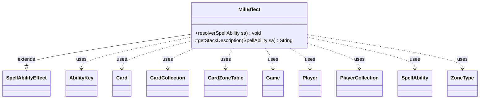

---
aliases:
  - MillEffect
tags:
  - java/class
  - module/forge-game
  - pkg/forge/game/ability/effects
fqn: forge.game.ability.effects.MillEffect
package: forge.game.ability.effects
module: forge-game
kind: Class
---

# MillEffect

**Package:** `forge.game.ability.effects`   **Module:** `forge-game`   **Kind:** Class



## Relationships
**Extends:**
- [[forge.game.ability.SpellAbilityEffect|SpellAbilityEffect]]
**Uses:**
- [[forge.game.Game|Game]]
- [[forge.game.ability.AbilityKey|AbilityKey]]
- [[forge.game.card.Card|Card]]
- [[forge.game.card.CardCollection|CardCollection]]
- [[forge.game.card.CardZoneTable|CardZoneTable]]
- [[forge.game.player.Player|Player]]
- [[forge.game.player.PlayerCollection|PlayerCollection]]
- [[forge.game.spellability.SpellAbility|SpellAbility]]
- [[forge.game.zone.ZoneType|ZoneType]]

## Design Description

MillEffect implements Magic's "mill" action as a concrete `SpellAbilityEffect`, the abstract base it extends within Forge's ability-effect framework. Its `resolve` method moves a configurable number of cards (`NumCards`, default 1) from the top of each target player's library to a destination zone—Graveyard by default, but also Ante or others via the `Destination` parameter—delegating the actual transfer to `game.getAction().mill`. It honors optional player consent (CR 701.13b) by prompting before milling, skipping players who decline or have too few cards, and performs post-resolution bookkeeping by remembering or imprinting the milled cards on the host.

The class collaborates with `Player`/`PlayerCollection` to resolve targets, `Card`/`CardCollection` for the milled cards, and `ZoneType` for source and destination zones, while a `CardZoneTable` (assembled from `AbilityKey` move params) batches the moves so zone-change triggers fire together in one pass. The overridden `getStackDescription` builds grammatically correct, localized log text, reflecting Forge's data-driven, parameter-keyed approach to encoding card effects.

## Source
`forge-game/src/main/java/forge/game/ability/effects/MillEffect.java`

```java
package forge.game.ability.effects;

import forge.game.Game;
import forge.game.ability.AbilityKey;
import forge.game.ability.AbilityUtils;
import forge.game.ability.SpellAbilityEffect;
import forge.game.card.Card;
import forge.game.card.CardCollection;
import forge.game.card.CardZoneTable;
import forge.game.player.Player;
import forge.game.player.PlayerCollection;
import forge.game.spellability.SpellAbility;
import forge.game.zone.ZoneType;
import forge.util.Lang;
import forge.util.Localizer;
import forge.util.TextUtil;

import java.util.Map;

public class MillEffect extends SpellAbilityEffect {

    @Override
    public void resolve(SpellAbility sa) {
        final Card source = sa.getHostCard();
        final Game game = source.getGame();
        final int numCards = sa.hasParam("NumCards") ? AbilityUtils.calculateAmount(source, sa.getParam("NumCards"), sa) : 1;

        if (numCards <= 0) {
            return;
        }

        if (sa.hasParam("ForgetOtherRemembered")) {
            source.clearRemembered();
        }

        ZoneType destination = ZoneType.smartValueOf(sa.getParam("Destination"));
        if (destination == null) {
            destination = ZoneType.Graveyard;
        }

        final PlayerCollection millers = getTargetPlayers(sa);

        if (sa.hasParam("Optional")) {
            final PlayerCollection toRemove = new PlayerCollection();
            for (Player p : millers) {
                String d = destination.equals(ZoneType.Graveyard) ? "" : " (" + destination.getTranslatedName() + ")";
                final String prompt = TextUtil.concatWithSpace(Localizer.getInstance().
                        getMessage("lblDoYouWantToMill", Lang.nounWithNumeral(numCards, "card"), d));
                // CR 701.13b
                if (numCards > p.getZone(ZoneType.Library).size() || !p.getController().confirmAction(sa, null, prompt, null)) {
                    toRemove.add(p);
                }
            }
            millers.removeAll(toRemove);
        }

        Map<AbilityKey, Object> moveParams = AbilityKey.newMap();
        final CardZoneTable table = AbilityKey.addCardZoneTableParams(moveParams, sa);
        CardCollection milled = game.getAction().mill(millers, numCards, destination, sa, moveParams);

        if (sa.hasParam("RememberMilled")) {
            sa.getHostCard().addRemembered(milled);
        }
        if (sa.hasParam("Imprint")) {
            sa.getHostCard().addImprintedCards(milled);
        }

        // run trigger if something got milled
        table.triggerChangesZoneAll(game, sa);
    }

    @Override
    protected String getStackDescription(SpellAbility sa) {
        final StringBuilder sb = new StringBuilder();
        final int numCards = sa.hasParam("NumCards") ? AbilityUtils.calculateAmount(sa.getHostCard(), sa.getParam("NumCards"), sa) : 1;
        final boolean optional = sa.hasParam("Optional");
        final boolean eachP = sa.hasParam("Defined") && sa.getParam("Defined").equals("Player");
        String each = "Each player";
        final PlayerCollection tgtPs = getTargetPlayers(sa);

        if (sa.hasParam("IfDesc")) {
            final String ifD = sa.getParam("IfDesc");
            if (ifD.equals("True")) {
                String ifDesc = sa.getDescription();
                if (ifDesc.contains(",")) {
                    sb.append(ifDesc, 0, ifDesc.indexOf(",") + 1);
                } else {
                    sb.append("[MillEffect IfDesc parsing error]");
                }
            } else {
                sb.append(ifD);
            }
            sb.append(" ");
            each = each.toLowerCase();
        }

        sb.append(eachP ? each : Lang.joinHomogenous(tgtPs));
        sb.append(" ");

        final ZoneType dest = ZoneType.smartValueOf(sa.getParam("Destination"));
        sb.append(optional ? "may " : "");
        if ((dest == null) || dest.equals(ZoneType.Graveyard)) {
            sb.append("mill");
        } else if (dest.equals(ZoneType.Ante)) {
            sb.append("ante");
        }
        sb.append((optional || tgtPs.size() > 1) && !eachP ? " " : "s ");

        sb.append(Lang.nounWithNumeralExceptOne(numCards, "card")).append(".");

        return sb.toString();
    }
}
```

## Python
`forge/game/ability/effects/MillEffect.py`

````python
package forge.game.ability.effects ΓÇö translated below.

```
from typing import Optional
```

I'll output only the Python source as required:

from forge.game.Game import Game
from forge.game.ability.AbilityKey import AbilityKey
from forge.game.ability.AbilityUtils import AbilityUtils
from forge.game.ability.SpellAbilityEffect import SpellAbilityEffect
from forge.game.card.Card import Card
from forge.game.card.CardCollection import CardCollection
from forge.game.card.CardZoneTable import CardZoneTable
from forge.game.player.Player import Player
from forge.game.player.PlayerCollection import PlayerCollection
from forge.game.spellability.SpellAbility import SpellAbility
from forge.game.zone.ZoneType import ZoneType
from forge.util.Lang import Lang
from forge.util.Localizer import Localizer
from forge.util.TextUtil import TextUtil


class MillEffect(SpellAbilityEffect):

    def resolve(self, sa: SpellAbility) -> None:
        source = sa.getHostCard()
        game = source.getGame()
        numCards = AbilityUtils.calculateAmount(source, sa.getParam("NumCards"), sa) if sa.hasParam("NumCards") else 1

        if numCards <= 0:
            return

        if sa.hasParam("ForgetOtherRemembered"):
            source.clearRemembered()

        destination = ZoneType.smartValueOf(sa.getParam("Destination"))
        if destination is None:
            destination = ZoneType.Graveyard

        millers = self.getTargetPlayers(sa)

        if sa.hasParam("Optional"):
            toRemove = PlayerCollection()
            for p in millers:
                d = "" if destination == ZoneType.Graveyard else " (" + destination.getTranslatedName() + ")"
                prompt = TextUtil.concatWithSpace(Localizer.getInstance().
                        getMessage("lblDoYouWantToMill", Lang.nounWithNumeral(numCards, "card"), d))
                # CR 701.13b
                if numCards > p.getZone(ZoneType.Library).size() or not p.getController().confirmAction(sa, None, prompt, None):
                    toRemove.add(p)
            millers.removeAll(toRemove)

        moveParams = AbilityKey.newMap()
        table = AbilityKey.addCardZoneTableParams(moveParams, sa)
        milled = game.getAction().mill(millers, numCards, destination, sa, moveParams)

        if sa.hasParam("RememberMilled"):
            sa.getHostCard().addRemembered(milled)
        if sa.hasParam("Imprint"):
            sa.getHostCard().addImprintedCards(milled)

        # run trigger if something got milled
        table.triggerChangesZoneAll(game, sa)

    def getStackDescription(self, sa: SpellAbility) -> str:
        sb = []
        numCards = AbilityUtils.calculateAmount(sa.getHostCard(), sa.getParam("NumCards"), sa) if sa.hasParam("NumCards") else 1
        optional = sa.hasParam("Optional")
        eachP = sa.hasParam("Defined") and sa.getParam("Defined") == "Player"
        each = "Each player"
        tgtPs = self.getTargetPlayers(sa)

        if sa.hasParam("IfDesc"):
            ifD = sa.getParam("IfDesc")
            if ifD == "True":
                ifDesc = sa.getDescription()
                if "," in ifDesc:
                    sb.append(ifDesc[0:ifDesc.index(",") + 1])
                else:
                    sb.append("[MillEffect IfDesc parsing error]")
            else:
                sb.append(ifD)
            sb.append(" ")
            each = each.lower()

        sb.append(each if eachP else Lang.joinHomogenous(tgtPs))
        sb.append(" ")

        dest = ZoneType.smartValueOf(sa.getParam("Destination"))
        sb.append("may " if optional else "")
        if (dest is None) or dest == ZoneType.Graveyard:
            sb.append("mill")
        elif dest == ZoneType.Ante:
            sb.append("ante")
        sb.append(" " if (optional or tgtPs.size() > 1) and not eachP else "s ")

        sb.append(Lang.nounWithNumeralExceptOne(numCards, "card"))
        sb.append(".")

        return "".join(sb)
````
