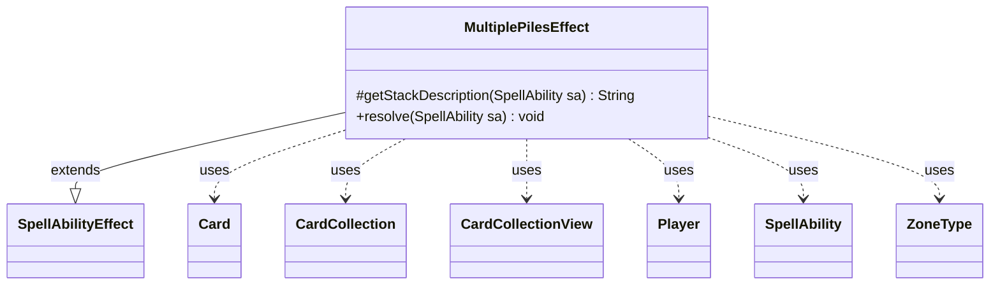

---
aliases:
  - MultiplePilesEffect
tags:
  - java/class
  - module/forge-game
  - pkg/forge/game/ability/effects
fqn: forge.game.ability.effects.MultiplePilesEffect
package: forge.game.ability.effects
module: forge-game
kind: Class
---

# MultiplePilesEffect

**Package:** `forge.game.ability.effects`   **Module:** `forge-game`   **Kind:** Class



## Relationships
**Extends:**
- [[forge.game.ability.SpellAbilityEffect|SpellAbilityEffect]]
**Uses:**
- [[forge.game.card.Card|Card]]
- [[forge.game.card.CardCollection|CardCollection]]
- [[forge.game.card.CardCollectionView|CardCollectionView]]
- [[forge.game.player.Player|Player]]
- [[forge.game.spellability.SpellAbility|SpellAbility]]
- [[forge.game.zone.ZoneType|ZoneType]]

## Design Description

MultiplePilesEffect is a concrete `SpellAbilityEffect` that resolves abilities asking players to divide a set of cards into a fixed number of piles. It overrides `getStackDescription` to produce a readable summary and `resolve` to perform the partitioning. For each in-game target player—ordered to start from the activator—it builds a candidate pool from explicitly defined cards or the player's cards in a given zone (defaulting to the battlefield), filters it via a `ValidCards` predicate using `CardLists`, then has the controller choose cards for each of the first *n*−1 piles, the remainder forming the last.

It records each player's piles and notifies the game of the result. When `RandomChosen` is set, it picks one pile per player, remembers those cards on the host card, and delegates to a `ChosenPile` sub-ability via `AbilityUtils`—separating pile creation from downstream effects. It collaborates with `Card`, `CardCollection`/`CardCollectionView`, `Player`, and `ZoneType`.

## Source
`forge-game/src/main/java/forge/game/ability/effects/MultiplePilesEffect.java`

```java
package forge.game.ability.effects;

import java.util.List;
import java.util.Map;
import java.util.Map.Entry;

import com.google.common.collect.Iterables;
import com.google.common.collect.Lists;
import com.google.common.collect.Maps;

import forge.game.ability.AbilityUtils;
import forge.game.ability.SpellAbilityEffect;
import forge.game.card.Card;
import forge.game.card.CardCollection;
import forge.game.card.CardCollectionView;
import forge.game.card.CardLists;
import forge.game.player.Player;
import forge.game.spellability.SpellAbility;
import forge.game.zone.ZoneType;
import forge.util.Aggregates;
import forge.util.Lang;
import forge.util.Localizer;

public class MultiplePilesEffect extends SpellAbilityEffect {

    /* (non-Javadoc)
     * @see forge.card.abilityfactory.SpellEffect#getStackDescription(java.util.Map, forge.card.spellability.SpellAbility)
     */
    @Override
    protected String getStackDescription(SpellAbility sa) {
        final StringBuilder sb = new StringBuilder();

        String piles = sa.getParam("Piles");
        final String valid = sa.getParamOrDefault("ValidCards", "");

        sb.append("Separate all ").append(valid).append(" cards ");

        sb.append(Lang.joinHomogenous(getTargetPlayers(sa)));

        sb.append("controls into ").append(piles).append(" piles.");
        return sb.toString();
    }

    /* (non-Javadoc)
     * @see forge.card.abilityfactory.SpellEffect#resolve(java.util.Map, forge.card.spellability.SpellAbility)
     */
    @Override
    public void resolve(SpellAbility sa) {
        final Card source = sa.getHostCard();
        final ZoneType zone = sa.hasParam("Zone") ? ZoneType.smartValueOf(sa.getParam("Zone")) : ZoneType.Battlefield;
        final boolean randomChosen = sa.hasParam("RandomChosen");
        final int piles = Integer.parseInt(sa.getParam("Piles"));
        final Map<Player, List<CardCollectionView>> record = Maps.newHashMap();

        final String valid = sa.getParamOrDefault("ValidCards", "");

        final List<Player> tgtPlayers = getTargetPlayers(sa);
        // starting with the activator
        int pSize = tgtPlayers.size();
        Player activator = sa.getActivatingPlayer();
        while (tgtPlayers.contains(activator) && !activator.equals(Iterables.getFirst(tgtPlayers, null))) {
            tgtPlayers.add(pSize - 1, tgtPlayers.remove(0));
        }

        for (final Player p : tgtPlayers) {
            if (!p.isInGame()) {
                continue;
            }

            CardCollection pool;
            if (sa.hasParam("DefinedCards")) {
                pool = AbilityUtils.getDefinedCards(source, sa.getParam("DefinedCards"), sa);
            } else {
                pool = new CardCollection(p.getCardsIn(zone));
            }
            pool = CardLists.getValidCards(pool, valid, source.getController(), source, sa);

            List<CardCollectionView> pileList = Lists.newArrayList();

            for (int i = 1; i < piles; i++) {
                int size = pool.size();
                CardCollectionView pile = p.getController().chooseCardsForEffect(pool, sa, Localizer.getInstance().getMessage("lblChooseCardsInTargetPile", i), 0, size, false, null);
                pileList.add(pile);
                pool.removeAll(pile);
            }

            pileList.add(pool);
            p.getGame().getAction().notifyOfValue(sa, p, pileList.toString(), p);
            record.put(p, pileList);
        }
        if (randomChosen) {
            for (Entry<Player, List<CardCollectionView>> ev : record.entrySet()) {
                CardCollectionView chosen = Aggregates.random(ev.getValue());
                source.addRemembered(chosen);
            }

            SpellAbility sub = sa.getAdditionalAbility("ChosenPile");
            if (sub != null) {
                AbilityUtils.resolve(sub);
            }
            source.clearRemembered();
        }
    }
}
```

## Python
`forge/game/ability/effects/MultiplePilesEffect.py`

```python
from typing import List, Dict

from forge.game.ability.AbilityUtils import AbilityUtils
from forge.game.ability.SpellAbilityEffect import SpellAbilityEffect
from forge.game.card.Card import Card
from forge.game.card.CardCollection import CardCollection
from forge.game.card.CardCollectionView import CardCollectionView
from forge.game.card.CardLists import CardLists
from forge.game.player.Player import Player
from forge.game.spellability.SpellAbility import SpellAbility
from forge.game.zone.ZoneType import ZoneType
from forge.util.Aggregates import Aggregates
from forge.util.Lang import Lang
from forge.util.Localizer import Localizer


class MultiplePilesEffect(SpellAbilityEffect):

    def getStackDescription(self, sa: SpellAbility) -> str:
        sb = []

        piles = sa.getParam("Piles")
        valid = sa.getParamOrDefault("ValidCards", "")

        sb.append("Separate all ")
        sb.append(valid)
        sb.append(" cards ")

        sb.append(Lang.joinHomogenous(self.getTargetPlayers(sa)))

        sb.append("controls into ")
        sb.append(piles)
        sb.append(" piles.")
        return "".join(sb)

    def resolve(self, sa: SpellAbility) -> None:
        source = sa.getHostCard()
        zone = ZoneType.smartValueOf(sa.getParam("Zone")) if sa.hasParam("Zone") else ZoneType.Battlefield
        randomChosen = sa.hasParam("RandomChosen")
        piles = int(sa.getParam("Piles"))
        record: Dict[Player, List[CardCollectionView]] = {}

        valid = sa.getParamOrDefault("ValidCards", "")

        tgtPlayers = self.getTargetPlayers(sa)
        # starting with the activator
        pSize = len(tgtPlayers)
        activator = sa.getActivatingPlayer()
        while activator in tgtPlayers and not activator == (tgtPlayers[0] if tgtPlayers else None):
            tgtPlayers.insert(pSize - 1, tgtPlayers.pop(0))

        for p in tgtPlayers:
            if not p.isInGame():
                continue

            if sa.hasParam("DefinedCards"):
                pool = AbilityUtils.getDefinedCards(source, sa.getParam("DefinedCards"), sa)
            else:
                pool = CardCollection(p.getCardsIn(zone))
            pool = CardLists.getValidCards(pool, valid, source.getController(), source, sa)

            pileList: List[CardCollectionView] = []

            for i in range(1, piles):
                size = pool.size()
                pile = p.getController().chooseCardsForEffect(pool, sa, Localizer.getInstance().getMessage("lblChooseCardsInTargetPile", i), 0, size, False, None)
                pileList.append(pile)
                pool.removeAll(pile)

            pileList.append(pool)
            p.getGame().getAction().notifyOfValue(sa, p, str(pileList), p)
            record[p] = pileList

        if randomChosen:
            for p, pileValue in record.items():
                chosen = Aggregates.random(pileValue)
                source.addRemembered(chosen)

            sub = sa.getAdditionalAbility("ChosenPile")
            if sub is not None:
                AbilityUtils.resolve(sub)
            source.clearRemembered()
```
