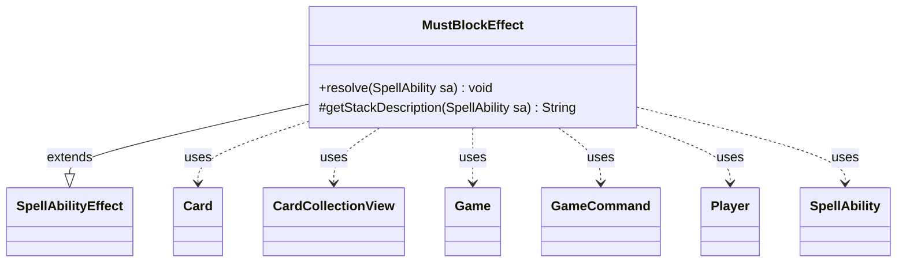

---
aliases:
  - MustBlockEffect
tags:
  - java/class
  - module/forge-game
  - pkg/forge/game/ability/effects
fqn: forge.game.ability.effects.MustBlockEffect
package: forge.game.ability.effects
module: forge-game
kind: Class
---

# MustBlockEffect

**Package:** `forge.game.ability.effects`   **Module:** `forge-game`   **Kind:** Class



## Relationships
**Extends:**
- [[forge.game.ability.SpellAbilityEffect|SpellAbilityEffect]]
**Uses:**
- [[forge.GameCommand|GameCommand]]
- [[forge.game.Game|Game]]
- [[forge.game.card.Card|Card]]
- [[forge.game.card.CardCollectionView|CardCollectionView]]
- [[forge.game.player.Player|Player]]
- [[forge.game.spellability.SpellAbility|SpellAbility]]

## Design Description

MustBlockEffect implements the resolution behavior for the "must block" combat requirement, extending `SpellAbilityEffect` to slot into Forge's ability-effect framework through its `resolve` and `getStackDescription` overrides. Its responsibility is to compel one or more blockers—supplied as explicit targets or chosen interactively via a controller prompt—to block a designated attacker, or every defined attacker when `BlockAllDefined` is set, if able.

Collaborating with `Game`, `Card`, and `CardCollectionView`, it resolves the attacker list and valid blocker choices, then stamps the requirement onto each blocker using a `game.getNextTimestamp()` value. The code shows deliberate care for game-state integrity: it re-fetches each card's live state and skips entries that are missing, timestamp-mismatched, or phased out. When a `Duration` is specified, it registers a `GameCommand` that later calls `removeMustBlockCards`, ensuring temporary requirements are cleanly reverted.

## Source
`forge-game/src/main/java/forge/game/ability/effects/MustBlockEffect.java`

```java
package forge.game.ability.effects;

import java.util.List;
import java.util.Map;

import com.google.common.collect.Lists;
import com.google.common.collect.Maps;

import forge.GameCommand;
import forge.game.Game;
import forge.game.ability.AbilityUtils;
import forge.game.ability.SpellAbilityEffect;
import forge.game.card.Card;
import forge.game.card.CardCollectionView;
import forge.game.card.CardLists;
import forge.game.player.Player;
import forge.game.spellability.SpellAbility;
import forge.game.zone.ZoneType;
import forge.util.Localizer;

public class MustBlockEffect extends SpellAbilityEffect {

    @Override
    public void resolve(SpellAbility sa) {
        final Card host = sa.getHostCard();
        final Player activator = sa.getActivatingPlayer();
        final Game game = activator.getGame();

        List<Card> cards;
        if (sa.hasParam("DefinedAttacker")) {
            cards = AbilityUtils.getDefinedCards(host, sa.getParam("DefinedAttacker"), sa);
            if (cards.isEmpty()) {
                return;
            }
        } else {
            cards = Lists.newArrayList(host);
        }

        final List<Card> tgtCards = Lists.newArrayList();
        if (sa.hasParam("Choices")) {
            Player chooser = activator;
            if (sa.hasParam("Chooser")) {
                final String choose = sa.getParam("Chooser");
                chooser = AbilityUtils.getDefinedPlayers(host, choose, sa).get(0);
            }

            CardCollectionView choices = game.getCardsIn(ZoneType.Battlefield);
            choices = CardLists.getValidCards(choices, sa.getParam("Choices"), activator, host, sa);
            if (!choices.isEmpty()) {
                String title = sa.hasParam("ChoiceTitle") ? sa.getParam("ChoiceTitle") : Localizer.getInstance().getMessage("lblChooseaCard") +" ";
                Map<String, Object> params = Maps.newHashMap();
                params.put("Attackers", cards);
                Card choosen = chooser.getController().chooseSingleEntityForEffect(choices, sa, title, false, params);

                if (choosen != null) {
                    tgtCards.add(choosen);
                }
            }
        } else {
            tgtCards.addAll(getTargetCards(sa));
        }

        final boolean mustBlockAll = sa.hasParam("BlockAllDefined");

        long ts = game.getNextTimestamp();

        for (final Card tgtC : tgtCards) {
            final Card gameCard = game.getCardState(tgtC, null);
            // gameCard is LKI in that case, the card is not in game anymore
            // or the timestamp did change
            // this should check Self too
            if (gameCard == null || !tgtC.equalsWithGameTimestamp(gameCard) || gameCard.isPhasedOut()) {
                continue;
            }
            if (mustBlockAll) {
                gameCard.addMustBlockCards(ts, cards);
            } else {
                final Card attacker = cards.get(0);
                gameCard.addMustBlockCard(ts, attacker);
            }
        }

        if (sa.hasParam("Duration")) {
            final GameCommand removeBlockingRequirements = new GameCommand() {
                private static final long serialVersionUID = -5861529814760561373L;

                @Override
                public void run() {
                    for (final Card c : tgtCards) {
                        c.removeMustBlockCards(ts);
                    }
                }
            };
            addUntilCommand(sa, removeBlockingRequirements);
        }
    }

    @Override
    protected String getStackDescription(SpellAbility sa) {
        final Card host = sa.getHostCard();
        final StringBuilder sb = new StringBuilder();

        // end standard pre-

        String attacker = null;
        if (sa.hasParam("DefinedAttacker")) {
            final List<Card> cards = AbilityUtils.getDefinedCards(host, sa.getParam("DefinedAttacker"), sa);
            attacker = cards.get(0).toString();
        } else {
            attacker = host.toString();
        }

        if (sa.hasParam("Choices")) {
            sb.append("Choosen creature ").append(" must block ").append(attacker).append(" if able.");
        } else {
            for (final Card c : getTargetCards(sa)) {
                sb.append(c).append(" must block ").append(attacker).append(" if able.");
            }
        }
        return sb.toString();
    }

}
```

## Python
`forge/game/ability/effects/MustBlockEffect.py`

```python
from forge.game.ability.SpellAbilityEffect import SpellAbilityEffect
from forge.GameCommand import GameCommand
from forge.game.Game import Game
from forge.game.card.Card import Card
from forge.game.card.CardCollectionView import CardCollectionView
from forge.game.player.Player import Player
from forge.game.spellability.SpellAbility import SpellAbility
from forge.game.ability.AbilityUtils import AbilityUtils
from forge.game.card.CardLists import CardLists
from forge.game.zone.ZoneType import ZoneType
from forge.util.Localizer import Localizer


class MustBlockEffect(SpellAbilityEffect):

    def resolve(self, sa: SpellAbility) -> None:
        host = sa.getHostCard()
        activator = sa.getActivatingPlayer()
        game = activator.getGame()

        if sa.hasParam("DefinedAttacker"):
            cards = AbilityUtils.getDefinedCards(host, sa.getParam("DefinedAttacker"), sa)
            if not cards:
                return
        else:
            cards = [host]

        tgtCards: list[Card] = []
        if sa.hasParam("Choices"):
            chooser = activator
            if sa.hasParam("Chooser"):
                choose = sa.getParam("Chooser")
                chooser = AbilityUtils.getDefinedPlayers(host, choose, sa)[0]

            choices = game.getCardsIn(ZoneType.Battlefield)
            choices = CardLists.getValidCards(choices, sa.getParam("Choices"), activator, host, sa)
            if not choices.isEmpty():
                title = sa.getParam("ChoiceTitle") if sa.hasParam("ChoiceTitle") else Localizer.getInstance().getMessage("lblChooseaCard") + " "
                params: dict[str, object] = {}
                params["Attackers"] = cards
                choosen = chooser.getController().chooseSingleEntityForEffect(choices, sa, title, False, params)

                if choosen is not None:
                    tgtCards.append(choosen)
        else:
            tgtCards.extend(self.getTargetCards(sa))

        mustBlockAll = sa.hasParam("BlockAllDefined")

        ts = game.getNextTimestamp()

        for tgtC in tgtCards:
            gameCard = game.getCardState(tgtC, None)
            # gameCard is LKI in that case, the card is not in game anymore
            # or the timestamp did change
            # this should check Self too
            if gameCard is None or not tgtC.equalsWithGameTimestamp(gameCard) or gameCard.isPhasedOut():
                continue
            if mustBlockAll:
                gameCard.addMustBlockCards(ts, cards)
            else:
                attacker = cards[0]
                gameCard.addMustBlockCard(ts, attacker)

        if sa.hasParam("Duration"):
            class removeBlockingRequirements(GameCommand):
                serialVersionUID = -5861529814760561373

                def run(self):
                    for c in tgtCards:
                        c.removeMustBlockCards(ts)

            self.addUntilCommand(sa, removeBlockingRequirements())

    def getStackDescription(self, sa: SpellAbility) -> str:
        host = sa.getHostCard()
        sb = []

        # end standard pre-

        if sa.hasParam("DefinedAttacker"):
            cards = AbilityUtils.getDefinedCards(host, sa.getParam("DefinedAttacker"), sa)
            attacker = str(cards[0])
        else:
            attacker = str(host)

        if sa.hasParam("Choices"):
            sb.append("Choosen creature ")
            sb.append(" must block ")
            sb.append(attacker)
            sb.append(" if able.")
        else:
            for c in self.getTargetCards(sa):
                sb.append(str(c))
                sb.append(" must block ")
                sb.append(attacker)
                sb.append(" if able.")
        return "".join(sb)
```
