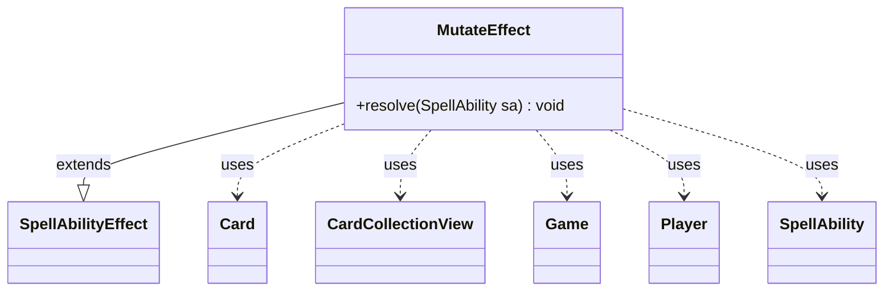

---
aliases:
  - MutateEffect
tags:
  - java/class
  - module/forge-game
  - pkg/forge/game/ability/effects
fqn: forge.game.ability.effects.MutateEffect
package: forge.game.ability.effects
module: forge-game
kind: Class
---

# MutateEffect

**Package:** `forge.game.ability.effects`   **Module:** `forge-game`   **Kind:** Class



## Relationships
**Extends:**
- [[forge.game.ability.SpellAbilityEffect|SpellAbilityEffect]]
**Uses:**
- [[forge.game.Game|Game]]
- [[forge.game.card.Card|Card]]
- [[forge.game.card.CardCollectionView|CardCollectionView]]
- [[forge.game.player.Player|Player]]
- [[forge.game.spellability.SpellAbility|SpellAbility]]

## Design Description

MutateEffect is a concrete `SpellAbilityEffect` subclass that implements the resolution of Magic's mutate mechanic. Its sole public responsibility, the overridden `resolve(SpellAbility)`, merges a mutating creature (the host `Card`) onto a chosen target `Card`, asking the controlling `Player` — via a `CardCollectionView` of the two candidates — which creature becomes the topmost face, then stacks them into one merged permanent.

Rather than reimplementing card state, it orchestrates collaborators: it rebuilds the target's combined characteristics through `CardFactory.getMutatedCloneStates` under a fresh `Game` timestamp, re-registers triggers, and moves the host into the Merged zone via the `Game`'s action handler. Notable design intent is its careful preservation of game-rule fidelity — retyping copied spells as tokens per rule 111.11, carrying over tapped/flipped/commander status, running face-up commands, and finally firing the `Mutates` trigger so downstream effects observe the event.

## Source
`forge-game/src/main/java/forge/game/ability/effects/MutateEffect.java`

```java
package forge.game.ability.effects;

import java.util.HashMap;

import com.google.common.collect.Lists;

import forge.card.GamePieceType;
import forge.game.Game;
import forge.game.ability.AbilityKey;
import forge.game.ability.SpellAbilityEffect;
import forge.game.card.Card;
import forge.game.card.CardCollection;
import forge.game.card.CardCollectionView;
import forge.game.card.CardFactory;
import forge.game.player.Player;
import forge.game.spellability.SpellAbility;
import forge.game.trigger.TriggerType;
import forge.game.zone.ZoneType;
import forge.util.Localizer;

public class MutateEffect extends SpellAbilityEffect {

    @Override
    public void resolve(SpellAbility sa) {
        final Card host = sa.getHostCard();
        final Player p = host.getOwner();
        final Game game = host.getGame();
        // 111.11. A copy of a permanent spell becomes a token as it resolves.
        // The token has the characteristics of the spell that became that token.
        // The token is not “created” for the purposes of any replacement effects or triggered abilities that refer to creating a token.
        if (host.isCopiedSpell()) {
            host.setGamePieceType(GamePieceType.TOKEN);
        }

        final Card target = getDefinedCardsOrTargeted(sa, "Defined").get(0);

        CardCollectionView view = CardCollection.getView(Lists.newArrayList(host, target));
        final Card topCard = host.getController().getController().chooseSingleEntityForEffect(
                view,
                sa,
                Localizer.getInstance().getMessage("lblChooseCreatureToBeTop"),
                false,
                new HashMap<>()
        );
        final boolean putOnTop = (topCard == host);

        // There shouldn't be any mutate abilities, but for now.
        if (sa.isSpell()) {
            host.setController(p, 0);
        }

        final boolean wasFaceDown = target.isFaceDown();

        host.setMergedToCard(target);
        // If first time mutate, add target first.
        if (!target.hasMergedCard()) {
            target.addMergedCard(target);
        }
        if (putOnTop) {
            target.addMergedCardToTop(host);
        } else {
            target.addMergedCard(host);
        }

        // First remove current mutated states
        target.removeMutatedStates();
        // Now add all abilities from bottom cards
        final long ts = game.getNextTimestamp();
        target.setMutatedTimestamp(ts);

        target.addCloneState(CardFactory.getMutatedCloneStates(target, sa), ts);

        // currently used by Tezzeret, Cruel Machinist and Yedora, Grave Gardener
        // when mutating onto the FaceDown, their effect should end, then 721.2e would stop trigger
        if (wasFaceDown && !target.isFaceDown()) {
            target.runFaceupCommands();
        }

        // Re-register triggers for target card
        game.getTriggerHandler().clearActiveTriggers(target, null);
        game.getTriggerHandler().registerActiveTrigger(target, false);

        game.getAction().moveTo(p.getZone(ZoneType.Merged), host, sa);

        host.setTapped(target.isTapped());
        host.setFlipped(target.isFlipped());
        target.setTimesMutated(target.getTimesMutated() + 1);
        target.updateStateForView();
        target.updateTokenView();
        if (host.isCommander()) {
            host.getOwner().updateMergedCommanderInfo(target, host);
            target.updateCommanderView();
        }

        game.getTriggerHandler().runTrigger(TriggerType.Mutates, AbilityKey.mapFromCard(target), false);
    }

}
```

## Python
`forge/game/ability/effects/MutateEffect.py`

```python
from forge.game.Game import Game
from forge.game.ability.AbilityKey import AbilityKey
from forge.game.ability.SpellAbilityEffect import SpellAbilityEffect
from forge.game.card.Card import Card
from forge.game.card.CardCollection import CardCollection
from forge.game.card.CardCollectionView import CardCollectionView
from forge.game.card.CardFactory import CardFactory
from forge.game.player.Player import Player
from forge.game.spellability.SpellAbility import SpellAbility
from forge.game.trigger.TriggerType import TriggerType
from forge.game.zone.ZoneType import ZoneType
from forge.card.GamePieceType import GamePieceType
from forge.util.Localizer import Localizer


class MutateEffect(SpellAbilityEffect):

    def resolve(self, sa: SpellAbility) -> None:
        host = sa.getHostCard()
        p = host.getOwner()
        game = host.getGame()
        # 111.11. A copy of a permanent spell becomes a token as it resolves.
        # The token has the characteristics of the spell that became that token.
        # The token is not ΓÇ£createdΓÇ¥ for the purposes of any replacement effects or triggered abilities that refer to creating a token.
        if host.isCopiedSpell():
            host.setGamePieceType(GamePieceType.TOKEN)

        target = self.getDefinedCardsOrTargeted(sa, "Defined").get(0)

        view = CardCollection.getView([host, target])
        topCard = host.getController().getController().chooseSingleEntityForEffect(
            view,
            sa,
            Localizer.getInstance().getMessage("lblChooseCreatureToBeTop"),
            False,
            {}
        )
        putOnTop = (topCard == host)

        # There shouldn't be any mutate abilities, but for now.
        if sa.isSpell():
            host.setController(p, 0)

        wasFaceDown = target.isFaceDown()

        host.setMergedToCard(target)
        # If first time mutate, add target first.
        if not target.hasMergedCard():
            target.addMergedCard(target)
        if putOnTop:
            target.addMergedCardToTop(host)
        else:
            target.addMergedCard(host)

        # First remove current mutated states
        target.removeMutatedStates()
        # Now add all abilities from bottom cards
        ts = game.getNextTimestamp()
        target.setMutatedTimestamp(ts)

        target.addCloneState(CardFactory.getMutatedCloneStates(target, sa), ts)

        # currently used by Tezzeret, Cruel Machinist and Yedora, Grave Gardener
        # when mutating onto the FaceDown, their effect should end, then 721.2e would stop trigger
        if wasFaceDown and not target.isFaceDown():
            target.runFaceupCommands()

        # Re-register triggers for target card
        game.getTriggerHandler().clearActiveTriggers(target, None)
        game.getTriggerHandler().registerActiveTrigger(target, False)

        game.getAction().moveTo(p.getZone(ZoneType.Merged), host, sa)

        host.setTapped(target.isTapped())
        host.setFlipped(target.isFlipped())
        target.setTimesMutated(target.getTimesMutated() + 1)
        target.updateStateForView()
        target.updateTokenView()
        if host.isCommander():
            host.getOwner().updateMergedCommanderInfo(target, host)
            target.updateCommanderView()

        game.getTriggerHandler().runTrigger(TriggerType.Mutates, AbilityKey.mapFromCard(target), False)
```
