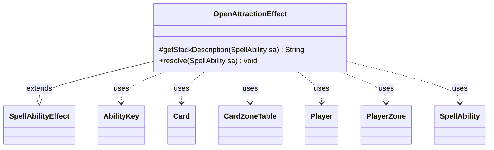

---
aliases:
  - OpenAttractionEffect
tags:
  - java/class
  - module/forge-game
  - pkg/forge/game/ability/effects
fqn: forge.game.ability.effects.OpenAttractionEffect
package: forge.game.ability.effects
module: forge-game
kind: Class
---

# OpenAttractionEffect

**Package:** `forge.game.ability.effects` &nbsp; **Module:** `forge-game` &nbsp; **Kind:** Class



## Relationships
**Extends:**
- [[forge.game.ability.SpellAbilityEffect|SpellAbilityEffect]]
**Uses:**
- [[forge.game.ability.AbilityKey|AbilityKey]]
- [[forge.game.card.Card|Card]]
- [[forge.game.card.CardZoneTable|CardZoneTable]]
- [[forge.game.player.Player|Player]]
- [[forge.game.spellability.SpellAbility|SpellAbility]]
- [[forge.game.zone.PlayerZone|PlayerZone]]

## Design Description

OpenAttractionEffect is a concrete `SpellAbilityEffect` subclass that resolves "open an Attraction" abilities from *Magic: The Gathering*'s Unfinity set. It overrides `getStackDescription` to build player-readable stack text—using `Lang` to pluralize player names, verbs, and Attraction counts—and overrides `resolve` to execute the effect: for each defined or targeted `Player` still in the game, it draws the configured `Amount` of cards from the top of that player's `AttractionDeck` `PlayerZone` and moves them into play.

The class delegates relocation to the game action's `moveToPlay`, threading an `AbilityKey` parameter map and a shared `CardZoneTable` so all moves are batched and reported once via `triggerChangesZoneAll`, ensuring zone-change triggers fire correctly. Optional `Remember` support records revealed Attractions on the host `Card`. Amounts and targets are derived entirely from the `SpellAbility`'s parameters, keeping the effect data-driven rather than hardcoded.

## Source
`forge-game/src/main/java/forge/game/ability/effects/OpenAttractionEffect.java`

```java
package forge.game.ability.effects;

import forge.game.ability.AbilityKey;
import forge.game.ability.AbilityUtils;
import forge.game.ability.SpellAbilityEffect;
import forge.game.card.Card;
import forge.game.card.CardZoneTable;
import forge.game.player.Player;
import forge.game.spellability.SpellAbility;
import forge.game.zone.PlayerZone;
import forge.game.zone.ZoneType;
import forge.util.Lang;

import java.util.List;
import java.util.Map;

public class OpenAttractionEffect extends SpellAbilityEffect {
    @Override
    protected String getStackDescription(SpellAbility sa) {
        final StringBuilder sb = new StringBuilder();
        final List<Player> tgtPlayers = getDefinedPlayersOrTargeted(sa);
        int amount = sa.hasParam("Amount") ? AbilityUtils.calculateAmount(sa.getHostCard(), sa.getParam("Amount"), sa) : 1;

        if(tgtPlayers.isEmpty())
            return "";

        sb.append(Lang.joinHomogenous(tgtPlayers));

        if (tgtPlayers.size() > 1) {
            sb.append(" each");
        }
        sb.append(Lang.joinVerb(tgtPlayers, " open")).append(" ");
        sb.append(amount == 1 ? "an Attraction." : (Lang.getNumeral(amount) + " Attractions."));
        return sb.toString();
    }

    @Override
    public void resolve(SpellAbility sa) {
        final Card source = sa.getHostCard();
        final List<Player> tgtPlayers = getDefinedPlayersOrTargeted(sa);
        int amount = sa.hasParam("Amount") ? AbilityUtils.calculateAmount(sa.getHostCard(), sa.getParam("Amount"), sa) : 1;

        Map<AbilityKey, Object> moveParams = AbilityKey.newMap();
        final CardZoneTable triggerList = AbilityKey.addCardZoneTableParams(moveParams, sa);

        for (Player p : tgtPlayers) {
            if (!p.isInGame())
                continue;
            final PlayerZone attractionDeck = p.getZone(ZoneType.AttractionDeck);
            for (int i = 0; i < amount; i++) {
                if(attractionDeck.isEmpty())
                    continue;
                Card attraction = attractionDeck.get(0);
                attraction = p.getGame().getAction().moveToPlay(attraction, sa, moveParams);
                if (sa.hasParam("Remember")) {
                    source.addRemembered(attraction);
                }
            }
        }
        triggerList.triggerChangesZoneAll(sa.getHostCard().getGame(), sa);
    }
}
```
