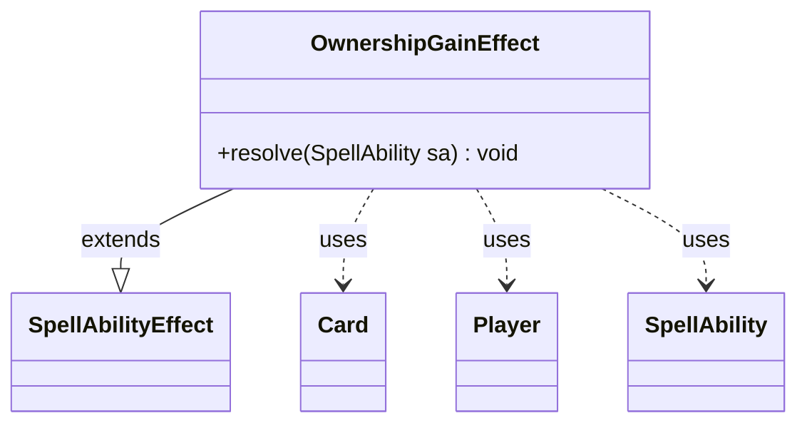

---
aliases:
  - OwnershipGainEffect
tags:
  - java/class
  - module/forge-game
  - pkg/forge/game/ability/effects
fqn: forge.game.ability.effects.OwnershipGainEffect
package: forge.game.ability.effects
module: forge-game
kind: Class
---

# OwnershipGainEffect

**Package:** `forge.game.ability.effects` &nbsp; **Module:** `forge-game` &nbsp; **Kind:** Class



## Relationships
**Extends:**
- [[forge.game.ability.SpellAbilityEffect|SpellAbilityEffect]]
**Uses:**
- [[forge.game.card.Card|Card]]
- [[forge.game.player.Player|Player]]
- [[forge.game.spellability.SpellAbility|SpellAbility]]

## Design Description

OwnershipGainEffect is a concrete spell-ability resolution effect that transfers permanent ownership of cards to a player. As a subclass of SpellAbilityEffect, it overrides `resolve` to implement the actual game-state mutation for an ownership-changing ability, fitting the engine's pattern of one effect class per distinct spell/ability behavior. During resolution it gathers the targeted Cards and resolves the recipient Player from the ability's "DefinedPlayer" parameter, defaulting to the activating player when none is specified, then calls `changeOwnership` on each card.

The design keeps the class deliberately thin: all parsing and targeting helpers (`getTargetCards`, `getDefinedPlayersOrTargeted`) are inherited from the base effect, and the ownership-transfer logic itself is delegated to `Card`, so this class only orchestrates the collaboration between SpellAbility, Player, and Card rather than holding state of its own.

## Source
`forge-game/src/main/java/forge/game/ability/effects/OwnershipGainEffect.java`

```java
package forge.game.ability.effects;

import java.util.List;

import forge.game.ability.SpellAbilityEffect;
import forge.game.card.Card;
import forge.game.player.Player;
import forge.game.spellability.SpellAbility;

public class OwnershipGainEffect extends SpellAbilityEffect {

    @Override
    public void resolve(SpellAbility sa) {
        final List<Card> cards = getTargetCards(sa);
        final List<Player> controllers = getDefinedPlayersOrTargeted(sa, "DefinedPlayer");

        final Player newOwner = controllers.isEmpty() ? sa.getActivatingPlayer() : controllers.get(0);

        for (Card card : cards) {
            newOwner.changeOwnership(card);
        }
    }
}
```
