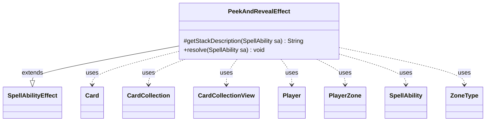

---
aliases:
  - PeekAndRevealEffect
tags:
  - java/class
  - module/forge-game
  - pkg/forge/game/ability/effects
fqn: forge.game.ability.effects.PeekAndRevealEffect
package: forge.game.ability.effects
module: forge-game
kind: Class
---

# PeekAndRevealEffect

**Package:** `forge.game.ability.effects` &nbsp; **Module:** `forge-game` &nbsp; **Kind:** Class



## Relationships
**Extends:**
- [[forge.game.ability.SpellAbilityEffect|SpellAbilityEffect]]
**Uses:**
- [[forge.game.card.Card|Card]]
- [[forge.game.card.CardCollection|CardCollection]]
- [[forge.game.card.CardCollectionView|CardCollectionView]]
- [[forge.game.player.Player|Player]]
- [[forge.game.spellability.SpellAbility|SpellAbility]]
- [[forge.game.zone.PlayerZone|PlayerZone]]
- [[forge.game.zone.ZoneType|ZoneType]]

## Design Description

PeekAndRevealEffect is a concrete SpellAbilityEffect that resolves "peek and reveal" abilities: the activating player looks at the top card(s) of one or more players' libraries and optionally reveals matching cards. It overrides `getStackDescription` to assemble a grammatically adaptive summary (singular/plural, "looks at" vs. "reveals", whose library) and `resolve` to apply the effect. It collaborates with Player and PlayerZone/ZoneType to locate the source zone (defaulting to Library), and with Card, CardCollection, and CardCollectionView to gather peeked cards and filter the revealable subset via CardLists and a RevealValid pattern.

The design is parameter-driven: optional SpellAbility params (PeekAmount, NoPeek, NoReveal, RevealOptional, RememberRevealed, ImprintRevealed, RememberPeeked) toggle behavior so a single class serves many card scripts. Remembered or imprinted cards are stored as last-known-information copies via CardCopyService, decoupling tracked references from subsequent zone movement.

## Source
`forge-game/src/main/java/forge/game/ability/effects/PeekAndRevealEffect.java`

```java
package forge.game.ability.effects;

import java.util.HashMap;
import java.util.List;
import java.util.Map;

import com.google.common.collect.Maps;

import forge.game.ability.AbilityUtils;
import forge.game.ability.SpellAbilityEffect;
import forge.game.card.*;
import forge.game.player.Player;
import forge.game.spellability.SpellAbility;
import forge.game.zone.PlayerZone;
import forge.game.zone.ZoneType;
import forge.util.Lang;
import forge.util.Localizer;

public class PeekAndRevealEffect extends SpellAbilityEffect {

    @Override
    protected String getStackDescription(SpellAbility sa) {
        final Player peeker = sa.getActivatingPlayer();
        final int numPeek = sa.hasParam("PeekAmount") ?
                AbilityUtils.calculateAmount(sa.getHostCard(), sa.getParam("PeekAmount"), sa) : 1;
        final String verb = sa.hasParam("NoReveal") || sa.hasParam("RevealOptional") ? " looks at " :
                " reveals ";
        final String defined = sa.getParamOrDefault("Defined", "");
        final List<Player> libraryPlayers = getDefinedPlayersOrTargeted(sa);
        final String defString = Lang.joinHomogenous(libraryPlayers);
        String who = defined.equals("Player") && verb.equals(" reveals ") ? "Each player" :
                sa.hasParam("NoPeek") && verb.equals(" reveals ") ? defString : "";
        String whose = defined.equals("Player") && verb.equals(" looks at ") ? "each player's"
                : libraryPlayers.size() == 1 && libraryPlayers.get(0) == peeker ? "their" :
                defString + "'s";

        final StringBuilder sb = new StringBuilder();

        sb.append(who.isEmpty() ? peeker : who);
        sb.append(verb).append("the top ");
        sb.append(numPeek > 1 ? Lang.getNumeral(numPeek) + " cards " : "card ").append("of ").append(whose);
        sb.append(" library.");

        return sb.toString();
    }

    /* (non-Javadoc)
     * @see forge.card.abilityfactory.SpellEffect#resolve(forge.card.spellability.SpellAbility)
     */
    @Override
    public void resolve(SpellAbility sa) {
        final Card source = sa.getHostCard();
        final boolean rememberRevealed = sa.hasParam("RememberRevealed");
        final boolean imprintRevealed = sa.hasParam("ImprintRevealed");
        final boolean noPeek = sa.hasParam("NoPeek");
        String revealValid = sa.getParamOrDefault("RevealValid", "Card");
        String peekAmount = sa.getParamOrDefault("PeekAmount", "1");
        int numPeek = AbilityUtils.calculateAmount(source, peekAmount, sa);
        final ZoneType srcZone = sa.hasParam("SourceZone") ? ZoneType.smartValueOf(sa.getParam("SourceZone")) : ZoneType.Library;

        List<Player> srcZonePlayers = getDefinedPlayersOrTargeted(sa);
        final Player peekingPlayer = sa.getActivatingPlayer();

        for (Player zoneToPeek : srcZonePlayers) {
            final PlayerZone playerZone = zoneToPeek.getZone(srcZone);
            numPeek = Math.min(numPeek, playerZone.size());

            CardCollection peekCards = new CardCollection();
            for (int i = 0; i < numPeek; i++) {
                peekCards.add(playerZone.get(i));
            }

            Map<String, Object> params = new HashMap<>();
            params.put("Revealed", peekCards);

            CardCollectionView revealableCards = CardLists.getValidCards(peekCards, revealValid, peekingPlayer, source, sa);
            boolean doReveal = !sa.hasParam("NoReveal") && !revealableCards.isEmpty();
            if (!noPeek) {
                peekingPlayer.getController().reveal(peekCards, srcZone, zoneToPeek,
                        source.getTranslatedName() + " - " +
                                Localizer.getInstance().getMessage("lblLookingCardFrom"));
            }

            if (doReveal && sa.hasParam("RevealOptional"))
                doReveal = peekingPlayer.getController().confirmAction(sa, null, Localizer.getInstance().getMessage("lblRevealCardToOtherPlayers"), params);

            if (doReveal) {
                peekingPlayer.getGame().getAction().reveal(revealableCards, srcZone, zoneToPeek, !noPeek,
                        source.getTranslatedName() + " - " +
                                Localizer.getInstance().getMessage("lblRevealingCardFrom"));

                if (rememberRevealed) {
                    Map<Integer, Card> cachedMap = Maps.newHashMap();
                    for (Card c : revealableCards) {
                        source.addRemembered(CardCopyService.getLKICopy(c, cachedMap));
                    }
                }
                if (imprintRevealed) {
                    Map<Integer, Card> cachedMap = Maps.newHashMap();
                    for (Card c : revealableCards) {
                        source.addImprintedCard(CardCopyService.getLKICopy(c, cachedMap));
                    }
                }
            } else if (sa.hasParam("RememberPeeked")) {
                Map<Integer, Card> cachedMap = Maps.newHashMap();
                for (Card c : revealableCards) {
                    source.addRemembered(CardCopyService.getLKICopy(c, cachedMap));
                }
            }
        }
    }

}
```

## Python
`forge/game/ability/effects/PeekAndRevealEffect.py`

```python
from typing import List

from forge.game.ability.AbilityUtils import AbilityUtils
from forge.game.ability.SpellAbilityEffect import SpellAbilityEffect
from forge.game.card.Card import Card
from forge.game.card.CardCollection import CardCollection
from forge.game.card.CardCollectionView import CardCollectionView
from forge.game.card.CardLists import CardLists
from forge.game.card.CardCopyService import CardCopyService
from forge.game.player.Player import Player
from forge.game.spellability.SpellAbility import SpellAbility
from forge.game.zone.PlayerZone import PlayerZone
from forge.game.zone.ZoneType import ZoneType
from forge.util.Lang import Lang
from forge.util.Localizer import Localizer


class PeekAndRevealEffect(SpellAbilityEffect):

    def getStackDescription(self, sa: SpellAbility) -> str:
        peeker = sa.getActivatingPlayer()
        numPeek = AbilityUtils.calculateAmount(sa.getHostCard(), sa.getParam("PeekAmount"), sa) \
            if sa.hasParam("PeekAmount") else 1
        verb = " looks at " if sa.hasParam("NoReveal") or sa.hasParam("RevealOptional") \
            else " reveals "
        defined = sa.getParamOrDefault("Defined", "")
        libraryPlayers = self.getDefinedPlayersOrTargeted(sa)
        defString = Lang.joinHomogenous(libraryPlayers)
        if defined == "Player" and verb == " reveals ":
            who = "Each player"
        elif sa.hasParam("NoPeek") and verb == " reveals ":
            who = defString
        else:
            who = ""
        if defined == "Player" and verb == " looks at ":
            whose = "each player's"
        elif len(libraryPlayers) == 1 and libraryPlayers[0] == peeker:
            whose = "their"
        else:
            whose = defString + "'s"

        sb = []

        sb.append(str(peeker) if who == "" else who)
        sb.append(verb)
        sb.append("the top ")
        sb.append(Lang.getNumeral(numPeek) + " cards " if numPeek > 1 else "card ")
        sb.append("of ")
        sb.append(whose)
        sb.append(" library.")

        return "".join(sb)

    # (non-Javadoc)
    # @see forge.card.abilityfactory.SpellEffect#resolve(forge.card.spellability.SpellAbility)
    def resolve(self, sa: SpellAbility) -> None:
        source = sa.getHostCard()
        rememberRevealed = sa.hasParam("RememberRevealed")
        imprintRevealed = sa.hasParam("ImprintRevealed")
        noPeek = sa.hasParam("NoPeek")
        revealValid = sa.getParamOrDefault("RevealValid", "Card")
        peekAmount = sa.getParamOrDefault("PeekAmount", "1")
        numPeek = AbilityUtils.calculateAmount(source, peekAmount, sa)
        srcZone = ZoneType.smartValueOf(sa.getParam("SourceZone")) if sa.hasParam("SourceZone") \
            else ZoneType.Library

        srcZonePlayers = self.getDefinedPlayersOrTargeted(sa)
        peekingPlayer = sa.getActivatingPlayer()

        for zoneToPeek in srcZonePlayers:
            playerZone = zoneToPeek.getZone(srcZone)
            numPeek = min(numPeek, playerZone.size())

            peekCards = CardCollection()
            for i in range(numPeek):
                peekCards.add(playerZone.get(i))

            params = {}
            params["Revealed"] = peekCards

            revealableCards = CardLists.getValidCards(peekCards, revealValid, peekingPlayer, source, sa)
            doReveal = not sa.hasParam("NoReveal") and not revealableCards.isEmpty()
            if not noPeek:
                peekingPlayer.getController().reveal(peekCards, srcZone, zoneToPeek,
                        source.getTranslatedName() + " - " +
                                Localizer.getInstance().getMessage("lblLookingCardFrom"))

            if doReveal and sa.hasParam("RevealOptional"):
                doReveal = peekingPlayer.getController().confirmAction(sa, None, Localizer.getInstance().getMessage("lblRevealCardToOtherPlayers"), params)

            if doReveal:
                peekingPlayer.getGame().getAction().reveal(revealableCards, srcZone, zoneToPeek, not noPeek,
                        source.getTranslatedName() + " - " +
                                Localizer.getInstance().getMessage("lblRevealingCardFrom"))

                if rememberRevealed:
                    cachedMap = {}
                    for c in revealableCards:
                        source.addRemembered(CardCopyService.getLKICopy(c, cachedMap))
                if imprintRevealed:
                    cachedMap = {}
                    for c in revealableCards:
                        source.addImprintedCard(CardCopyService.getLKICopy(c, cachedMap))
            elif sa.hasParam("RememberPeeked"):
                cachedMap = {}
                for c in revealableCards:
                    source.addRemembered(CardCopyService.getLKICopy(c, cachedMap))
```
