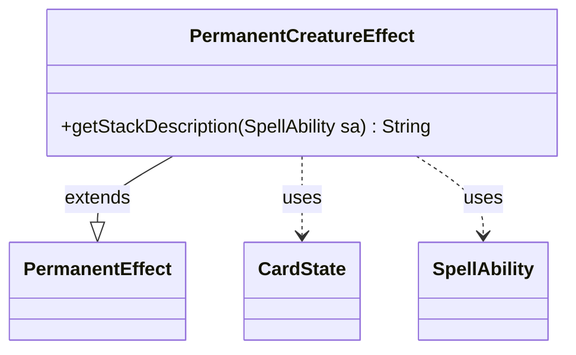

---
aliases:
  - PermanentCreatureEffect
tags:
  - java/class
  - module/forge-game
  - pkg/forge/game/ability/effects
fqn: forge.game.ability.effects.PermanentCreatureEffect
package: forge.game.ability.effects
module: forge-game
kind: Class
---

# PermanentCreatureEffect

**Package:** `forge.game.ability.effects` &nbsp; **Module:** `forge-game` &nbsp; **Kind:** Class



## Relationships
**Extends:**
- [[forge.game.ability.effects.PermanentEffect|PermanentEffect]]
**Uses:**
- [[forge.game.card.CardState|CardState]]
- [[forge.game.spellability.SpellAbility|SpellAbility]]

## Design Description

PermanentCreatureEffect is a stack-presentation specialization of PermanentEffect, responsible for rendering the human-readable description shown when a permanent-creature spell or ability resolves. It inherits all permanent-creation behavior from its parent and overrides only `getStackDescription`, contributing creature-specific text. The method pulls the originating CardState from the SpellAbility to read the card's translated name and base power/toughness, then lets the ability's `SetPower` and `SetToughness` parameters override those defaults, assembling a localized "Name - Creature P/T" line. Its reliance on CardTranslation and Localizer reflects a deliberate commitment to internationalized output, while delegating substantive resolution logic upward marks a thin-specialization design: the subclass exists purely to customize presentation, leaving game-state mutation to PermanentEffect.

## Source
`forge-game/src/main/java/forge/game/ability/effects/PermanentCreatureEffect.java`

```java
package forge.game.ability.effects;

import forge.game.card.CardState;
import forge.game.spellability.SpellAbility;
import forge.util.CardTranslation;
import forge.util.Localizer;

/**
 * TODO: Write javadoc for this type.
 *
 */
public class PermanentCreatureEffect extends PermanentEffect {

    @Override
    public String getStackDescription(final SpellAbility sa) {
        final CardState source = sa.getCardState();
        final StringBuilder sb = new StringBuilder();
        sb.append(CardTranslation.getTranslatedName(source.getName())).append(" - ").append(Localizer.getInstance().getMessage("lblCreature")).append(" ");
        sb.append(sa.getParamOrDefault("SetPower", source.getBasePowerString()));
        sb.append(" / ").append(sa.getParamOrDefault("SetToughness", source.getBaseToughnessString()));
        return sb.toString();
    }
}
```
