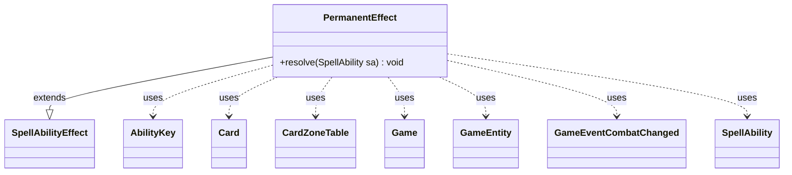

---
aliases:
  - PermanentEffect
tags:
  - java/class
  - module/forge-game
  - pkg/forge/game/ability/effects
fqn: forge.game.ability.effects.PermanentEffect
package: forge.game.ability.effects
module: forge-game
kind: Class
---

# PermanentEffect

**Package:** `forge.game.ability.effects` &nbsp; **Module:** `forge-game` &nbsp; **Kind:** Class



## Relationships
**Extends:**
- [[forge.game.ability.SpellAbilityEffect|SpellAbilityEffect]]
**Uses:**
- [[forge.game.Game|Game]]
- [[forge.game.GameEntity|GameEntity]]
- [[forge.game.ability.AbilityKey|AbilityKey]]
- [[forge.game.card.Card|Card]]
- [[forge.game.card.CardZoneTable|CardZoneTable]]
- [[forge.game.event.GameEventCombatChanged|GameEventCombatChanged]]
- [[forge.game.spellability.SpellAbility|SpellAbility]]

## Design Description

PermanentEffect is a concrete `SpellAbilityEffect` that resolves spells and abilities which put a card onto the battlefield. As a leaf in the effect-resolution hierarchy, it overrides `resolve(SpellAbility)` to move the host `Card` into play via the `Game`'s action system, threading an `AbilityKey` parameter map and a `CardZoneTable` so that the relocation is tracked and zone-change triggers fire collectively at the end.

Beyond the basic move, it encodes the rules for alternative-cost keywords: Dash, Blitz, and Warp register delayed triggers (return, sacrifice, or exile at end of turn) and stamp an `EndOfTurnLeavePlay` SVar as an AI hint, while Sneak optionally taps the permanent and re-inserts a returned creature as an attacker, updating combat and firing a `GameEventCombatChanged`. This keeps all "enter the battlefield directly" cost variations centralized in one effect rather than scattered across cards.

## Source
`forge-game/src/main/java/forge/game/ability/effects/PermanentEffect.java`

```java
package forge.game.ability.effects;

import java.util.Collections;
import java.util.Map;

import com.google.common.collect.Lists;

import forge.game.Game;
import forge.game.GameEntity;
import forge.game.ability.AbilityKey;
import forge.game.ability.SpellAbilityEffect;
import forge.game.card.Card;
import forge.game.card.CardZoneTable;
import forge.game.event.GameEventCombatChanged;
import forge.game.spellability.SpellAbility;

public class PermanentEffect extends SpellAbilityEffect {

    /*
     * (non-Javadoc)
     *
     * @see
     * forge.card.abilityfactory.SpellEffect#resolve(forge.card.spellability.
     * SpellAbility)
     */
    @Override
    public void resolve(SpellAbility sa) {
        final Card host = sa.getHostCard();
        final Game game = host.getGame();
        final Map<AbilityKey, Object> moveParams = AbilityKey.newMap();
        final CardZoneTable table = AbilityKey.addCardZoneTableParams(moveParams, sa);

        if ((sa.isIntrinsic() || host.wasCast()) && sa.isSneak()) {
            host.setTapped(true);
        }

        final Card c = game.getAction().moveToPlay(host, sa, moveParams);
        sa.setHostCard(c);

        // CR 608.3g
        if ((sa.isIntrinsic() || c.wasCast()) && c.isInPlay()) {
            if (sa.isDash()) {
                registerDelayedTrigger(sa, "Hand", Lists.newArrayList(c));
                // add AI hint
                c.addChangedSVars(Collections.singletonMap("EndOfTurnLeavePlay", "Dash"), c.getGame().getNextTimestamp(), 0);
            }
            if (sa.isBlitz()) {
                registerDelayedTrigger(sa, "Sacrifice", Lists.newArrayList(c));
                c.addChangedSVars(Collections.singletonMap("EndOfTurnLeavePlay", "Blitz"), c.getGame().getNextTimestamp(), 0);
            }
            if (sa.isWarp()) {
                registerDelayedTrigger(sa, "Exile", Lists.newArrayList(c));
                c.addChangedSVars(Collections.singletonMap("EndOfTurnLeavePlay", "Warp"), c.getGame().getNextTimestamp(), 0);
            }
            if (sa.isSneak() && c.isCreature()) {
                final Card returned = sa.getPaidList("Returned", true).getFirst();
                final GameEntity defender = game.getCombat().getDefenderByAttacker(returned);
                game.getCombat().addAttacker(c, defender);
                game.getCombat().getBandOfAttacker(c).setBlocked(false);

                game.updateCombatForView();
                game.fireEvent(new GameEventCombatChanged());
            }
        }

        table.triggerChangesZoneAll(game, sa);
    }
}
```

## Python
`forge/game/ability/effects/PermanentEffect.py`

```python
from forge.game.Game import Game
from forge.game.GameEntity import GameEntity
from forge.game.ability.AbilityKey import AbilityKey
from forge.game.ability.SpellAbilityEffect import SpellAbilityEffect
from forge.game.card.Card import Card
from forge.game.card.CardZoneTable import CardZoneTable
from forge.game.event.GameEventCombatChanged import GameEventCombatChanged
from forge.game.spellability.SpellAbility import SpellAbility


class PermanentEffect(SpellAbilityEffect):

    """
    (non-Javadoc)

    @see
    forge.card.abilityfactory.SpellEffect#resolve(forge.card.spellability.
    SpellAbility)
    """
    def resolve(self, sa: SpellAbility) -> None:
        host = sa.getHostCard()
        game = host.getGame()
        moveParams = AbilityKey.newMap()
        table = AbilityKey.addCardZoneTableParams(moveParams, sa)

        if (sa.isIntrinsic() or host.wasCast()) and sa.isSneak():
            host.setTapped(True)

        c = game.getAction().moveToPlay(host, sa, moveParams)
        sa.setHostCard(c)

        # CR 608.3g
        if (sa.isIntrinsic() or c.wasCast()) and c.isInPlay():
            if sa.isDash():
                self.registerDelayedTrigger(sa, "Hand", [c])
                # add AI hint
                c.addChangedSVars({"EndOfTurnLeavePlay": "Dash"}, c.getGame().getNextTimestamp(), 0)
            if sa.isBlitz():
                self.registerDelayedTrigger(sa, "Sacrifice", [c])
                c.addChangedSVars({"EndOfTurnLeavePlay": "Blitz"}, c.getGame().getNextTimestamp(), 0)
            if sa.isWarp():
                self.registerDelayedTrigger(sa, "Exile", [c])
                c.addChangedSVars({"EndOfTurnLeavePlay": "Warp"}, c.getGame().getNextTimestamp(), 0)
            if sa.isSneak() and c.isCreature():
                returned = sa.getPaidList("Returned", True).getFirst()
                defender = game.getCombat().getDefenderByAttacker(returned)
                game.getCombat().addAttacker(c, defender)
                game.getCombat().getBandOfAttacker(c).setBlocked(False)

                game.updateCombatForView()
                game.fireEvent(GameEventCombatChanged())

        table.triggerChangesZoneAll(game, sa)
```
