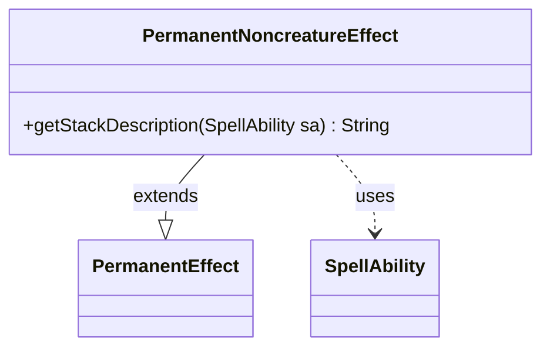

---
aliases:
  - PermanentNoncreatureEffect
tags:
  - java/class
  - module/forge-game
  - pkg/forge/game/ability/effects
fqn: forge.game.ability.effects.PermanentNoncreatureEffect
package: forge.game.ability.effects
module: forge-game
kind: Class
---

# PermanentNoncreatureEffect

**Package:** `forge.game.ability.effects` &nbsp; **Module:** `forge-game` &nbsp; **Kind:** Class



## Relationships
**Extends:**
- [[forge.game.ability.effects.PermanentEffect|PermanentEffect]]
**Uses:**
- [[forge.game.spellability.SpellAbility|SpellAbility]]

## Design Description

Permanent enchantments and other noncreature permanents resolve through this class, which extends `PermanentEffect` to provide the shared resolution machinery for putting a permanent onto the battlefield. Its sole specialization is overriding `getStackDescription`, which renders the spell's stack entry simply as the translated name of the card being cast—relying on `SpellAbility.getCardState()` to obtain the relevant face and `CardTranslation` to localize it. The design intent is minimalism: because a noncreature permanent's stack representation needs nothing beyond its name (unlike effects that describe targets or modes), the class delegates all real work to its supertype and contributes only this lightweight display override.

## Source
`forge-game/src/main/java/forge/game/ability/effects/PermanentNoncreatureEffect.java`

```java
package forge.game.ability.effects;

import forge.game.spellability.SpellAbility;
import forge.util.CardTranslation;

/**
 * TODO: Write javadoc for this type.
 *
 */
public class PermanentNoncreatureEffect extends PermanentEffect {

    @Override
    public String getStackDescription(final SpellAbility sa) {
        //CardView toString return translated name,don't need call CardTranslation.getTranslatedName in this.
        return CardTranslation.getTranslatedName(sa.getCardState().getName());
    }
}
```
