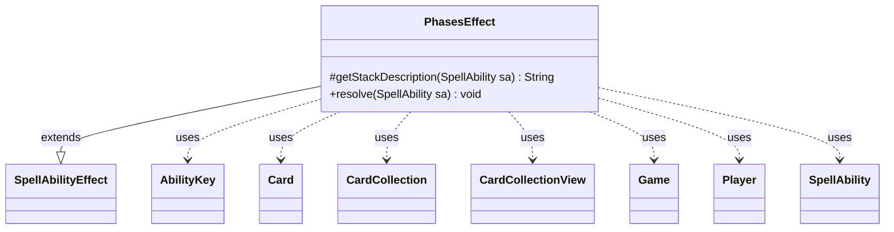

---
aliases:
  - PhasesEffect
tags:
  - java/class
  - module/forge-game
  - pkg/forge/game/ability/effects
fqn: forge.game.ability.effects.PhasesEffect
package: forge.game.ability.effects
module: forge-game
kind: Class
---

# PhasesEffect

**Package:** `forge.game.ability.effects`   **Module:** `forge-game`   **Kind:** Class



## Relationships
**Extends:**
- [[forge.game.ability.SpellAbilityEffect|SpellAbilityEffect]]
**Uses:**
- [[forge.game.Game|Game]]
- [[forge.game.ability.AbilityKey|AbilityKey]]
- [[forge.game.card.Card|Card]]
- [[forge.game.card.CardCollection|CardCollection]]
- [[forge.game.card.CardCollectionView|CardCollectionView]]
- [[forge.game.player.Player|Player]]
- [[forge.game.spellability.SpellAbility|SpellAbility]]

## Design Description

PhasesEffect implements the resolution logic for abilities that phase permanents in or out, extending `SpellAbilityEffect` and slotting into Forge's ability-effect framework through the inherited `resolve` and `getStackDescription` contract. Driven by script parameters (`PhaseInOrOut`, `AllValid`, `AnyNumber`, `WontPhaseInNormal`, `RememberAffected`, and tap-state flags), it assembles its target set—either from defined/targeted cards or by filtering the battlefield via `AbilityUtils`—then toggles each card's phased state through `Card.phase`, collaborating with `Game`, `Player`, `CardCollection`, and `SpellAbility`.

Notably, it re-resolves every target against live game state using `getCardState` and `equalsWithGameTimestamp` to skip stale last-known-information copies, and consults `StaticAbilityCantPhase` to honor cant-phase restrictions in both directions. After phasing it preserves tap status, optionally remembers affected cards on the source, and fires a single batched `PhaseOutAll` trigger carrying the collected cards through `AbilityKey`-keyed runtime parameters, centralizing trigger bookkeeping.

## Source
`forge-game/src/main/java/forge/game/ability/effects/PhasesEffect.java`

```java
package forge.game.ability.effects;

import java.util.List;
import java.util.Map;

import forge.game.ability.AbilityKey;
import forge.game.card.CardCollection;
import forge.game.trigger.TriggerType;
import forge.util.Lang;

import forge.game.Game;
import forge.game.ability.AbilityUtils;
import forge.game.ability.SpellAbilityEffect;
import forge.game.card.Card;
import forge.game.card.CardCollectionView;
import forge.game.player.Player;
import forge.game.spellability.SpellAbility;
import forge.game.staticability.StaticAbilityCantPhase;
import forge.game.zone.ZoneType;
import forge.util.Localizer;

public class PhasesEffect extends SpellAbilityEffect {

    /* (non-Javadoc)
     * @see forge.card.abilityfactory.SpellEffect#resolve(java.util.Map, forge.card.spellability.SpellAbility)
     */
    @Override
    protected String getStackDescription(SpellAbility sa) {
        // when getStackDesc is called, just build exactly what is happening
        final StringBuilder sb = new StringBuilder();
        final List<Card> tgtCards = getTargetCards(sa);
        sb.append(Lang.joinHomogenous(tgtCards));
        sb.append(tgtCards.size() == 1 ? " phases out." : " phase out.");
        return sb.toString();
    }

    @Override
    public void resolve(SpellAbility sa) {
        CardCollectionView tgtCards;
        final Player activator = sa.getActivatingPlayer();
        final Game game = activator.getGame();
        final Card source = sa.getHostCard();
        final boolean phaseInOrOut = sa.hasParam("PhaseInOrOut");
        final boolean wontPhaseInNormal = sa.hasParam("WontPhaseInNormal");

        if (sa.hasParam("AllValid")) {
            if (phaseInOrOut) {
                tgtCards = game.getCardsIncludePhasingIn(ZoneType.Battlefield);
            } else {
                tgtCards = game.getCardsIn(ZoneType.Battlefield);
            }
            tgtCards = AbilityUtils.filterListByType(tgtCards, sa.getParam("AllValid"), sa);
        } else {
            tgtCards = getDefinedCardsOrTargeted(sa);
        }
        if (sa.hasParam("AnyNumber")) {
            tgtCards = activator.getController().chooseCardsForEffect(tgtCards, sa,
                    Localizer.getInstance().getMessage("lblChooseAnyNumberToPhase"),
                    0, tgtCards.size(), true, null);
        }

        CardCollection phasedOut = new CardCollection();
        if (phaseInOrOut) { // Time and Tide and Oubliette
            CardCollection toPhase = new CardCollection();
            for (final Card tgtC : tgtCards) {
                if (tgtC.isPhasedOut() && StaticAbilityCantPhase.cantPhaseIn(tgtC)) {
                    continue;
                }
                if (!tgtC.isPhasedOut() && StaticAbilityCantPhase.cantPhaseOut(tgtC)) {
                    continue;
                }
                toPhase.add(tgtC);
            }
            for (final Card tgtC : toPhase) {
                Card gameCard = game.getCardState(tgtC, null);
                // gameCard is LKI in that case, the card is not in game anymore
                // or the timestamp did change
                // this should check Self too
                if (gameCard == null || !tgtC.equalsWithGameTimestamp(gameCard)) {
                    continue;
                }
                gameCard.phase(false);
                if (gameCard.isPhasedOut()) {
                    phasedOut.add(gameCard);
                    gameCard.setWontPhaseInNormal(wontPhaseInNormal);
                } else {
                    // won't trigger tap or untap triggers when phase in
                    if (sa.hasParam("Tapped")) {
                        gameCard.setTapped(true);
                    } else if (sa.hasParam("Untapped")) {
                        gameCard.setTapped(false);
                    }
                    gameCard.setWontPhaseInNormal(false);
                }
            }
        } else { // just phase out
            for (final Card tgtC : tgtCards) {
                Card gameCard = game.getCardState(tgtC, null);
                // gameCard is LKI in that case, the card is not in game anymore
                // or the timestamp did change
                // this should check Self too
                if (gameCard == null || !tgtC.equalsWithGameTimestamp(gameCard)) {
                    continue;
                }
                if (!gameCard.isPhasedOut() && !StaticAbilityCantPhase.cantPhaseOut(gameCard)) {
                    gameCard.phase(false);
                    if (gameCard.isPhasedOut()) {
                        if (sa.hasParam("RememberAffected")) {
                            source.addRemembered(gameCard);
                        }
                        phasedOut.add(gameCard);
                        gameCard.setWontPhaseInNormal(wontPhaseInNormal);
                    }
                }
            }
        }
        if (sa.hasParam("RememberValids")) {
            source.addRemembered(tgtCards);
        }
        if (!phasedOut.isEmpty()) {
            final Map<AbilityKey, Object> runParams = AbilityKey.newMap();
            runParams.put(AbilityKey.Cards, phasedOut);
            game.getTriggerHandler().runTrigger(TriggerType.PhaseOutAll, runParams, false);
        }
    }
}
```

## Python
`forge/game/ability/effects/PhasesEffect.py`

```python
from forge.game.ability.AbilityKey import AbilityKey
from forge.game.card.CardCollection import CardCollection
from forge.game.trigger.TriggerType import TriggerType
from forge.util.Lang import Lang

from forge.game.Game import Game
from forge.game.ability.AbilityUtils import AbilityUtils
from forge.game.ability.SpellAbilityEffect import SpellAbilityEffect
from forge.game.card.Card import Card
from forge.game.card.CardCollectionView import CardCollectionView
from forge.game.player.Player import Player
from forge.game.spellability.SpellAbility import SpellAbility
from forge.game.staticability.StaticAbilityCantPhase import StaticAbilityCantPhase
from forge.game.zone.ZoneType import ZoneType
from forge.util.Localizer import Localizer


class PhasesEffect(SpellAbilityEffect):

    # (non-Javadoc)
    # @see forge.card.abilityfactory.SpellEffect#resolve(java.util.Map, forge.card.spellability.SpellAbility)
    def getStackDescription(self, sa: SpellAbility) -> str:
        # when getStackDesc is called, just build exactly what is happening
        sb = []
        tgtCards = self.getTargetCards(sa)
        sb.append(Lang.joinHomogenous(tgtCards))
        sb.append(" phases out." if len(tgtCards) == 1 else " phase out.")
        return "".join(sb)

    def resolve(self, sa: SpellAbility) -> None:
        activator = sa.getActivatingPlayer()
        game = activator.getGame()
        source = sa.getHostCard()
        phaseInOrOut = sa.hasParam("PhaseInOrOut")
        wontPhaseInNormal = sa.hasParam("WontPhaseInNormal")

        if sa.hasParam("AllValid"):
            if phaseInOrOut:
                tgtCards = game.getCardsIncludePhasingIn(ZoneType.Battlefield)
            else:
                tgtCards = game.getCardsIn(ZoneType.Battlefield)
            tgtCards = AbilityUtils.filterListByType(tgtCards, sa.getParam("AllValid"), sa)
        else:
            tgtCards = self.getDefinedCardsOrTargeted(sa)
        if sa.hasParam("AnyNumber"):
            tgtCards = activator.getController().chooseCardsForEffect(tgtCards, sa,
                    Localizer.getInstance().getMessage("lblChooseAnyNumberToPhase"),
                    0, tgtCards.size(), True, None)

        phasedOut = CardCollection()
        if phaseInOrOut:  # Time and Tide and Oubliette
            toPhase = CardCollection()
            for tgtC in tgtCards:
                if tgtC.isPhasedOut() and StaticAbilityCantPhase.cantPhaseIn(tgtC):
                    continue
                if not tgtC.isPhasedOut() and StaticAbilityCantPhase.cantPhaseOut(tgtC):
                    continue
                toPhase.add(tgtC)
            for tgtC in toPhase:
                gameCard = game.getCardState(tgtC, None)
                # gameCard is LKI in that case, the card is not in game anymore
                # or the timestamp did change
                # this should check Self too
                if gameCard is None or not tgtC.equalsWithGameTimestamp(gameCard):
                    continue
                gameCard.phase(False)
                if gameCard.isPhasedOut():
                    phasedOut.add(gameCard)
                    gameCard.setWontPhaseInNormal(wontPhaseInNormal)
                else:
                    # won't trigger tap or untap triggers when phase in
                    if sa.hasParam("Tapped"):
                        gameCard.setTapped(True)
                    elif sa.hasParam("Untapped"):
                        gameCard.setTapped(False)
                    gameCard.setWontPhaseInNormal(False)
        else:  # just phase out
            for tgtC in tgtCards:
                gameCard = game.getCardState(tgtC, None)
                # gameCard is LKI in that case, the card is not in game anymore
                # or the timestamp did change
                # this should check Self too
                if gameCard is None or not tgtC.equalsWithGameTimestamp(gameCard):
                    continue
                if not gameCard.isPhasedOut() and not StaticAbilityCantPhase.cantPhaseOut(gameCard):
                    gameCard.phase(False)
                    if gameCard.isPhasedOut():
                        if sa.hasParam("RememberAffected"):
                            source.addRemembered(gameCard)
                        phasedOut.add(gameCard)
                        gameCard.setWontPhaseInNormal(wontPhaseInNormal)
        if sa.hasParam("RememberValids"):
            source.addRemembered(tgtCards)
        if not phasedOut.isEmpty():
            runParams = AbilityKey.newMap()
            runParams[AbilityKey.Cards] = phasedOut
            game.getTriggerHandler().runTrigger(TriggerType.PhaseOutAll, runParams, False)
```
