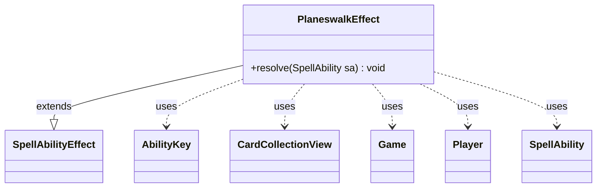

---
aliases:
  - PlaneswalkEffect
tags:
  - java/class
  - module/forge-game
  - pkg/forge/game/ability/effects
fqn: forge.game.ability.effects.PlaneswalkEffect
package: forge.game.ability.effects
module: forge-game
kind: Class
---

# PlaneswalkEffect

**Package:** `forge.game.ability.effects` &nbsp; **Module:** `forge-game` &nbsp; **Kind:** Class



## Relationships
**Extends:**
- [[forge.game.ability.SpellAbilityEffect|SpellAbilityEffect]]
**Uses:**
- [[forge.game.Game|Game]]
- [[forge.game.ability.AbilityKey|AbilityKey]]
- [[forge.game.card.CardCollectionView|CardCollectionView]]
- [[forge.game.player.Player|Player]]
- [[forge.game.spellability.SpellAbility|SpellAbility]]

## Design Description

PlaneswalkEffect implements the resolution logic for the Planechase "planeswalk" action. As a concrete subclass of `SpellAbilityEffect`, it overrides `resolve(SpellAbility)` to hook into Forge's ability-effect dispatch, recovering the activating `Player` and `Game` from the supplied `SpellAbility`.

It first guards against non-Planechase games and an optional player confirmation, then publishes a `ReplacementType.Planeswalk` event through an `AbilityKey`-keyed parameter map so other effects may intercept or replace the move. If unreplaced, it makes every player leave the current plane and sends the activator either to `Defined` destinations—resolved via `AbilityUtils` into a `CardCollectionView`—or on a default random planeswalk. Its parameter-driven branches (`Optional`, `Cause`, `DontPlaneswalkAway`, `Defined`) reflect Forge's data-defined card scripting, keeping behavior configurable rather than hard-coded.

## Source
`forge-game/src/main/java/forge/game/ability/effects/PlaneswalkEffect.java`

```java
package forge.game.ability.effects;

import forge.game.Game;
import forge.game.ability.AbilityKey;
import forge.game.ability.AbilityUtils;
import forge.game.ability.SpellAbilityEffect;
import forge.game.card.CardCollectionView;
import forge.game.player.Player;
import forge.game.replacement.ReplacementResult;
import forge.game.replacement.ReplacementType;
import forge.game.spellability.SpellAbility;
import forge.util.Localizer;

import java.util.Map;


public class PlaneswalkEffect extends SpellAbilityEffect {
    @Override
    public void resolve(SpellAbility sa) {
        Player activator = sa.getActivatingPlayer();
        Game game = activator.getGame();

        if (game.getActivePlanes() == null) { // not a planechase game, nothing happens
            return;
        }

        if (sa.hasParam("Optional") && !activator.getController().confirmAction(sa, null,
                Localizer.getInstance().getMessage("lblWouldYouLikeToPlaneswalk"), null)) {
                    return;
        }

        final Map<AbilityKey, Object> repParams = AbilityKey.mapFromAffected(activator);
        Object cause = sa.hasParam("Cause") ? sa.getParam("Cause") : sa;
        repParams.put(AbilityKey.Cause, cause);
        if (game.getReplacementHandler().run(ReplacementType.Planeswalk, repParams) == ReplacementResult.Replaced) {
            return;
        }

        if (!sa.hasParam("DontPlaneswalkAway")) {
            for (Player p : game.getPlayers()) {
                p.leaveCurrentPlane();
            }
        }
        if (sa.hasParam("Defined")) {
            CardCollectionView destinations = AbilityUtils.getDefinedCards(sa.getHostCard(), sa.getParam("Defined"), sa);
            activator.planeswalkTo(sa, destinations);
        } else {
            activator.planeswalk(sa);
        }
    }
}
```
