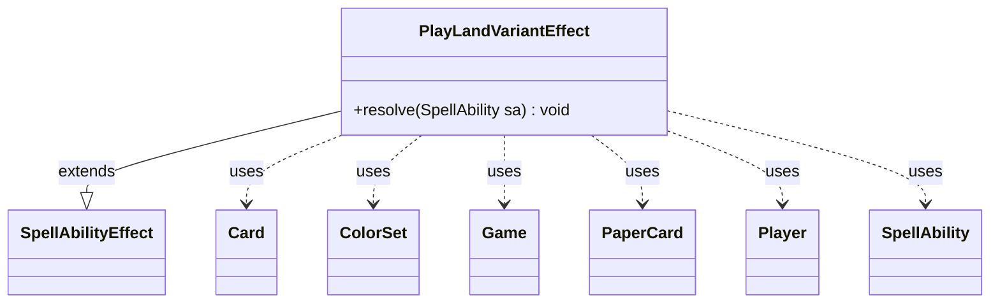

---
aliases:
  - PlayLandVariantEffect
tags:
  - java/class
  - module/forge-game
  - pkg/forge/game/ability/effects
fqn: forge.game.ability.effects.PlayLandVariantEffect
package: forge.game.ability.effects
module: forge-game
kind: Class
---

# PlayLandVariantEffect

**Package:** `forge.game.ability.effects`   **Module:** `forge-game`   **Kind:** Class



## Relationships
**Extends:**
- [[forge.game.ability.SpellAbilityEffect|SpellAbilityEffect]]
**Uses:**
- [[forge.card.ColorSet|ColorSet]]
- [[forge.game.Game|Game]]
- [[forge.game.card.Card|Card]]
- [[forge.game.player.Player|Player]]
- [[forge.game.spellability.SpellAbility|SpellAbility]]
- [[forge.item.PaperCard|PaperCard]]

## Design Description

PlayLandVariantEffect implements the resolution logic for an ability that lets a card play a randomly chosen basic land matching the host's colors. As a concrete `SpellAbilityEffect` subclass, it overrides only `resolve(SpellAbility)`, fitting the engine's effect-handler pattern where each ability behavior is a self-contained strategy invoked when its spell or ability resolves. It collaborates with the global `StaticData` card pool and `PaperCard` definitions to enumerate candidate lands, filters them by the host `Card`'s `ColorSet` (returning early when colorless), and uses `CardFactory` to instantiate candidates within the `Game` for the activating `Player`.

The design intent is notable in its randomized, retry-until-playable selection: it repeatedly draws a random land, removes rejected picks, and loops until one the player can legally play is found or the pool empties. Rather than swapping cards, it applies a clone state to the source via timestamped `addCloneState`, then plays the source as that land—reusing Forge's clone and land-play machinery instead of duplicating it.

## Source
`forge-game/src/main/java/forge/game/ability/effects/PlayLandVariantEffect.java`

```java
package forge.game.ability.effects;

import java.util.List;
import java.util.stream.Collectors;
import java.util.stream.Stream;

import com.google.common.collect.Lists;

import forge.StaticData;
import forge.card.ColorSet;
import forge.card.MagicColor;
import forge.game.Game;
import forge.game.ability.SpellAbilityEffect;
import forge.game.card.Card;
import forge.game.card.CardFactory;
import forge.game.player.Player;
import forge.game.spellability.SpellAbility;
import forge.item.PaperCard;
import forge.item.PaperCardPredicates;
import forge.util.Aggregates;

public class PlayLandVariantEffect extends SpellAbilityEffect {

    @Override
    public void resolve(final SpellAbility sa) {
        final Card source = sa.getHostCard();
        final Player activator = sa.getActivatingPlayer();
        final Game game = source.getGame();
        final String landType = sa.getParam("Clone");
        Stream<PaperCard> cardStream = StaticData.instance().getCommonCards().streamUniqueCards();
        if ("BasicLand".equals(landType)) {
            cardStream = cardStream.filter(PaperCardPredicates.IS_BASIC_LAND);
        }
        // current color of source card
        final ColorSet color = source.getColor();
        if (color.isColorless()) {
            return;
        }
        // find basic lands that can produce mana of one of the card's colors
        final List<String> landNames = Lists.newArrayList();
        for (byte i = 0; i < MagicColor.WUBRG.length; i++) {
            if (color.hasAnyColor(MagicColor.WUBRG[i])) {
                landNames.add(MagicColor.Constant.BASIC_LANDS.get(i));
                landNames.add(MagicColor.Constant.SNOW_LANDS.get(i));
            }
        }

        cardStream = cardStream.filter(x -> landNames.contains(x.getName()));
        List<PaperCard> cards = cardStream.collect(Collectors.toList());
        // get a random basic land
        Card random;
        // if activator cannot play the random land, loop
        do {
            if (cards.isEmpty()) return;
            PaperCard ran = Aggregates.random(cards);
            random = CardFactory.getCard(ran, activator, game);
            cards.remove(ran);
        } while (!activator.canPlayLand(random, false, random.getFirstSpellAbility()));

        source.addCloneState(CardFactory.getCloneStates(random, source, sa), game.getNextTimestamp());
        source.updateStateForView();

        activator.playLand(source, sa);
    }
}
```
