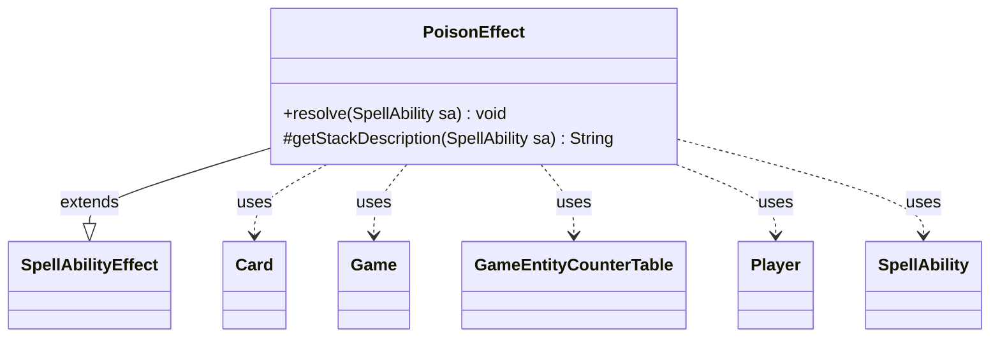

---
aliases:
  - PoisonEffect
tags:
  - java/class
  - module/forge-game
  - pkg/forge/game/ability/effects
fqn: forge.game.ability.effects.PoisonEffect
package: forge.game.ability.effects
module: forge-game
kind: Class
---

# PoisonEffect

**Package:** `forge.game.ability.effects` &nbsp; **Module:** `forge-game` &nbsp; **Kind:** Class



## Relationships
**Extends:**
- [[forge.game.ability.SpellAbilityEffect|SpellAbilityEffect]]
**Uses:**
- [[forge.game.Game|Game]]
- [[forge.game.GameEntityCounterTable|GameEntityCounterTable]]
- [[forge.game.card.Card|Card]]
- [[forge.game.player.Player|Player]]
- [[forge.game.spellability.SpellAbility|SpellAbility]]

## Design Description

PoisonEffect implements the resolution logic for spells and abilities that bestow or remove poison counters, extending `SpellAbilityEffect` to integrate into Forge's ability-effect framework. Its `resolve` method computes the counter count from the ability's `Num` parameter via `AbilityUtils`, then iterates over the targeted in-game `Player` objects, adding poison counters for positive amounts or removing them for negative ones, crediting the activating player. The overridden `getStackDescription` produces the human-readable stack text.

A notable design choice is that all counter changes are accumulated in a single `GameEntityCounterTable` and applied together through `replaceCounterEffect`, so replacement effects observe the batch as a unit rather than per-player. The class holds no state, drawing all context (`Card`, `Game`) and inputs from the passed-in `SpellAbility`, keeping it a reusable, side-effect-only handler within the engine.

## Source
`forge-game/src/main/java/forge/game/ability/effects/PoisonEffect.java`

```java
package forge.game.ability.effects;

import java.util.List;

import forge.game.Game;
import forge.game.GameEntityCounterTable;
import forge.game.ability.AbilityUtils;
import forge.game.ability.SpellAbilityEffect;
import forge.game.card.Card;
import forge.game.card.CounterEnumType;
import forge.game.player.Player;
import forge.game.spellability.SpellAbility;
import forge.util.Lang;

/**
 * TODO: Write javadoc for this type.
 *
 */

public class PoisonEffect extends SpellAbilityEffect {

    /* (non-Javadoc)
     * @see forge.game.ability.SpellAbilityEffect#resolve(forge.game.spellability.SpellAbility)
     */
    @Override
    public void resolve(SpellAbility sa) {
        final Card host = sa.getHostCard();
        final Game game = host.getGame();
        final int amount = AbilityUtils.calculateAmount(host, sa.getParam("Num"), sa);

        GameEntityCounterTable table = new GameEntityCounterTable();

        for (final Player p : getTargetPlayers(sa)) {
            if (!p.isInGame()) {
                continue;
            }

            if (amount >= 0) {
                p.addPoisonCounters(amount, sa.getActivatingPlayer(), table);
            } else {
                p.removePoisonCounters(-amount, sa.getActivatingPlayer());
            }
        }
        table.replaceCounterEffect(game, sa);
    }

    /* (non-Javadoc)
     * @see forge.game.ability.SpellAbilityEffect#getStackDescription(forge.game.spellability.SpellAbility)
     */
    @Override
    protected String getStackDescription(SpellAbility sa) {
        final StringBuilder sb = new StringBuilder();
        final int amount = AbilityUtils.calculateAmount(sa.getHostCard(), sa.getParam("Num"), sa);

        final List<Player> tgtPlayers = getTargetPlayers(sa);

        sb.append(Lang.joinHomogenous(tgtPlayers));
        sb.append(" ");

        sb.append("get");
        if (tgtPlayers.size() < 2) {
            sb.append("s");
        }

        String type = CounterEnumType.POISON.getName() + " counter";

        sb.append(" ").append(Lang.nounWithAmount(amount, type)).append(".");

        return sb.toString();
    }

}
```
