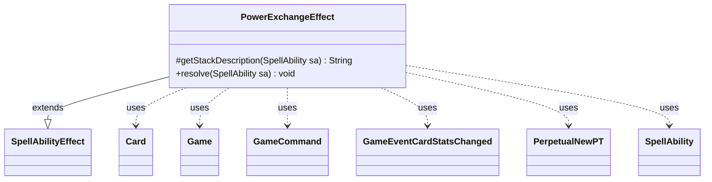

---
aliases:
  - PowerExchangeEffect
tags:
  - java/class
  - module/forge-game
  - pkg/forge/game/ability/effects
fqn: forge.game.ability.effects.PowerExchangeEffect
package: forge.game.ability.effects
module: forge-game
kind: Class
---

# PowerExchangeEffect

**Package:** `forge.game.ability.effects` &nbsp; **Module:** `forge-game` &nbsp; **Kind:** Class



## Relationships
**Extends:**
- [[forge.game.ability.SpellAbilityEffect|SpellAbilityEffect]]
**Uses:**
- [[forge.GameCommand|GameCommand]]
- [[forge.game.Game|Game]]
- [[forge.game.card.Card|Card]]
- [[forge.game.card.perpetual.PerpetualNewPT|PerpetualNewPT]]
- [[forge.game.event.GameEventCardStatsChanged|GameEventCardStatsChanged]]
- [[forge.game.spellability.SpellAbility|SpellAbility]]

## Design Description

PowerExchangeEffect is a concrete `SpellAbilityEffect` implementing a "swap power" resolution in which two creatures trade their power values. As a leaf in the ability-effect framework, it overrides `getStackDescription` to phrase the exchange for the stack and `resolve` to apply it. The two participants are either the host card and a single target, or two targeted cards; after confirming both are still in play, it reads each creature's power (current or net, per the `BasePower` flag) and reassigns the swapped values through timestamped `addNewPT` calls.

The class encodes Magic's layered, timestamp-ordered stat system as its core design intent. Duration determines lifetime: `Perpetual` records `PerpetualNewPT` entries that survive zone changes, `Permanent` leaves the modification standing, and otherwise a `GameCommand` is registered to undo the swap at end of turn. It collaborates with `Game` to allocate timestamps and to fire `GameEventCardStatsChanged` events, keeping the UI and game state synchronized.

## Source
`forge-game/src/main/java/forge/game/ability/effects/PowerExchangeEffect.java`

```java
package forge.game.ability.effects;

import java.util.List;

import forge.GameCommand;
import forge.game.Game;
import forge.game.ability.SpellAbilityEffect;
import forge.game.card.Card;
import forge.game.card.perpetual.PerpetualNewPT;
import forge.game.event.GameEventCardStatsChanged;
import forge.game.spellability.SpellAbility;

public class PowerExchangeEffect extends SpellAbilityEffect {
    /* (non-Javadoc)
     * @see forge.card.abilityfactory.AbilityFactoryAlterLife.SpellEffect#getStackDescription(java.util.Map, forge.card.spellability.SpellAbility)
     */
    @Override
    protected String getStackDescription(SpellAbility sa) {
        final StringBuilder sb = new StringBuilder();
        final List<Card> tgtCards = getTargetCards(sa);

        if (tgtCards.size() == 1) {
            sb.append(sa.getHostCard()).append(" exchanges power with ");
            sb.append(tgtCards.get(0));
        } else if (tgtCards.size() > 1) {
            sb.append(tgtCards.get(0)).append(" exchanges power with ");
            sb.append(tgtCards.get(1));
        }
        sb.append(".");
        return sb.toString();
    }

    /* (non-Javadoc)
     * @see forge.card.abilityfactory.AbilityFactoryAlterLife.SpellEffect#resolve(java.util.Map, forge.card.spellability.SpellAbility)
     */
    @Override
    public void resolve(SpellAbility sa) {
        final boolean perpetual = "Perpetual".equals(sa.getParam("Duration"));
        final Card source = sa.getHostCard();
        final Game game = source.getGame();
        final Card c1;
        final Card c2;

        final List<Card> tgtCards = getTargetCards(sa);

        if (tgtCards.size() == 1) {
            c1 = source;
            c2 = tgtCards.get(0);
        } else {
            c1 = tgtCards.get(0);
            c2 = tgtCards.get(1);
        }
        if (!c1.isInPlay() || !c2.isInPlay()) {
            return;
        }
        final boolean basePower = sa.hasParam("BasePower");
        final int power1 = basePower ? c1.getCurrentPower() : c1.getNetPower();
        final int power2 = basePower ? c2.getCurrentPower() : c2.getNetPower();

        final long timestamp = game.getNextTimestamp();

        if (perpetual) {
            c1.addPerpetual(new PerpetualNewPT(timestamp, power2, null));
            c2.addPerpetual(new PerpetualNewPT(timestamp, power1, null));
        }
        c1.addNewPT(power2, null, timestamp, 0);
        c2.addNewPT(power1, null, timestamp, 0);

        game.fireEvent(new GameEventCardStatsChanged(c1));
        game.fireEvent(new GameEventCardStatsChanged(c2));

        if (!"Permanent".equals(sa.getParam("Duration")) && !perpetual) {
            // If not Permanent, remove Pumped at EOT
            final GameCommand untilEOT = new GameCommand() {

                private static final long serialVersionUID = -4890579038956651232L;

                @Override
                public void run() {
                    c1.removeNewPT(timestamp, 0);
                    c2.removeNewPT(timestamp, 0);
                    game.fireEvent(new GameEventCardStatsChanged(c1));
                    game.fireEvent(new GameEventCardStatsChanged(c2));
                }
            };

            addUntilCommand(sa, untilEOT);
        }
    }

}
```

## Python
`forge/game/ability/effects/PowerExchangeEffect.py`

```python
from forge.GameCommand import GameCommand
from forge.game.Game import Game
from forge.game.ability.SpellAbilityEffect import SpellAbilityEffect
from forge.game.card.Card import Card
from forge.game.card.perpetual.PerpetualNewPT import PerpetualNewPT
from forge.game.event.GameEventCardStatsChanged import GameEventCardStatsChanged
from forge.game.spellability.SpellAbility import SpellAbility


class PowerExchangeEffect(SpellAbilityEffect):
    # (non-Javadoc)
    # @see forge.card.abilityfactory.AbilityFactoryAlterLife.SpellEffect#getStackDescription(java.util.Map, forge.card.spellability.SpellAbility)
    def getStackDescription(self, sa: SpellAbility) -> str:
        sb = []
        tgtCards = self.getTargetCards(sa)

        if len(tgtCards) == 1:
            sb.append(str(sa.getHostCard()))
            sb.append(" exchanges power with ")
            sb.append(str(tgtCards[0]))
        elif len(tgtCards) > 1:
            sb.append(str(tgtCards[0]))
            sb.append(" exchanges power with ")
            sb.append(str(tgtCards[1]))
        sb.append(".")
        return "".join(sb)

    # (non-Javadoc)
    # @see forge.card.abilityfactory.AbilityFactoryAlterLife.SpellEffect#resolve(java.util.Map, forge.card.spellability.SpellAbility)
    def resolve(self, sa: SpellAbility) -> None:
        perpetual = "Perpetual" == sa.getParam("Duration")
        source = sa.getHostCard()
        game = source.getGame()

        tgtCards = self.getTargetCards(sa)

        if len(tgtCards) == 1:
            c1 = source
            c2 = tgtCards[0]
        else:
            c1 = tgtCards[0]
            c2 = tgtCards[1]
        if not c1.isInPlay() or not c2.isInPlay():
            return
        basePower = sa.hasParam("BasePower")
        power1 = c1.getCurrentPower() if basePower else c1.getNetPower()
        power2 = c2.getCurrentPower() if basePower else c2.getNetPower()

        timestamp = game.getNextTimestamp()

        if perpetual:
            c1.addPerpetual(PerpetualNewPT(timestamp, power2, None))
            c2.addPerpetual(PerpetualNewPT(timestamp, power1, None))
        c1.addNewPT(power2, None, timestamp, 0)
        c2.addNewPT(power1, None, timestamp, 0)

        game.fireEvent(GameEventCardStatsChanged(c1))
        game.fireEvent(GameEventCardStatsChanged(c2))

        if "Permanent" != sa.getParam("Duration") and not perpetual:
            # If not Permanent, remove Pumped at EOT
            class _UntilEOT(GameCommand):
                serialVersionUID = -4890579038956651232

                def run(self):
                    c1.removeNewPT(timestamp, 0)
                    c2.removeNewPT(timestamp, 0)
                    game.fireEvent(GameEventCardStatsChanged(c1))
                    game.fireEvent(GameEventCardStatsChanged(c2))

            untilEOT = _UntilEOT()

            self.addUntilCommand(sa, untilEOT)
```
