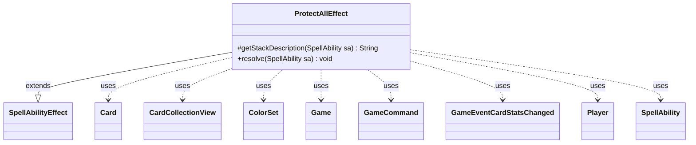

---
aliases:
  - ProtectAllEffect
tags:
  - java/class
  - module/forge-game
  - pkg/forge/game/ability/effects
fqn: forge.game.ability.effects.ProtectAllEffect
package: forge.game.ability.effects
module: forge-game
kind: Class
---

# ProtectAllEffect

**Package:** `forge.game.ability.effects` &nbsp; **Module:** `forge-game` &nbsp; **Kind:** Class



## Relationships
**Extends:**
- [[forge.game.ability.SpellAbilityEffect|SpellAbilityEffect]]
**Uses:**
- [[forge.GameCommand|GameCommand]]
- [[forge.card.ColorSet|ColorSet]]
- [[forge.game.Game|Game]]
- [[forge.game.card.Card|Card]]
- [[forge.game.card.CardCollectionView|CardCollectionView]]
- [[forge.game.event.GameEventCardStatsChanged|GameEventCardStatsChanged]]
- [[forge.game.player.Player|Player]]
- [[forge.game.spellability.SpellAbility|SpellAbility]]

## Design Description

ProtectAllEffect is a resolution handler for "protect all" style spell abilities, granting protection keywords to many permanents and players at once rather than to a single target. As a concrete subclass of SpellAbilityEffect, it overrides getStackDescription to summarize the granted protection and resolve to perform the work, fitting the engine's pattern where each ability script maps to one effect implementation.

On resolution it determines which protection colors to grant—via player choice, the host's chosen colors, a targeted card's colors, or a fixed list—then builds "Protection from X" keywords and applies them through timestamped changed-keyword layers to every valid battlefield Card and defined Player. It collaborates with Game for timestamps and fires GameEventCardStatsChanged to refresh affected cards, and reuses ProtectEffect.getProtectionList for color logic. Notably, unless the Duration is Permanent, it registers GameCommand cleanup callbacks via addUntilCommand to revoke the keywords at end of turn, mirroring Magic's temporary-effect semantics.

## Source
`forge-game/src/main/java/forge/game/ability/effects/ProtectAllEffect.java`

```java
package forge.game.ability.effects;

import java.util.ArrayList;
import java.util.List;

import com.google.common.collect.Lists;

import forge.GameCommand;
import forge.card.ColorSet;
import forge.card.MagicColor;
import forge.game.Game;
import forge.game.ability.AbilityUtils;
import forge.game.ability.SpellAbilityEffect;
import forge.game.card.Card;
import forge.game.card.CardCollectionView;
import forge.game.card.CardLists;
import forge.game.event.GameEventCardStatsChanged;
import forge.game.player.Player;
import forge.game.spellability.SpellAbility;
import forge.game.zone.ZoneType;
import forge.util.Lang;
import forge.util.TextUtil;

public class ProtectAllEffect extends SpellAbilityEffect {

    @Override
    protected String getStackDescription(SpellAbility sa) {
        final StringBuilder sb = new StringBuilder();

        final List<Card> tgtCards = getTargetCards(sa);

        if (tgtCards.size() > 0) {
            sb.append("Valid card gain protection");
            if (!"Permanent".equals(sa.getParam("Duration"))) {
                sb.append(" until end of turn");
            }
            sb.append(".");
        }

        return sb.toString();
    }

    @Override
    public void resolve(SpellAbility sa) {
        final Card host = sa.getHostCard();
        final Game game = sa.getActivatingPlayer().getGame();
        final long timestamp = game.getNextTimestamp();

        final boolean isChoice = sa.getParam("Gains").contains("Choice");
        final List<String> choices = ProtectEffect.getProtectionList(sa);
        final List<String> gains = new ArrayList<>();
        if (isChoice) {
            Player choser = sa.getActivatingPlayer();
            final String choice = choser.getController().chooseProtectionType(sa, choices);
            if( null == choice)
                return;
            gains.add(choice);
            game.getAction().notifyOfValue(sa, choser, Lang.joinHomogenous(gains), choser);
        } else {
            if (sa.getParam("Gains").equals("ChosenColor")) {
                for (final String color : host.getChosenColors()) {
                    gains.add(color.toLowerCase());
                }
            } else if (sa.getParam("Gains").equals("TargetedCardColor")) {
                for (final Card c : sa.getSATargetingCard().getTargets().getTargetCards()) {
                    ColorSet cs = c.getColor();
                    for (byte col : MagicColor.WUBRG) {
                        if (cs.hasAnyColor(col))
                            gains.add(MagicColor.toLongString(col).toLowerCase());
                    }
                }
            } else {
                gains.addAll(choices);
            }
        }

        List<String> gainsKWList = Lists.newArrayList();
        for (String color : gains) {
            gainsKWList.add(TextUtil.concatWithSpace("Protection from", color));
        }

        // Deal with permanents
        final String valid = sa.getParamOrDefault("ValidCards", "");
        if (!valid.isEmpty()) {
            CardCollectionView list = CardLists.getValidCards(game.getCardsIn(ZoneType.Battlefield), valid, sa.getActivatingPlayer(), host, sa);

            for (final Card tgtC : list) {
                tgtC.addChangedCardKeywords(gainsKWList, null, false, timestamp, null, true);
                game.fireEvent(new GameEventCardStatsChanged(tgtC));

                if (!"Permanent".equals(sa.getParam("Duration"))) {
                    // If not Permanent, remove protection at EOT
                    final GameCommand untilEOT = new GameCommand() {
                        private static final long serialVersionUID = -6573962672873853565L;

                        @Override
                        public void run() {
                            if (tgtC.isInPlay()) {
                                tgtC.removeChangedCardKeywords(timestamp, 0, true);
                                game.fireEvent(new GameEventCardStatsChanged(tgtC));
                            }
                        }
                    };
                    addUntilCommand(sa, untilEOT);
                }
            }
        }

        // Deal with Players
        final String players = sa.getParamOrDefault("ValidPlayers", "");
        if (!players.isEmpty()) {
            for (final Player player : AbilityUtils.getDefinedPlayers(host, players, sa)) {
                player.addChangedKeywords(gainsKWList, List.of(), timestamp, 0);

                if (!"Permanent".equals(sa.getParam("Duration"))) {
                    // If not Permanent, remove protection at EOT
                    final GameCommand revokeCommand = new GameCommand() {
                        private static final long serialVersionUID = -6573962672873853565L;

                        @Override
                        public void run() {
                            player.removeChangedKeywords(timestamp, 0);
                        }
                    };
                    addUntilCommand(sa, revokeCommand);
                }
            }
        }
    }

}
```
