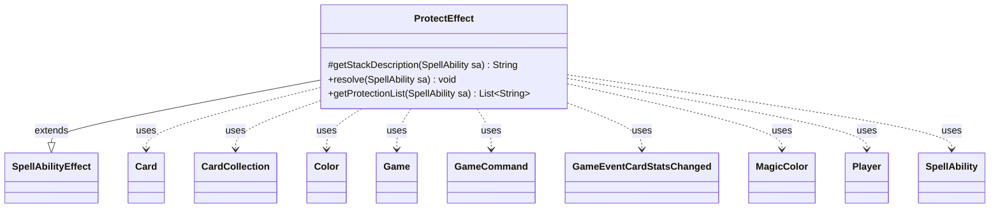

---
aliases:
  - ProtectEffect
tags:
  - java/class
  - module/forge-game
  - pkg/forge/game/ability/effects
fqn: forge.game.ability.effects.ProtectEffect
package: forge.game.ability.effects
module: forge-game
kind: Class
---

# ProtectEffect

**Package:** `forge.game.ability.effects`   **Module:** `forge-game`   **Kind:** Class



## Relationships
**Extends:**
- [[forge.game.ability.SpellAbilityEffect|SpellAbilityEffect]]
**Uses:**
- [[forge.GameCommand|GameCommand]]
- [[forge.card.MagicColor|MagicColor]]
- [[forge.card.MagicColor.Color|Color]]
- [[forge.game.Game|Game]]
- [[forge.game.card.Card|Card]]
- [[forge.game.card.CardCollection|CardCollection]]
- [[forge.game.event.GameEventCardStatsChanged|GameEventCardStatsChanged]]
- [[forge.game.player.Player|Player]]
- [[forge.game.spellability.SpellAbility|SpellAbility]]

## Design Description

ProtectEffect is a concrete resolver in Forge's ability-effects framework that implements Magic: The Gathering's "protection from" ability. Extending SpellAbilityEffect, it overrides getStackDescription to render human-readable rules text and resolve to apply the grant, and exposes a static getProtectionList helper that parses the ability's "Gains"/"Choices" parameters into protection types, expanding shorthands such as "AnyColor" and "CardType".

During resolution it derives the protection set from a player choice, the host's chosen colors, or a defined card's colors, converts each into the appropriate keyword, and applies it to every valid target Card plus any Radiance spread—skipping cards not in play, phased out, or failing the LKI game-state/timestamp check. A shared timestamp lets it register an until-end-of-turn GameCommand to remove non-permanent protections, while firing GameEventCardStatsChanged keeps game state and UI synchronized.

## Source
`forge-game/src/main/java/forge/game/ability/effects/ProtectEffect.java`

```java
package forge.game.ability.effects;

import java.util.ArrayList;
import java.util.Arrays;
import java.util.Iterator;
import java.util.List;

import org.apache.commons.lang3.StringUtils;

import com.google.common.collect.Lists;

import forge.GameCommand;
import forge.card.CardType;
import forge.card.MagicColor;
import forge.game.Game;
import forge.game.ability.AbilityUtils;
import forge.game.ability.SpellAbilityEffect;
import forge.game.card.Card;
import forge.game.card.CardCollection;
import forge.game.card.CardUtil;
import forge.game.event.GameEventCardStatsChanged;
import forge.game.player.Player;
import forge.game.spellability.SpellAbility;
import forge.util.Lang;
import forge.util.TextUtil;

public class ProtectEffect extends SpellAbilityEffect {

    /* (non-Javadoc)
         * @see forge.card.abilityfactory.SpellEffect#getStackDescription(java.util.Map, forge.card.spellability.SpellAbility)
         */
    @Override
    protected String getStackDescription(SpellAbility sa) {
        final List<String> gains = getProtectionList(sa);
        final boolean choose = sa.hasParam("Choices");
        final String joiner = choose ? "or" : "and";

        final StringBuilder sb = new StringBuilder();

        List<Card> tgtCards = getTargetCards(sa);

        if (!tgtCards.isEmpty()) {
            final Iterator<Card> it = tgtCards.iterator();
            while (it.hasNext()) {
                final Card tgtC = it.next();
                if (tgtC.isFaceDown()) {
                    sb.append("Morph");
                } else {
                    sb.append(tgtC);
                }

                if (it.hasNext()) {
                    sb.append(", ");
                }
            }

            if (sa.hasParam("Radiance") && sa.usesTargeting()) {
                sb.append(" and each other ").append(sa.getParam("ValidTgts"))
                        .append(" that shares a color with ");
                if (tgtCards.size() > 1) {
                    sb.append("them");
                } else {
                    sb.append("it");
                }
            }

            sb.append(" gain");
            if (tgtCards.size() == 1) {
                sb.append("s");
            }
            sb.append(" protection from ");

            if (choose) {
                sb.append("your choice of ");
            }

            for (int i = 0; i < gains.size(); i++) {
                if (i != 0) {
                    sb.append(", ");
                }

                if (i == (gains.size() - 1)) {
                    sb.append(joiner).append(" ");
                }

                sb.append(gains.get(i));
            }

            if (!"Permanent".equals(sa.getParam("Duration"))) {
                sb.append(" until end of turn");
            }

            sb.append(".");
        }

        return sb.toString();
    }

    @Override
    public void resolve(SpellAbility sa) {
        final Card host = sa.getHostCard();
        final Game game = sa.getActivatingPlayer().getGame();

        final boolean isChoice = sa.getParam("Gains").contains("Choice");
        final List<String> choices = getProtectionList(sa);
        final List<String> gains = new ArrayList<>();
        final List<Card> tgtCards = getTargetCards(sa);

        if (isChoice && !choices.isEmpty())  {
            Player choser = sa.getActivatingPlayer();
            if (sa.hasParam("Choser") && sa.getParam("Choser").equals("Controller") && !tgtCards.isEmpty()) {
                choser = tgtCards.get(0).getController();
            }
            final String choice = choser.getController().chooseProtectionType(sa, choices);
            if (null == choice)
                return;
            gains.add(choice);
            game.getAction().notifyOfValue(sa, choser, Lang.joinHomogenous(gains), choser);
        } else if (sa.getParam("Gains").equals("ChosenColor")) {
            for (final String color : host.getChosenColors()) {
                gains.add(color.toLowerCase());
            }
        } else if (sa.getParam("Gains").startsWith("Defined")) {
            CardCollection def = AbilityUtils.getDefinedCards(host, sa.getParam("Gains").substring(8), sa);
            for (final MagicColor.Color color : def.get(0).getColor()) {
                gains.add(color.getName());
            }
        } else {
            gains.addAll(choices);
        }

        List<String> gainsKWList = Lists.newArrayList();
        for (String type : gains) {
            if (CardType.isACardType(type)) {
                gainsKWList.add("Protection:" + type);
            }  else {
                gainsKWList.add(TextUtil.concatWithSpace("Protection from", type));
            }
        }

        tgtCards.addAll(CardUtil.getRadiance(sa));

        final long timestamp = game.getNextTimestamp();

        for (final Card tgtC : tgtCards) {
            // only pump things in play
            if (!tgtC.isInPlay()) {
                continue;
            }
            if (tgtC.isPhasedOut()) {
                continue;
            }
            // do Game Check there in case of LKI
            final Card gameCard = game.getCardState(tgtC, null);
            if (gameCard == null || !tgtC.equalsWithGameTimestamp(gameCard)) {
                continue;
            }

            gameCard.addChangedCardKeywords(gainsKWList, null, false, timestamp, null);
            game.fireEvent(new GameEventCardStatsChanged(gameCard));

            if (!"Permanent".equals(sa.getParam("Duration"))) {
                // If not Permanent, remove protection at EOT
                final GameCommand untilEOT = new GameCommand() {
                    private static final long serialVersionUID = 7682700789217703789L;

                    @Override
                    public void run() {
                        if (gameCard.isInPlay()) {
                            gameCard.removeChangedCardKeywords(timestamp, 0, true);
                            game.fireEvent(new GameEventCardStatsChanged(gameCard));
                        }
                    }
                };
                addUntilCommand(sa, untilEOT);
            }
        }
    }

    public static List<String> getProtectionList(final SpellAbility sa) {
        final List<String> gains = new ArrayList<>();

        final String gainStr = sa.getParam("Gains");
        if (gainStr.equals("Choice")) {
            String choices = sa.getParam("Choices");

            // Replace AnyColor with the 5 colors
            if (choices.contains("AnyColor")) {
                gains.addAll(MagicColor.Constant.ONLY_COLORS);
                choices = choices.replaceAll("AnyColor,?", "");
            } else if (choices.contains("CardType")) {
                choices = StringUtils.join(CardType.getAllCardTypes(), ",");
            }
            // Add any remaining choices
            if (choices.length() > 0) {
                gains.addAll(Arrays.asList(choices.split(",")));
            }
        } else {
            gains.addAll(Arrays.asList(gainStr.split(",")));
        }
        return gains;
    }

}
```

## Python
`forge/game/ability/effects/ProtectEffect.py`

```python
package forge.game.ability.effects

from typing import List

from forge.GameCommand import GameCommand
from forge.card.CardType import CardType
from forge.card.MagicColor import MagicColor
from forge.game.Game import Game
from forge.game.ability.AbilityUtils import AbilityUtils
from forge.game.ability.SpellAbilityEffect import SpellAbilityEffect
from forge.game.card.Card import Card
from forge.game.card.CardCollection import CardCollection
from forge.game.card.CardUtil import CardUtil
from forge.game.event.GameEventCardStatsChanged import GameEventCardStatsChanged
from forge.game.player.Player import Player
from forge.game.spellability.SpellAbility import SpellAbility
from forge.util.Lang import Lang
from forge.util.TextUtil import TextUtil


class ProtectEffect(SpellAbilityEffect):

    # (non-Javadoc)
    # @see forge.card.abilityfactory.SpellEffect#getStackDescription(java.util.Map, forge.card.spellability.SpellAbility)
    def getStackDescription(self, sa: SpellAbility) -> str:
        gains = self.getProtectionList(sa)
        choose = sa.hasParam("Choices")
        joiner = "or" if choose else "and"

        sb = []

        tgtCards = self.getTargetCards(sa)

        if tgtCards:
            it = iter(tgtCards)
            try:
                tgtC = next(it)
                hasNext = True
            except StopIteration:
                hasNext = False
            while hasNext:
                if tgtC.isFaceDown():
                    sb.append("Morph")
                else:
                    sb.append(str(tgtC))

                try:
                    tgtC = next(it)
                    sb.append(", ")
                except StopIteration:
                    hasNext = False

            if sa.hasParam("Radiance") and sa.usesTargeting():
                sb.append(" and each other ")
                sb.append(sa.getParam("ValidTgts"))
                sb.append(" that shares a color with ")
                if len(tgtCards) > 1:
                    sb.append("them")
                else:
                    sb.append("it")

            sb.append(" gain")
            if len(tgtCards) == 1:
                sb.append("s")
            sb.append(" protection from ")

            if choose:
                sb.append("your choice of ")

            for i in range(len(gains)):
                if i != 0:
                    sb.append(", ")

                if i == (len(gains) - 1):
                    sb.append(joiner)
                    sb.append(" ")

                sb.append(gains[i])

            if "Permanent" != sa.getParam("Duration"):
                sb.append(" until end of turn")

            sb.append(".")

        return "".join(sb)

    def resolve(self, sa: SpellAbility) -> None:
        host = sa.getHostCard()
        game = sa.getActivatingPlayer().getGame()

        isChoice = "Choice" in sa.getParam("Gains")
        choices = self.getProtectionList(sa)
        gains: List[str] = []
        tgtCards = self.getTargetCards(sa)

        if isChoice and choices:
            choser = sa.getActivatingPlayer()
            if sa.hasParam("Choser") and sa.getParam("Choser") == "Controller" and tgtCards:
                choser = tgtCards[0].getController()
            choice = choser.getController().chooseProtectionType(sa, choices)
            if choice is None:
                return
            gains.append(choice)
            game.getAction().notifyOfValue(sa, choser, Lang.joinHomogenous(gains), choser)
        elif sa.getParam("Gains") == "ChosenColor":
            for color in host.getChosenColors():
                gains.append(color.lower())
        elif sa.getParam("Gains").startswith("Defined"):
            def_ = AbilityUtils.getDefinedCards(host, sa.getParam("Gains")[8:], sa)
            for color in def_.get(0).getColor():
                gains.append(color.getName())
        else:
            gains.extend(choices)

        gainsKWList: List[str] = []
        for type in gains:
            if CardType.isACardType(type):
                gainsKWList.append("Protection:" + type)
            else:
                gainsKWList.append(TextUtil.concatWithSpace("Protection from", type))

        tgtCards.extend(CardUtil.getRadiance(sa))

        timestamp = game.getNextTimestamp()

        for tgtC in tgtCards:
            # only pump things in play
            if not tgtC.isInPlay():
                continue
            if tgtC.isPhasedOut():
                continue
            # do Game Check there in case of LKI
            gameCard = game.getCardState(tgtC, None)
            if gameCard is None or not tgtC.equalsWithGameTimestamp(gameCard):
                continue

            gameCard.addChangedCardKeywords(gainsKWList, None, False, timestamp, None)
            game.fireEvent(GameEventCardStatsChanged(gameCard))

            if "Permanent" != sa.getParam("Duration"):
                # If not Permanent, remove protection at EOT
                class untilEOT(GameCommand):
                    serialVersionUID = 7682700789217703789

                    def run(self):
                        if gameCard.isInPlay():
                            gameCard.removeChangedCardKeywords(timestamp, 0, True)
                            game.fireEvent(GameEventCardStatsChanged(gameCard))

                self.addUntilCommand(sa, untilEOT())

    @staticmethod
    def getProtectionList(sa: SpellAbility) -> List[str]:
        gains: List[str] = []

        gainStr = sa.getParam("Gains")
        if gainStr == "Choice":
            choices = sa.getParam("Choices")

            # Replace AnyColor with the 5 colors
            if "AnyColor" in choices:
                gains.extend(MagicColor.Constant.ONLY_COLORS)
                import re
                choices = re.sub("AnyColor,?", "", choices)
            elif "CardType" in choices:
                choices = ",".join(CardType.getAllCardTypes())
            # Add any remaining choices
            if len(choices) > 0:
                gains.extend(choices.split(","))
        else:
            gains.extend(gainStr.split(","))
        return gains
```
