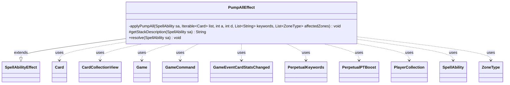

---
aliases:
  - PumpAllEffect
tags:
  - java/class
  - module/forge-game
  - pkg/forge/game/ability/effects
fqn: forge.game.ability.effects.PumpAllEffect
package: forge.game.ability.effects
module: forge-game
kind: Class
---

# PumpAllEffect

**Package:** `forge.game.ability.effects` &nbsp; **Module:** `forge-game` &nbsp; **Kind:** Class



## Relationships
**Extends:**
- [[forge.game.ability.SpellAbilityEffect|SpellAbilityEffect]]
**Uses:**
- [[forge.GameCommand|GameCommand]]
- [[forge.game.Game|Game]]
- [[forge.game.card.Card|Card]]
- [[forge.game.card.CardCollectionView|CardCollectionView]]
- [[forge.game.card.perpetual.PerpetualKeywords|PerpetualKeywords]]
- [[forge.game.card.perpetual.PerpetualPTBoost|PerpetualPTBoost]]
- [[forge.game.event.GameEventCardStatsChanged|GameEventCardStatsChanged]]
- [[forge.game.player.PlayerCollection|PlayerCollection]]
- [[forge.game.spellability.SpellAbility|SpellAbility]]
- [[forge.game.zone.ZoneType|ZoneType]]

## Design Description

PumpAllEffect is a concrete SpellAbilityEffect that resolves "pump all" abilities—those granting a power/toughness boost and/or keywords to every card matching a filter rather than to a single target. Its `resolve` method determines the affected zones (Battlefield by default, or a configured PumpZone), collects the relevant CardCollectionView either from the whole game or from targeted players' PlayerCollection, narrows it with the ValidCards filter, computes the attack/defense amounts and keyword list, and delegates the mutation to the private `applyPumpAll` helper. It also overrides `getStackDescription` to surface the spell's description to the UI.

The design centers on a single shared timestamp that tags every modification so it can be undone coherently: HIDDEN-prefixed keywords are separated out, and unless the duration is Permanent or Perpetual, an until-end-of-turn GameCommand reverses the P/T boost and keyword changes. Perpetual durations instead persist boosts via PerpetualPTBoost and PerpetualKeywords. Throughout, GameEventCardStatsChanged events keep views synchronized, with optional support for RememberPumped, SharedKeywordsZone, and delayed AtEOT triggers.

## Source
`forge-game/src/main/java/forge/game/ability/effects/PumpAllEffect.java`

```java
package forge.game.ability.effects;

import java.util.Arrays;
import java.util.List;

import com.google.common.collect.Iterables;
import com.google.common.collect.Lists;

import forge.GameCommand;
import forge.game.Game;
import forge.game.ability.AbilityUtils;
import forge.game.ability.SpellAbilityEffect;
import forge.game.card.Card;
import forge.game.card.CardCollectionView;
import forge.game.card.CardFactoryUtil;
import forge.game.card.perpetual.PerpetualKeywords;
import forge.game.card.perpetual.PerpetualPTBoost;
import forge.game.event.GameEventCardStatsChanged;
import forge.game.player.PlayerCollection;
import forge.game.spellability.SpellAbility;
import forge.game.zone.ZoneType;

public class PumpAllEffect extends SpellAbilityEffect {

    private static void applyPumpAll(final SpellAbility sa,
            final Iterable<Card> list, final int a, final int d,
            final List<String> keywords, final List<ZoneType> affectedZones) {
        final Game game = sa.getActivatingPlayer().getGame();
        final long timestamp = game.getNextTimestamp();
        final List<String> kws = Lists.newArrayList();
        final List<String> hiddenkws = Lists.newArrayList();
        final boolean perpetual = ("Perpetual").equals(sa.getParam("Duration"));

        for (String kw : keywords) {
            if (kw.startsWith("HIDDEN")) {
                hiddenkws.add(kw.substring(7));
            } else {
                kws.add(kw);
            }
        }

        for (final Card tgtC : list) {
            // only pump things in the affected zones.
            if (!tgtC.isInZones(affectedZones)) {
                continue;
            }

            boolean redrawPT = false;

            if (a != 0 || d != 0) {
                if (perpetual) {
                    tgtC.addPerpetual(new PerpetualPTBoost(timestamp, a, d));
                }
                tgtC.addPTBoost(a, d, timestamp, 0);
                redrawPT = true;
            }

            if (!kws.isEmpty()) {
                if (perpetual) {
                    tgtC.addPerpetual(new PerpetualKeywords(timestamp, kws, null, false));
                }
                tgtC.addChangedCardKeywords(kws, null, false, timestamp, null);
            }
            if (redrawPT) {
                tgtC.updatePTforView();
            }

            if (!hiddenkws.isEmpty()) {
                tgtC.addHiddenExtrinsicKeywords(timestamp, 0, hiddenkws);
            }

            if (sa.hasParam("RememberPumped")) {
                sa.getHostCard().addRemembered(tgtC);
            }

            if (!"Permanent".equals(sa.getParam("Duration")) && !perpetual) {
                // If not Permanent, remove Pumped at EOT
                final GameCommand untilEOT = new GameCommand() {
                    private static final long serialVersionUID = 5415795460189457660L;

                    @Override
                    public void run() {
                        tgtC.removePTBoost(timestamp, 0);
                        tgtC.removeChangedCardKeywords(timestamp, 0);
                        tgtC.removeHiddenExtrinsicKeywords(timestamp, 0);

                        tgtC.updatePTforView();

                        game.fireEvent(new GameEventCardStatsChanged(tgtC));
                    }
                };
                addUntilCommand(sa, untilEOT);
            }

            game.fireEvent(new GameEventCardStatsChanged(tgtC));
        }

        if (sa.hasParam("AtEOT") && !Iterables.isEmpty(list)) {
            registerDelayedTrigger(sa, sa.getParam("AtEOT"), list);
        }
    }

    @Override
    protected String getStackDescription(final SpellAbility sa) {
        final StringBuilder sb = new StringBuilder();

        String desc = "";
        if (sa.hasParam("SpellDescription")) {
            desc = sa.getParam("SpellDescription");
        }

        sb.append(desc);

        return sb.toString();
    }

    @Override
    public void resolve(final SpellAbility sa) {
        final List<ZoneType> affectedZones = Lists.newArrayList();
        final Game game = sa.getActivatingPlayer().getGame();

        if (!checkValidDuration(sa.getParam("Duration"), sa)) {
            return;
        }

        if (sa.hasParam("PumpZone")) {
            affectedZones.addAll(ZoneType.listValueOf(sa.getParam("PumpZone")));
        } else {
            affectedZones.add(ZoneType.Battlefield);
        }

        CardCollectionView list;
        if (!sa.usesTargeting() && !sa.hasParam("Defined")) {
            list = game.getCardsIn(affectedZones);
        } else {
            final PlayerCollection tgtPlayers = getTargetPlayers(sa);
            list = tgtPlayers.getCardsIn(affectedZones);
        }

        final String valid = sa.getParamOrDefault("ValidCards", "");

        list = AbilityUtils.filterListByType(list, valid, sa);

        List<String> keywords = Lists.newArrayList();
        if (sa.hasParam("KW")) {
            keywords.addAll(Arrays.asList(sa.getParam("KW").split(" & ")));
        }
        final int a = AbilityUtils.calculateAmount(sa.getHostCard(), sa.getParam("NumAtt"), sa, true);
        final int d = AbilityUtils.calculateAmount(sa.getHostCard(), sa.getParam("NumDef"), sa, true);

        if (sa.hasParam("SharedKeywordsZone")) {
            List<ZoneType> zones = ZoneType.listValueOf(sa.getParam("SharedKeywordsZone"));
            String[] restrictions = new String[] {"Card"};
            if (sa.hasParam("SharedRestrictions"))
                restrictions = sa.getParam("SharedRestrictions").split(",");
            keywords = CardFactoryUtil.sharedKeywords(keywords, restrictions, zones, sa.getHostCard(), sa);
        }
        applyPumpAll(sa, list, a, d, keywords, affectedZones);

        replaceDying(sa);
    }

}
```
