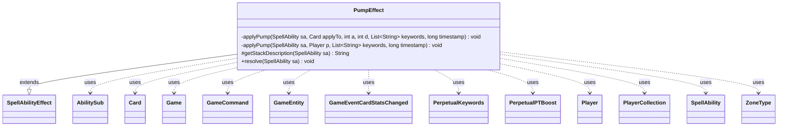

---
aliases:
  - PumpEffect
tags:
  - java/class
  - module/forge-game
  - pkg/forge/game/ability/effects
fqn: forge.game.ability.effects.PumpEffect
package: forge.game.ability.effects
module: forge-game
kind: Class
---

# PumpEffect

**Package:** `forge.game.ability.effects`   **Module:** `forge-game`   **Kind:** Class



## Relationships
**Extends:**
- [[forge.game.ability.SpellAbilityEffect|SpellAbilityEffect]]
**Uses:**
- [[forge.GameCommand|GameCommand]]
- [[forge.game.Game|Game]]
- [[forge.game.GameEntity|GameEntity]]
- [[forge.game.card.Card|Card]]
- [[forge.game.card.perpetual.PerpetualKeywords|PerpetualKeywords]]
- [[forge.game.card.perpetual.PerpetualPTBoost|PerpetualPTBoost]]
- [[forge.game.event.GameEventCardStatsChanged|GameEventCardStatsChanged]]
- [[forge.game.player.Player|Player]]
- [[forge.game.player.PlayerCollection|PlayerCollection]]
- [[forge.game.spellability.AbilitySub|AbilitySub]]
- [[forge.game.spellability.SpellAbility|SpellAbility]]
- [[forge.game.zone.ZoneType|ZoneType]]

## Design Description

PumpEffect resolves the broad family of MTG "pump" effects, applying temporary or lasting power/toughness boosts and keyword grants to creatures and players. Extending `SpellAbilityEffect`, it overrides `resolve` to read the host `SpellAbility`'s extensive parameters — NumAtt/NumDef (including Double/Triple), KW choices, durations, pump zones, radiance, keyword substitution (chosen type/color/player, mana-cost placeholders, shared and random keywords), and bookkeeping flags — and `getStackDescription` to render readable stack text.

Actual mutation is delegated to two private `applyPump` overloads, for `Card` and `Player` targets, which stamp boosts and keyword changes with a `timestamp` so they can be layered and removed. Non-permanent effects register a `GameCommand` to undo themselves at end of turn, while `Perpetual` durations persist via `PerpetualPTBoost`/`PerpetualKeywords`; each change fires `GameEventCardStatsChanged`. This data-driven design lets one class implement countless distinct cards through parameterization rather than per-card code.

## Source
`forge-game/src/main/java/forge/game/ability/effects/PumpEffect.java`

```java
package forge.game.ability.effects;

import java.util.Arrays;
import java.util.List;
import java.util.stream.Collectors;

import forge.util.*;
import org.apache.commons.lang3.StringUtils;

import com.google.common.collect.Lists;

import forge.GameCommand;
import forge.game.Game;
import forge.game.GameEntity;
import forge.game.ability.AbilityUtils;
import forge.game.ability.SpellAbilityEffect;
import forge.game.card.Card;
import forge.game.card.CardFactoryUtil;
import forge.game.card.CardUtil;
import forge.game.card.perpetual.PerpetualKeywords;
import forge.game.card.perpetual.PerpetualPTBoost;
import forge.game.event.GameEventCardStatsChanged;
import forge.game.player.Player;
import forge.game.player.PlayerCollection;
import forge.game.spellability.AbilitySub;
import forge.game.spellability.SpellAbility;
import forge.game.zone.ZoneType;

public class PumpEffect extends SpellAbilityEffect {

    private static void applyPump(final SpellAbility sa, final Card applyTo,
            final int a, final int d, final List<String> keywords,
            final long timestamp) {
        final Card host = sa.getHostCard();
        final Game game = host.getGame();
        final String duration = sa.getParam("Duration");
        final boolean perpetual = "Perpetual".equals(duration);

        // do Game Check there in case of LKI
        final Card gameCard = game.getCardState(applyTo, null);
        if (gameCard == null || !applyTo.equalsWithGameTimestamp(gameCard)) {
            return;
        }
        final List<String> kws = Lists.newArrayList();
        final List<String> hiddenKws = Lists.newArrayList();

        boolean redrawPT = false;
        for (String kw : keywords) {
            if (kw.startsWith("HIDDEN")) {
                hiddenKws.add(kw.substring(7));
                redrawPT |= kw.contains("CARDNAME's power and toughness are switched");
            } else {
                kws.add(kw);
            }
        }

        if (a != 0 || d != 0) {
            if (perpetual) {
                gameCard.addPerpetual(new PerpetualPTBoost(timestamp, a, d));
            }
            gameCard.addPTBoost(a, d, timestamp, 0);
            redrawPT = true;
        }

        if (!kws.isEmpty()) {
            if (perpetual) {
                gameCard.addPerpetual(new PerpetualKeywords(timestamp, kws, Lists.newArrayList(), false));
            }
            gameCard.addChangedCardKeywords(kws, Lists.newArrayList(), false, timestamp, null);
        }
        if (!hiddenKws.isEmpty()) {
            gameCard.addHiddenExtrinsicKeywords(timestamp, 0, hiddenKws);
        }
        if (redrawPT) {
            gameCard.updatePTforView();
        }

        if (sa.hasParam("CanBlockAny")) {
            gameCard.addCanBlockAny(timestamp);
        }
        if (sa.hasParam("CanBlockAmount")) {
            int v = AbilityUtils.calculateAmount(host, sa.getParam("CanBlockAmount"), sa, true);
            gameCard.addCanBlockAdditional(v, timestamp);
        }

        if (sa.hasParam("LeaveBattlefield")) {
            addLeaveBattlefieldReplacement(gameCard, sa, sa.getParam("LeaveBattlefield"));
        }

        if (sa.hasParam("RememberPumped")) {
            host.addRemembered(gameCard);
        }

        if (!"Permanent".equals(duration) && !perpetual) {
            // If not Permanent, remove Pumped at EOT
            final GameCommand untilEOT = new GameCommand() {
                private static final long serialVersionUID = -42244224L;

                @Override
                public void run() {
                    host.removeGainControlTargets(gameCard);

                    gameCard.removePTBoost(timestamp, 0);
                    boolean updateText = gameCard.removeCanBlockAny(timestamp);
                    updateText |= gameCard.removeCanBlockAdditional(timestamp);

                    if (keywords.size() > 0) {
                        gameCard.removeHiddenExtrinsicKeywords(timestamp, 0);
                        gameCard.removeChangedCardKeywords(timestamp, 0);
                    }
                    gameCard.updatePTforView();
                    if (updateText) {
                        gameCard.updateAbilityTextForView();
                    }

                    game.fireEvent(new GameEventCardStatsChanged(gameCard));
                }
            };
            if ("UntilUntaps".equals(duration)) {
                host.addGainControlTarget(gameCard);
            }
            addUntilCommand(sa, untilEOT);
        }
        game.fireEvent(new GameEventCardStatsChanged(gameCard));
    }

    private static void applyPump(final SpellAbility sa, final Player p,
            final List<String> keywords, final long timestamp) {
        final String duration = sa.getParam("Duration");

        if (!keywords.isEmpty()) {
            p.addChangedKeywords(keywords, List.of(), timestamp, 0);
        }

        if (!"Permanent".equals(duration)) {
            // If not Permanent, remove Pumped at EOT
            final GameCommand untilEOT = new GameCommand() {
                private static final long serialVersionUID = -32453460L;

                @Override
                public void run() {
                    p.removeChangedKeywords(timestamp, 0);
                }
            };
            addUntilCommand(sa, untilEOT);
        }
    }

    /*
     * (non-Javadoc)
     * @see forge.game.ability.SpellAbilityEffect#getStackDescription(forge.game.spellability.SpellAbility)
     */
    @Override
    protected String getStackDescription(final SpellAbility sa) {
        final StringBuilder sb = new StringBuilder();
        List<GameEntity> tgts = Lists.newArrayList();
        tgts.addAll(getCardsfromTargets(sa));
        if ((sa.usesTargeting() && sa.getTargetRestrictions().canTgtPlayer()) || sa.hasParam("Defined")) {
            tgts.addAll(getTargetPlayers(sa));
        }

        if (tgts.size() > 0) {
            List<String> keywords = Lists.newArrayList();
            if (sa.hasParam("KW")) {
                if (sa.getParam("KW").equals("HIDDEN This card doesn't untap during your next untap step.")) {
                    if (sa instanceof AbilitySub) {
                        sb.append(tgts.size() == 1 ? "It doesn't " : "They don't ");
                    } else {
                        sb.append(Lang.joinHomogenous(tgts)).append(tgts.size() == 1 ? " doesn't " : " don't ");
                    }
                    sb.append("untap during ");
                    String whose = "your";
                    for (GameEntity t : tgts) {
                        final Card c = (Card) t;
                        if (!(c.getOwner() == sa.getActivatingPlayer())) {
                            whose = (tgts.size() == 1 ? "its controller's" : "their controller's");
                            break;
                        }
                    }
                    sb.append(whose).append(" next untap step.");
                    return sb.toString();
                }
                keywords.addAll(Arrays.asList(sa.getParam("KW").split(" & ")));
            }

            if (sa.hasParam("IfDesc")) {
                if (sa.getParam("IfDesc").equals("True") && sa.hasParam("SpellDescription")) {
                    String ifDesc = sa.getParam("SpellDescription");
                    sb.append(ifDesc, 0, ifDesc.indexOf(",") + 1);
                } else {
                    sb.append(sa.getParam("IfDesc"));
                }
                sb.append(" ");
            }

            if (sa instanceof AbilitySub && sa.getRootAbility().getTargets().containsAll(tgts)) {
                //try to avoid having the same long list of targets twice in a StackDescription
                sb.append(tgts.size() == 1 && tgts.get(0) instanceof Card ? "It " : "They ");
            } else {
                sb.append(Lang.joinHomogenous(tgts)).append(" ");
            }

            if (sa.hasParam("Radiance")) {
                sb.append("and each other ").append(sa.getParam("ValidTgts"))
                        .append(" that shares a color with ");
                sb.append(tgts.size() > 1 ? "them " : "it ");
            }

            final int atk = AbilityUtils.calculateAmount(sa.getHostCard(), sa.getParam("NumAtt"), sa, true);
            final int def = AbilityUtils.calculateAmount(sa.getHostCard(), sa.getParam("NumDef"), sa, true);

            boolean gets = sa.hasParam("NumAtt") || sa.hasParam("NumDef");
            boolean gains = !keywords.isEmpty();

            if (gets) {
                sb.append("gets ");
                if (atk != 0) {
                    sb.append(atk > 0 ? "+" : "").append(atk).append("/");
                } else {
                    sb.append(def < 0 ? "-" : "+").append(atk).append("/");
                }
                if (def != 0) {
                    sb.append(def > 0 ? "+" : "").append(def).append(" ");
                } else {
                    sb.append(atk < 0 ? "-" : "+").append(def).append(" ");
                }
                sb.append(gains ? "and gains " : "");
            } else if (gains) {
                sb.append("gains ");
            }

            for (int i = 0; i < keywords.size(); i++) {
                sb.append(keywords.get(i).toLowerCase());
                sb.append(keywords.size() > 2 && i+1 != keywords.size() ? ", " : "");
                sb.append(keywords.size() == 2 && i == 0 ? " " : "");
                sb.append(i+2 == keywords.size() ? "and " : "");
            }

            if (sa.hasParam("CanBlockAny")) {
                if (gets || gains) {
                    sb.append(" and ");
                }
                sb.append("can block any number of creatures");
            } else if (sa.hasParam("CanBlockAmount")) {
                if (gets || gains) {
                    sb.append(" and ");
                }
                String n = sa.getParam("CanBlockAmount");
                sb.append("can block an additional ");
                sb.append("1".equals(n) ? "creature" : Lang.nounWithNumeral(n, "creature"));
                sb.append(" each combat");
            }

            String duration = sa.getParam("Duration");
            if (!"Permanent".equals(duration)) {
                if ("UntilUntaps".equals(duration)) {
                    sb.append(" for as long as CARDNAME remains tapped.");
                } else {
                    sb.append(" until end of turn.");
                }
            } else {
                sb.append(".");
            }
        }

        return sb.toString();
    }

    @Override
    public void resolve(final SpellAbility sa) {
        if (!checkValidDuration(sa.getParam("Duration"), sa)) {
            return;
        }

        final Player activator = sa.getActivatingPlayer();
        final Game game = activator.getGame();
        final Card host = sa.getHostCard();
        final long timestamp = game.getNextTimestamp();
        List<Card> tgtCards = getCardsfromTargets(sa);
        List<Player> tgtPlayers = getTargetPlayers(sa);

        if (sa.hasParam("Optional")) {
            final String targets = Lang.joinHomogenous(tgtCards);
            final String message = sa.hasParam("OptionQuestion")
                    ? TextUtil.fastReplace(sa.getParam("OptionQuestion"), "TARGETS", targets)
                    : Localizer.getInstance().getMessage("lblApplyPumpToTarget", targets);

            if (!activator.getController().confirmAction(sa, null, message, null)) {
                return;
            }
        }

        List<String> keywords = Lists.newArrayList();
        if (sa.hasParam("KW")) {
            keywords.addAll(Arrays.asList(sa.getParam("KW").split(" & ")));
        } else if (sa.hasParam("KWChoice")) {
            List<String> options = Arrays.asList(sa.getParam("KWChoice").split(","));
            String chosen = activator.getController().chooseKeywordForPump(options, sa,
                    Localizer.getInstance().getMessage("lblChooseKeyword"), tgtCards.get(0));
            keywords.add(chosen);
        }
        
        int a = 0;
        int d = 0;
        if (sa.hasParam("NumAtt") && !sa.getParam("NumAtt").equals("Double") && !sa.getParam("NumAtt").equals("Triple")) {
            a = AbilityUtils.calculateAmount(host, sa.getParam("NumAtt"), sa, true);
        }
        if (sa.hasParam("NumDef") && !sa.getParam("NumDef").equals("Double") && !sa.getParam("NumDef").equals("Triple")) {
            d = AbilityUtils.calculateAmount(host, sa.getParam("NumDef"), sa, true);
        }

        if (sa.hasParam("SharedKeywordsZone")) {
            List<ZoneType> zones = ZoneType.listValueOf(sa.getParam("SharedKeywordsZone"));
            String[] restrictions = sa.hasParam("SharedRestrictions") ? sa.getParam("SharedRestrictions").split(",") : new String[]{"Card"};
            keywords = CardFactoryUtil.sharedKeywords(keywords, restrictions, zones, host, sa);
        }

        if (sa.hasParam("DefinedKW")) {
            String defined = sa.getParam("DefinedKW");
            if (defined.equals("ChosenType")) {
                if (!host.hasChosenType()) {
                    return;
                }
                String replaced = host.getChosenType();
                for (int i = 0; i < keywords.size(); i++) {
                    String s = keywords.get(i);
                    s = s.replaceAll(defined, replaced);
                    keywords.set(i, s);
                }
            } else if (defined.equals("ChosenPlayer")) {
                if (!host.hasChosenPlayer()) {
                    return;
                }
                Player cp = host.getChosenPlayer();
                for (int i = 0; i < keywords.size(); i++) {
                    String s = keywords.get(i);
                    s = s.replaceAll("ChosenPlayerUID", String.valueOf(cp.getId()));
                    s = s.replaceAll("ChosenPlayerName", cp.getName());
                    keywords.set(i, s);
                }
            } else if (defined.equals("ChosenColor")) {
                if (!host.hasChosenColor()) {
                    return;
                }
                for (int i = 0; i < keywords.size(); i++) {
                    String s = keywords.get(i);
                    s = s.replaceAll("ChosenColor", StringUtils.capitalize(host.getChosenColor()));
                    s = s.replaceAll("chosenColor", host.getChosenColor().toLowerCase());
                    keywords.set(i, s);
                }
            } else { // anything else needs to be defined players?
                PlayerCollection players = AbilityUtils.getDefinedPlayers(host, defined, sa);
                if (players.isEmpty()) return;
                List<String> newKeywords = Lists.newArrayList();
                keywords.removeIf(input -> {
                    if (!input.contains("ChosenPlayerUID") && !input.contains("ChosenPlayerName")) {
                        return false;
                    }
                    for (Player p : players) {
                        String replacedID = String.valueOf(p.getId());
                        String replacedName = p.getName();

                        String s = input.replaceAll("ChosenPlayerUID", replacedID);
                        s = s.replaceAll("ChosenPlayerName", replacedName);
                        newKeywords.add(s);
                    }
                    return true;
                });
                keywords.addAll(newKeywords);
            }
        }
        if (sa.hasParam("DefinedLandwalk")) {
            final String landtype = sa.getParam("DefinedLandwalk");
            for (final Card c : AbilityUtils.getDefinedCards(host, landtype, sa)) {
                for (String type : c.getType().getLandTypes()) {
                    keywords.add("Landwalk:" +type);
                }
            }
        }
        if (sa.hasParam("RandomKeyword")) {
            final String num = sa.getParamOrDefault("RandomKWNum", "1");
            final int numkw = AbilityUtils.calculateAmount(host, num, sa);
            List<String> choice = Lists.newArrayList();
            List<String> total = Lists.newArrayList(keywords);
            if (sa.hasParam("NoRepetition")) {
                for (String kw : keywords) {
                    if (tgtCards.get(0).hasKeyword(kw)) {
                        total.remove(kw);
                    }
                }
            }
            final int min = Math.min(total.size(), numkw);
            for (int i = 0; i < min; i++) {
                final String random = Aggregates.random(total);
                choice.add(random);
                total.remove(random);
            }
            keywords = choice;
        }

        if (sa.hasParam("RememberObjects")) {
            host.addRemembered(AbilityUtils.getDefinedObjects(host, sa.getParam("RememberObjects"), sa));
        }

        if (sa.hasParam("NoteCardsFor")) {
            for (final Card c : AbilityUtils.getDefinedCards(host, sa.getParam("NoteCards"), sa)) {
                for (Player p : tgtPlayers) {
                    p.addNoteForName(sa.getParam("NoteCardsFor"), "Id:" + c.getId());
                }
            }
        }
        if (sa.hasParam("ClearNotedCardsFor")) {
            for (Player p : tgtPlayers) {
                for (String s : sa.getParam("ClearNotedCardsFor").split(",")) {
                    p.clearNotesForName(s);
                }
            }
        }

        if (sa.hasParam("NoteNumber")) {
            int num = AbilityUtils.calculateAmount(host, sa.getParam("NoteNumber"), sa);
            for (Player p : tgtPlayers) {
                p.noteNumberForName(host.getName(), num);
            }
        }

        if (sa.hasParam("ForgetObjects")) {
            host.removeRemembered(AbilityUtils.getDefinedObjects(host, sa.getParam("ForgetObjects"), sa));
        }

        if (sa.hasParam("ImprintCards")) {
            host.addImprintedCards(AbilityUtils.getDefinedCards(host, sa.getParam("ImprintCards"), sa));
        }

        if (sa.hasParam("ForgetImprinted")) {
            host.removeImprintedCards(AbilityUtils.getDefinedCards(host, sa.getParam("ForgetImprinted"), sa));
        }

        List<ZoneType> pumpZones = sa.hasParam("PumpZone") ? ZoneType.listValueOf(sa.getParam("PumpZone"))
                : ZoneType.listValueOf("Battlefield");

        for (Card tgtC : tgtCards) {
            // CR 702.26e
            if (tgtC.isPhasedOut()) {
                continue;
            }

            // only pump things in PumpZones
            if (!tgtC.isInZones(pumpZones)) {
                continue;
            }

            // substitute specific tgtC mana cost for keyword placeholder CardManaCost
            List<String> affectedKeywords = Lists.newArrayList(keywords);

            if (!affectedKeywords.isEmpty()) {
                affectedKeywords = affectedKeywords.stream().map(input -> {
                    if (input.contains("CardManaCost")) {
                        input = input.replace("CardManaCost", tgtC.getManaCost().getShortString());
                    } else if (input.contains("ConvertedManaCost")) {
                        final String costcmc = Integer.toString(tgtC.getCMC());
                        input = input.replace("ConvertedManaCost", costcmc);
                    }
                    return input;
                }).collect(Collectors.toList());
            }

            if (sa.hasParam("NumAtt") && sa.getParam("NumAtt").equals("Double")) {
                a = tgtC.getNetPower();
            }
            if (sa.hasParam("NumDef") && sa.getParam("NumDef").equals("Double")) {
                d = tgtC.getNetToughness();
            }

            if (sa.hasParam("NumAtt") && sa.getParam("NumAtt").equals("Triple")) {
                a = tgtC.getNetPower() *2;
            }
            if (sa.hasParam("NumDef") && sa.getParam("NumDef").equals("Triple")) {
                d = tgtC.getNetToughness() *2;
            }

            applyPump(sa, tgtC, a, d, affectedKeywords, timestamp);
        }

        if (sa.hasParam("AtEOT") && !tgtCards.isEmpty()) {
            registerDelayedTrigger(sa, sa.getParam("AtEOT"), tgtCards);
        }

        for (final Card tgtC : CardUtil.getRadiance(sa)) {
            // only pump things in PumpZone
            if (!tgtC.isInZones(pumpZones)) {
                continue;
            }

            applyPump(sa, tgtC, a, d, keywords, timestamp);
        }

        for (Player p : tgtPlayers) {
            if (!p.isInGame()) {
                continue;
            }

            applyPump(sa, p, keywords, timestamp);
        }

        replaceDying(sa);
    }
}
```

## Python
`forge/game/ability/effects/PumpEffect.py`

```python
from forge.GameCommand import GameCommand
from forge.game.Game import Game
from forge.game.GameEntity import GameEntity
from forge.game.ability.AbilityUtils import AbilityUtils
from forge.game.ability.SpellAbilityEffect import SpellAbilityEffect
from forge.game.card.Card import Card
from forge.game.card.CardFactoryUtil import CardFactoryUtil
from forge.game.card.CardUtil import CardUtil
from forge.game.card.perpetual.PerpetualKeywords import PerpetualKeywords
from forge.game.card.perpetual.PerpetualPTBoost import PerpetualPTBoost
from forge.game.event.GameEventCardStatsChanged import GameEventCardStatsChanged
from forge.game.player.Player import Player
from forge.game.player.PlayerCollection import PlayerCollection
from forge.game.spellability.AbilitySub import AbilitySub
from forge.game.spellability.SpellAbility import SpellAbility
from forge.game.zone.ZoneType import ZoneType
from forge.util.Lang import Lang
from forge.util.TextUtil import TextUtil
from forge.util.Localizer import Localizer
from forge.util.Aggregates import Aggregates


class PumpEffect(SpellAbilityEffect):

    @staticmethod
    def applyPumpCard(sa, applyTo, a, d, keywords, timestamp):
        host = sa.getHostCard()
        game = host.getGame()
        duration = sa.getParam("Duration")
        perpetual = "Perpetual" == duration

        # do Game Check there in case of LKI
        gameCard = game.getCardState(applyTo, None)
        if gameCard is None or not applyTo.equalsWithGameTimestamp(gameCard):
            return
        kws = []
        hiddenKws = []

        redrawPT = False
        for kw in keywords:
            if kw.startswith("HIDDEN"):
                hiddenKws.append(kw[7:])
                redrawPT |= "CARDNAME's power and toughness are switched" in kw
            else:
                kws.append(kw)

        if a != 0 or d != 0:
            if perpetual:
                gameCard.addPerpetual(PerpetualPTBoost(timestamp, a, d))
            gameCard.addPTBoost(a, d, timestamp, 0)
            redrawPT = True

        if kws:
            if perpetual:
                gameCard.addPerpetual(PerpetualKeywords(timestamp, kws, [], False))
            gameCard.addChangedCardKeywords(kws, [], False, timestamp, None)
        if hiddenKws:
            gameCard.addHiddenExtrinsicKeywords(timestamp, 0, hiddenKws)
        if redrawPT:
            gameCard.updatePTforView()

        if sa.hasParam("CanBlockAny"):
            gameCard.addCanBlockAny(timestamp)
        if sa.hasParam("CanBlockAmount"):
            v = AbilityUtils.calculateAmount(host, sa.getParam("CanBlockAmount"), sa, True)
            gameCard.addCanBlockAdditional(v, timestamp)

        if sa.hasParam("LeaveBattlefield"):
            SpellAbilityEffect.addLeaveBattlefieldReplacement(gameCard, sa, sa.getParam("LeaveBattlefield"))

        if sa.hasParam("RememberPumped"):
            host.addRemembered(gameCard)

        if "Permanent" != duration and not perpetual:
            # If not Permanent, remove Pumped at EOT
            class UntilEOT(GameCommand):
                serialVersionUID = -42244224

                def run(self):
                    host.removeGainControlTargets(gameCard)

                    gameCard.removePTBoost(timestamp, 0)
                    updateText = gameCard.removeCanBlockAny(timestamp)
                    updateText |= gameCard.removeCanBlockAdditional(timestamp)

                    if len(keywords) > 0:
                        gameCard.removeHiddenExtrinsicKeywords(timestamp, 0)
                        gameCard.removeChangedCardKeywords(timestamp, 0)
                    gameCard.updatePTforView()
                    if updateText:
                        gameCard.updateAbilityTextForView()

                    game.fireEvent(GameEventCardStatsChanged(gameCard))

            untilEOT = UntilEOT()
            if "UntilUntaps" == duration:
                host.addGainControlTarget(gameCard)
            SpellAbilityEffect.addUntilCommand(sa, untilEOT)
        game.fireEvent(GameEventCardStatsChanged(gameCard))

    @staticmethod
    def applyPumpPlayer(sa, p, keywords, timestamp):
        duration = sa.getParam("Duration")

        if keywords:
            p.addChangedKeywords(keywords, [], timestamp, 0)

        if "Permanent" != duration:
            # If not Permanent, remove Pumped at EOT
            class UntilEOT(GameCommand):
                serialVersionUID = -32453460

                def run(self):
                    p.removeChangedKeywords(timestamp, 0)

            untilEOT = UntilEOT()
            SpellAbilityEffect.addUntilCommand(sa, untilEOT)

    #
    # (non-Javadoc)
    # @see forge.game.ability.SpellAbilityEffect#getStackDescription(forge.game.spellability.SpellAbility)
    #
    def getStackDescription(self, sa):
        sb = []
        tgts = []
        tgts.extend(self.getCardsfromTargets(sa))
        if (sa.usesTargeting() and sa.getTargetRestrictions().canTgtPlayer()) or sa.hasParam("Defined"):
            tgts.extend(self.getTargetPlayers(sa))

        if len(tgts) > 0:
            keywords = []
            if sa.hasParam("KW"):
                if sa.getParam("KW") == "HIDDEN This card doesn't untap during your next untap step.":
                    if isinstance(sa, AbilitySub):
                        sb.append("It doesn't " if len(tgts) == 1 else "They don't ")
                    else:
                        sb.append(Lang.joinHomogenous(tgts))
                        sb.append(" doesn't " if len(tgts) == 1 else " don't ")
                    sb.append("untap during ")
                    whose = "your"
                    for t in tgts:
                        c = t
                        if not (c.getOwner() == sa.getActivatingPlayer()):
                            whose = "its controller's" if len(tgts) == 1 else "their controller's"
                            break
                    sb.append(whose)
                    sb.append(" next untap step.")
                    return "".join(sb)
                keywords.extend(sa.getParam("KW").split(" & "))

            if sa.hasParam("IfDesc"):
                if sa.getParam("IfDesc") == "True" and sa.hasParam("SpellDescription"):
                    ifDesc = sa.getParam("SpellDescription")
                    sb.append(ifDesc[0:ifDesc.find(",") + 1])
                else:
                    sb.append(sa.getParam("IfDesc"))
                sb.append(" ")

            if isinstance(sa, AbilitySub) and sa.getRootAbility().getTargets().containsAll(tgts):
                # try to avoid having the same long list of targets twice in a StackDescription
                sb.append("It " if len(tgts) == 1 and isinstance(tgts[0], Card) else "They ")
            else:
                sb.append(Lang.joinHomogenous(tgts))
                sb.append(" ")

            if sa.hasParam("Radiance"):
                sb.append("and each other ")
                sb.append(sa.getParam("ValidTgts"))
                sb.append(" that shares a color with ")
                sb.append("them " if len(tgts) > 1 else "it ")

            atk = AbilityUtils.calculateAmount(sa.getHostCard(), sa.getParam("NumAtt"), sa, True)
            df = AbilityUtils.calculateAmount(sa.getHostCard(), sa.getParam("NumDef"), sa, True)

            gets = sa.hasParam("NumAtt") or sa.hasParam("NumDef")
            gains = bool(keywords)

            if gets:
                sb.append("gets ")
                if atk != 0:
                    sb.append("+" if atk > 0 else "")
                    sb.append(str(atk))
                    sb.append("/")
                else:
                    sb.append("-" if df < 0 else "+")
                    sb.append(str(atk))
                    sb.append("/")
                if df != 0:
                    sb.append("+" if df > 0 else "")
                    sb.append(str(df))
                    sb.append(" ")
                else:
                    sb.append("-" if atk < 0 else "+")
                    sb.append(str(df))
                    sb.append(" ")
                sb.append("and gains " if gains else "")
            elif gains:
                sb.append("gains ")

            for i in range(len(keywords)):
                sb.append(keywords[i].lower())
                sb.append(", " if len(keywords) > 2 and i + 1 != len(keywords) else "")
                sb.append(" " if len(keywords) == 2 and i == 0 else "")
                sb.append("and " if i + 2 == len(keywords) else "")

            if sa.hasParam("CanBlockAny"):
                if gets or gains:
                    sb.append(" and ")
                sb.append("can block any number of creatures")
            elif sa.hasParam("CanBlockAmount"):
                if gets or gains:
                    sb.append(" and ")
                n = sa.getParam("CanBlockAmount")
                sb.append("can block an additional ")
                sb.append("creature" if "1" == n else Lang.nounWithNumeral(n, "creature"))
                sb.append(" each combat")

            duration = sa.getParam("Duration")
            if "Permanent" != duration:
                if "UntilUntaps" == duration:
                    sb.append(" for as long as CARDNAME remains tapped.")
                else:
                    sb.append(" until end of turn.")
            else:
                sb.append(".")

        return "".join(sb)

    def resolve(self, sa):
        if not self.checkValidDuration(sa.getParam("Duration"), sa):
            return

        activator = sa.getActivatingPlayer()
        game = activator.getGame()
        host = sa.getHostCard()
        timestamp = game.getNextTimestamp()
        tgtCards = self.getCardsfromTargets(sa)
        tgtPlayers = self.getTargetPlayers(sa)

        if sa.hasParam("Optional"):
            targets = Lang.joinHomogenous(tgtCards)
            message = (TextUtil.fastReplace(sa.getParam("OptionQuestion"), "TARGETS", targets)
                       if sa.hasParam("OptionQuestion")
                       else Localizer.getInstance().getMessage("lblApplyPumpToTarget", targets))

            if not activator.getController().confirmAction(sa, None, message, None):
                return

        keywords = []
        if sa.hasParam("KW"):
            keywords.extend(sa.getParam("KW").split(" & "))
        elif sa.hasParam("KWChoice"):
            options = sa.getParam("KWChoice").split(",")
            chosen = activator.getController().chooseKeywordForPump(
                options, sa, Localizer.getInstance().getMessage("lblChooseKeyword"), tgtCards[0])
            keywords.append(chosen)

        a = 0
        d = 0
        if sa.hasParam("NumAtt") and sa.getParam("NumAtt") != "Double" and sa.getParam("NumAtt") != "Triple":
            a = AbilityUtils.calculateAmount(host, sa.getParam("NumAtt"), sa, True)
        if sa.hasParam("NumDef") and sa.getParam("NumDef") != "Double" and sa.getParam("NumDef") != "Triple":
            d = AbilityUtils.calculateAmount(host, sa.getParam("NumDef"), sa, True)

        if sa.hasParam("SharedKeywordsZone"):
            zones = ZoneType.listValueOf(sa.getParam("SharedKeywordsZone"))
            restrictions = sa.getParam("SharedRestrictions").split(",") if sa.hasParam("SharedRestrictions") else ["Card"]
            keywords = CardFactoryUtil.sharedKeywords(keywords, restrictions, zones, host, sa)

        if sa.hasParam("DefinedKW"):
            defined = sa.getParam("DefinedKW")
            if defined == "ChosenType":
                if not host.hasChosenType():
                    return
                replaced = host.getChosenType()
                for i in range(len(keywords)):
                    s = keywords[i]
                    s = s.replace(defined, replaced)
                    keywords[i] = s
            elif defined == "ChosenPlayer":
                if not host.hasChosenPlayer():
                    return
                cp = host.getChosenPlayer()
                for i in range(len(keywords)):
                    s = keywords[i]
                    s = s.replace("ChosenPlayerUID", str(cp.getId()))
                    s = s.replace("ChosenPlayerName", cp.getName())
                    keywords[i] = s
            elif defined == "ChosenColor":
                if not host.hasChosenColor():
                    return
                for i in range(len(keywords)):
                    s = keywords[i]
                    chosenColor = host.getChosenColor()
                    s = s.replace("ChosenColor", chosenColor[:1].upper() + chosenColor[1:])
                    s = s.replace("chosenColor", host.getChosenColor().lower())
                    keywords[i] = s
            else:  # anything else needs to be defined players?
                players = AbilityUtils.getDefinedPlayers(host, defined, sa)
                if players.isEmpty():
                    return
                newKeywords = []

                def shouldRemove(input):
                    if "ChosenPlayerUID" not in input and "ChosenPlayerName" not in input:
                        return False
                    for p in players:
                        replacedID = str(p.getId())
                        replacedName = p.getName()

                        s = input.replace("ChosenPlayerUID", replacedID)
                        s = s.replace("ChosenPlayerName", replacedName)
                        newKeywords.append(s)
                    return True

                keywords = [kw for kw in keywords if not shouldRemove(kw)]
                keywords.extend(newKeywords)
        if sa.hasParam("DefinedLandwalk"):
            landtype = sa.getParam("DefinedLandwalk")
            for c in AbilityUtils.getDefinedCards(host, landtype, sa):
                for type in c.getType().getLandTypes():
                    keywords.append("Landwalk:" + type)
        if sa.hasParam("RandomKeyword"):
            num = sa.getParamOrDefault("RandomKWNum", "1")
            numkw = AbilityUtils.calculateAmount(host, num, sa)
            choice = []
            total = list(keywords)
            if sa.hasParam("NoRepetition"):
                for kw in keywords:
                    if tgtCards[0].hasKeyword(kw):
                        total.remove(kw)
            min_ = min(len(total), numkw)
            for i in range(min_):
                random = Aggregates.random(total)
                choice.append(random)
                total.remove(random)
            keywords = choice

        if sa.hasParam("RememberObjects"):
            host.addRemembered(AbilityUtils.getDefinedObjects(host, sa.getParam("RememberObjects"), sa))

        if sa.hasParam("NoteCardsFor"):
            for c in AbilityUtils.getDefinedCards(host, sa.getParam("NoteCards"), sa):
                for p in tgtPlayers:
                    p.addNoteForName(sa.getParam("NoteCardsFor"), "Id:" + str(c.getId()))
        if sa.hasParam("ClearNotedCardsFor"):
            for p in tgtPlayers:
                for s in sa.getParam("ClearNotedCardsFor").split(","):
                    p.clearNotesForName(s)

        if sa.hasParam("NoteNumber"):
            num = AbilityUtils.calculateAmount(host, sa.getParam("NoteNumber"), sa)
            for p in tgtPlayers:
                p.noteNumberForName(host.getName(), num)

        if sa.hasParam("ForgetObjects"):
            host.removeRemembered(AbilityUtils.getDefinedObjects(host, sa.getParam("ForgetObjects"), sa))

        if sa.hasParam("ImprintCards"):
            host.addImprintedCards(AbilityUtils.getDefinedCards(host, sa.getParam("ImprintCards"), sa))

        if sa.hasParam("ForgetImprinted"):
            host.removeImprintedCards(AbilityUtils.getDefinedCards(host, sa.getParam("ForgetImprinted"), sa))

        pumpZones = (ZoneType.listValueOf(sa.getParam("PumpZone")) if sa.hasParam("PumpZone")
                     else ZoneType.listValueOf("Battlefield"))

        for tgtC in tgtCards:
            # CR 702.26e
            if tgtC.isPhasedOut():
                continue

            # only pump things in PumpZones
            if not tgtC.isInZones(pumpZones):
                continue

            # substitute specific tgtC mana cost for keyword placeholder CardManaCost
            affectedKeywords = list(keywords)

            if affectedKeywords:
                def substitute(input):
                    if "CardManaCost" in input:
                        input = input.replace("CardManaCost", tgtC.getManaCost().getShortString())
                    elif "ConvertedManaCost" in input:
                        costcmc = str(tgtC.getCMC())
                        input = input.replace("ConvertedManaCost", costcmc)
                    return input

                affectedKeywords = [substitute(kw) for kw in affectedKeywords]

            if sa.hasParam("NumAtt") and sa.getParam("NumAtt") == "Double":
                a = tgtC.getNetPower()
            if sa.hasParam("NumDef") and sa.getParam("NumDef") == "Double":
                d = tgtC.getNetToughness()

            if sa.hasParam("NumAtt") and sa.getParam("NumAtt") == "Triple":
                a = tgtC.getNetPower() * 2
            if sa.hasParam("NumDef") and sa.getParam("NumDef") == "Triple":
                d = tgtC.getNetToughness() * 2

            PumpEffect.applyPumpCard(sa, tgtC, a, d, affectedKeywords, timestamp)

        if sa.hasParam("AtEOT") and tgtCards:
            self.registerDelayedTrigger(sa, sa.getParam("AtEOT"), tgtCards)

        for tgtC in CardUtil.getRadiance(sa):
            # only pump things in PumpZone
            if not tgtC.isInZones(pumpZones):
                continue

            PumpEffect.applyPumpCard(sa, tgtC, a, d, keywords, timestamp)

        for p in tgtPlayers:
            if not p.isInGame():
                continue

            PumpEffect.applyPumpPlayer(sa, p, keywords, timestamp)

        self.replaceDying(sa)
```
