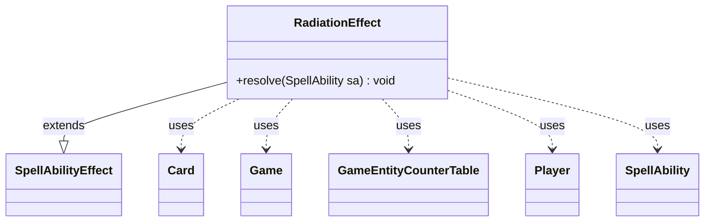

---
aliases:
  - RadiationEffect
tags:
  - java/class
  - module/forge-game
  - pkg/forge/game/ability/effects
fqn: forge.game.ability.effects.RadiationEffect
package: forge.game.ability.effects
module: forge-game
kind: Class
---

# RadiationEffect

**Package:** `forge.game.ability.effects` &nbsp; **Module:** `forge-game` &nbsp; **Kind:** Class



## Relationships
**Extends:**
- [[forge.game.ability.SpellAbilityEffect|SpellAbilityEffect]]
**Uses:**
- [[forge.game.Game|Game]]
- [[forge.game.GameEntityCounterTable|GameEntityCounterTable]]
- [[forge.game.card.Card|Card]]
- [[forge.game.player.Player|Player]]
- [[forge.game.spellability.SpellAbility|SpellAbility]]

## Design Description

RadiationEffect implements the resolution logic for Magic's radiation-counter mechanic. It extends `SpellAbilityEffect` and overrides `resolve(SpellAbility)`, the hook through which Forge's data-driven ability framework dispatches a resolving spell or ability to its concrete effect. From the incoming `SpellAbility` it pulls the host `Card`, the activating `Player`, and the `Game`, then evaluates a signed `Num` parameter through `AbilityUtils.calculateAmount`.

For each in-game target player it either adds rad counters (positive amount) or removes them (negative). Notably, all additions are routed through a single `GameEntityCounterTable` that is resolved once via `replaceCounterEffect` after the loop, so replacement effects apply atomically across every affected player rather than per counter. The class holds no state, relying entirely on the passed `SpellAbility`, consistent with Forge's stateless, parameter-driven effect classes.

## Source
`forge-game/src/main/java/forge/game/ability/effects/RadiationEffect.java`

```java
package forge.game.ability.effects;

import forge.game.Game;
import forge.game.GameEntityCounterTable;
import forge.game.ability.AbilityUtils;
import forge.game.ability.SpellAbilityEffect;
import forge.game.card.Card;
import forge.game.player.Player;
import forge.game.spellability.SpellAbility;

public class RadiationEffect extends SpellAbilityEffect {

    @Override
    public void resolve(SpellAbility sa) {
        final Card host = sa.getHostCard();
        final Player player = sa.getActivatingPlayer();
        final Game game = host.getGame();
        final int num = AbilityUtils.calculateAmount(host, sa.getParamOrDefault("Num", "0"), sa);

        GameEntityCounterTable table = new GameEntityCounterTable();

        for (final Player p : getTargetPlayers(sa)) {
            if (!p.isInGame()) continue;

            if (num >= 1) {
                p.addRadCounters(num, player, table);
            } else {
                p.removeRadCounters(-num);
            }
        }
        table.replaceCounterEffect(game, sa);
    }
}
```

## Python
`forge/game/ability/effects/RadiationEffect.py`

```python
from forge.game.Game import Game
from forge.game.GameEntityCounterTable import GameEntityCounterTable
from forge.game.ability.AbilityUtils import AbilityUtils
from forge.game.ability.SpellAbilityEffect import SpellAbilityEffect
from forge.game.card.Card import Card
from forge.game.player.Player import Player
from forge.game.spellability.SpellAbility import SpellAbility


class RadiationEffect(SpellAbilityEffect):

    def resolve(self, sa: SpellAbility) -> None:
        host = sa.getHostCard()
        player = sa.getActivatingPlayer()
        game = host.getGame()
        num = AbilityUtils.calculateAmount(host, sa.getParamOrDefault("Num", "0"), sa)

        table = GameEntityCounterTable()

        for p in self.getTargetPlayers(sa):
            if not p.isInGame():
                continue

            if num >= 1:
                p.addRadCounters(num, player, table)
            else:
                p.removeRadCounters(-num)
        table.replaceCounterEffect(game, sa)
```
