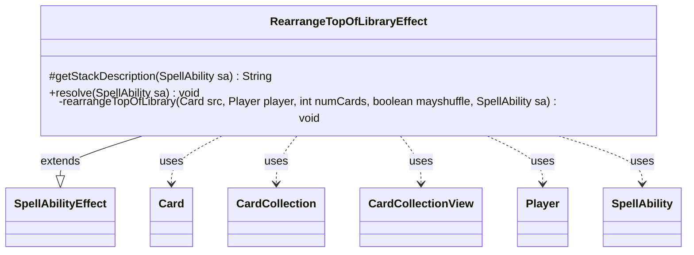

---
aliases:
  - RearrangeTopOfLibraryEffect
tags:
  - java/class
  - module/forge-game
  - pkg/forge/game/ability/effects
fqn: forge.game.ability.effects.RearrangeTopOfLibraryEffect
package: forge.game.ability.effects
module: forge-game
kind: Class
---

# RearrangeTopOfLibraryEffect

**Package:** `forge.game.ability.effects` &nbsp; **Module:** `forge-game` &nbsp; **Kind:** Class



## Relationships
**Extends:**
- [[forge.game.ability.SpellAbilityEffect|SpellAbilityEffect]]
**Uses:**
- [[forge.game.card.Card|Card]]
- [[forge.game.card.CardCollection|CardCollection]]
- [[forge.game.card.CardCollectionView|CardCollectionView]]
- [[forge.game.player.Player|Player]]
- [[forge.game.spellability.SpellAbility|SpellAbility]]

## Design Description

RearrangeTopOfLibraryEffect encapsulates the resolution logic for spells and abilities that let a player look at the top N cards of one or more target libraries, reorder them freely, and optionally shuffle afterward. As a concrete subclass of SpellAbilityEffect, it overrides `getStackDescription` to compose the human-readable stack text from the `NumCards` and `MayShuffle` parameters, and `resolve` to apply the effect to each targeted player still in the game.

The actual rearranging is factored into a private static helper that resolves the acting player (the activator by default, or a `RearrangePlayer`-defined player), draws the top cards into a CardCollection, and delegates ordering to that player's controller via `orderMoveToZoneList` before moving each Card back to the library. Driving everything through string parameters keeps the class data-driven, so many distinct cards reuse it while it collaborates with Player, Card, and the game's action and controller services.

## Source
`forge-game/src/main/java/forge/game/ability/effects/RearrangeTopOfLibraryEffect.java`

```java
package forge.game.ability.effects;

import java.util.List;

import com.google.common.collect.Iterables;
import forge.game.ability.AbilityUtils;
import forge.game.ability.SpellAbilityEffect;
import forge.game.card.Card;
import forge.game.card.CardCollection;
import forge.game.card.CardCollectionView;
import forge.game.player.Player;
import forge.game.spellability.SpellAbility;
import forge.game.zone.ZoneType;
import forge.util.Lang;
import forge.util.Localizer;

public class RearrangeTopOfLibraryEffect extends SpellAbilityEffect {

    /* (non-Javadoc)
     * @see forge.card.abilityfactory.SpellEffect#resolve(java.util.Map, forge.card.spellability.SpellAbility)
     */

    @Override
    protected String getStackDescription(SpellAbility sa) {
        Card host = sa.getHostCard();
        final List<Player> tgtPlayers = getTargetPlayers(sa);
        int numCards = AbilityUtils.calculateAmount(host, sa.getParam("NumCards"), sa);
        boolean shuffle = sa.hasParam("MayShuffle");

        final StringBuilder ret = new StringBuilder();
        ret.append("Look at the top ");
        ret.append(numCards);
        ret.append(" cards of ");
        for (final Player p : tgtPlayers) {
            ret.append(Lang.getInstance().getPossesive(p.getName()));
            ret.append(" & ");
        }
        ret.delete(ret.length() - 3, ret.length());

        ret.append(" library. Then put them back in any order.");

        if (shuffle) {
            ret.append("You may have ");
            if (tgtPlayers.size() > 1) {
                ret.append("those");
            } else {
                ret.append("that");
            }

            ret.append(" player shuffle their library.");
        }

        return ret.toString();
    }

    /**
     * <p>
     * rearrangeTopOfLibraryResolve.
     * </p>
     * @param sa
     *            a {@link forge.game.spellability.SpellAbility} object.
     * @param af
     *            a {@link forge.game.ability.AbilityFactory} object.
     */

    @Override
    public void resolve(SpellAbility sa) {
        Card host = sa.getHostCard();
        int numCards = AbilityUtils.calculateAmount(host, sa.getParam("NumCards"), sa);
        boolean shuffle = sa.hasParam("MayShuffle");

        for (final Player p : getTargetPlayers(sa)) {
            if (!p.isInGame()) {
                continue;
            }
            rearrangeTopOfLibrary(host, p, numCards, shuffle, sa);
        }
    }

    /**
     * use this when Human needs to rearrange the top X cards in a player's
     * library. You may also specify a shuffle when done
     *
     * @param src
     *            the source card
     * @param player
     *            the player to target
     * @param numCards
     *            the number of cards from the top to rearrange
     * @param mayshuffle
     *            a boolean.
     */
    private static void rearrangeTopOfLibrary(final Card src,
            final Player player, final int numCards, final boolean mayshuffle,
            final SpellAbility sa) {
        final Player activator = sa.hasParam("RearrangePlayer") ? Iterables.getFirst(AbilityUtils.getDefinedPlayers(src, sa.getParam("RearrangePlayer"), sa), null)
                : sa.getActivatingPlayer();
        if (activator == null) {
            return;
        }

        CardCollection topCards = player.getTopXCardsFromLibrary(numCards);

        CardCollectionView orderedCards = activator.getController().orderMoveToZoneList(topCards, ZoneType.Library, sa);
        for (Card next : orderedCards) {
            player.getGame().getAction().moveToLibrary(next, 0, sa);
        }
        if (mayshuffle && activator.getController().confirmAction(sa, null, Localizer.getInstance().getMessage("lblDoyouWantShuffleTheLibrary"), null)) {
            player.shuffle(sa);
        }
    }

}
```

## Python
`forge/game/ability/effects/RearrangeTopOfLibraryEffect.py`

```python
from typing import List

from forge.game.ability.AbilityUtils import AbilityUtils
from forge.game.ability.SpellAbilityEffect import SpellAbilityEffect
from forge.game.card.Card import Card
from forge.game.card.CardCollection import CardCollection
from forge.game.card.CardCollectionView import CardCollectionView
from forge.game.player.Player import Player
from forge.game.spellability.SpellAbility import SpellAbility
from forge.game.zone.ZoneType import ZoneType
from forge.util.Lang import Lang
from forge.util.Localizer import Localizer


class RearrangeTopOfLibraryEffect(SpellAbilityEffect):

    # (non-Javadoc)
    # @see forge.card.abilityfactory.SpellEffect#resolve(java.util.Map, forge.card.spellability.SpellAbility)

    def getStackDescription(self, sa: SpellAbility) -> str:
        host = sa.getHostCard()
        tgtPlayers: List[Player] = self.getTargetPlayers(sa)
        numCards = AbilityUtils.calculateAmount(host, sa.getParam("NumCards"), sa)
        shuffle = sa.hasParam("MayShuffle")

        ret = []
        ret.append("Look at the top ")
        ret.append(str(numCards))
        ret.append(" cards of ")
        for p in tgtPlayers:
            ret.append(Lang.getInstance().getPossesive(p.getName()))
            ret.append(" & ")
        ret_str = "".join(ret)
        ret_str = ret_str[:len(ret_str) - 3]

        ret_str += " library. Then put them back in any order."

        if shuffle:
            ret_str += "You may have "
            if len(tgtPlayers) > 1:
                ret_str += "those"
            else:
                ret_str += "that"

            ret_str += " player shuffle their library."

        return ret_str

    # <p>
    # rearrangeTopOfLibraryResolve.
    # </p>
    # @param sa
    #            a {@link forge.game.spellability.SpellAbility} object.
    # @param af
    #            a {@link forge.game.ability.AbilityFactory} object.

    def resolve(self, sa: SpellAbility) -> None:
        host = sa.getHostCard()
        numCards = AbilityUtils.calculateAmount(host, sa.getParam("NumCards"), sa)
        shuffle = sa.hasParam("MayShuffle")

        for p in self.getTargetPlayers(sa):
            if not p.isInGame():
                continue
            RearrangeTopOfLibraryEffect.rearrangeTopOfLibrary(host, p, numCards, shuffle, sa)

    # use this when Human needs to rearrange the top X cards in a player's
    # library. You may also specify a shuffle when done
    #
    # @param src
    #            the source card
    # @param player
    #            the player to target
    # @param numCards
    #            the number of cards from the top to rearrange
    # @param mayshuffle
    #            a boolean.
    @staticmethod
    def rearrangeTopOfLibrary(src: Card, player: Player, numCards: int, mayshuffle: bool, sa: SpellAbility) -> None:
        activator = (Iterables.getFirst(AbilityUtils.getDefinedPlayers(src, sa.getParam("RearrangePlayer"), sa), None)
                     if sa.hasParam("RearrangePlayer")
                     else sa.getActivatingPlayer())
        if activator is None:
            return

        topCards: CardCollection = player.getTopXCardsFromLibrary(numCards)

        orderedCards: CardCollectionView = activator.getController().orderMoveToZoneList(topCards, ZoneType.Library, sa)
        for next in orderedCards:
            player.getGame().getAction().moveToLibrary(next, 0, sa)
        if mayshuffle and activator.getController().confirmAction(sa, None, Localizer.getInstance().getMessage("lblDoyouWantShuffleTheLibrary"), None):
            player.shuffle(sa)
```
