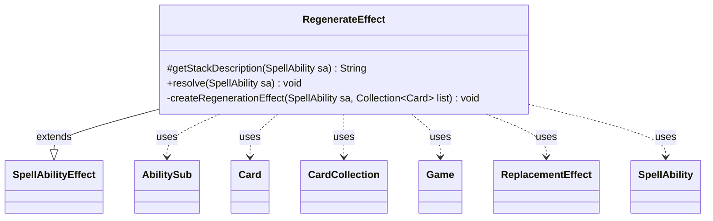

---
aliases:
  - RegenerateEffect
tags:
  - java/class
  - module/forge-game
  - pkg/forge/game/ability/effects
fqn: forge.game.ability.effects.RegenerateEffect
package: forge.game.ability.effects
module: forge-game
kind: Class
---

# RegenerateEffect

**Package:** `forge.game.ability.effects`   **Module:** `forge-game`   **Kind:** Class



## Relationships
**Extends:**
- [[forge.game.ability.SpellAbilityEffect|SpellAbilityEffect]]
**Uses:**
- [[forge.game.Game|Game]]
- [[forge.game.card.Card|Card]]
- [[forge.game.card.CardCollection|CardCollection]]
- [[forge.game.replacement.ReplacementEffect|ReplacementEffect]]
- [[forge.game.spellability.AbilitySub|AbilitySub]]
- [[forge.game.spellability.SpellAbility|SpellAbility]]

## Design Description

RegenerateEffect is a concrete `SpellAbilityEffect` that implements Magic's regeneration mechanic within Forge's data-driven ability framework. By overriding `getStackDescription` and `resolve`, it slots into the engine's standard effect-resolution contract: it gathers the spell ability's defined or targeted cards, discards any no longer genuinely in play (comparing each against the live `Game` state via game-timestamp equality to reject stale or moved references), and grants the survivors a regeneration shield.

Rather than mutating card state imperatively, the class models regeneration as a self-contained command-zone effect. It creates an effect card remembering the affected `Card`s, attaches a `ReplacementEffect` that intercepts Destroy events and substitutes a regeneration sub-ability, and chains an exile sub-ability (`AbilitySub`) so the effect removes itself once no remembered shields remain. It increments each card's shield count, registers a forget-on-move trigger, optionally folds in an additional `RegenerationAbility` and remembered objects, and schedules end-of-turn cleanup—keeping the mechanic declarative, automatically reversible, and decoupled from the cards it protects.

## Source
`forge-game/src/main/java/forge/game/ability/effects/RegenerateEffect.java`

```java
package forge.game.ability.effects;

import java.util.Collection;
import java.util.List;

import forge.game.Game;
import forge.game.ability.AbilityFactory;
import forge.game.ability.AbilityUtils;
import forge.game.ability.SpellAbilityEffect;
import forge.game.card.Card;
import forge.game.card.CardCollection;
import forge.game.replacement.ReplacementEffect;
import forge.game.replacement.ReplacementHandler;
import forge.game.spellability.AbilitySub;
import forge.game.spellability.SpellAbility;
import forge.util.Lang;

public class RegenerateEffect extends SpellAbilityEffect {

    /*
     * (non-Javadoc)
     * @see forge.game.ability.SpellAbilityEffect#getStackDescription(forge.game.spellability.SpellAbility)
     */
    @Override
    protected String getStackDescription(SpellAbility sa) {
        final StringBuilder sb = new StringBuilder();
        final List<Card> tgtCards = getDefinedCardsOrTargeted(sa);

        if (!tgtCards.isEmpty()) {
            sb.append("Regenerate ");
            sb.append(Lang.joinHomogenous(tgtCards));
            sb.append(".");
        }

        return sb.toString();
    }

    /*
     * (non-Javadoc)
     * @see forge.game.ability.SpellAbilityEffect#resolve(forge.game.spellability.SpellAbility)
     */
    @Override
    public void resolve(SpellAbility sa) {
        final Game game = sa.getHostCard().getGame();
        CardCollection result = new CardCollection();

        for (Card c : getDefinedCardsOrTargeted(sa)) {
            if (!c.isInPlay()) {
                continue;
            }

            // check if the object is still in game or if it was moved
            Card gameCard = game.getCardState(c, null);
            // gameCard is LKI in that case, the card is not in game anymore
            // or the timestamp did change
            // this should check Self too
            if (gameCard == null || !c.equalsWithGameTimestamp(gameCard)) {
                continue;
            }
            result.add(gameCard);
        }
        // create Effect for Regeneration
        createRegenerationEffect(sa, result);
    }

    private void createRegenerationEffect(SpellAbility sa, final Collection<Card> list) {
        if (list.isEmpty()) {
            return;
        }
        final Card hostCard = sa.getHostCard();
        final Game game = hostCard.getGame();

        // create Effect for Regeneration
        final Card eff = createEffect(
                sa, sa.getActivatingPlayer(), hostCard + "'s Regeneration", hostCard.getImageKey());

        eff.addRemembered(list);
        addForgetOnMovedTrigger(eff, "Battlefield");

        // build ReplacementEffect
        String repeffstr = "Event$ Destroy | ActiveZones$ Command | ValidCard$ Card.IsRemembered | Regeneration$ True"
                + " | Description$ Regeneration (if creature would be destroyed, regenerate it instead)";

        String effect = "DB$ Regeneration | Defined$ ReplacedCard";
        String exileEff = "DB$ ChangeZone | Defined$ Self | Origin$ Command | Destination$ Exile"
                + " | ConditionDefined$ Remembered | ConditionPresent$ Card | ConditionCompare$ EQ0";
        ReplacementEffect re = ReplacementHandler.parseReplacement(repeffstr, eff, true);

        SpellAbility saReg = AbilityFactory.getAbility(effect, eff);
        AbilitySub saExile = (AbilitySub)AbilityFactory.getAbility(exileEff, eff);

        if (sa.hasAdditionalAbility("RegenerationAbility")) {
            AbilitySub trigSA = (AbilitySub)sa.getAdditionalAbility("RegenerationAbility").copy(eff, sa.getActivatingPlayer(), false);
            saExile.setSubAbility(trigSA);
        }

        saReg.setSubAbility(saExile);
        re.setOverridingAbility(saReg);
        eff.addReplacementEffect(re);

        // add extra Remembered
        if (sa.hasParam("RememberObjects")) {
            eff.addRemembered(AbilityUtils.getDefinedObjects(hostCard, sa.getParam("RememberObjects"), sa));
        }

        // Copy text changes
        if (sa.isIntrinsic()) {
            eff.copyChangedTextFrom(hostCard);
        }

        // add RegenEffect as Shield to the Affected Cards
        for (final Card c : list) {
            c.incShieldCount();
        }
        game.getAction().moveToCommand(eff, sa);

        game.getEndOfTurn().addUntil(() -> game.getAction().exileEffect(eff));
    }

}
```

## Python
`forge/game/ability/effects/RegenerateEffect.py`

```python
from forge.game.Game import Game
from forge.game.ability.AbilityFactory import AbilityFactory
from forge.game.ability.AbilityUtils import AbilityUtils
from forge.game.ability.SpellAbilityEffect import SpellAbilityEffect
from forge.game.card.Card import Card
from forge.game.card.CardCollection import CardCollection
from forge.game.replacement.ReplacementEffect import ReplacementEffect
from forge.game.replacement.ReplacementHandler import ReplacementHandler
from forge.game.spellability.AbilitySub import AbilitySub
from forge.game.spellability.SpellAbility import SpellAbility
from forge.util.Lang import Lang


class RegenerateEffect(SpellAbilityEffect):

    #
    # (non-Javadoc)
    # @see forge.game.ability.SpellAbilityEffect#getStackDescription(forge.game.spellability.SpellAbility)
    #
    def getStackDescription(self, sa: SpellAbility) -> str:
        sb = []
        tgtCards = self.getDefinedCardsOrTargeted(sa)

        if tgtCards:
            sb.append("Regenerate ")
            sb.append(Lang.joinHomogenous(tgtCards))
            sb.append(".")

        return "".join(sb)

    #
    # (non-Javadoc)
    # @see forge.game.ability.SpellAbilityEffect#resolve(forge.game.spellability.SpellAbility)
    #
    def resolve(self, sa: SpellAbility) -> None:
        game = sa.getHostCard().getGame()
        result = CardCollection()

        for c in self.getDefinedCardsOrTargeted(sa):
            if not c.isInPlay():
                continue

            # check if the object is still in game or if it was moved
            gameCard = game.getCardState(c, None)
            # gameCard is LKI in that case, the card is not in game anymore
            # or the timestamp did change
            # this should check Self too
            if gameCard is None or not c.equalsWithGameTimestamp(gameCard):
                continue
            result.add(gameCard)
        # create Effect for Regeneration
        self.createRegenerationEffect(sa, result)

    def createRegenerationEffect(self, sa: SpellAbility, list: "Collection[Card]") -> None:
        if not list:
            return
        hostCard = sa.getHostCard()
        game = hostCard.getGame()

        # create Effect for Regeneration
        eff = self.createEffect(
            sa, sa.getActivatingPlayer(), str(hostCard) + "'s Regeneration", hostCard.getImageKey())

        eff.addRemembered(list)
        self.addForgetOnMovedTrigger(eff, "Battlefield")

        # build ReplacementEffect
        repeffstr = ("Event$ Destroy | ActiveZones$ Command | ValidCard$ Card.IsRemembered | Regeneration$ True"
                     + " | Description$ Regeneration (if creature would be destroyed, regenerate it instead)")

        effect = "DB$ Regeneration | Defined$ ReplacedCard"
        exileEff = ("DB$ ChangeZone | Defined$ Self | Origin$ Command | Destination$ Exile"
                    + " | ConditionDefined$ Remembered | ConditionPresent$ Card | ConditionCompare$ EQ0")
        re = ReplacementHandler.parseReplacement(repeffstr, eff, True)

        saReg = AbilityFactory.getAbility(effect, eff)
        saExile = AbilitySub(AbilityFactory.getAbility(exileEff, eff))

        if sa.hasAdditionalAbility("RegenerationAbility"):
            trigSA = AbilitySub(sa.getAdditionalAbility("RegenerationAbility").copy(eff, sa.getActivatingPlayer(), False))
            saExile.setSubAbility(trigSA)

        saReg.setSubAbility(saExile)
        re.setOverridingAbility(saReg)
        eff.addReplacementEffect(re)

        # add extra Remembered
        if sa.hasParam("RememberObjects"):
            eff.addRemembered(AbilityUtils.getDefinedObjects(hostCard, sa.getParam("RememberObjects"), sa))

        # Copy text changes
        if sa.isIntrinsic():
            eff.copyChangedTextFrom(hostCard)

        # add RegenEffect as Shield to the Affected Cards
        for c in list:
            c.incShieldCount()
        game.getAction().moveToCommand(eff, sa)

        game.getEndOfTurn().addUntil(lambda: game.getAction().exileEffect(eff))
```
