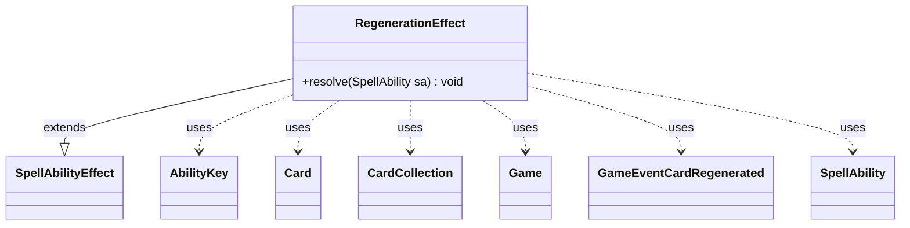

---
aliases:
  - RegenerationEffect
tags:
  - java/class
  - module/forge-game
  - pkg/forge/game/ability/effects
fqn: forge.game.ability.effects.RegenerationEffect
package: forge.game.ability.effects
module: forge-game
kind: Class
---

# RegenerationEffect

**Package:** `forge.game.ability.effects`   **Module:** `forge-game`   **Kind:** Class



## Relationships
**Extends:**
- [[forge.game.ability.SpellAbilityEffect|SpellAbilityEffect]]
**Uses:**
- [[forge.game.Game|Game]]
- [[forge.game.ability.AbilityKey|AbilityKey]]
- [[forge.game.card.Card|Card]]
- [[forge.game.card.CardCollection|CardCollection]]
- [[forge.game.event.GameEventCardRegenerated|GameEventCardRegenerated]]
- [[forge.game.spellability.SpellAbility|SpellAbility]]

## Design Description

RegenerationEffect implements the resolution behavior of a regeneration shield, regenerating one or more target permanents. As a concrete `SpellAbilityEffect` subclass it overrides only `resolve(SpellAbility)`, conforming to Forge's command-pattern design in which each ability effect encapsulates its own resolution logic and is dispatched generically by the engine.

For each target it re-fetches the live `Card` through `Game.getCardState` and skips any whose game-timestamp no longer matches, guarding against last-known-information for cards that have left or changed since the shield was created. It then applies the standard regeneration steps—clearing damage and deathtouch state, tapping the card, marking it regenerated, and removing it from combat—using `AbilityKey` to recover the causing ability and firing `GameEventCardRegenerated` for UI and sound feedback. Tapped cards are batched into a single `TapAll` trigger, and shields hosted on immutable effects decrement a shield count, reflecting reusable shield-based regeneration.

## Source
`forge-game/src/main/java/forge/game/ability/effects/RegenerationEffect.java`

```java
package forge.game.ability.effects;

import forge.game.Game;
import forge.game.ability.AbilityKey;
import forge.game.ability.SpellAbilityEffect;
import forge.game.card.Card;
import forge.game.card.CardCollection;
import forge.game.event.GameEventCardRegenerated;
import forge.game.spellability.SpellAbility;
import forge.game.trigger.TriggerType;

import java.util.Map;

public class RegenerationEffect extends SpellAbilityEffect {

    /*
     * (non-Javadoc)
     * @see forge.game.ability.SpellAbilityEffect#resolve(forge.game.spellability.SpellAbility)
     */
    @Override
    public void resolve(SpellAbility sa) {
        final Card host = sa.getHostCard();
        final Game game = host.getGame();
        CardCollection tapped = new CardCollection();
        for (Card c : getTargetCards(sa)) {
            // checks already done in ReplacementEffect

            // check if the object is still in game or if it was moved
            Card gameCard = game.getCardState(c, null);
            // gameCard is LKI in that case, the card is not in game anymore
            // or the timestamp did change
            // this should check Self too
            if (gameCard == null || !c.equalsWithGameTimestamp(gameCard)) {
                continue;
            }

            SpellAbility cause = (SpellAbility)sa.getReplacingObject(AbilityKey.Cause);

            gameCard.setDamage(0);
            gameCard.setHasBeenDealtDeathtouchDamage(false);
            if (gameCard.tap(true, cause, gameCard.getController())) tapped.add(gameCard);
            gameCard.addRegeneratedThisTurn();

            if (game.getCombat() != null) {
                game.getCombat().saveLKI(gameCard);
                game.getCombat().removeFromCombat(gameCard);
            }

            // Play the Regen sound
            game.fireEvent(new GameEventCardRegenerated(gameCard));

            if (host.isImmutable()) {
                gameCard.decShieldCount();
                host.removeRemembered(gameCard);
            }
        }
        if (!tapped.isEmpty()) {
            final Map<AbilityKey, Object> runParams = AbilityKey.newMap();
            runParams.put(AbilityKey.Cards, tapped);
            game.getTriggerHandler().runTrigger(TriggerType.TapAll, runParams, false);
        }
    }

}
```

## Python
`forge/game/ability/effects/RegenerationEffect.py`

```python
from forge.game.Game import Game
from forge.game.ability.AbilityKey import AbilityKey
from forge.game.ability.SpellAbilityEffect import SpellAbilityEffect
from forge.game.card.Card import Card
from forge.game.card.CardCollection import CardCollection
from forge.game.event.GameEventCardRegenerated import GameEventCardRegenerated
from forge.game.spellability.SpellAbility import SpellAbility
from forge.game.trigger.TriggerType import TriggerType


class RegenerationEffect(SpellAbilityEffect):

    #
    # (non-Javadoc)
    # @see forge.game.ability.SpellAbilityEffect#resolve(forge.game.spellability.SpellAbility)
    #
    def resolve(self, sa: SpellAbility) -> None:
        host = sa.getHostCard()
        game = host.getGame()
        tapped = CardCollection()
        for c in self.getTargetCards(sa):
            # checks already done in ReplacementEffect

            # check if the object is still in game or if it was moved
            gameCard = game.getCardState(c, None)
            # gameCard is LKI in that case, the card is not in game anymore
            # or the timestamp did change
            # this should check Self too
            if gameCard is None or not c.equalsWithGameTimestamp(gameCard):
                continue

            cause = sa.getReplacingObject(AbilityKey.Cause)

            gameCard.setDamage(0)
            gameCard.setHasBeenDealtDeathtouchDamage(False)
            if gameCard.tap(True, cause, gameCard.getController()):
                tapped.add(gameCard)
            gameCard.addRegeneratedThisTurn()

            if game.getCombat() is not None:
                game.getCombat().saveLKI(gameCard)
                game.getCombat().removeFromCombat(gameCard)

            # Play the Regen sound
            game.fireEvent(GameEventCardRegenerated(gameCard))

            if host.isImmutable():
                gameCard.decShieldCount()
                host.removeRemembered(gameCard)

        if not tapped.isEmpty():
            runParams = AbilityKey.newMap()
            runParams[AbilityKey.Cards] = tapped
            game.getTriggerHandler().runTrigger(TriggerType.TapAll, runParams, False)
```
