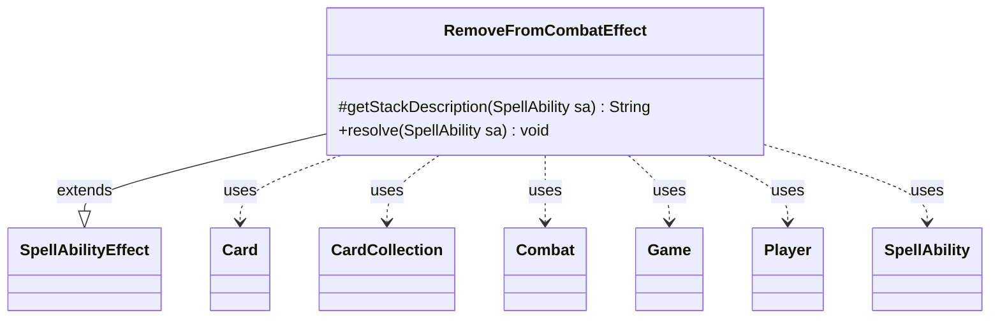

---
aliases:
  - RemoveFromCombatEffect
tags:
  - java/class
  - module/forge-game
  - pkg/forge/game/ability/effects
fqn: forge.game.ability.effects.RemoveFromCombatEffect
package: forge.game.ability.effects
module: forge-game
kind: Class
---

# RemoveFromCombatEffect

**Package:** `forge.game.ability.effects`   **Module:** `forge-game`   **Kind:** Class



## Relationships
**Extends:**
- [[forge.game.ability.SpellAbilityEffect|SpellAbilityEffect]]
**Uses:**
- [[forge.game.Game|Game]]
- [[forge.game.card.Card|Card]]
- [[forge.game.card.CardCollection|CardCollection]]
- [[forge.game.combat.Combat|Combat]]
- [[forge.game.player.Player|Player]]
- [[forge.game.spellability.SpellAbility|SpellAbility]]

## Design Description

`RemoveFromCombatEffect` is a concrete `SpellAbilityEffect` that resolves abilities removing creatures from combat. Following the engine's one-class-per-keyword effect pattern, it overrides `getStackDescription` to build a human-readable "Remove … from combat." line and `resolve` to apply the state change, collaborating with `SpellAbility` for context and `Lang` for formatting.

During resolution it iterates the targeted `Card`s, querying the current `Game` state and comparing game-timestamps to discard cards that have left play or become LKI. It then drives the active `Combat`: when the `UnblockCreaturesBlockedOnlyBy` parameter is present it scans attackers (gathered as a `CardCollection`) and unblocks those whose sole blocker was the named card, before saving last-known information and removing the creature. Optional `RememberRemovedFromCombat` and `UnblockCreaturesBlockedOnlyBy` parameters keep the behavior data-driven, configurable from card scripts without subclassing.

## Source
`forge-game/src/main/java/forge/game/ability/effects/RemoveFromCombatEffect.java`

```java
package forge.game.ability.effects;

import forge.game.Game;
import forge.game.ability.AbilityUtils;
import forge.game.ability.SpellAbilityEffect;
import forge.game.card.Card;
import forge.game.card.CardCollection;
import forge.game.combat.Combat;
import forge.game.player.Player;
import forge.game.spellability.SpellAbility;
import forge.util.Lang;

public class RemoveFromCombatEffect extends SpellAbilityEffect {

    @Override
    protected String getStackDescription(SpellAbility sa) {
        final StringBuilder sb = new StringBuilder();

        sb.append("Remove ");
        sb.append(Lang.joinHomogenous(getTargetCards(sa)));
        sb.append(" from combat.");

        return sb.toString();
    }

    @Override
    public void resolve(SpellAbility sa) {
        final Player activator = sa.getActivatingPlayer();
        final Game game = activator.getGame();
        final boolean rem = sa.hasParam("RememberRemovedFromCombat");
        final Combat combat = game.getPhaseHandler().getCombat();

        for (final Card c : getTargetCards(sa)) {
            if (combat == null || !c.isInPlay()) {
                continue;
            }
            // check if the object is still in game or if it was moved
            Card gameCard = game.getCardState(c, null);
            // gameCard is LKI in that case, the card is not in game anymore
            // or the timestamp did change
            // this should check Self too
            if (gameCard == null || !c.equalsWithGameTimestamp(gameCard)) {
                continue;
            }

            // Unblock creatures that were blocked only by this card (e.g. Ydwen Efreet)
            if (sa.hasParam("UnblockCreaturesBlockedOnlyBy")) {
                CardCollection attackers = AbilityUtils.getDefinedCards(sa.getHostCard(), sa.getParam("UnblockCreaturesBlockedOnlyBy"), sa);
                if (!attackers.isEmpty()) {
                    CardCollection blockedByCard = combat.getAttackersBlockedBy(attackers.getFirst());
                    for (Card atk : blockedByCard) {
                        boolean blockedOnlyByCard = true;
                        for (Card blocker : combat.getBlockers(atk)) {
                            if (!blocker.equals(attackers.getFirst())) {
                                blockedOnlyByCard = false;
                                break;
                            }
                        }
                        if (blockedOnlyByCard) {
                            combat.setBlocked(atk, false);
                        }
                    }
                }
            }

            game.getCombat().saveLKI(gameCard);
            combat.removeFromCombat(gameCard);

            if (rem) {
                sa.getHostCard().addRemembered(gameCard);
            }
        }
    }
}
```

## Python
`forge/game/ability/effects/RemoveFromCombatEffect.py`

```python
from forge.game.Game import Game
from forge.game.ability.AbilityUtils import AbilityUtils
from forge.game.ability.SpellAbilityEffect import SpellAbilityEffect
from forge.game.card.Card import Card
from forge.game.card.CardCollection import CardCollection
from forge.game.combat.Combat import Combat
from forge.game.player.Player import Player
from forge.game.spellability.SpellAbility import SpellAbility
from forge.util.Lang import Lang


class RemoveFromCombatEffect(SpellAbilityEffect):

    def getStackDescription(self, sa: SpellAbility) -> str:
        sb = []

        sb.append("Remove ")
        sb.append(Lang.joinHomogenous(self.getTargetCards(sa)))
        sb.append(" from combat.")

        return "".join(sb)

    def resolve(self, sa: SpellAbility) -> None:
        activator = sa.getActivatingPlayer()
        game = activator.getGame()
        rem = sa.hasParam("RememberRemovedFromCombat")
        combat = game.getPhaseHandler().getCombat()

        for c in self.getTargetCards(sa):
            if combat is None or not c.isInPlay():
                continue
            # check if the object is still in game or if it was moved
            gameCard = game.getCardState(c, None)
            # gameCard is LKI in that case, the card is not in game anymore
            # or the timestamp did change
            # this should check Self too
            if gameCard is None or not c.equalsWithGameTimestamp(gameCard):
                continue

            # Unblock creatures that were blocked only by this card (e.g. Ydwen Efreet)
            if sa.hasParam("UnblockCreaturesBlockedOnlyBy"):
                attackers = AbilityUtils.getDefinedCards(sa.getHostCard(), sa.getParam("UnblockCreaturesBlockedOnlyBy"), sa)
                if not attackers.isEmpty():
                    blockedByCard = combat.getAttackersBlockedBy(attackers.getFirst())
                    for atk in blockedByCard:
                        blockedOnlyByCard = True
                        for blocker in combat.getBlockers(atk):
                            if not blocker.equals(attackers.getFirst()):
                                blockedOnlyByCard = False
                                break
                        if blockedOnlyByCard:
                            combat.setBlocked(atk, False)

            game.getCombat().saveLKI(gameCard)
            combat.removeFromCombat(gameCard)

            if rem:
                sa.getHostCard().addRemembered(gameCard)
```
