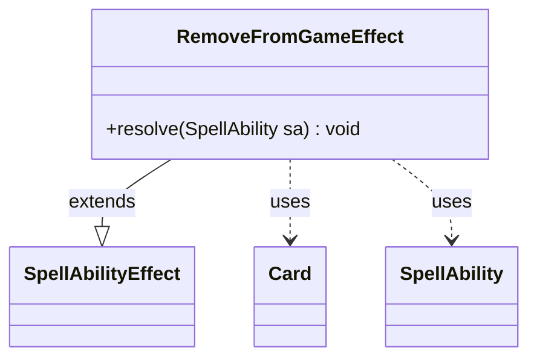

---
aliases:
  - RemoveFromGameEffect
tags:
  - java/class
  - module/forge-game
  - pkg/forge/game/ability/effects
fqn: forge.game.ability.effects.RemoveFromGameEffect
package: forge.game.ability.effects
module: forge-game
kind: Class
---

# RemoveFromGameEffect

**Package:** `forge.game.ability.effects` &nbsp; **Module:** `forge-game` &nbsp; **Kind:** Class



## Relationships
**Extends:**
- [[forge.game.ability.SpellAbilityEffect|SpellAbilityEffect]]
**Uses:**
- [[forge.game.card.Card|Card]]
- [[forge.game.spellability.SpellAbility|SpellAbility]]

## Design Description

RemoveFromGameEffect is a concrete spell-ability effect responsible for permanently removing targeted cards from the game. It extends SpellAbilityEffect, overriding the single `resolve(SpellAbility)` hook through which Forge's ability-resolution framework drives effects, and relies on the inherited `getTargetCards` helper to obtain the cards an ability is aimed at. For each targeted Card it reaches the active game via `getGame().getAction()` and calls `ceaseToExist`, delegating the actual state change to the engine's central game-action handler.

The design is deliberately minimal: the class holds no state and adds no configuration, acting purely as a thin adapter between a declarative ability definition and the engine's remove-from-existence mechanic. Passing `true` to `ceaseToExist` signals the intended removal semantics, keeping all collaboration confined to the Card and SpellAbility types it depends on.

## Source
`forge-game/src/main/java/forge/game/ability/effects/RemoveFromGameEffect.java`

```java
package forge.game.ability.effects;

import forge.game.ability.SpellAbilityEffect;
import forge.game.card.Card;
import forge.game.spellability.SpellAbility;

public class RemoveFromGameEffect extends SpellAbilityEffect {

    @Override
    public void resolve(SpellAbility sa) {
        for (final Card tgtC : getTargetCards(sa)) {
            tgtC.getGame().getAction().ceaseToExist(tgtC, true);
        }

    }
}
```

## Python
`forge/game/ability/effects/RemoveFromGameEffect.py`

```python
package forge.game.ability.effects;

from forge.game.ability.SpellAbilityEffect import SpellAbilityEffect
from forge.game.card.Card import Card
from forge.game.spellability.SpellAbility import SpellAbility


class RemoveFromGameEffect(SpellAbilityEffect):

    def resolve(self, sa: SpellAbility) -> None:
        for tgtC in self.getTargetCards(sa):
            tgtC.getGame().getAction().ceaseToExist(tgtC, True)
```
