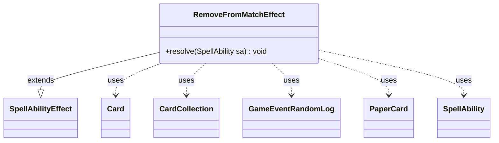

---
aliases:
  - RemoveFromMatchEffect
tags:
  - java/class
  - module/forge-game
  - pkg/forge/game/ability/effects
fqn: forge.game.ability.effects.RemoveFromMatchEffect
package: forge.game.ability.effects
module: forge-game
kind: Class
---

# RemoveFromMatchEffect

**Package:** `forge.game.ability.effects` &nbsp; **Module:** `forge-game` &nbsp; **Kind:** Class



## Relationships
**Extends:**
- [[forge.game.ability.SpellAbilityEffect|SpellAbilityEffect]]
**Uses:**
- [[forge.game.card.Card|Card]]
- [[forge.game.card.CardCollection|CardCollection]]
- [[forge.game.event.GameEventRandomLog|GameEventRandomLog]]
- [[forge.game.spellability.SpellAbility|SpellAbility]]
- [[forge.item.PaperCard|PaperCard]]

## Design Description

`RemoveFromMatchEffect` implements the resolution logic for a spell or ability that permanently removes cards from the current match—a mechanic used by cards like Shahrazad or "ante" effects that pull cards out of the game entirely. As a concrete `SpellAbilityEffect` subclass, it overrides only `resolve(SpellAbility)`, deriving its behavior from script parameters rather than hardcoded rules, consistent with Forge's data-driven ability framework.

It selects targets two ways: by filtering all in-game cards (optionally including sideboards) through `AbilityUtils` when a `RemoveType` is given, otherwise using the ability's explicit targets, collecting them into a `CardCollection`. Each card is logged via a `GameEventRandomLog`, made to `ceaseToExist`, and its backing `PaperCard` is stripped from the `Match`; the optional `RemoveFromInventory` flag further destroys the physical card. The design cleanly separates game-state removal from match- and inventory-level bookkeeping, reflecting Forge's distinction between in-play `Card` objects and the persistent `PaperCard` deck representation.

## Source
`forge-game/src/main/java/forge/game/ability/effects/RemoveFromMatchEffect.java`

```java
package forge.game.ability.effects;

import forge.game.ability.AbilityUtils;
import forge.game.ability.SpellAbilityEffect;
import forge.game.card.Card;
import forge.game.card.CardCollection;
import forge.game.event.GameEventRandomLog;
import forge.game.spellability.SpellAbility;
import forge.game.zone.ZoneType;
import forge.item.PaperCard;

public class RemoveFromMatchEffect extends SpellAbilityEffect {
    @Override
    public void resolve(SpellAbility sa) {
        final Card host = sa.getHostCard();
        CardCollection toRemove;
        boolean removeFromInventory = sa.hasParam("RemoveFromInventory");

        if (sa.hasParam("RemoveType")) {
            CardCollection cards = (CardCollection) host.getOwner().getGame().getCardsInGame();
            if (sa.hasParam("IncludeSideboard")) {
                CardCollection sideboard = (CardCollection) host.getGame().getCardsIn(ZoneType.Sideboard);
                cards.addAll(sideboard);
            }
            toRemove = (CardCollection) AbilityUtils.filterListByType(cards, sa.getParam("RemoveType"), sa);
        } else {
            toRemove = getTargetCards(sa);
        }
        String logMessage = sa.getParamOrDefault("LogMessage", "Removed from match");
        String remove = toRemove.toString().replace("[","").replace("]","");
        host.getController().getGame().fireEvent(new GameEventRandomLog(logMessage + ": " + remove));
        for (final Card tgtC : toRemove) {
            tgtC.getGame().getAction().ceaseToExist(tgtC, true);
            PaperCard rem = (PaperCard) tgtC.getPaperCard();
            host.getGame().getMatch().removeCard(rem);
            if (removeFromInventory) {
                host.getController().destroyPhysicalCard(tgtC);
            }
        }
    }
}
```
