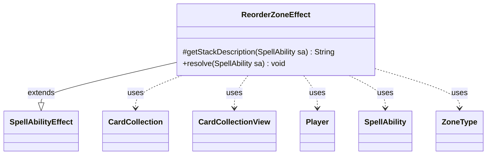

---
aliases:
  - ReorderZoneEffect
tags:
  - java/class
  - module/forge-game
  - pkg/forge/game/ability/effects
fqn: forge.game.ability.effects.ReorderZoneEffect
package: forge.game.ability.effects
module: forge-game
kind: Class
---

# ReorderZoneEffect

**Package:** `forge.game.ability.effects` &nbsp; **Module:** `forge-game` &nbsp; **Kind:** Class



## Relationships
**Extends:**
- [[forge.game.ability.SpellAbilityEffect|SpellAbilityEffect]]
**Uses:**
- [[forge.game.card.CardCollection|CardCollection]]
- [[forge.game.card.CardCollectionView|CardCollectionView]]
- [[forge.game.player.Player|Player]]
- [[forge.game.spellability.SpellAbility|SpellAbility]]
- [[forge.game.zone.ZoneType|ZoneType]]


## Design Description

ReorderZoneEffect is a concrete ability-effect that implements the game logic for spells and abilities which rearrange the cards in a player's zone (for example, putting a library into a chosen or random order). As a subclass of `SpellAbilityEffect`, it plugs into Forge's resolution framework by overriding `getStackDescription` to produce a human-readable stack entry and `resolve` to carry out the effect, reading its `Zone` and optional `Random` parameters from the driving `SpellAbility`.

During resolution it iterates over each target `Player`, skips those no longer in the game, and copies the affected zone into a mutable `CardCollection`. When the `Random` flag is set it shuffles via the shared `MyRandom` source; otherwise it delegates the ordering decision to the player's controller (`orderMoveToZoneList`), then writes the resulting `CardCollectionView` back through `Zone.setCards`. This separation lets the same effect serve both deterministic player-chosen and randomized reordering while respecting the controller abstraction for input.

## Source
`forge-game/src/main/java/forge/game/ability/effects/ReorderZoneEffect.java`

```java
package forge.game.ability.effects;

import java.util.Collections;
import java.util.List;

import forge.game.ability.SpellAbilityEffect;
import forge.game.card.CardCollection;
import forge.game.card.CardCollectionView;
import forge.game.player.Player;
import forge.game.spellability.SpellAbility;
import forge.game.zone.ZoneType;
import forge.util.Lang;
import forge.util.MyRandom;

public class ReorderZoneEffect extends SpellAbilityEffect {
    @Override
    protected String getStackDescription(SpellAbility sa) {
        final ZoneType zone = ZoneType.smartValueOf(sa.getParam("Zone"));
        final List<Player> tgtPlayers = getTargetPlayers(sa);
        boolean shuffle = sa.hasParam("Random");

        return "Reorder " + Lang.joinHomogenous(tgtPlayers) + " " + zone.toString() + " " + (shuffle ? "at random." : "as your choose.");
    }

    @Override
    public void resolve(SpellAbility sa) {
        final ZoneType zone = ZoneType.smartValueOf(sa.getParam("Zone"));
        boolean shuffle = sa.hasParam("Random");

        for (final Player p : getTargetPlayers(sa)) {
            if (!p.isInGame()) {
                continue;
            }

            CardCollection list = new CardCollection(p.getCardsIn(zone));
            if (shuffle) {
                Collections.shuffle(list, MyRandom.getRandom());
                p.getZone(zone).setCards(list);
            } else {
                CardCollectionView orderedCards = p.getController().orderMoveToZoneList(list, zone, sa);
                p.getZone(zone).setCards(orderedCards);
            }
        }
    }
}
```

## Python
`forge/game/ability/effects/ReorderZoneEffect.py`

```python
import random

from forge.game.ability.SpellAbilityEffect import SpellAbilityEffect
from forge.game.card.CardCollection import CardCollection
from forge.game.card.CardCollectionView import CardCollectionView
from forge.game.player.Player import Player
from forge.game.spellability.SpellAbility import SpellAbility
from forge.game.zone.ZoneType import ZoneType
from forge.util.Lang import Lang
from forge.util.MyRandom import MyRandom


class ReorderZoneEffect(SpellAbilityEffect):
    def getStackDescription(self, sa: SpellAbility) -> str:
        zone = ZoneType.smartValueOf(sa.getParam("Zone"))
        tgtPlayers = self.getTargetPlayers(sa)
        shuffle = sa.hasParam("Random")

        return "Reorder " + Lang.joinHomogenous(tgtPlayers) + " " + zone.toString() + " " + ("at random." if shuffle else "as your choose.")

    def resolve(self, sa: SpellAbility) -> None:
        zone = ZoneType.smartValueOf(sa.getParam("Zone"))
        shuffle = sa.hasParam("Random")

        for p in self.getTargetPlayers(sa):
            if not p.isInGame():
                continue

            list = CardCollection(p.getCardsIn(zone))
            if shuffle:
                MyRandom.getRandom().shuffle(list)
                p.getZone(zone).setCards(list)
            else:
                orderedCards = p.getController().orderMoveToZoneList(list, zone, sa)
                p.getZone(zone).setCards(orderedCards)
```
