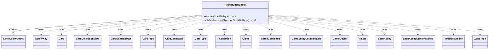

---
aliases:
  - RepeatEachEffect
tags:
  - java/class
  - module/forge-game
  - pkg/forge/game/ability/effects
fqn: forge.game.ability.effects.RepeatEachEffect
package: forge.game.ability.effects
module: forge-game
kind: Class
---

# RepeatEachEffect

**Package:** `forge.game.ability.effects` &nbsp; **Module:** `forge-game` &nbsp; **Kind:** Class



## Relationships
**Extends:**
- [[forge.game.ability.SpellAbilityEffect|SpellAbilityEffect]]
**Uses:**
- [[forge.GameCommand|GameCommand]]
- [[forge.card.CardType|CardType]]
- [[forge.card.CardType.CoreType|CoreType]]
- [[forge.game.Game|Game]]
- [[forge.game.GameEntityCounterTable|GameEntityCounterTable]]
- [[forge.game.GameObject|GameObject]]
- [[forge.game.ability.AbilityKey|AbilityKey]]
- [[forge.game.card.Card|Card]]
- [[forge.game.card.CardCollectionView|CardCollectionView]]
- [[forge.game.card.CardDamageMap|CardDamageMap]]
- [[forge.game.card.CardZoneTable|CardZoneTable]]
- [[forge.game.player.Player|Player]]
- [[forge.game.spellability.SpellAbility|SpellAbility]]
- [[forge.game.spellability.SpellAbilityStackInstance|SpellAbilityStackInstance]]
- [[forge.game.trigger.WrappedAbility|WrappedAbility]]
- [[forge.game.zone.ZoneType|ZoneType]]
- [[forge.util.collect.FCollection|FCollection]]


## Design Description

RepeatEachEffect is a resolution handler implementing the "repeat a sub-ability once for each X" pattern pervasive in Magic cards. As a concrete `SpellAbilityEffect` subclass, it overrides `resolve` to read script parameters and iterate a configured "RepeatSubAbility" over a chosen collection: matching `Card`s in given `ZoneType`s, `SpellAbility`s on the stack, mixed targeted `GameObject`s, players (`FCollection<Player>`), or card `CoreType`s. For each element it temporarily marks the host as remembered (or imprinted), resolves the sub-ability via `AbilityUtils`, then cleans up — carefully swapping out other remembered players to avoid collisions.

The design is data-driven: every behavior is parameter-gated, supporting optional confirmation, player-chosen ordering, vote-derived amounts, and deferred next-turn execution via `GameCommand`. It accumulates side effects across iterations through shared structures (`CardDamageMap`, `CardZoneTable`, `GameEntityCounterTable`, a life-loss map), then applies batched damage, zone-change triggers, and a single `LifeLostAll` trigger only after the loop completes, so all repetitions resolve as one coordinated game event.

## Source
`forge-game/src/main/java/forge/game/ability/effects/RepeatEachEffect.java`

```java
package forge.game.ability.effects;

import java.util.*;

import com.google.common.collect.Lists;
import com.google.common.collect.Maps;

import forge.GameCommand;
import forge.card.CardType;
import forge.game.Game;
import forge.game.GameEntityCounterTable;
import forge.game.GameObject;
import forge.game.ability.AbilityKey;
import forge.game.ability.AbilityUtils;
import forge.game.ability.ApiType;
import forge.game.ability.SpellAbilityEffect;
import forge.game.card.*;
import forge.game.player.Player;
import forge.game.spellability.SpellAbility;
import forge.game.spellability.SpellAbilityStackInstance;
import forge.game.trigger.TriggerType;
import forge.game.trigger.WrappedAbility;
import forge.game.zone.ZoneType;
import forge.util.IterableUtil;
import forge.util.collect.FCollection;

public class RepeatEachEffect extends SpellAbilityEffect {

    /* (non-Javadoc)
     * @see forge.card.abilityfactory.SpellEffect#resolve(forge.card.spellability.SpellAbility)
     */
    @SuppressWarnings("serial")
    @Override
    public void resolve(SpellAbility sa) {
        // Things to loop over: Cards, Players, or SAs
        final Card source = sa.getHostCard();

        final SpellAbility repeat = sa.getAdditionalAbility("RepeatSubAbility");

        final Player activator = sa.getActivatingPlayer();
        final Game game = activator.getGame();
        if (sa.hasParam("Optional") && sa.hasParam("OptionPrompt") && //for now, OptionPrompt is needed
                !activator.getController().confirmAction(sa, null, sa.getParam("OptionPrompt"), null)) {
            return;
        }

        boolean useImprinted = sa.hasParam("UseImprinted");

        CardCollectionView repeatCards = null;
        List<SpellAbility> repeatSas = null;

        if (sa.hasParam("RepeatCards")) {
            List<ZoneType> zone = Lists.newArrayList();
            if (sa.hasParam("Zone")) {
                zone = ZoneType.listValueOf(sa.getParam("Zone"));
            } else {
                zone.add(ZoneType.Battlefield);
            }
            repeatCards = CardLists.getValidCards(game.getCardsIn(zone), sa.getParam("RepeatCards"), source.getController(), source, sa);
        }
        else if (sa.hasParam(("RepeatSpellAbilities"))) {
            repeatSas = Lists.newArrayList();
            String[] restrictions = sa.getParam("RepeatSpellAbilities").split(",");
            for (SpellAbilityStackInstance stackInstance : game.getStack()) {
                if (stackInstance.getSpellAbility().isValid(restrictions, source.getController(), source, sa)) {
                    repeatSas.add(stackInstance.getSpellAbility());
                }
            }

        }
        else if (sa.hasParam("DefinedCards")) {
            repeatCards = AbilityUtils.getDefinedCards(source, sa.getParam("DefinedCards"), sa);
        }

        if (sa.hasParam("ClearRemembered")) {
            source.clearRemembered();
        }

        if (sa.hasParam("DamageMap")) {
            sa.setDamageMap(new CardDamageMap());
            sa.setPreventMap(new CardDamageMap());
            sa.setCounterTable(new GameEntityCounterTable());
        }
        if (sa.hasParam("ChangeZoneTable")) {
            sa.setChangeZoneTable(new CardZoneTable());
        }
        if (sa.hasParam("LoseLifeMap")) {
            sa.setLoseLifeMap(Maps.newHashMap());
        }

        if (repeatCards != null && !repeatCards.isEmpty()) {
            if (sa.hasParam("ChooseOrder") && repeatCards.size() > 1) {
                final Player chooser = sa.getParam("ChooseOrder").equals("True") ? activator :
                        AbilityUtils.getDefinedPlayers(source, sa.getParam("ChooseOrder"), sa).get(0);
                repeatCards = chooser.getController().orderMoveToZoneList(repeatCards, ZoneType.None, sa);
            }

            for (Card card : repeatCards) {
                if (useImprinted) {
                    source.addImprintedCard(card);
                } else {
                    source.addRemembered(card);
                }
                if (sa.hasParam("AmountFromVotes")) {
                    setVoteAmount(card, sa);
                }
                AbilityUtils.resolve(repeat);
                if (useImprinted) {
                    source.removeImprintedCard(card);
                } else {
                    source.removeRemembered(card);
                }
            }
        }
        if (repeatSas != null) {
            for (SpellAbility card : repeatSas) {
                source.addRemembered(card);
                AbilityUtils.resolve(repeat);
                source.removeRemembered(card);
            }
        }

        // for a mixed list of target permanents and players, e.g. Soulfire Eruption
        if (sa.hasParam("RepeatTargeted")) {
            for (final GameObject o : getTargets(sa)) {
                source.addRemembered(o);
                AbilityUtils.resolve(repeat);
                source.removeRemembered(o);
            }
        }

        if (sa.hasParam("RepeatTypesFrom")) {
            final Set<String> validTypes = new HashSet<>();
            final String def = sa.getParam("RepeatTypesFrom");
            final List<Card> res;
            if (def.startsWith("ThisTurnCast")) {
                final String[] workingCopy = def.split("_");
                final String validFilter = workingCopy[1];
                res = CardUtil.getThisTurnCast(validFilter, source, sa, activator);
            } else {
                res = AbilityUtils.getDefinedCards(source, def, sa);
            }
            for (final Card c : res) {
                for (CardType.CoreType type : c.getType().getCoreTypes()) {
                    validTypes.add(type.name());
                }
            }

            final String storedType = source.getChosenType();
            Player chooser = activator;
            if (sa.hasParam("ChooseOrder") && !sa.getParam("ChooseOrder").equals("True")) {
                chooser = AbilityUtils.getDefinedPlayers(source, sa.getParam("ChooseOrder"), sa).get(0);
            }
            while (!validTypes.isEmpty()) {
                String chosenT = chooser.getController().chooseSomeType("Card", sa, validTypes);
                source.setChosenType(chosenT);
                AbilityUtils.resolve(repeat);
                validTypes.remove(chosenT);
            }
            source.setChosenType(storedType);
        }

        if (sa.hasParam("RepeatPlayers")) {
            final FCollection<Player> repeatPlayers = getDefinedPlayersOrTargeted(sa, "RepeatPlayers");
            if (sa.hasParam("ClearRememberedBeforeLoop")) {
                source.clearRemembered();
            }
            boolean optional = sa.hasParam("RepeatOptionalForEachPlayer");
            boolean nextTurn = sa.hasParam("NextTurnForEachPlayer");

            for (final Player p : repeatPlayers) {
                if (optional && !p.getController().confirmAction(repeat, null, sa.getParam("RepeatOptionalMessage"), null)) {
                    continue;
                }
                if (nextTurn) {
                    game.getCleanup().addUntil(p, (GameCommand) () -> {
                        List<Object> tempRemembered = Lists.newArrayList(IterableUtil.filter(source.getRemembered(), Player.class));
                        source.removeRemembered(tempRemembered);
                        source.addRemembered(p);
                        AbilityUtils.resolve(repeat);
                        source.removeRemembered(p);
                        source.addRemembered(tempRemembered);
                    });
                } else {
                    // to avoid risk of collision with other abilities swap out other Remembered Player while resolving
                    List<Object> tempRemembered = Lists.newArrayList(IterableUtil.filter(source.getRemembered(), Player.class));
                    source.removeRemembered(tempRemembered);
                    source.addRemembered(p);
                    if (sa.hasParam("AmountFromVotes")) {
                        setVoteAmount(p, sa);
                    }
                    AbilityUtils.resolve(repeat);
                    source.removeRemembered(p);
                    source.addRemembered(tempRemembered);
                }
            }
        }

        if (sa.hasParam("DamageMap")) {
            game.getAction().dealDamage(false, sa.getDamageMap(), sa.getPreventMap(), sa.getCounterTable(), sa);
        }
        if (sa.hasParam("ChangeZoneTable")) {
            sa.getChangeZoneTable().triggerChangesZoneAll(game, sa);
            sa.setChangeZoneTable(null);
        }
        if (sa.hasParam("LoseLifeMap")) {
            Map<Player, Integer> lossMap = sa.getLoseLifeMap();
            if (!lossMap.isEmpty()) {
                final Map<AbilityKey, Object> runParams2 = AbilityKey.mapFromPIMap(lossMap);
                game.getTriggerHandler().runTrigger(TriggerType.LifeLostAll, runParams2, false);
            }
            sa.setLoseLifeMap(null);
        }
    }

    private void setVoteAmount(Object o, SpellAbility sa) {
        SpellAbility rootAbility = sa.getRootAbility();
        if (rootAbility.isWrapper()) {
            rootAbility = ((WrappedAbility) rootAbility).getWrappedAbility();
        }
        final SpellAbility saVote = rootAbility.getApi().equals(ApiType.Vote) ? rootAbility
                : rootAbility.findSubAbilityByType(ApiType.Vote);
        if (saVote == null) {
            System.err.println(sa.getHostCard() + ": Bad vote amount for " + o + ", default to 0");
            sa.setSVar("Votes", "Number$0");
        } else {
            sa.setSVar("Votes", saVote.getSVar("VoteNum" + o.toString()));
        }
    }
}
```
