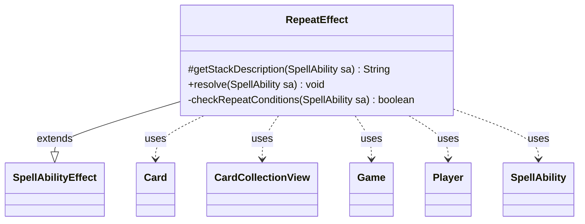

---
aliases:
  - RepeatEffect
tags:
  - java/class
  - module/forge-game
  - pkg/forge/game/ability/effects
fqn: forge.game.ability.effects.RepeatEffect
package: forge.game.ability.effects
module: forge-game
kind: Class
---

# RepeatEffect

**Package:** `forge.game.ability.effects`   **Module:** `forge-game`   **Kind:** Class



## Relationships
**Extends:**
- [[forge.game.ability.SpellAbilityEffect|SpellAbilityEffect]]
**Uses:**
- [[forge.game.Game|Game]]
- [[forge.game.card.Card|Card]]
- [[forge.game.card.CardCollectionView|CardCollectionView]]
- [[forge.game.player.Player|Player]]
- [[forge.game.spellability.SpellAbility|SpellAbility]]


## Design Description

RepeatEffect is a `SpellAbilityEffect` subclass that implements the resolution of "repeat" abilities, executing a nested `RepeatSubAbility` in a loop. It runs the sub-ability at least once (a do/while), then continues only while `checkRepeatConditions` holds. Conditions are data-driven, read from the hosting `SpellAbility`'s parameters via `AbilityUtils`: an optional `MaxRepeat` iteration cap, a `RepeatPresent` predicate counting valid cards in a `CardCollectionView` (the `Game` battlefield by default, or a defined set), an SVar comparison, and an optional player-confirmed `RepeatOptional` prompt.

The design delegates the actual repeated work to the sub-ability rather than reimplementing it, keeping this class focused purely on loop control and termination. Notable intent shows in its infinite-loop safeguards: it aborts when the `Game` is over, honors `MaxRepeat`, and hardcodes a Helm of Obedience break — with TODO comments noting these should ultimately resolve to a game draw once draws are supported.

## Source
`forge-game/src/main/java/forge/game/ability/effects/RepeatEffect.java`

```java
package forge.game.ability.effects;

import forge.game.Game;
import forge.game.ability.AbilityUtils;
import forge.game.ability.SpellAbilityEffect;
import forge.game.card.Card;
import forge.game.card.CardCollectionView;
import forge.game.card.CardLists;
import forge.game.player.Player;
import forge.game.spellability.SpellAbility;
import forge.game.zone.ZoneType;
import forge.util.Expressions;
import forge.util.Localizer;

public class RepeatEffect extends SpellAbilityEffect {

    @Override
    protected String getStackDescription(final SpellAbility sa) {
        return "Repeat something. Somebody should really write a better StackDescription!";
    }

    @Override
    public void resolve(final SpellAbility sa) {
        Card source = sa.getHostCard();

        // setup subability to repeat
        SpellAbility repeat = sa.getAdditionalAbility("RepeatSubAbility");

        Integer maxRepeat = null;
        if (sa.hasParam("MaxRepeat")) {
            maxRepeat = AbilityUtils.calculateAmount(source, sa.getParam("MaxRepeat"), sa);
            if (maxRepeat == 0) return; // do nothing if maxRepeat is 0. the next loop will execute at least once
        }

        //execute repeat ability at least once
        int count = 0;
        do {
            AbilityUtils.resolve(repeat);
            count++;
            if (maxRepeat != null && maxRepeat <= count) {
                // TODO Replace Infinite Loop Break with a game draw. Here are the scenarios that can cause this:
                // Helm of Obedience vs Graveyard to Library replacement effect

                if (source.getName().equals("Helm of Obedience")) {
                StringBuilder infLoop = new StringBuilder(source.toString());
                    infLoop.append(" - To avoid an infinite loop, this repeat has been broken ");
                    infLoop.append(" and the game will now continue in the current state, ending the loop early. ");
                    infLoop.append("Once Draws are available this probably should change to a Draw.");
                    System.out.println(infLoop.toString());
                }
                break;
            }
        } while (checkRepeatConditions(sa));
    }

    /**
     * <p>
     * checkRepeatConditions.
     * </p>
     *
     * @param sa
     *            a {@link forge.game.spellability.SpellAbility} object.
     */
    private static boolean checkRepeatConditions(final SpellAbility sa) {
        //boolean doAgain = false;
        final Player activator = sa.getActivatingPlayer();
        final Game game = activator.getGame();

        if (game.isGameOver()) {
            return false;
        }

        if (sa.hasParam("RepeatPresent")) {
            final String repeatPresent = sa.getParam("RepeatPresent");
            String repeatCompare = sa.getParamOrDefault("RepeatCompare", "GE1");

            CardCollectionView list;
            if (sa.hasParam("RepeatDefined")) {
                list = AbilityUtils.getDefinedCards(sa.getHostCard(), sa.getParam("RepeatDefined"), sa);
            } else {
                list = game.getCardsIn(ZoneType.Battlefield);
            }
            list = CardLists.getValidCards(list, repeatPresent, activator, sa.getHostCard(), sa);

            final String rightString = repeatCompare.substring(2);
            int right = AbilityUtils.calculateAmount(sa.getHostCard(), rightString, sa);

            final int left = list.size();

            if (!Expressions.compare(left, repeatCompare, right)) {
                return false;
            }
        }

        if (sa.hasParam("RepeatCheckSVar")) {
            String sVarOperator = "GE";
            String sVarOperand = "1";
            if (sa.hasParam("RepeatSVarCompare")) {
                sVarOperator = sa.getParam("RepeatSVarCompare").substring(0, 2);
                sVarOperand = sa.getParam("RepeatSVarCompare").substring(2);
            }
            final int svarValue = AbilityUtils.calculateAmount(sa.getHostCard(), sa.getParam("RepeatCheckSVar"), sa);
            final int operandValue = AbilityUtils.calculateAmount(sa.getHostCard(), sVarOperand, sa);

            if (!Expressions.compare(svarValue, sVarOperator, operandValue)) {
                return false;
            }
        }

        if (sa.hasParam("RepeatOptional")) {
            Player decider = sa.hasParam("RepeatOptionalDecider")
                    ? AbilityUtils.getDefinedPlayers(sa.getHostCard(), sa.getParam("RepeatOptionalDecider"), sa).get(0)
                    : activator;
            return decider.getController().confirmAction(sa, null, Localizer.getInstance().getMessage("lblDoYouWantRepeatProcessAgain"), null);
        }

        return true;
    }
}
```

## Python
`forge/game/ability/effects/RepeatEffect.py`

```python
from forge.game.Game import Game
from forge.game.ability.AbilityUtils import AbilityUtils
from forge.game.ability.SpellAbilityEffect import SpellAbilityEffect
from forge.game.card.Card import Card
from forge.game.card.CardCollectionView import CardCollectionView
from forge.game.card.CardLists import CardLists
from forge.game.player.Player import Player
from forge.game.spellability.SpellAbility import SpellAbility
from forge.game.zone.ZoneType import ZoneType
from forge.util.Expressions import Expressions
from forge.util.Localizer import Localizer


class RepeatEffect(SpellAbilityEffect):

    def getStackDescription(self, sa: SpellAbility) -> str:
        return "Repeat something. Somebody should really write a better StackDescription!"

    def resolve(self, sa: SpellAbility) -> None:
        source = sa.getHostCard()

        # setup subability to repeat
        repeat = sa.getAdditionalAbility("RepeatSubAbility")

        maxRepeat = None
        if sa.hasParam("MaxRepeat"):
            maxRepeat = AbilityUtils.calculateAmount(source, sa.getParam("MaxRepeat"), sa)
            if maxRepeat == 0:
                return  # do nothing if maxRepeat is 0. the next loop will execute at least once

        # execute repeat ability at least once
        count = 0
        while True:
            AbilityUtils.resolve(repeat)
            count += 1
            if maxRepeat is not None and maxRepeat <= count:
                # TODO Replace Infinite Loop Break with a game draw. Here are the scenarios that can cause this:
                # Helm of Obedience vs Graveyard to Library replacement effect

                if source.getName() == "Helm of Obedience":
                    infLoop = []
                    infLoop.append(str(source))
                    infLoop.append(" - To avoid an infinite loop, this repeat has been broken ")
                    infLoop.append(" and the game will now continue in the current state, ending the loop early. ")
                    infLoop.append("Once Draws are available this probably should change to a Draw.")
                    print("".join(infLoop))
                break
            if not RepeatEffect.checkRepeatConditions(sa):
                break

    @staticmethod
    def checkRepeatConditions(sa: SpellAbility) -> bool:
        # doAgain = False
        activator = sa.getActivatingPlayer()
        game = activator.getGame()

        if game.isGameOver():
            return False

        if sa.hasParam("RepeatPresent"):
            repeatPresent = sa.getParam("RepeatPresent")
            repeatCompare = sa.getParamOrDefault("RepeatCompare", "GE1")

            if sa.hasParam("RepeatDefined"):
                list = AbilityUtils.getDefinedCards(sa.getHostCard(), sa.getParam("RepeatDefined"), sa)
            else:
                list = game.getCardsIn(ZoneType.Battlefield)
            list = CardLists.getValidCards(list, repeatPresent, activator, sa.getHostCard(), sa)

            rightString = repeatCompare[2:]
            right = AbilityUtils.calculateAmount(sa.getHostCard(), rightString, sa)

            left = list.size()

            if not Expressions.compare(left, repeatCompare, right):
                return False

        if sa.hasParam("RepeatCheckSVar"):
            sVarOperator = "GE"
            sVarOperand = "1"
            if sa.hasParam("RepeatSVarCompare"):
                sVarOperator = sa.getParam("RepeatSVarCompare")[0:2]
                sVarOperand = sa.getParam("RepeatSVarCompare")[2:]
            svarValue = AbilityUtils.calculateAmount(sa.getHostCard(), sa.getParam("RepeatCheckSVar"), sa)
            operandValue = AbilityUtils.calculateAmount(sa.getHostCard(), sVarOperand, sa)

            if not Expressions.compare(svarValue, sVarOperator, operandValue):
                return False

        if sa.hasParam("RepeatOptional"):
            decider = (AbilityUtils.getDefinedPlayers(sa.getHostCard(), sa.getParam("RepeatOptionalDecider"), sa).get(0)
                       if sa.hasParam("RepeatOptionalDecider")
                       else activator)
            return decider.getController().confirmAction(sa, None, Localizer.getInstance().getMessage("lblDoYouWantRepeatProcessAgain"), None)

        return True
```
