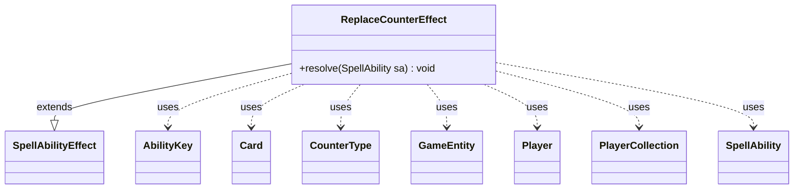

---
aliases:
  - ReplaceCounterEffect
tags:
  - java/class
  - module/forge-game
  - pkg/forge/game/ability/effects
fqn: forge.game.ability.effects.ReplaceCounterEffect
package: forge.game.ability.effects
module: forge-game
kind: Class
---

# ReplaceCounterEffect

**Package:** `forge.game.ability.effects` &nbsp; **Module:** `forge-game` &nbsp; **Kind:** Class



## Relationships
**Extends:**
- [[forge.game.ability.SpellAbilityEffect|SpellAbilityEffect]]
**Uses:**
- [[forge.game.GameEntity|GameEntity]]
- [[forge.game.ability.AbilityKey|AbilityKey]]
- [[forge.game.card.Card|Card]]
- [[forge.game.card.CounterType|CounterType]]
- [[forge.game.player.Player|Player]]
- [[forge.game.player.PlayerCollection|PlayerCollection]]
- [[forge.game.spellability.SpellAbility|SpellAbility]]

## Design Description

ReplaceCounterEffect implements the resolution logic for a counter replacement effect, extending `SpellAbilityEffect` and overriding only `resolve(SpellAbility)`. Its responsibility is to intercept and rewrite the counters being placed during a replacement event: it reads the in-flight `CounterMap` and `OriginalParams` from the triggering ability's replacing objects, recalculates each affected counter amount via `AbilityUtils.calculateAmount`, then updates or removes table entries before flagging the outcome as `ReplacementResult.Updated`.

The class guards against running outside a replacement context and supports two modes. When a single counter arrives from multiple sources under `ChooseCounter`, it transposes the player-to-counter table into a `CounterType`-to-`Player` `Multimap` so the affected `Player` can pick a target through the engine's choice API. Otherwise it filters entries by `ValidSource` and optional `ValidCounterType` parameters. Collaborating with `Card`, `CounterType`, `GameEntity`, `Player`, and `PlayerCollection`, it acts as a stateless, data-driven effect handler keyed off `AbilityKey` parameters.

## Source
`forge-game/src/main/java/forge/game/ability/effects/ReplaceCounterEffect.java`

```java
package forge.game.ability.effects;

import java.util.Collection;
import java.util.List;
import java.util.Map;
import java.util.Optional;

import com.google.common.collect.HashMultimap;
import com.google.common.collect.Lists;
import com.google.common.collect.Multimap;

import forge.game.GameEntity;
import forge.game.ability.AbilityKey;
import forge.game.ability.AbilityUtils;
import forge.game.ability.SpellAbilityEffect;
import forge.game.card.Card;
import forge.game.card.CounterType;
import forge.game.player.Player;
import forge.game.player.PlayerCollection;
import forge.game.replacement.ReplacementResult;
import forge.game.spellability.SpellAbility;

public class ReplaceCounterEffect extends SpellAbilityEffect {

    @Override
    public void resolve(SpellAbility sa) {
        final Card card = sa.getHostCard();

        // outside of Replacement Effect, unwanted result
        if (!sa.isReplacementAbility()) {
            return;
        }

        @SuppressWarnings("unchecked")
        Map<AbilityKey, Object> originalParams = (Map<AbilityKey, Object>) sa.getReplacingObject(AbilityKey.OriginalParams);
        @SuppressWarnings("unchecked")
        Map<Optional<Player>, Map<CounterType, Integer>> counterTable = (Map<Optional<Player>, Map<CounterType, Integer>>) sa.getReplacingObject(AbilityKey.CounterMap);

        if (counterTable.size() > 1 && sa.hasParam("ChooseCounter")) {
            // ChooseCounter is for ones that only adds one counter, when that is coming from multiple sources, the affected player needs to choose

            GameEntity ge = (GameEntity) sa.getReplacingObject(AbilityKey.Object);
            Player chooser = ge instanceof Player ? (Player) ge : ((Card) ge).getController();

            // for some effects, the Player -> CounterType Table needs to be flip into a CounterType -> [Player] list for the player to select
            Multimap<CounterType, Player> playerMap = HashMultimap.create();
            for (Map.Entry<Optional<Player>, Map<CounterType, Integer>> e : counterTable.entrySet()) {
                for (CounterType ct : e.getValue().keySet()) {
                    playerMap.put(ct, e.getKey().orElse(null));
                }
            }

            // there shouldn't be a case where one of the players is null, and the other is not

            for (Map.Entry<CounterType, Collection<Player>> e : playerMap.asMap().entrySet()) {
                Optional<Player> p = Optional.ofNullable(chooser.getController().chooseSingleEntityForEffect(new PlayerCollection(e.getValue()), sa, "Choose Player for " + e.getKey().getName(), null));

                sa.setReplacingObject(AbilityKey.CounterNum, counterTable.get(p).get(e.getKey()));
                int value = AbilityUtils.calculateAmount(card, sa.getParam("Amount"), sa);
                if (value <= 0) {
                    counterTable.get(p).remove(e.getKey());
                } else {
                    counterTable.get(p).put(e.getKey(), value);
                }
            }
        } else {
            for (Map.Entry<Optional<Player>, Map<CounterType, Integer>> e : counterTable.entrySet()) {
                if (!sa.matchesValidParam("ValidSource", e.getKey().orElse(null))) {
                    continue;
                }

                if (sa.hasParam("ValidCounterType")) {
                    CounterType ct = CounterType.getType(sa.getParam("ValidCounterType"));
                    if (e.getValue().containsKey(ct)) {
                        sa.setReplacingObject(AbilityKey.CounterNum, e.getValue().get(ct));
                        int value = AbilityUtils.calculateAmount(card, sa.getParam("Amount"), sa);
                        if (value <= 0) {
                            e.getValue().remove(ct);
                        } else {
                            e.getValue().put(ct, value);
                        }
                    }
                } else {
                    List<CounterType> toRemove = Lists.newArrayList();
                    for (Map.Entry<CounterType, Integer> ec : e.getValue().entrySet()) {
                        sa.setReplacingObject(AbilityKey.CounterNum, ec.getValue());
                        int value = AbilityUtils.calculateAmount(card, sa.getParam("Amount"), sa);
                        if (value <= 0) {
                            toRemove.add(ec.getKey());
                        } else {
                            ec.setValue(value);
                        }
                    }
                    e.getValue().keySet().removeAll(toRemove);
                }
            }
        }

        originalParams.put(AbilityKey.ReplacementResult, ReplacementResult.Updated);
    }
}
```
