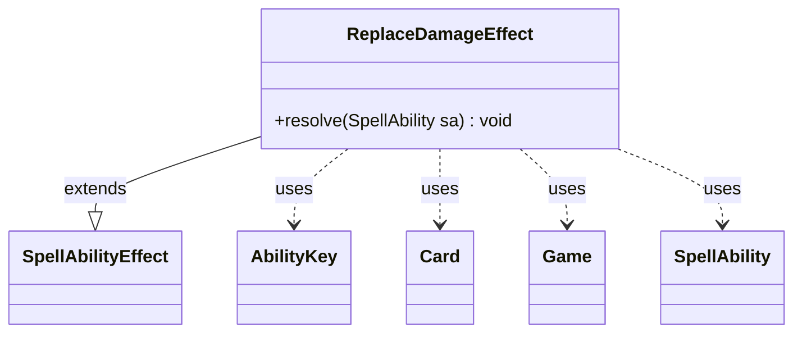

---
aliases:
  - ReplaceDamageEffect
tags:
  - java/class
  - module/forge-game
  - pkg/forge/game/ability/effects
fqn: forge.game.ability.effects.ReplaceDamageEffect
package: forge.game.ability.effects
module: forge-game
kind: Class
---

# ReplaceDamageEffect

**Package:** `forge.game.ability.effects` &nbsp; **Module:** `forge-game` &nbsp; **Kind:** Class



## Relationships
**Extends:**
- [[forge.game.ability.SpellAbilityEffect|SpellAbilityEffect]]
**Uses:**
- [[forge.game.Game|Game]]
- [[forge.game.ability.AbilityKey|AbilityKey]]
- [[forge.game.card.Card|Card]]
- [[forge.game.spellability.SpellAbility|SpellAbility]]

## Design Description

ReplaceDamageEffect is a concrete `SpellAbilityEffect` that implements Magic's damage-prevention mechanic, running only as a replacement ability—it returns immediately if `resolve` is invoked outside that context. It reads the original replacement parameters and incoming damage amount from the `SpellAbility`'s replacing objects (keyed by `AbilityKey`), computes the preventable amount via `AbilityUtils.calculateAmount`, and clamps it against both the remaining damage and any divided-shield limit.

A central design intent is distinguishing two prevention flavors: consumable "prevent next X" shields, whose backing `Number$` SVar on the host `Card` is decremented (and whose immutable effect is exiled through the `Game`'s action layer once depleted), versus fixed "prevent X" effects that are never updated. It reports results back through the original parameter map—marking the replacement `Replaced` when all damage is absorbed, or `Updated` with the reduced amount otherwise—and records the prevented total in the `PreventedDamage` SVar for downstream consumers.

## Source
`forge-game/src/main/java/forge/game/ability/effects/ReplaceDamageEffect.java`

```java
package forge.game.ability.effects;

import java.util.Map;

import org.apache.commons.lang3.StringUtils;

import forge.game.Game;
import forge.game.ability.AbilityKey;
import forge.game.ability.AbilityUtils;
import forge.game.ability.SpellAbilityEffect;
import forge.game.card.Card;
import forge.game.replacement.ReplacementResult;
import forge.game.spellability.SpellAbility;

/**
 * This class handles two kinds of prevention effect:
 * - Prevent next X damages. Those will use `Amount$ <SVar>`, and the `<SVar>` will have form `Number$ X`.
 *   That SVar will be updated after each prevention "shield" used up.
 * - Prevent X damages. Those will use `Amount$ N` or `Amount$ <SVar>`, where the `<SVar>` will have form other than
 *   `Number$ X`. These "shields" are not used up so won't be updated. */
public class ReplaceDamageEffect extends SpellAbilityEffect {

    @Override
    public void resolve(SpellAbility sa) {
        final Card card = sa.getHostCard();
        final Game game = card.getGame();

        // outside of Replacement Effect, unwanted result
        if (!sa.isReplacementAbility()) {
            return;
        }

        @SuppressWarnings("unchecked")
        Map<AbilityKey, Object> originalParams = (Map<AbilityKey, Object>) sa.getReplacingObject(AbilityKey.OriginalParams);
        Integer dmg = (Integer) sa.getReplacingObject(AbilityKey.DamageAmount);

        String varValue = sa.getParamOrDefault("Amount", "1");
        int prevent = AbilityUtils.calculateAmount(card, varValue, sa);

        if (prevent > 0) {
            int n = Math.min(dmg, prevent);
            // if the effect has divided shield, use that
            if (originalParams.get(AbilityKey.DividedShieldAmount) != null) {
                n = Math.min(n, (Integer)originalParams.get(AbilityKey.DividedShieldAmount));
            }
            dmg -= n;
            prevent -= n;

            if (!StringUtils.isNumeric(varValue) && card.getSVar(varValue).startsWith("Number$")) {
                if (card.isImmutable() && prevent <= 0) {
                    game.getAction().exileEffect(card);
                } else {
                    card.setSVar(varValue, "Number$" + prevent);
                    card.updateAbilityTextForView();
                }
            }
            // Set PreventedDamage SVar
            card.setSVar("PreventedDamage", "Number$" + n);
        }

        // no damage for original target anymore
        if (dmg <= 0) {
            originalParams.put(AbilityKey.ReplacementResult, ReplacementResult.Replaced);
            return;
        }
        originalParams.put(AbilityKey.DamageAmount, dmg);
        originalParams.put(AbilityKey.ReplacementResult, ReplacementResult.Updated);
    }

}
```
