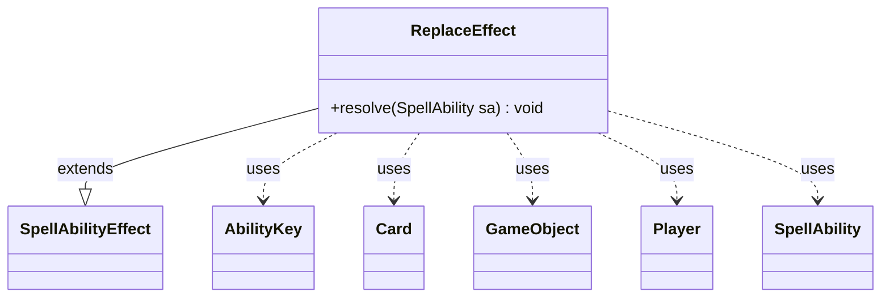

---
aliases:
  - ReplaceEffect
tags:
  - java/class
  - module/forge-game
  - pkg/forge/game/ability/effects
fqn: forge.game.ability.effects.ReplaceEffect
package: forge.game.ability.effects
module: forge-game
kind: Class
---

# ReplaceEffect

**Package:** `forge.game.ability.effects` &nbsp; **Module:** `forge-game` &nbsp; **Kind:** Class



## Relationships
**Extends:**
- [[forge.game.ability.SpellAbilityEffect|SpellAbilityEffect]]
**Uses:**
- [[forge.game.GameObject|GameObject]]
- [[forge.game.ability.AbilityKey|AbilityKey]]
- [[forge.game.card.Card|Card]]
- [[forge.game.player.Player|Player]]
- [[forge.game.spellability.SpellAbility|SpellAbility]]


## Design Description

ReplaceEffect is a concrete resolution handler in Forge's ability-effects framework, extending `SpellAbilityEffect` to plug into the engine's replacement-effect machinery. Its sole responsibility, executed in `resolve`, is to modify the in-flight parameters of an event currently being replaced: it reads the original parameter map (keyed by `AbilityKey`) off the hosting `SpellAbility`, computes a new value for a named variable, writes it back, and finally stamps the map with `ReplacementResult.Updated` so the replacement system knows the event was altered.

Value computation is data-driven, switching on a declared `VarType` and delegating to `AbilityUtils` to resolve a `Card`, `Player`, `GameObject`, planar-dice value, accumulated per-player `Map`, card set, or a plain calculated amount. This type-dispatched design lets a single effect class satisfy many replacement scenarios declaratively from card-script parameters, keeping the replacement subsystem uniform and avoiding bespoke subclasses per case.

## Source
`forge-game/src/main/java/forge/game/ability/effects/ReplaceEffect.java`

```java
package forge.game.ability.effects;

import java.util.List;
import java.util.Map;
import java.util.Set;

import forge.game.GameObject;
import forge.game.PlanarDice;
import forge.game.ability.AbilityKey;
import forge.game.ability.AbilityUtils;
import forge.game.ability.SpellAbilityEffect;
import forge.game.card.Card;
import forge.game.player.Player;
import forge.game.replacement.ReplacementResult;
import forge.game.spellability.SpellAbility;

public class ReplaceEffect extends SpellAbilityEffect {

    @Override
    public void resolve(SpellAbility sa) {
        final Card card = sa.getHostCard();

        final AbilityKey varName = AbilityKey.fromString(sa.getParam("VarName"));
        final String varValue = sa.getParam("VarValue");
        final String type = sa.getParamOrDefault("VarType", "amount");

        @SuppressWarnings("unchecked")
        Map<AbilityKey, Object> params = (Map<AbilityKey, Object>) sa.getReplacingObject(AbilityKey.OriginalParams);

        if ("Card".equals(type)) {
            List<Card> list = AbilityUtils.getDefinedCards(card, varValue, sa);
            if (list.size() > 0) {
                params.put(varName, list.get(0));
            }
        } else if ("Player".equals(type)) {
            List<Player> list = AbilityUtils.getDefinedPlayers(card, varValue, sa);
            if (list.size() > 0) {
                params.put(varName, list.get(0));
            }
        } else if ("GameEntity".equals(type)) {
            List<GameObject> list = AbilityUtils.getDefinedObjects(card, varValue, sa);
            if (list.size() > 0) {
                params.put(varName, list.get(0));
            }
        } else if ("PlanarDice".equals(type)) {
            params.put(varName, PlanarDice.smartValueOf(varValue));
        } else if ("Map".equals(type)) {
            Map<Player, Integer> m = (Map<Player, Integer>) sa.getReplacingObject(varName);
            for (Player key : AbilityUtils.getDefinedPlayers(card, sa.getParam("VarKey"), sa)) {
                m.put(key, m.getOrDefault(key, 0) + AbilityUtils.calculateAmount(card, varValue, sa));
            }
        } else if ("CardSet".equals(type)) {
            Set<Card> cards = (Set<Card>) params.get(varName);
            List<Card> list = AbilityUtils.getDefinedCards(card, varValue, sa);
            if (!list.isEmpty()) {
                cards.add(list.get(0));
            }
        } else if (varName != null) {
            params.put(varName, AbilityUtils.calculateAmount(card, varValue, sa));
        }

        params.put(AbilityKey.ReplacementResult, ReplacementResult.Updated);
    }

}
```

## Python
`forge/game/ability/effects/ReplaceEffect.py`

```python
from typing import List, Map

from forge.game.GameObject import GameObject
from forge.game.PlanarDice import PlanarDice
from forge.game.ability.AbilityKey import AbilityKey
from forge.game.ability.AbilityUtils import AbilityUtils
from forge.game.ability.SpellAbilityEffect import SpellAbilityEffect
from forge.game.card.Card import Card
from forge.game.player.Player import Player
from forge.game.replacement.ReplacementResult import ReplacementResult
from forge.game.spellability.SpellAbility import SpellAbility


class ReplaceEffect(SpellAbilityEffect):

    def resolve(self, sa: SpellAbility) -> None:
        card = sa.getHostCard()

        varName = AbilityKey.fromString(sa.getParam("VarName"))
        varValue = sa.getParam("VarValue")
        type = sa.getParamOrDefault("VarType", "amount")

        params: dict[AbilityKey, object] = sa.getReplacingObject(AbilityKey.OriginalParams)

        if "Card" == type:
            list = AbilityUtils.getDefinedCards(card, varValue, sa)
            if len(list) > 0:
                params[varName] = list[0]
        elif "Player" == type:
            list = AbilityUtils.getDefinedPlayers(card, varValue, sa)
            if len(list) > 0:
                params[varName] = list[0]
        elif "GameEntity" == type:
            list = AbilityUtils.getDefinedObjects(card, varValue, sa)
            if len(list) > 0:
                params[varName] = list[0]
        elif "PlanarDice" == type:
            params[varName] = PlanarDice.smartValueOf(varValue)
        elif "Map" == type:
            m: dict[Player, int] = sa.getReplacingObject(varName)
            for key in AbilityUtils.getDefinedPlayers(card, sa.getParam("VarKey"), sa):
                m[key] = m.get(key, 0) + AbilityUtils.calculateAmount(card, varValue, sa)
        elif "CardSet" == type:
            cards: set[Card] = params.get(varName)
            list = AbilityUtils.getDefinedCards(card, varValue, sa)
            if list:
                cards.add(list[0])
        elif varName is not None:
            params[varName] = AbilityUtils.calculateAmount(card, varValue, sa)

        params[AbilityKey.ReplacementResult] = ReplacementResult.Updated
```
