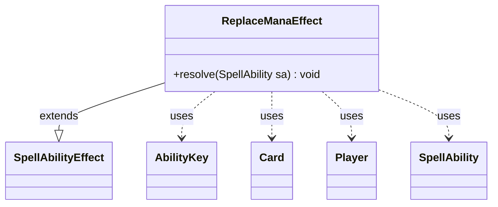

---
aliases:
  - ReplaceManaEffect
tags:
  - java/class
  - module/forge-game
  - pkg/forge/game/ability/effects
fqn: forge.game.ability.effects.ReplaceManaEffect
package: forge.game.ability.effects
module: forge-game
kind: Class
---

# ReplaceManaEffect

**Package:** `forge.game.ability.effects`   **Module:** `forge-game`   **Kind:** Class



## Relationships
**Extends:**
- [[forge.game.ability.SpellAbilityEffect|SpellAbilityEffect]]
**Uses:**
- [[forge.game.ability.AbilityKey|AbilityKey]]
- [[forge.game.card.Card|Card]]
- [[forge.game.player.Player|Player]]
- [[forge.game.spellability.SpellAbility|SpellAbility]]


## Design Description

ReplaceManaEffect is a concrete `SpellAbilityEffect` that implements the resolution logic for a mana-replacement effect, rewriting mana as it is produced. Its sole responsibility is the overridden `resolve` method, which plugs into Forge's ability-resolution pipeline yet guards itself by returning immediately unless invoked as a replacement ability. It reads the in-flight mana string from the replacement's `OriginalParams` map—accessed via `AbilityKey`—and applies one of several mutually exclusive, script-driven transformations: substituting type and amount (`ReplaceMana`), recoloring symbols (`ReplaceType`/`ReplaceColor`), or multiplying output (`ReplaceAmount`).

The design intent is tight integration with the replacement-effect framework rather than standalone behavior. It collaborates with `Player` and `Card` to resolve player color choices and a host card's chosen color, and relies on `MagicColor`/`ColorSet` for symbol normalization. It signals completion by writing the updated mana back into the params map and stamping `ReplacementResult.Updated`, so the engine continues resolution with the modified value.

## Source
`forge-game/src/main/java/forge/game/ability/effects/ReplaceManaEffect.java`

```java
package forge.game.ability.effects;

import java.util.Map;

import org.apache.commons.lang3.StringUtils;


import forge.card.ColorSet;
import forge.card.MagicColor;
import forge.game.ability.AbilityKey;
import forge.game.ability.SpellAbilityEffect;
import forge.game.card.Card;
import forge.game.player.Player;
import forge.game.replacement.ReplacementResult;
import forge.game.spellability.SpellAbility;

public class ReplaceManaEffect extends SpellAbilityEffect {

    @Override
    public void resolve(SpellAbility sa) {
        final Card card = sa.getHostCard();
        final Player player = sa.getActivatingPlayer();

        // outside of Replacement Effect, unwanted result
        if (!sa.isReplacementAbility()) {
            return;
        }

        @SuppressWarnings("unchecked")
        Map<AbilityKey, Object> params = (Map<AbilityKey, Object>) sa.getReplacingObject(AbilityKey.OriginalParams);

        String replaced = (String)sa.getReplacingObject(AbilityKey.Mana);
        if (sa.hasParam("ReplaceMana")) {
            // replace type and amount
            replaced = sa.getParam("ReplaceMana");
            if ("Any".equals(replaced)) {
                byte rs = player.getController().chooseColor("Choose a color", sa, ColorSet.WUBRG);
                replaced = MagicColor.toShortString(rs);
            }
        } else if (sa.hasParam("ReplaceType")) {
            // replace color and colorless
            String color = sa.getParam("ReplaceType");
            if ("Any".equals(color)) {
                byte rs = player.getController().chooseColor("Choose a color", sa, ColorSet.WUBRG);
                color = MagicColor.toShortString(rs);
            } else {
                // convert in case Color Word used
                color = MagicColor.toShortString(color);
            }
            for (byte c : MagicColor.WUBRGC) {
                String s = MagicColor.toShortString(c);
                replaced = replaced.replace(s, color);
            }
        } else if (sa.hasParam("ReplaceColor")) {
            // replace color
            String color = sa.getParam("ReplaceColor");
            if ("Chosen".equals(color)) {
                if (card.hasChosenColor()) {
                    color = MagicColor.toShortString(card.getChosenColor());
                }
            } else {
                // convert in case Color Word used
                color = MagicColor.toShortString(color);
            }
            if (sa.hasParam("ReplaceOnly")) {
                replaced = replaced.replace(sa.getParam("ReplaceOnly"), color);
            } else {
                for (byte c : MagicColor.WUBRG) {
                    String s = MagicColor.toShortString(c);
                    replaced = replaced.replace(s, color);
                }
            }
        } else if (sa.hasParam("ReplaceAmount")) {
            // replace amount = multiples
            replaced = StringUtils.repeat(replaced, " ", Integer.parseInt(sa.getParam("ReplaceAmount")));
        }
        params.put(AbilityKey.Mana, replaced);
        // effect was updated
        params.put(AbilityKey.ReplacementResult, ReplacementResult.Updated);
    }

}
```

## Python
`forge/game/ability/effects/ReplaceManaEffect.py`

```python
from typing import Map  # noqa  -- placeholder; will use dict below

from forge.card.ColorSet import ColorSet
from forge.card.MagicColor import MagicColor
from forge.game.ability.AbilityKey import AbilityKey
from forge.game.ability.SpellAbilityEffect import SpellAbilityEffect
from forge.game.card.Card import Card
from forge.game.player.Player import Player
from forge.game.replacement.ReplacementResult import ReplacementResult
from forge.game.spellability.SpellAbility import SpellAbility


class ReplaceManaEffect(SpellAbilityEffect):

    def resolve(self, sa: SpellAbility) -> None:
        card = sa.getHostCard()
        player = sa.getActivatingPlayer()

        # outside of Replacement Effect, unwanted result
        if not sa.isReplacementAbility():
            return

        params = sa.getReplacingObject(AbilityKey.OriginalParams)

        replaced = sa.getReplacingObject(AbilityKey.Mana)
        if sa.hasParam("ReplaceMana"):
            # replace type and amount
            replaced = sa.getParam("ReplaceMana")
            if "Any" == replaced:
                rs = player.getController().chooseColor("Choose a color", sa, ColorSet.WUBRG)
                replaced = MagicColor.toShortString(rs)
        elif sa.hasParam("ReplaceType"):
            # replace color and colorless
            color = sa.getParam("ReplaceType")
            if "Any" == color:
                rs = player.getController().chooseColor("Choose a color", sa, ColorSet.WUBRG)
                color = MagicColor.toShortString(rs)
            else:
                # convert in case Color Word used
                color = MagicColor.toShortString(color)
            for c in MagicColor.WUBRGC:
                s = MagicColor.toShortString(c)
                replaced = replaced.replace(s, color)
        elif sa.hasParam("ReplaceColor"):
            # replace color
            color = sa.getParam("ReplaceColor")
            if "Chosen" == color:
                if card.hasChosenColor():
                    color = MagicColor.toShortString(card.getChosenColor())
            else:
                # convert in case Color Word used
                color = MagicColor.toShortString(color)
            if sa.hasParam("ReplaceOnly"):
                replaced = replaced.replace(sa.getParam("ReplaceOnly"), color)
            else:
                for c in MagicColor.WUBRG:
                    s = MagicColor.toShortString(c)
                    replaced = replaced.replace(s, color)
        elif sa.hasParam("ReplaceAmount"):
            # replace amount = multiples
            replaced = " ".join([replaced] * int(sa.getParam("ReplaceAmount")))
        params.put(AbilityKey.Mana, replaced)
        # effect was updated
        params.put(AbilityKey.ReplacementResult, ReplacementResult.Updated)
```
