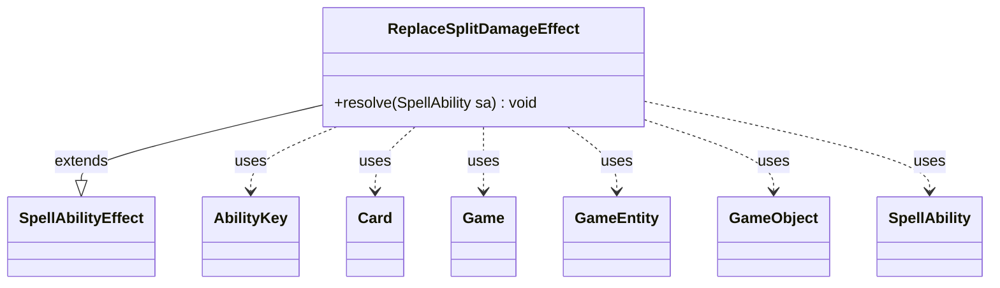

---
aliases:
  - ReplaceSplitDamageEffect
tags:
  - java/class
  - module/forge-game
  - pkg/forge/game/ability/effects
fqn: forge.game.ability.effects.ReplaceSplitDamageEffect
package: forge.game.ability.effects
module: forge-game
kind: Class
---

# ReplaceSplitDamageEffect

**Package:** `forge.game.ability.effects` &nbsp; **Module:** `forge-game` &nbsp; **Kind:** Class



## Relationships
**Extends:**
- [[forge.game.ability.SpellAbilityEffect|SpellAbilityEffect]]
**Uses:**
- [[forge.game.Game|Game]]
- [[forge.game.GameEntity|GameEntity]]
- [[forge.game.GameObject|GameObject]]
- [[forge.game.ability.AbilityKey|AbilityKey]]
- [[forge.game.card.Card|Card]]
- [[forge.game.spellability.SpellAbility|SpellAbility]]


## Design Description

ReplaceSplitDamageEffect is a concrete `SpellAbilityEffect` subclass that serves as the resolver for a damage-replacement ability, redirecting some or all of an incoming damage event onto an alternative target. It overrides `resolve` and first guards against misuse by returning early unless `sa.isReplacementAbility()`, so it only acts within Forge's replacement framework.

Working from the host `Card` and its `Game`, it reads the pending event through the `AbilityKey`-keyed `OriginalParams` map and `DamageAmount`, computes a prevent amount (further capped by any `DividedShieldAmount`), and reassigns that portion to a defined `GameEntity` via the `Affected` and `DamageAmount` keys. It signals the engine with `ReplacementResult.Replaced` when no damage remains or `Updated` otherwise. Notable intent: it depletes a non-numeric shield SVar, refreshes the card's view text, and self-exiles spent immutable effect cards.

## Source
`forge-game/src/main/java/forge/game/ability/effects/ReplaceSplitDamageEffect.java`

```java
package forge.game.ability.effects;

import java.util.List;
import java.util.Map;

import org.apache.commons.lang3.StringUtils;

import forge.game.Game;
import forge.game.GameEntity;
import forge.game.GameObject;
import forge.game.ability.AbilityKey;
import forge.game.ability.AbilityUtils;
import forge.game.ability.SpellAbilityEffect;
import forge.game.card.Card;
import forge.game.replacement.ReplacementResult;
import forge.game.spellability.SpellAbility;

public class ReplaceSplitDamageEffect extends SpellAbilityEffect {

    @Override
    public void resolve(SpellAbility sa) {
        final Card card = sa.getHostCard();
        final Game game = card.getGame();

        // outside of Replacement Effect, unwanted result
        if (!sa.isReplacementAbility()) {
            return;
        }

        String varValue = sa.getParamOrDefault("VarName", "1");

        @SuppressWarnings("unchecked")
        Map<AbilityKey, Object> originalParams = (Map<AbilityKey , Object>) sa.getReplacingObject(AbilityKey.OriginalParams);
        Integer dmg = (Integer) sa.getReplacingObject(AbilityKey.DamageAmount);
        int prevent = AbilityUtils.calculateAmount(card, varValue, sa);

        List<GameObject> list = AbilityUtils.getDefinedObjects(card, sa.getParam("DamageTarget"), sa);

        if (prevent > 0 && list.size() > 0 && list.get(0) instanceof GameEntity) {
            int n = Math.min(dmg, prevent);
            // if the effect has divided shield, use that
            if (originalParams.get(AbilityKey.DividedShieldAmount) != null) {
                n = Math.min(n, (Integer)originalParams.get(AbilityKey.DividedShieldAmount));
            }
            dmg -= n;
            prevent -= n;

            if (card.isImmutable() && prevent <= 0) {
                game.getAction().exileEffect(card);
            } else if (!StringUtils.isNumeric(varValue)) {
                sa.setSVar(varValue, "Number$" + prevent);
                card.updateAbilityTextForView();
            }

            GameEntity obj = (GameEntity) list.get(0);
            originalParams.put(AbilityKey.Affected, obj);
            originalParams.put(AbilityKey.DamageAmount, n);
        }

        // no damage for original target anymore
        if (dmg <= 0) {
            originalParams.put(AbilityKey.ReplacementResult, ReplacementResult.Replaced);
            return;
        }
        originalParams.put(AbilityKey.ReplacementResult, ReplacementResult.Updated);
    }

}
```
