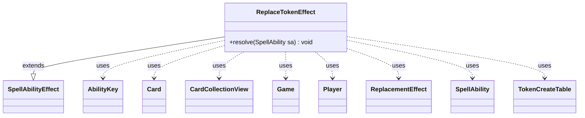

---
aliases:
  - ReplaceTokenEffect
tags:
  - java/class
  - module/forge-game
  - pkg/forge/game/ability/effects
fqn: forge.game.ability.effects.ReplaceTokenEffect
package: forge.game.ability.effects
module: forge-game
kind: Class
---

# ReplaceTokenEffect

**Package:** `forge.game.ability.effects`   **Module:** `forge-game`   **Kind:** Class



## Relationships
**Extends:**
- [[forge.game.ability.SpellAbilityEffect|SpellAbilityEffect]]
**Uses:**
- [[forge.game.Game|Game]]
- [[forge.game.ability.AbilityKey|AbilityKey]]
- [[forge.game.card.Card|Card]]
- [[forge.game.card.CardCollectionView|CardCollectionView]]
- [[forge.game.card.TokenCreateTable|TokenCreateTable]]
- [[forge.game.player.Player|Player]]
- [[forge.game.replacement.ReplacementEffect|ReplacementEffect]]
- [[forge.game.spellability.SpellAbility|SpellAbility]]


## Design Description

ReplaceTokenEffect is a resolution-time `SpellAbilityEffect` that customizes how an in-progress token-creation replacement plays out. Overriding `resolve`, it locates the triggering replacement context — resolving the replacement effect, the affected `Player`, and the `TokenCreateTable` from the replacing-objects map — then branches on a `Type` parameter to one of four behaviors: scaling token counts ("Amount"), inserting additional tokens ("AddToken"), substituting different token scripts ("ReplaceToken", optionally copying a chosen permanent), or reassigning control ("ReplaceController"). On completion it records `ReplacementResult.Updated` back into the original parameter map.

Its design intent is a single data-driven dispatcher: card scripts configure behavior declaratively through parameters rather than via separate effect classes. Candidate tokens are filtered through the `ReplacementEffect`'s `ValidToken` predicate, while it collaborates with `AbilityUtils` for amount math, `TokenInfo`/`Card` for prototyping new tokens, and `Game` timestamps to stamp controller changes — keeping all token-replacement variants centralized and consistent.

## Source
`forge-game/src/main/java/forge/game/ability/effects/ReplaceTokenEffect.java`

```java
package forge.game.ability.effects;

import java.util.Map;
import java.util.Set;
import java.util.stream.Collectors;

import org.apache.commons.lang3.tuple.ImmutablePair;
import org.apache.commons.lang3.tuple.Pair;

import com.google.common.collect.ArrayListMultimap;
import com.google.common.collect.Multimap;
import com.google.common.collect.Sets;

import forge.game.Game;
import forge.game.ability.AbilityKey;
import forge.game.ability.AbilityUtils;
import forge.game.ability.SpellAbilityEffect;
import forge.game.card.Card;
import forge.game.card.CardCollectionView;
import forge.game.card.CardLists;
import forge.game.card.TokenCreateTable;
import forge.game.card.token.TokenInfo;
import forge.game.player.Player;
import forge.game.replacement.ReplacementEffect;
import forge.game.replacement.ReplacementResult;
import forge.game.spellability.SpellAbility;
import forge.game.zone.ZoneType;
import forge.util.Localizer;

public class ReplaceTokenEffect extends SpellAbilityEffect {

    @Override
    public void resolve(SpellAbility sa) {
        final Card card = sa.getHostCard();
        final Player p = sa.getActivatingPlayer();
        final Game game = card.getGame();
        SpellAbility repSA = sa;

        if (repSA.getReplacingObjects().isEmpty()) {
            repSA = sa.getRootAbility();
        }
        ReplacementEffect re = repSA.getReplacementEffect();
        // ReplaceToken Effect only applies to one Player
        Player affected = (Player) repSA.getReplacingObject(AbilityKey.Player);
        TokenCreateTable table = (TokenCreateTable) repSA.getReplacingObject(AbilityKey.Token);

        @SuppressWarnings("unchecked")
        Map<AbilityKey, Object> originalParams =
                (Map<AbilityKey, Object>) repSA.getReplacingObject(AbilityKey.OriginalParams);

        if ("Amount".equals(sa.getParam("Type"))) {
            final String mod = sa.getParamOrDefault("Amount", "Twice");
            for (Map.Entry<Card, Integer> e : table.row(affected).entrySet()) {
                if (!re.matchesValidParam("ValidToken", e.getKey())) {
                    continue;
                }
                int newAmt = AbilityUtils.doXMath(e.getValue(), mod, card, sa);
                table.put(affected, e.getKey(), newAmt);
            }
        } else if ("AddToken".equals(sa.getParam("Type"))) {
            long timestamp = game.getNextTimestamp();

            Map<Player, Integer> byController = table.row(affected).entrySet().stream()
                    .filter(e -> re.matchesValidParam("ValidToken", e.getKey()))
                    .collect(Collectors.groupingBy(e -> e.getKey().getController(), Collectors.summingInt(e -> e.getValue())));

            if (!byController.isEmpty()) {
                // for Xorn, might matter if you could somehow create Treasure under multiple players control
                if (sa.hasParam("Amount")) {
                    int i = AbilityUtils.calculateAmount(card, sa.getParam("Amount"), sa);
                    for (Map.Entry<Player, Integer> e : byController.entrySet()) {
                        e.setValue(i);
                    }
                }
                for (Map.Entry<Player, Integer> e : byController.entrySet()) {
                    for (String script : sa.getParam("TokenScript").split(",")) {
                        final Card token = TokenInfo.getProtoType(script, sa, p);

                        if (token == null) {
                            throw new RuntimeException("don't find Token for TokenScript: " + script);
                        }
                        token.setTokenSpawningAbility((SpellAbility)repSA.getReplacingObject(AbilityKey.Cause));
                        token.setController(e.getKey(), timestamp);
                        table.put(p, token, e.getValue());
                    }
                }
            }
        } else if ("ReplaceToken".equals(sa.getParam("Type"))) {
            Card chosen = null;
            if (sa.hasParam("ValidChoices")) {
                CardCollectionView choices = CardLists.getValidCards(game.getCardsIn(ZoneType.Battlefield), sa.getParam("ValidChoices"), p, card, sa);
                if (choices.isEmpty()) {
                    originalParams.put(AbilityKey.ReplacementResult, ReplacementResult.NotReplaced);
                    return;
                }
                chosen = p.getController().chooseSingleEntityForEffect(choices, sa, Localizer.getInstance().getMessage("lblChooseaCard"), false, null);
            }

            long timestamp = game.getNextTimestamp();

            Multimap<Player, Pair<Integer, Iterable<Object>>> toInsertMap = ArrayListMultimap.create();
            Set<Card> toRemoveSet = Sets.newHashSet();
            for (Map.Entry<Card, Integer> e : table.row(affected).entrySet()) {
                if (!re.matchesValidParam("ValidToken", e.getKey())) {
                    continue;
                }
                Player controller = e.getKey().getController();
                // TODO should still merge the amounts to avoid additional prototypes when sourceSA doesn't use ForEach
                //int old = ObjectUtils.defaultIfNull(toInsertMap.get(controller), 0);
                Pair<Integer, Iterable<Object>> tokenAmountPair = new ImmutablePair<>(e.getValue(), e.getKey().getRemembered());
                toInsertMap.put(controller, tokenAmountPair);
                toRemoveSet.add(e.getKey());
            }
            // remove replaced tokens
            table.row(affected).keySet().removeAll(toRemoveSet);

            // insert new tokens
            for (Map.Entry<Player, Pair<Integer, Iterable<Object>>> pe : toInsertMap.entries()) {
                int amt = pe.getValue().getLeft();
                if (amt <= 0) {
                    continue;
                }
                for (String script : sa.getParam("TokenScript").split(",")) {
                    final Card token;
                    if (script.equals("Chosen")) {
                        token = CopyPermanentEffect.getProtoType(sa, chosen, pe.getKey());
                        token.setCopiedPermanent(token);
                    } else {
                        token = TokenInfo.getProtoType(script, sa, pe.getKey());
                    }

                    if (token == null) {
                        throw new RuntimeException("don't find Token for TokenScript: " + script);
                    }

                    token.setTokenSpawningAbility((SpellAbility)repSA.getReplacingObject(AbilityKey.Cause));
                    token.setController(pe.getKey(), timestamp);
                    // if token is created from ForEach keep that
                    token.addRemembered(pe.getValue().getRight());
                    table.put(affected, token, amt);
                }
            }
        } else if ("ReplaceController".equals(sa.getParam("Type"))) {
            long timestamp = game.getNextTimestamp();
            Player newController = p;
            if (sa.hasParam("NewController")) {
                newController = AbilityUtils.getDefinedPlayers(sa.getHostCard(), sa.getParam("NewController"), sa).get(0);
            }
            for (Map.Entry<Card, Integer> c : table.row(affected).entrySet()) {
                if (!re.matchesValidParam("ValidToken", c.getKey())) {
                    continue;
                }
                c.getKey().setController(newController, timestamp);
            }
        }

        // effect was updated
        originalParams.put(AbilityKey.ReplacementResult, ReplacementResult.Updated);
    }

}
```

## Python
`forge/game/ability/effects/ReplaceTokenEffect.py`

```python
from typing import Iterable

from forge.game.Game import Game
from forge.game.ability.AbilityKey import AbilityKey
from forge.game.ability.AbilityUtils import AbilityUtils
from forge.game.ability.SpellAbilityEffect import SpellAbilityEffect
from forge.game.card.Card import Card
from forge.game.card.CardCollectionView import CardCollectionView
from forge.game.card.CardLists import CardLists
from forge.game.card.TokenCreateTable import TokenCreateTable
from forge.game.card.token.TokenInfo import TokenInfo
from forge.game.player.Player import Player
from forge.game.replacement.ReplacementEffect import ReplacementEffect
from forge.game.replacement.ReplacementResult import ReplacementResult
from forge.game.spellability.SpellAbility import SpellAbility
from forge.game.zone.ZoneType import ZoneType
from forge.util.Localizer import Localizer
from forge.game.ability.effects.CopyPermanentEffect import CopyPermanentEffect


class ReplaceTokenEffect(SpellAbilityEffect):

    def resolve(self, sa: SpellAbility) -> None:
        card = sa.getHostCard()
        p = sa.getActivatingPlayer()
        game = card.getGame()
        repSA = sa

        if not repSA.getReplacingObjects():
            repSA = sa.getRootAbility()
        re = repSA.getReplacementEffect()
        # ReplaceToken Effect only applies to one Player
        affected = repSA.getReplacingObject(AbilityKey.Player)
        table = repSA.getReplacingObject(AbilityKey.Token)

        originalParams = repSA.getReplacingObject(AbilityKey.OriginalParams)

        if "Amount" == sa.getParam("Type"):
            mod = sa.getParamOrDefault("Amount", "Twice")
            for key, value in list(table.row(affected).items()):
                if not re.matchesValidParam("ValidToken", key):
                    continue
                newAmt = AbilityUtils.doXMath(value, mod, card, sa)
                table.put(affected, key, newAmt)
        elif "AddToken" == sa.getParam("Type"):
            timestamp = game.getNextTimestamp()

            byController: dict[Player, int] = {}
            for key, value in table.row(affected).items():
                if not re.matchesValidParam("ValidToken", key):
                    continue
                controller = key.getController()
                byController[controller] = byController.get(controller, 0) + value

            if byController:
                # for Xorn, might matter if you could somehow create Treasure under multiple players control
                if sa.hasParam("Amount"):
                    i = AbilityUtils.calculateAmount(card, sa.getParam("Amount"), sa)
                    for controller in byController:
                        byController[controller] = i
                for controller, amount in byController.items():
                    for script in sa.getParam("TokenScript").split(","):
                        token = TokenInfo.getProtoType(script, sa, p)

                        if token is None:
                            raise RuntimeError("don't find Token for TokenScript: " + script)
                        token.setTokenSpawningAbility(repSA.getReplacingObject(AbilityKey.Cause))
                        token.setController(controller, timestamp)
                        table.put(p, token, amount)
        elif "ReplaceToken" == sa.getParam("Type"):
            chosen = None
            if sa.hasParam("ValidChoices"):
                choices = CardLists.getValidCards(game.getCardsIn(ZoneType.Battlefield), sa.getParam("ValidChoices"), p, card, sa)
                if not choices:
                    originalParams[AbilityKey.ReplacementResult] = ReplacementResult.NotReplaced
                    return
                chosen = p.getController().chooseSingleEntityForEffect(choices, sa, Localizer.getInstance().getMessage("lblChooseaCard"), False, None)

            timestamp = game.getNextTimestamp()

            toInsertMap: dict[Player, list[tuple[int, Iterable[object]]]] = {}
            toRemoveSet: set[Card] = set()
            for key, value in table.row(affected).items():
                if not re.matchesValidParam("ValidToken", key):
                    continue
                controller = key.getController()
                # TODO should still merge the amounts to avoid additional prototypes when sourceSA doesn't use ForEach
                # int old = ObjectUtils.defaultIfNull(toInsertMap.get(controller), 0);
                tokenAmountPair = (value, key.getRemembered())
                toInsertMap.setdefault(controller, []).append(tokenAmountPair)
                toRemoveSet.add(key)
            # remove replaced tokens
            for k in list(table.row(affected).keys()):
                if k in toRemoveSet:
                    del table.row(affected)[k]

            # insert new tokens
            for controller, pairs in toInsertMap.items():
                for pair in pairs:
                    amt = pair[0]
                    if amt <= 0:
                        continue
                    for script in sa.getParam("TokenScript").split(","):
                        if script == "Chosen":
                            token = CopyPermanentEffect.getProtoType(sa, chosen, controller)
                            token.setCopiedPermanent(token)
                        else:
                            token = TokenInfo.getProtoType(script, sa, controller)

                        if token is None:
                            raise RuntimeError("don't find Token for TokenScript: " + script)

                        token.setTokenSpawningAbility(repSA.getReplacingObject(AbilityKey.Cause))
                        token.setController(controller, timestamp)
                        # if token is created from ForEach keep that
                        token.addRemembered(pair[1])
                        table.put(affected, token, amt)
        elif "ReplaceController" == sa.getParam("Type"):
            timestamp = game.getNextTimestamp()
            newController = p
            if sa.hasParam("NewController"):
                newController = AbilityUtils.getDefinedPlayers(sa.getHostCard(), sa.getParam("NewController"), sa)[0]
            for key, value in table.row(affected).items():
                if not re.matchesValidParam("ValidToken", key):
                    continue
                key.setController(newController, timestamp)

        # effect was updated
        originalParams[AbilityKey.ReplacementResult] = ReplacementResult.Updated
```
