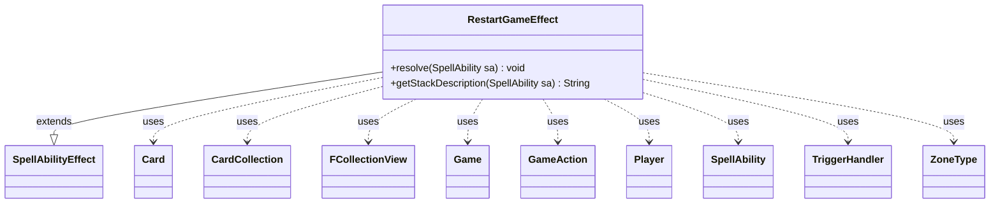

---
aliases:
  - RestartGameEffect
tags:
  - java/class
  - module/forge-game
  - pkg/forge/game/ability/effects
fqn: forge.game.ability.effects.RestartGameEffect
package: forge.game.ability.effects
module: forge-game
kind: Class
---

# RestartGameEffect

**Package:** `forge.game.ability.effects` &nbsp; **Module:** `forge-game` &nbsp; **Kind:** Class



## Relationships
**Extends:**
- [[forge.game.ability.SpellAbilityEffect|SpellAbilityEffect]]
**Uses:**
- [[forge.game.Game|Game]]
- [[forge.game.GameAction|GameAction]]
- [[forge.game.card.Card|Card]]
- [[forge.game.card.CardCollection|CardCollection]]
- [[forge.game.player.Player|Player]]
- [[forge.game.spellability.SpellAbility|SpellAbility]]
- [[forge.game.trigger.TriggerHandler|TriggerHandler]]
- [[forge.game.zone.ZoneType|ZoneType]]
- [[forge.util.collect.FCollectionView|FCollectionView]]


## Design Description

RestartGameEffect is a resolution handler in the ability-effects layer that implements the "restart the game" ability (most notably Karn Liberated's ultimate). It extends SpellAbilityEffect, overriding `resolve` to perform the work and `getStackDescription` to label it on the stack. Rather than starting a new match, it reinitializes the existing Game in place: it restarts the phase handler, clears step commands and the stack, resets per-turn and global game flags (monarch, initiative, day/night), and for each Player wipes counters, per-game stats, and special state before rebuilding their library via GameAction.moveToLibrary and reshuffling.

Its design intent centers on safe mass card movement and zone handling. It collaborates with TriggerHandler to suppress ChangesZone and Shuffled triggers during the rebuild (avoiding spurious effects like Psychic Surgery) and resets Trigger IDs so observables stay consistent. It deliberately excludes Ante zones, honors the `RestrictFromZone`/`RestrictFromValid` parameters via ZoneType and CardLists, preserves commanders out of the Command zone, then marks the game stage RestartedByKarn and hands remaining setup to the phase handler.

## Source
`forge-game/src/main/java/forge/game/ability/effects/RestartGameEffect.java`

```java
package forge.game.ability.effects;

import java.util.ArrayList;
import java.util.Arrays;
import java.util.List;

import forge.game.Game;
import forge.game.GameAction;
import forge.game.GameStage;
import forge.game.ability.SpellAbilityEffect;
import forge.game.card.Card;
import forge.game.card.CardCollection;
import forge.game.card.CardLists;
import forge.game.player.Player;
import forge.game.spellability.SpellAbility;
import forge.game.trigger.TriggerHandler;
import forge.game.trigger.TriggerType;
import forge.game.zone.ZoneType;
import forge.util.collect.FCollectionView;

public class RestartGameEffect extends SpellAbilityEffect {
    @Override
    public void resolve(SpellAbility sa) {
        final Player activator = sa.getActivatingPlayer();
        final Game game = activator.getGame();
        FCollectionView<Player> players = game.getPlayers();

        // Don't grab Ante Zones
        List<ZoneType> restartZones = new ArrayList<>(Arrays.asList(ZoneType.Battlefield,
                ZoneType.Library, ZoneType.Graveyard, ZoneType.Hand, ZoneType.Exile));

        ZoneType leaveZone = ZoneType.smartValueOf(sa.getParam("RestrictFromZone"));
        restartZones.remove(leaveZone);
        String leaveRestriction = sa.getParamOrDefault("RestrictFromValid", "Card");

        //Card.resetUniqueNumber();
        // need this code here, otherwise observables fail
        forge.game.trigger.Trigger.resetIDs();
        TriggerHandler trigHandler = game.getTriggerHandler();
        trigHandler.clearDelayedTrigger();
        trigHandler.clearPlayerDefinedDelayedTrigger();
        trigHandler.suppressMode(TriggerType.ChangesZone);
        // Avoid Psychic Surgery trigger in new game
        trigHandler.suppressMode(TriggerType.Shuffled);

        game.getPhaseHandler().restart();
        game.getUntap().clearCommands();
        game.getUpkeep().clearCommands();
        game.getEndOfCombat().clearCommands();
        game.getEndOfTurn().clearCommands();
        game.getCleanup().clearCommands();

        game.getStack().reset();
        game.clearCounterAddedThisTurn();
        game.clearCounterRemovedThisTurn();
        game.setMonarch(null);
        game.setHasInitiative(null);
        game.setDayTime(null);
        GameAction action = game.getAction();

        for (Player p: players) {
            p.setStartingLife(p.getStartingLife());
            p.clearCounters();
            p.resetSpellCastThisGame();
            p.onCleanupPhase();
            p.setLandsPlayedLastTurn(0);
            p.setSpellsCastLastTurn(0);
            p.setLifeLostLastTurn(0);
            p.resetCommanderStats();
            p.resetCompletedDungeons();
            p.resetRingTemptedYou();
            p.clearRingBearer();
            p.clearTheRing();
            p.setBlessing(false, null);
            p.clearController();

            CardCollection newLibrary = new CardCollection(p.getCardsIn(restartZones, false));
            if (leaveZone != null) {
                List<Card> filteredCards = CardLists.getValidCards(p.getCardsIn(leaveZone), leaveRestriction, p, sa.getHostCard(), sa);
                newLibrary.addAll(filteredCards);
            }

            // special handling for Karn to filter out non-cards
            for (Card c : p.getCardsIn(ZoneType.Command)) {
                if (c.isCommander()) {
                    newLibrary.add(c);
                }
            }
            p.getZone(ZoneType.Command).removeAllCards(true);

            for (Card c : newLibrary) {
                if (c.getIntensity(false) > 0) {
                    c.setIntensity(0);
                }
                action.moveToLibrary(c, 0, sa);
            }
            p.initVariantsZones(p.getRegisteredPlayer());

            p.shuffle(null);
        }

        trigHandler.clearSuppression(TriggerType.Shuffled);
        trigHandler.clearSuppression(TriggerType.ChangesZone);

        game.resetTurnOrder();
        game.setAge(GameStage.RestartedByKarn);
        // For the rare case that you get to resolve it during another players turn
        game.getPhaseHandler().setPlayerTurn(activator);

        // The rest is handled by phaseHandler
    }

    /* (non-Javadoc)
     * @see forge.card.abilityfactory.AbilityFactoryAlterLife.SpellEffect#getStackDescription(java.util.Map, forge.card.spellability.SpellAbility)
     */
    @Override
    public String getStackDescription(SpellAbility sa) {
        String desc = sa.getParam("SpellDescription");

        if (desc == null) {
            desc = "Restart the game.";
        }

        return desc;
    }
}
```
