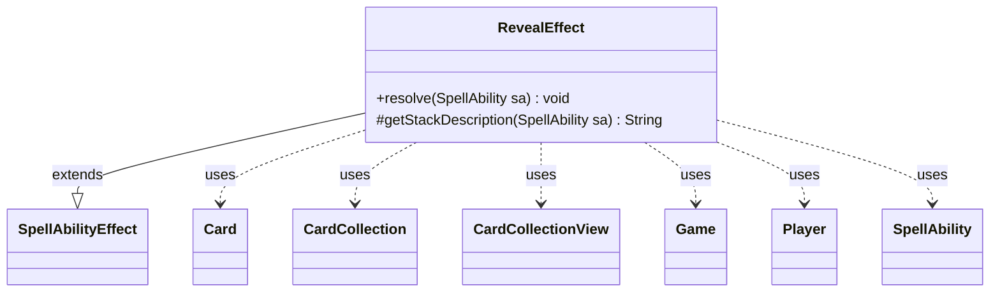

---
aliases:
  - RevealEffect
tags:
  - java/class
  - module/forge-game
  - pkg/forge/game/ability/effects
fqn: forge.game.ability.effects.RevealEffect
package: forge.game.ability.effects
module: forge-game
kind: Class
---

# RevealEffect

**Package:** `forge.game.ability.effects` &nbsp; **Module:** `forge-game` &nbsp; **Kind:** Class



## Relationships
**Extends:**
- [[forge.game.ability.SpellAbilityEffect|SpellAbilityEffect]]
**Uses:**
- [[forge.game.Game|Game]]
- [[forge.game.card.Card|Card]]
- [[forge.game.card.CardCollection|CardCollection]]
- [[forge.game.card.CardCollectionView|CardCollectionView]]
- [[forge.game.player.Player|Player]]
- [[forge.game.spellability.SpellAbility|SpellAbility]]


## Design Description

RevealEffect implements the resolution logic for "reveal cards from hand" abilities within Forge's data-driven ability framework. Extending `SpellAbilityEffect`, it overrides `resolve` to perform the reveal and `getStackDescription` to generate human-readable stack text. For each targeted `Player`, it selects cards from hand—at random, from defined or valid-card filters, or via interactive controller choice—governed by string parameters like `NumCards`, `AnyNumber`, `Optional`, `Random`, and `RevealValid`.

The design embodies the engine's parameter-driven convention: a single effect class serves many card scripts, configured entirely through the `SpellAbility`'s parameters rather than subclassing. It collaborates with `Game` to delegate the actual reveal through the game action, uses `CardCollection`/`CardCollectionView` to gather candidate cards, leans on `AbilityUtils`, `CardLists`, and `Aggregates` for filtering and selection, and can optionally remember revealed cards on the host for later reference.

## Source
`forge-game/src/main/java/forge/game/ability/effects/RevealEffect.java`

```java
package forge.game.ability.effects;

import java.util.List;

import org.apache.commons.lang3.StringUtils;

import forge.game.Game;
import forge.game.ability.AbilityUtils;
import forge.game.ability.SpellAbilityEffect;
import forge.game.card.Card;
import forge.game.card.CardCollection;
import forge.game.card.CardCollectionView;
import forge.game.card.CardLists;
import forge.game.player.Player;
import forge.game.spellability.SpellAbility;
import forge.game.zone.ZoneType;
import forge.util.Aggregates;
import forge.util.Lang;

public class RevealEffect extends SpellAbilityEffect {

    @Override
    public void resolve(SpellAbility sa) {
        final Card host = sa.getHostCard();
        final Game game = host.getGame();
        final boolean anyNumber = sa.hasParam("AnyNumber");
        final boolean optional = sa.hasParam("Optional");
        int cnt = sa.hasParam("NumCards") ? AbilityUtils.calculateAmount(host, sa.getParam("NumCards"), sa) : 1;

        for (final Player p : getTargetPlayers(sa)) {
            if (!p.isInGame()) {
                continue;
            }
            final CardCollectionView cardsInHand = p.getCardsIn(ZoneType.Hand);
            if (cardsInHand.isEmpty()) {
                continue;
            }
            final CardCollection revealed = new CardCollection();
            if (sa.hasParam("Random")) {
                CardCollection valid = new CardCollection(cardsInHand);

                if (sa.hasParam("RevealValid")) {
                    valid = CardLists.getValidCards(valid, sa.getParam("RevealValid"), p, host, sa);
                }

                if (valid.isEmpty())
                    continue;

                final int revealnum = Math.min(valid.size(), cnt);
                revealed.addAll(Aggregates.random(valid, revealnum));
            } else if (sa.hasParam("RevealDefined")) {
                revealed.addAll(AbilityUtils.getDefinedCards(host, sa.getParam("RevealDefined"), sa));
            } else if (sa.hasParam("RevealAllValid")) {
                revealed.addAll(CardLists.getValidCards(cardsInHand, sa.getParam("RevealAllValid"), p, host, sa));
            } else {
                CardCollection valid = new CardCollection(cardsInHand);

                if (sa.hasParam("RevealValid")) {
                    valid = CardLists.getValidCards(valid, sa.getParam("RevealValid"), p, host, sa);
                }

                if (valid.isEmpty())
                    continue;

                if (cnt > valid.size())
                    cnt = valid.size();

                int min = cnt;
                if (anyNumber) {
                    cnt = valid.size();
                    min = 0;
                } else if (optional) {
                    min = 0;
                }

                revealed.addAll(p.getController().chooseCardsToRevealFromHand(min, cnt, valid));
            }

            if (sa.hasParam("RevealToAll") || sa.hasParam("Random")) {
                boolean revealTitle = sa.hasParam("RevealTitle");
                game.getAction().reveal(revealed, p, false, 
                    revealTitle ? sa.getParam("RevealTitle") : "", !revealTitle);
            } else {
                game.getAction().reveal(revealed, p);
            }
            if (sa.hasParam("RememberRevealed")) {
                host.addRemembered(revealed);
            }
        }
    }

    @Override
    protected String getStackDescription(SpellAbility sa) {
        final StringBuilder sb = new StringBuilder();

        final List<Player> tgtPlayers = getTargetPlayers(sa);

        if (tgtPlayers.size() > 0) {
            sb.append(Lang.joinHomogenous(tgtPlayers)).append(" reveals ");
            if (sa.hasParam("AnyNumber")) {
                sb.append("any number of cards ");
            } else if (sa.hasParam("NumCards")) {
                int numCards = sa.getHostCard() != null ?
                        AbilityUtils.calculateAmount(sa.getHostCard(), "NumCards", sa)
                        : StringUtils.isNumeric(sa.getParam("NumCards")) ? Integer.parseInt(sa.getParam("NumCards")) : 0;
                sb.append(numCards > 1 ? numCards + " cards " : "a card ");
            } else {
                sb.append("a card ");
            }
            if (sa.hasParam("Random")) {
                sb.append("at random ");
            }
            sb.append("from their hand.");
        } else {
            sb.append("Error - no target players for RevealHand. ");
        }

        return sb.toString();
    }

}
```
