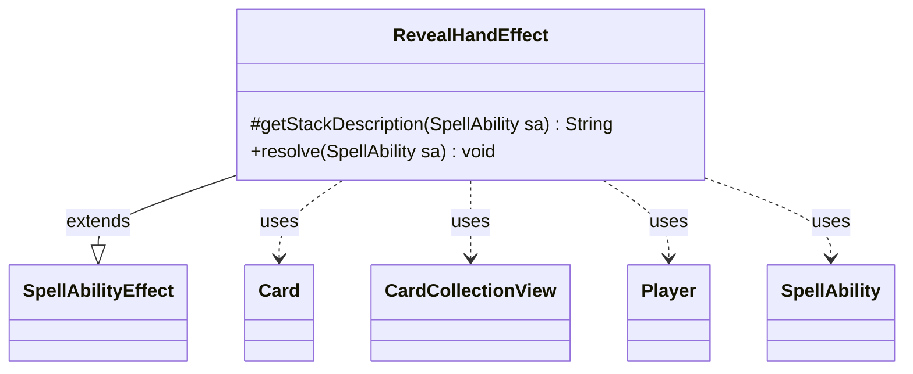

---
aliases:
  - RevealHandEffect
tags:
  - java/class
  - module/forge-game
  - pkg/forge/game/ability/effects
fqn: forge.game.ability.effects.RevealHandEffect
package: forge.game.ability.effects
module: forge-game
kind: Class
---

# RevealHandEffect

**Package:** `forge.game.ability.effects`   **Module:** `forge-game`   **Kind:** Class



## Relationships
**Extends:**
- [[forge.game.ability.SpellAbilityEffect|SpellAbilityEffect]]
**Uses:**
- [[forge.game.card.Card|Card]]
- [[forge.game.card.CardCollectionView|CardCollectionView]]
- [[forge.game.player.Player|Player]]
- [[forge.game.spellability.SpellAbility|SpellAbility]]


## Design Description

RevealHandEffect realizes the resolution logic for "reveal hand" abilities, extending `SpellAbilityEffect` so it plugs into Forge's data-driven ability framework where each effect class is instantiated and resolved by the engine. It overrides `getStackDescription` to build localized, grammatically-correct stack text—distinguishing a private "look" from a public "reveal" and singular from plural targets—and `resolve` to perform the action.

In `resolve` it walks each target `Player`, skipping those no longer in the game and honoring an optional confirmation prompt. It reads the player's hand as a `CardCollectionView`, optionally narrowing it by `RevealType`, then either privately shows it to the activating player (`Look`) or reveals it publicly via the game action. The effect is entirely parameter-driven through the `SpellAbility`: flags such as `RememberRevealed`, `ImprintRevealed`, and `RememberRevealedPlayer` record results on the host `Card`, letting one reusable class back many card definitions and chain into downstream effects.

## Source
`forge-game/src/main/java/forge/game/ability/effects/RevealHandEffect.java`

```java
package forge.game.ability.effects;

import java.util.List;

import forge.game.ability.SpellAbilityEffect;
import forge.game.card.*;
import forge.game.player.Player;
import forge.game.spellability.SpellAbility;
import forge.game.zone.ZoneType;
import forge.util.Lang;
import forge.util.Localizer;

public class RevealHandEffect extends SpellAbilityEffect {

    @Override
    protected String getStackDescription(SpellAbility sa) {
        final StringBuilder sb = new StringBuilder();

        final List<Player> tgtPlayers = getTargetPlayers(sa);
        final int numTgts = tgtPlayers.size();

        if (numTgts <= 0) {
            sb.append("Error - no target players for RevealHand.");
        } else if (sa.hasParam("Look")) {
            sb.append(sa.getActivatingPlayer()).append(" looks at ").append(Lang.joinHomogenous(tgtPlayers));
            sb.append("'s ").append(numTgts == 1 ? "hand." :  "hands.");
        } else {
            sb.append(Lang.joinHomogenous(tgtPlayers)).append(numTgts == 1 ? " reveals" :  " reveal");
            sb.append(" their ").append(numTgts == 1 ? "hand." :  "hands.");
        }

        return sb.toString();
    }

    @Override
    public void resolve(SpellAbility sa) {
        final Card host = sa.getHostCard();
        final boolean optional = sa.hasParam("Optional");

        for (final Player p : getTargetPlayers(sa)) {
            if (!p.isInGame()) {
                continue;
            }
            if (optional && !p.getController().confirmAction(sa, null, Localizer.getInstance().getMessage("lblDoYouWantRevealYourHand"), null)) {
                continue;
            }
            CardCollectionView hand = p.getCardsIn(ZoneType.Hand);
            if (sa.hasParam("RevealType")) {
                hand = CardLists.getType(hand, sa.getParam("RevealType"));
            }
            if (sa.hasParam("Look")) {
                sa.getActivatingPlayer().getController().reveal(hand, ZoneType.Hand, p);
            } else {
                host.getGame().getAction().reveal(hand, p);
            }
            if (sa.hasParam("RememberRevealed")) {
                host.addRemembered(hand);
            }
            if (sa.hasParam("ImprintRevealed")) {
                host.addImprintedCards(hand);
            }
            if (sa.hasParam("RememberRevealedPlayer")) {
                host.addRemembered(p);
            }
        }
    }
}
```

## Python
`forge/game/ability/effects/RevealHandEffect.py`

```python
from forge.game.ability.SpellAbilityEffect import SpellAbilityEffect
from forge.game.card.Card import Card
from forge.game.card.CardCollectionView import CardCollectionView
from forge.game.card.CardLists import CardLists
from forge.game.player.Player import Player
from forge.game.spellability.SpellAbility import SpellAbility
from forge.game.zone.ZoneType import ZoneType
from forge.util.Lang import Lang
from forge.util.Localizer import Localizer


class RevealHandEffect(SpellAbilityEffect):

    def getStackDescription(self, sa: SpellAbility) -> str:
        sb = []

        tgtPlayers = self.getTargetPlayers(sa)
        numTgts = len(tgtPlayers)

        if numTgts <= 0:
            sb.append("Error - no target players for RevealHand.")
        elif sa.hasParam("Look"):
            sb.append(str(sa.getActivatingPlayer()))
            sb.append(" looks at ")
            sb.append(Lang.joinHomogenous(tgtPlayers))
            sb.append("'s ")
            sb.append("hand." if numTgts == 1 else "hands.")
        else:
            sb.append(Lang.joinHomogenous(tgtPlayers))
            sb.append(" reveals" if numTgts == 1 else " reveal")
            sb.append(" their ")
            sb.append("hand." if numTgts == 1 else "hands.")

        return "".join(sb)

    def resolve(self, sa: SpellAbility) -> None:
        host = sa.getHostCard()
        optional = sa.hasParam("Optional")

        for p in self.getTargetPlayers(sa):
            if not p.isInGame():
                continue
            if optional and not p.getController().confirmAction(sa, None, Localizer.getInstance().getMessage("lblDoYouWantRevealYourHand"), None):
                continue
            hand = p.getCardsIn(ZoneType.Hand)
            if sa.hasParam("RevealType"):
                hand = CardLists.getType(hand, sa.getParam("RevealType"))
            if sa.hasParam("Look"):
                sa.getActivatingPlayer().getController().reveal(hand, ZoneType.Hand, p)
            else:
                host.getGame().getAction().reveal(hand, p)
            if sa.hasParam("RememberRevealed"):
                host.addRemembered(hand)
            if sa.hasParam("ImprintRevealed"):
                host.addImprintedCards(hand)
            if sa.hasParam("RememberRevealedPlayer"):
                host.addRemembered(p)
```
