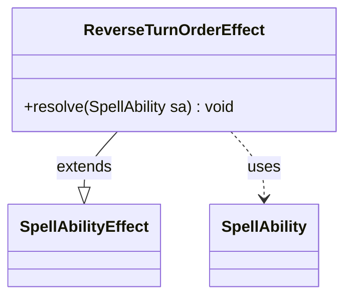

---
aliases:
  - ReverseTurnOrderEffect
tags:
  - java/class
  - module/forge-game
  - pkg/forge/game/ability/effects
fqn: forge.game.ability.effects.ReverseTurnOrderEffect
package: forge.game.ability.effects
module: forge-game
kind: Class
---

# ReverseTurnOrderEffect

**Package:** `forge.game.ability.effects`   **Module:** `forge-game`   **Kind:** Class



## Relationships
**Extends:**
- [[forge.game.ability.SpellAbilityEffect|SpellAbilityEffect]]
**Uses:**
- [[forge.game.spellability.SpellAbility|SpellAbility]]


## Design Description

ReverseTurnOrderEffect implements the resolution behavior for an ability that flips the order in which players take their turns. As a concrete subclass of `SpellAbilityEffect`, it overrides only `resolve(SpellAbility)`, conforming to the framework's template for one-shot effects while contributing no setup or stack-description logic of its own.

Its responsibility is deliberately minimal: it navigates from the resolving `SpellAbility` to its host card and the owning `Game`, then delegates entirely to `Game.reverseTurnOrder()`. This keeps turn-sequencing state on the central game object rather than in the effect, so the class acts as a thin adapter that translates a spell or ability's resolution into a single game-level state change—reflecting the engine's data-driven design where each effect is a small, focused unit dispatched by the ability factory.

## Source
`forge-game/src/main/java/forge/game/ability/effects/ReverseTurnOrderEffect.java`

```java
package forge.game.ability.effects;

import forge.game.ability.SpellAbilityEffect;
import forge.game.spellability.SpellAbility;

public class ReverseTurnOrderEffect extends SpellAbilityEffect {

    /* (non-Javadoc)
     * @see forge.card.abilityfactory.SpellEffect#resolve(java.util.Map, forge.card.spellability.SpellAbility)
     */
    @Override
    public void resolve(final SpellAbility sa) {
        sa.getHostCard().getGame().reverseTurnOrder();
    }

}
```

## Python
`forge/game/ability/effects/ReverseTurnOrderEffect.py`

```python
package = None
from forge.game.ability.SpellAbilityEffect import SpellAbilityEffect
from forge.game.spellability.SpellAbility import SpellAbility


class ReverseTurnOrderEffect(SpellAbilityEffect):

    # (non-Javadoc)
    # @see forge.card.abilityfactory.SpellEffect#resolve(java.util.Map, forge.card.spellability.SpellAbility)
    def resolve(self, sa: SpellAbility) -> None:
        sa.getHostCard().getGame().reverseTurnOrder()
```
