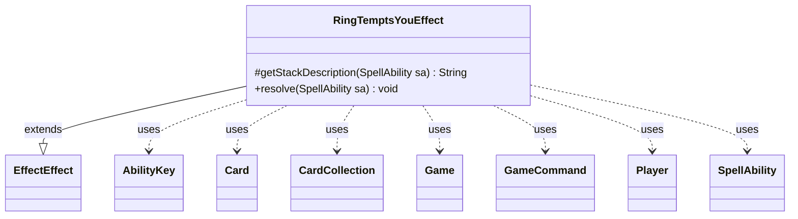

---
aliases:
  - RingTemptsYouEffect
tags:
  - java/class
  - module/forge-game
  - pkg/forge/game/ability/effects
fqn: forge.game.ability.effects.RingTemptsYouEffect
package: forge.game.ability.effects
module: forge-game
kind: Class
---

# RingTemptsYouEffect

**Package:** `forge.game.ability.effects`   **Module:** `forge-game`   **Kind:** Class



## Relationships
**Extends:**
- [[forge.game.ability.effects.EffectEffect|EffectEffect]]
**Uses:**
- [[forge.GameCommand|GameCommand]]
- [[forge.game.Game|Game]]
- [[forge.game.ability.AbilityKey|AbilityKey]]
- [[forge.game.card.Card|Card]]
- [[forge.game.card.CardCollection|CardCollection]]
- [[forge.game.player.Player|Player]]
- [[forge.game.spellability.SpellAbility|SpellAbility]]


## Design Description

RingTemptsYouEffect implements the resolution behavior for Magic's "The Ring tempts you" mechanic as a single one-shot effect. As a concrete subclass of EffectEffect, it overrides `getStackDescription` to provide a localized stack message and `resolve` to apply the actual game-state changes when the ability resolves.

During resolution it creates the activating Player's Ring emblem, increments and applies the Ring-temptation level, and asks the player's controller to choose a Ring-bearer from creatures in play. To honor rule 701.52a, it attaches a `GameCommand`—triggered on both control change and leaving play—to the chosen Card so its Ring-bearer status is cleared automatically. It then builds an `AbilityKey` parameter map and fires the `RingTemptsYou` trigger via the Game's trigger handler, reflecting the engine's command-and-trigger pattern for deferred cleanup and reactive abilities.

## Source
`forge-game/src/main/java/forge/game/ability/effects/RingTemptsYouEffect.java`

```java
package forge.game.ability.effects;

import forge.GameCommand;
import forge.game.Game;
import forge.game.ability.AbilityKey;
import forge.game.card.Card;
import forge.game.card.CardCollection;
import forge.game.player.Player;
import forge.game.spellability.SpellAbility;
import forge.game.trigger.TriggerType;
import forge.util.Localizer;

import java.util.Map;

public class RingTemptsYouEffect extends EffectEffect {

    @Override
    protected String getStackDescription(SpellAbility sa) {
        return Localizer.getInstance().getMessage("lblTheRingTempts", sa.getActivatingPlayer());
    }

    @Override
    public void resolve(SpellAbility sa) {
        Player p = sa.getActivatingPlayer();
        Game game = p.getGame();

        p.createTheRing(sa.getOriginalHost().getSetCode());

        //increment ring tempted you for property
        p.incrementRingTemptedYou();
        p.setRingLevel(p.getNumRingTemptedYou());

        // Then choose a ring-bearer (You may keep the same one). Auto pick if <2 choices.
        CardCollection creatures = p.getCreaturesInPlay();
        Card ringBearer = p.getController().chooseSingleEntityForEffect(creatures, sa, Localizer.getInstance().getMessage("lblChooseRingBearer"), false, null);
        p.setRingBearer(ringBearer);

        // 701.52a That creature becomes your Ring-bearer until another player gains control of it.
        if (ringBearer != null) {
            GameCommand loseCommand = new GameCommand() {
                private static final long serialVersionUID = 1L;
                @Override
                public void run() {
                    if (ringBearer.isRingBearer()) {
                        p.clearRingBearer();
                    }
                }
            };
            ringBearer.addChangeControllerCommand(loseCommand);
            ringBearer.addLeavesPlayCommand(loseCommand);
        }

        final Map<AbilityKey, Object> runParams = AbilityKey.mapFromPlayer(p);
        runParams.put(AbilityKey.Card, ringBearer);
        game.getTriggerHandler().runTrigger(TriggerType.RingTemptsYou, runParams, false);
    }
}
```

## Python
`forge/game/ability/effects/RingTemptsYouEffect.py`

```python
from forge.GameCommand import GameCommand
from forge.game.Game import Game
from forge.game.ability.AbilityKey import AbilityKey
from forge.game.card.Card import Card
from forge.game.card.CardCollection import CardCollection
from forge.game.player.Player import Player
from forge.game.spellability.SpellAbility import SpellAbility
from forge.game.trigger.TriggerType import TriggerType
from forge.util.Localizer import Localizer

from forge.game.ability.effects.EffectEffect import EffectEffect


class RingTemptsYouEffect(EffectEffect):

    def getStackDescription(self, sa: SpellAbility) -> str:
        return Localizer.getInstance().getMessage("lblTheRingTempts", sa.getActivatingPlayer())

    def resolve(self, sa: SpellAbility) -> None:
        p = sa.getActivatingPlayer()
        game = p.getGame()

        p.createTheRing(sa.getOriginalHost().getSetCode())

        # increment ring tempted you for property
        p.incrementRingTemptedYou()
        p.setRingLevel(p.getNumRingTemptedYou())

        # Then choose a ring-bearer (You may keep the same one). Auto pick if <2 choices.
        creatures = p.getCreaturesInPlay()
        ringBearer = p.getController().chooseSingleEntityForEffect(creatures, sa, Localizer.getInstance().getMessage("lblChooseRingBearer"), False, None)
        p.setRingBearer(ringBearer)

        # 701.52a That creature becomes your Ring-bearer until another player gains control of it.
        if ringBearer is not None:
            class LoseCommand(GameCommand):
                serialVersionUID = 1

                def run(self):
                    if ringBearer.isRingBearer():
                        p.clearRingBearer()

            loseCommand = LoseCommand()
            ringBearer.addChangeControllerCommand(loseCommand)
            ringBearer.addLeavesPlayCommand(loseCommand)

        runParams = AbilityKey.mapFromPlayer(p)
        runParams[AbilityKey.Card] = ringBearer
        game.getTriggerHandler().runTrigger(TriggerType.RingTemptsYou, runParams, False)
```
