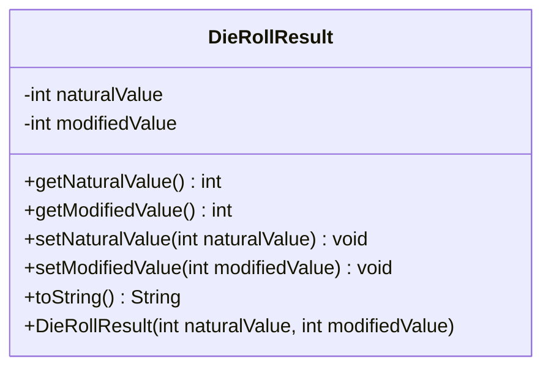

---
aliases:
  - DieRollResult
tags:
  - java/class
  - module/forge-game
  - pkg/forge/game/ability/effects
fqn: forge.game.ability.effects.RollDiceEffect.DieRollResult
package: forge.game.ability.effects
module: forge-game
kind: Class
---

# DieRollResult

**Package:** `forge.game.ability.effects`   **Module:** `forge-game`   **Kind:** Class



## Design Description

DieRollResult is a lightweight, mutable value holder nested within RollDiceEffect, representing the outcome of a single die roll as two distinct quantities: the natural value as physically rolled and the modified value after game effects are applied. It exposes a constructor that initializes both fields plus conventional getters and setters for each, allowing the surrounding roll-resolution logic to adjust the modified result while preserving the original natural reading. The overridden toString returns only the modified value's string form, reflecting the design intent that the post-modification number is the one normally presented to players or downstream display code. As a simple static data structure with no behavior beyond accessors, it cleanly separates the bookkeeping of dice outcomes from the effect logic in its enclosing class.

## Source
`forge-game/src/main/java/forge/game/ability/effects/RollDiceEffect.java` — declaration excerpt

```java
    public static class DieRollResult {
        private int naturalValue;
        private int modifiedValue;

        public DieRollResult(int naturalValue, int modifiedValue) {
            this.naturalValue = naturalValue;
            this.modifiedValue = modifiedValue;
        }

        public int getNaturalValue() {
            return naturalValue;
        }
        public int getModifiedValue() {
            return modifiedValue;
        }

        public void setNaturalValue(int naturalValue) {
            this.naturalValue = naturalValue;
        }
        public void setModifiedValue(int modifiedValue) {
            this.modifiedValue = modifiedValue;
        }

        @Override
        public String toString() {
            return String.valueOf(modifiedValue);
        }
    }
```

## Python
`forge/game/ability/effects/RollDiceEffect/DieRollResult.py`

```python
from forge.game.ability.effects.RollDiceEffect import RollDiceEffect


class DieRollResult:
    def __init__(self, naturalValue: int, modifiedValue: int):
        self.naturalValue = naturalValue
        self.modifiedValue = modifiedValue

    def getNaturalValue(self) -> int:
        return self.naturalValue

    def getModifiedValue(self) -> int:
        return self.modifiedValue

    def setNaturalValue(self, naturalValue: int) -> None:
        self.naturalValue = naturalValue

    def setModifiedValue(self, modifiedValue: int) -> None:
        self.modifiedValue = modifiedValue

    def __str__(self) -> str:
        return str(self.modifiedValue)
```
