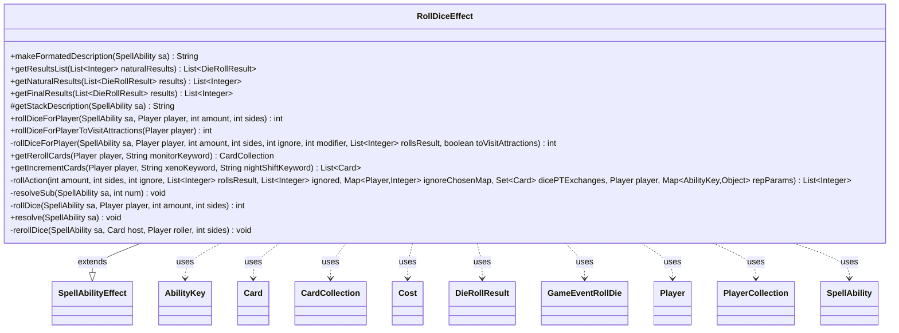

---
aliases:
  - RollDiceEffect
tags:
  - java/class
  - module/forge-game
  - pkg/forge/game/ability/effects
fqn: forge.game.ability.effects.RollDiceEffect
package: forge.game.ability.effects
module: forge-game
kind: Class
---

# RollDiceEffect

**Package:** `forge.game.ability.effects` &nbsp; **Module:** `forge-game` &nbsp; **Kind:** Class



## Relationships
**Extends:**
- [[forge.game.ability.SpellAbilityEffect|SpellAbilityEffect]]
**Uses:**
- [[forge.game.ability.AbilityKey|AbilityKey]]
- [[forge.game.ability.effects.RollDiceEffect.DieRollResult|DieRollResult]]
- [[forge.game.card.Card|Card]]
- [[forge.game.card.CardCollection|CardCollection]]
- [[forge.game.cost.Cost|Cost]]
- [[forge.game.event.GameEventRollDie|GameEventRollDie]]
- [[forge.game.player.Player|Player]]
- [[forge.game.player.PlayerCollection|PlayerCollection]]
- [[forge.game.spellability.SpellAbility|SpellAbility]]

## Design Description

RollDiceEffect implements the resolution logic for "roll dice" spell abilities, the concrete `SpellAbilityEffect` subclass that Forge invokes when a card instructs a player to roll dice. It overrides `resolve` to roll the configured amount and number of sides for each targeted `Player`, and overrides `getStackDescription` to render the action for the stack. Beyond the raw roll it drives the full Magic rules pipeline: applying `RollDice` replacement effects, honoring ignore/modifier and highest-roll parameters, and interactively offering reroll, increment, and Vedalken-style power/toughness swap choices through each player's `PlayerController`. Outcomes are tracked as `DieRollResult` natural-versus-modified pairs so `RolledDie`/`RolledDieOnce` triggers and even/odd, distinct, and max-roll SVars can be populated.

The design exposes static utility methods (e.g. `rollDiceForPlayerToVisitAttractions`) so dice rolling is reusable outside ability resolution, and keeps card-specific behavior data-driven through keyword and SVar lookups rather than hard-coded references. It collaborates with `AbilityKey`-keyed parameter maps, `CardCollection`, `Cost`, and `GameEventRollDie` to integrate with Forge's replacement, trigger, and event subsystems.

## Source
`forge-game/src/main/java/forge/game/ability/effects/RollDiceEffect.java`

```java
package forge.game.ability.effects;

import com.google.common.collect.Lists;
import com.google.common.collect.Maps;
import forge.game.ability.AbilityKey;
import forge.game.ability.AbilityUtils;
import forge.game.ability.SpellAbilityEffect;
import forge.game.card.*;
import forge.game.cost.Cost;
import forge.game.event.GameEventRollDie;
import forge.game.player.Player;
import forge.game.player.PlayerCollection;
import forge.game.player.PlayerController;
import forge.game.replacement.ReplacementType;
import forge.game.spellability.SpellAbility;
import forge.game.trigger.TriggerType;
import forge.game.zone.ZoneType;
import forge.util.Lang;
import forge.util.Localizer;
import forge.util.MyRandom;
import org.apache.commons.lang3.StringUtils;

import java.util.*;

public class RollDiceEffect extends SpellAbilityEffect {

    public static String makeFormatedDescription(SpellAbility sa) {
        StringBuilder sb = new StringBuilder();
        final String key = "ResultSubAbilities";
        if (sa.hasParam(key)) {
            String [] diceAbilities = sa.getParam(key).split(",");
            for (String ab : diceAbilities) {
                String [] kv = ab.split(":");
                String desc = sa.getAdditionalAbility(kv[0]).getDescription();
                if (!desc.isEmpty()) {
                    sb.append("\n").append(desc);
                }
            }
        }

        return sb.toString();
    }

    public static class DieRollResult {
        private int naturalValue;
        private int modifiedValue;

        public DieRollResult(int naturalValue, int modifiedValue) {
            this.naturalValue = naturalValue;
            this.modifiedValue = modifiedValue;
        }

        public int getNaturalValue() {
            return naturalValue;
        }
        public int getModifiedValue() {
            return modifiedValue;
        }

        public void setNaturalValue(int naturalValue) {
            this.naturalValue = naturalValue;
        }
        public void setModifiedValue(int modifiedValue) {
            this.modifiedValue = modifiedValue;
        }

        @Override
        public String toString() {
            return String.valueOf(modifiedValue);
        }
    }

    public static List<DieRollResult> getResultsList(List<Integer> naturalResults) {
        List<DieRollResult> results = new ArrayList<>();
        for (int r : naturalResults) {
            results.add(new DieRollResult(r, r));
        }
        return results;
    }

    public static List<Integer> getNaturalResults(List<DieRollResult> results) {
        List<Integer> naturalResults = new ArrayList<>();
        for (DieRollResult r : results) {
            naturalResults.add(r.getNaturalValue());
        }
        return naturalResults;
    }

    public static List<Integer> getFinalResults(List<DieRollResult> results) {
        List<Integer> naturalResults = new ArrayList<>();
        for (DieRollResult r : results) {
            naturalResults.add(r.getModifiedValue());
        }
        return naturalResults;
    }

    /* (non-Javadoc)
     * @see forge.card.abilityfactory.SpellEffect#getStackDescription(java.util.Map, forge.card.spellability.SpellAbility)
     */
    @Override
    protected String getStackDescription(SpellAbility sa) {
        final PlayerCollection player = getTargetPlayers(sa);

        if(sa.hasParam("ToVisitYourAttractions")) {
            if (player.size() == 1 && player.get(0).equals(sa.getActivatingPlayer()))
                return "Roll to Visit Your Attractions.";
            else
                return String.format("%s %s to visit their Attractions.", Lang.joinHomogenous(player), Lang.joinVerb(player, "roll"));
        }

        StringBuilder stringBuilder = new StringBuilder();
        if (player.size() == 1 && player.get(0).equals(sa.getActivatingPlayer())) {
            stringBuilder.append("Roll ");
        } else {
            stringBuilder.append(player).append(" rolls ");
        }
        stringBuilder.append(sa.getParamOrDefault("Amount", "a")).append(" d");
        stringBuilder.append(sa.getParamOrDefault("Sides", "6"));
        if (sa.hasParam("IgnoreLower")) {
            stringBuilder.append(" and ignore the lower roll");
        }
        stringBuilder.append(".");
        return stringBuilder.toString();
    }

    public static int rollDiceForPlayer(SpellAbility sa, Player player, int amount, int sides) {
        boolean toVisitAttractions = sa != null && sa.hasParam("ToVisitYourAttractions");
        return rollDiceForPlayer(sa, player, amount, sides, 0, 0, null, toVisitAttractions);
    }
    public static int rollDiceForPlayerToVisitAttractions(Player player) {
        return rollDiceForPlayer(null, player, 1, 6, 0, 0, null, true);
    }
    private static int rollDiceForPlayer(SpellAbility sa, Player player, int amount, int sides, int ignore, int modifier, List<Integer> rollsResult, boolean toVisitAttractions) {
        if (amount == 0) {
            return 0;
        }

        Map<Player, Integer> ignoreChosenMap = Maps.newHashMap();
        Set<Card> dicePTExchanges = new HashSet<>();

        final Map<AbilityKey, Object> repParams = AbilityKey.mapFromAffected(player);
        List<Integer> ignored = new ArrayList<>();
        List<Integer> naturalRolls = rollAction(amount, sides, ignore, rollsResult, ignored, ignoreChosenMap, dicePTExchanges, player, repParams);

        if (sa != null && sa.hasParam("UseHighestRoll")) {
            naturalRolls.subList(0, naturalRolls.size() - 1).clear();
        }

        // Reroll Phase:
        String monitorKeyword = "Once each turn, you may pay {1} to reroll one or more dice you rolled.";
        CardCollection canRerollDice = getRerollCards(player, monitorKeyword);
        while (!canRerollDice.isEmpty()) {
            List<Integer> diceToReroll = player.getController().chooseDiceToReroll(naturalRolls);
            if (diceToReroll.isEmpty()) {break;}

            String message = Localizer.getInstance().getMessage("lblChooseRerollCard");
            Card c = player.getController().chooseSingleEntityForEffect(canRerollDice, sa, message, null);

            String[] parts = c.getSVar("ModsThisTurn").split("\\$");
            int activationsThisTurn = Integer.parseInt(parts[1]);
            SpellAbility modifierSA = c.getFirstSpellAbility();
            Cost cost = new Cost(c.getSVar("RollRerollCost"), false);
            boolean paid = player.getController().payCostDuringRoll(cost, modifierSA);
            if (paid) {
                for (Integer roll : diceToReroll) {
                    naturalRolls.remove(roll);
                }
                int amountToReroll = diceToReroll.size();
                List<Integer> rerolls = rollAction(amountToReroll, sides, 0, null, ignored, Maps.newHashMap(), dicePTExchanges, player, repParams);
                naturalRolls.addAll(rerolls);
                activationsThisTurn += 1;
                c.setSVar("ModsThisTurn", "Number$" + activationsThisTurn);
                canRerollDice.remove(c);
            }
        }

        // Modification Phase:
        List<DieRollResult> resultsList = new ArrayList<>();
        Integer rollToModify;
        String xenoKeyword = "After you roll a die, you may remove a +1/+1 counter from Xenosquirrels. If you do, increase or decrease the result by 1.";
        String nightShiftKeyword = "After you roll a die, you may pay 1 life. If you do, increase or decrease the result by 1. Do this only once each turn.";
        List<Card> canIncrementDice = getIncrementCards(player, xenoKeyword, nightShiftKeyword);
        boolean hasBeenModified = false;

        if (!canIncrementDice.isEmpty()) {
            do {
                rollToModify = player.getController().chooseRollToModify(naturalRolls);
                if (rollToModify == null) {break;}

                boolean modified = false;
                DieRollResult dieResult = new DieRollResult(rollToModify, rollToModify);
                // canIncrementThisRoll won't be empty the first iteration because canIncrementDice wasn't empty
                CardCollection canIncrementThisRoll = new CardCollection(canIncrementDice);
                Card c;
                do {
                    String message = Localizer.getInstance().getMessage("lblChooseRollIncrementCard", rollToModify);
                    c = player.getController().chooseSingleEntityForEffect(canIncrementThisRoll, sa, message, null);

                    String[] parts = c.getSVar("ModsThisTurn").split("\\$");
                    int activationsThisTurn = Integer.parseInt(parts[1]);
                    SpellAbility modifierSA = c.getFirstSpellAbility();
                    String costString = c.getSVar("RollModifyCost");
                    Cost cost = new Cost(costString, false);
                    boolean paid = player.getController().payCostDuringRoll(cost, modifierSA);
                    if (paid) {
                        message = Localizer.getInstance().getMessage("lblChooseRollIncrement", rollToModify);
                        boolean isPositive = player.getController().chooseBinary(sa, message, PlayerController.BinaryChoiceType.IncreaseOrDecrease);
                        int increment = isPositive ? 1 : -1;
                        if (!modified) {naturalRolls.remove(rollToModify); modified = true;}
                        rollToModify += increment;
                        activationsThisTurn += 1;
                        c.setSVar("ModsThisTurn", "Number$" + activationsThisTurn);
                        canIncrementThisRoll.remove(c);
                    }
                } while (!canIncrementThisRoll.isEmpty());
                if (modified) {
                    dieResult.setModifiedValue(rollToModify);
                    resultsList.add(dieResult);
                    hasBeenModified = true;
                }
                canIncrementDice = getIncrementCards(player, xenoKeyword, nightShiftKeyword);
            } while (!naturalRolls.isEmpty() && !canIncrementDice.isEmpty());
        }

        // finish roll list
        for (Integer unmodified : naturalRolls) {
            // Add all the unmodified rolls into the results
            resultsList.add(new DieRollResult(unmodified, unmodified));
        }

        // Vedalken Exchange
        CardCollection vedalkenSwaps = new CardCollection(dicePTExchanges);
        if (!vedalkenSwaps.isEmpty()) {
            DieRollResult rollToSwap;
            do {
                rollToSwap = player.getController().chooseRollToSwap(resultsList);
                if (rollToSwap == null) {break;}

                String message = Localizer.getInstance().getMessage("lblChooseCardToDiceSwap", rollToSwap.getModifiedValue());
                Card c = player.getController().chooseSingleEntityForEffect(vedalkenSwaps, sa, message, null);
                int cPower = c.getCurrentPower();
                int cToughness = c.getCurrentToughness();
                String labelPower = Localizer.getInstance().getMessage("lblPower");
                String labelToughness = Localizer.getInstance().getMessage("lblToughness");
                List<String> choices = Arrays.asList(labelPower, labelToughness);
                String powerOrToughness = player.getController().chooseRollSwapValue(choices, rollToSwap.getModifiedValue(), cPower, cToughness);
                if (powerOrToughness != null) {
                    int tempRollValue = rollToSwap.getModifiedValue();
                    if (powerOrToughness.equals(labelPower)) {
                        rollToSwap.setModifiedValue(cPower);
                        c.addNewPT(tempRollValue, cToughness, player.getGame().getNextTimestamp(), 0);
                    } else if (powerOrToughness.equals(labelToughness)) {
                        rollToSwap.setModifiedValue(cToughness);
                        c.addNewPT(cPower, tempRollValue, player.getGame().getNextTimestamp(), 0);
                    } else {
                        throw new IllegalStateException("Unexpected value: " + powerOrToughness);
                    }
                    vedalkenSwaps.remove(c);
                }
            } while (!vedalkenSwaps.isEmpty());
        }

        //Notify of results
        if (amount > 0) {
            StringBuilder sb = new StringBuilder();
            String rollResults = StringUtils.join(getFinalResults(resultsList), ", ");
            String resultMessage = toVisitAttractions ? "lblAttractionRollResult" : "lblPlayerRolledResult";
            sb.append(Localizer.getInstance().getMessage(resultMessage, player, rollResults));
            if (!ignored.isEmpty()) {
                sb.append("\r\n").append(Localizer.getInstance().getMessage("lblIgnoredRolls",
                        StringUtils.join(ignored, ", ")));
            }
            if (hasBeenModified) {
                sb.append("\r\n").append(Localizer.getInstance().getMessage("lblNaturalRolls",
                        StringUtils.join(getNaturalResults(resultsList), ", ")));
            }
            player.getGame().getAction().notifyOfValue(sa, player, sb.toString(), null);
            player.addDieRollThisTurn(getFinalResults(resultsList));
        }

        List<Integer> rolls = Lists.newArrayList();
        int oddResults = 0;
        int evenResults = 0;
        int differentResults = 0;
        int countMaxRolls = 0;
        for (DieRollResult i : resultsList) {
            int naturalRoll = i.getNaturalValue();
            final int modifiedRoll = i.getModifiedValue() + modifier;

            i.setModifiedValue(modifiedRoll);

            if (!rolls.contains(modifiedRoll)) {
                differentResults++;
            }
            rolls.add(modifiedRoll);
            if (modifiedRoll % 2 == 0) {
                evenResults++;
            } else {
                oddResults++;
            }
            if (naturalRoll == sides) {
                countMaxRolls++;
            }
        }
        if (sa != null) {
            if (sa.hasParam("EvenOddResults")) {
                sa.setSVar("EvenResults", Integer.toString(evenResults));
                sa.setSVar("OddResults", Integer.toString(oddResults));
            }
            if (sa.hasParam("DifferentResults")) {
                sa.setSVar("DifferentResults", Integer.toString(differentResults));
            }
            if (sa.hasParam("MaxRollsResults")) {
                sa.setSVar("MaxRolls", Integer.toString(countMaxRolls));
            }
        }

        int rollNum = 1;
        for (DieRollResult roll : resultsList) {
            final Map<AbilityKey, Object> runParams = AbilityKey.mapFromPlayer(player);
            runParams.put(AbilityKey.Sides, sides);
            runParams.put(AbilityKey.Result, roll.getModifiedValue());
            runParams.put(AbilityKey.NaturalResult, roll.getNaturalValue());
            runParams.put(AbilityKey.RolledToVisitAttractions, toVisitAttractions);
            runParams.put(AbilityKey.Number, player.getNumRollsThisTurn() - amount + rollNum);
            player.getGame().getTriggerHandler().runTrigger(TriggerType.RolledDie, runParams, false);
            rollNum++;
        }
        final Map<AbilityKey, Object> runParams = AbilityKey.mapFromPlayer(player);
        runParams.put(AbilityKey.Sides, sides);
        runParams.put(AbilityKey.Result, getFinalResults(resultsList));
        runParams.put(AbilityKey.RolledToVisitAttractions, toVisitAttractions);
        player.getGame().getTriggerHandler().runTrigger(TriggerType.RolledDieOnce, runParams, false);

        return getFinalResults(resultsList).stream().reduce(0, Integer::sum);
    }

    /**
     * Gets a list of cards that can reroll dice roll results for a given player.
     * This is currently only Monitor Monitor
     *
     * @param player            The player whose battlefield is being checked for cards that can modify dice rolls
     * @param monitorKeyword       The keyword text identifying Monitor Monitor cards
     * @return A list of cards that are currently able to reroll dice
     */
    public static CardCollection getRerollCards(Player player, String monitorKeyword) {
        CardCollection monitors = CardLists.getKeyword(player.getCardsIn(ZoneType.Battlefield), monitorKeyword);
        return monitors.filter(card -> {
            String activationLimit = card.getSVar("RollModificationsLimit");
            String[] parts = card.getSVar("ModsThisTurn").split("\\$");
            int activationsThisTurn = Integer.parseInt(parts[1]);
            return (activationLimit.equals("None") || activationsThisTurn < Integer.parseInt(activationLimit));
        });
    }

    /**
     * Gets a list of cards that can modify dice roll results for a given player.
     * This includes both Xenosquirrels (which can remove +1/+1 counters to modify rolls)
     * and Night Shift cards (which can pay life to modify rolls once per turn).
     *
     * @param player            The player whose battlefield is being checked for cards that can modify dice rolls
     * @param xenoKeyword       The keyword text identifying Xenosquirrel cards
     * @param nightShiftKeyword The keyword text identifying Night Shift cards
     * @return A list of cards that are currently able to modify dice roll results
     */
    public static List<Card> getIncrementCards(Player player, String xenoKeyword, String nightShiftKeyword) {
        CardCollection xenosquirrels = CardLists.getKeyword(player.getCardsIn(ZoneType.Battlefield), xenoKeyword);
        CardCollection nightShifts = CardLists.getKeyword(player.getCardsIn(ZoneType.Battlefield), nightShiftKeyword);
        List<Card> canIncrementDice = new ArrayList<>();
        for (Card c : xenosquirrels) {
            // Xenosquirrels must have a P1P1 counter on it to remove in order to modify
            Integer P1P1Counters = c.getCounters().get(CounterEnumType.P1P1);
            if (P1P1Counters != null && P1P1Counters > 0 && c.canRemoveCounters(CounterEnumType.P1P1)) {
                canIncrementDice.add(c);
            }
        }
        for (Card c : nightShifts) {
            // Night Shift of the Living Dead has a limit of once per turn, player must be able to pay the 1 life cost
            String activationLimit = c.getSVar("RollModificationsLimit");
            String[] parts = c.getSVar("ModsThisTurn").split("\\$");
            int activationsThisTurn = Integer.parseInt(parts[1]);
            if ((activationLimit.equals("None") || activationsThisTurn < Integer.parseInt(activationLimit)) && player.canPayLife(1, true, c.getFirstSpellAbility())) {
                canIncrementDice.add(c);
            }
        }
        return canIncrementDice;
    }

    /**
     * Performs the dice rolling action with support for replacements, ignoring rolls, and tracking results.
     *
     * @param amount          number of dice to roll
     * @param sides           number of sides on each die
     * @param ignore          number of lowest rolls to automatically ignore
     * @param rollsResult     optional list to store roll results, if null a new list will be created
     * @param ignored         list to store ignored roll results
     * @param ignoreChosenMap mapping of players to number of rolls they can choose to ignore
     * @param player          the player performing the roll
     * @param repParams       replacement effect parameters
     * @return list of final roll results after applying ignores and replacements, sorted in ascending order
     */
    @SuppressWarnings("unchecked")
    private static List<Integer> rollAction(int amount, int sides, int ignore, List<Integer> rollsResult, List<Integer> ignored, Map<Player, Integer> ignoreChosenMap, Set<Card> dicePTExchanges, Player player, Map<AbilityKey, Object> repParams) {
        repParams.put(AbilityKey.Sides, sides);
        repParams.put(AbilityKey.Number, amount);
        repParams.put(AbilityKey.Ignore, ignore);
        repParams.put(AbilityKey.DicePTExchanges, dicePTExchanges);
        repParams.put(AbilityKey.IgnoreChosen, ignoreChosenMap);
        switch (player.getGame().getReplacementHandler().run(ReplacementType.RollDice, repParams)) {
            case NotReplaced:
                break;
            case Updated: {
                amount = (int) repParams.get(AbilityKey.Number);
                ignore = (int) repParams.get(AbilityKey.Ignore);
                //noinspection unchecked
                ignoreChosenMap = (Map<Player, Integer>) repParams.get(AbilityKey.IgnoreChosen);
                break;
            }
            default:
                break;
        }

        List<Integer> naturalRolls = (rollsResult == null ? new ArrayList<>() : rollsResult);

        for (int i = 0; i < amount; i++) {
            int roll = MyRandom.getRandom().nextInt(sides) + 1;
            // Play the die roll sound
            player.getGame().fireEvent(new GameEventRollDie());
            player.roll();
            naturalRolls.add(roll);
        }

        naturalRolls.sort(null);

        // Ignore lowest rolls
        if (ignore > 0) {
            for (int i = ignore - 1; i >= 0; --i) {
                ignored.add(naturalRolls.get(i));
                naturalRolls.remove(i);
            }
        }
        // Player chooses to ignore rolls
        for (Player chooser : ignoreChosenMap.keySet()) {
            for (int ig = 0; ig < ignoreChosenMap.get(chooser); ig++) {
                Integer ign = chooser.getController().chooseRollToIgnore(naturalRolls);
                ignored.add(ign);
                naturalRolls.remove(ign);
            }
        }

        return naturalRolls;
    }

    private static void resolveSub(SpellAbility sa, int num) {
        Map<String, SpellAbility> diceAbilities = sa.getAdditionalAbilities();
        SpellAbility resultAbility = null;
        for (Map.Entry<String, SpellAbility> e : diceAbilities.entrySet()) {
            String diceKey = e.getKey();
            if (diceKey.contains("-")) {
                String[] ranges = diceKey.split("-");
                if (Integer.parseInt(ranges[0]) <= num && Integer.parseInt(ranges[1]) >= num) {
                    resultAbility = e.getValue();
                    break;
                }
            } else if (StringUtils.isNumeric(diceKey) && Integer.parseInt(diceKey) == num) {
                resultAbility = e.getValue();
                break;
            }
        }
        if (resultAbility != null) {
            AbilityUtils.resolve(resultAbility);

        } else if (sa.hasAdditionalAbility("Else")) {
            AbilityUtils.resolve(sa.getAdditionalAbility("Else"));
        }
    }

    private int rollDice(SpellAbility sa, Player player, int amount, int sides) {
        final Card host = sa.getHostCard();
        final int modifier = AbilityUtils.calculateAmount(host, sa.getParamOrDefault("Modifier", "0"), sa);
        final int ignore = AbilityUtils.calculateAmount(host, sa.getParamOrDefault("IgnoreLower", "0"), sa);

        List<Integer> rolls = new ArrayList<>();
        int total = rollDiceForPlayer(sa, player, amount, sides, ignore, modifier, rolls, sa.hasParam("ToVisitYourAttractions"));

        if (sa.hasParam("UseDifferenceBetweenRolls")) {
            total = Collections.max(rolls) - Collections.min(rolls);
        }

        if (sa.hasParam("StoreResults")) {
            host.addStoredRolls(rolls);
        }
        if (sa.hasParam("ResultSVar")) {
            sa.setSVar(sa.getParam("ResultSVar"), Integer.toString(total));
        }
        if (sa.hasParam("ChosenSVar")) {
            int chosen = player.getController().chooseNumber(sa, Localizer.getInstance().getMessage("lblChooseAResult"), rolls, player);
            String message = Localizer.getInstance().getMessage("lblPlayerChooseValue", player, chosen);
            player.getGame().getAction().notifyOfValue(sa, player, message, player);
            sa.setSVar(sa.getParam("ChosenSVar"), Integer.toString(chosen));
            if (sa.hasParam("OtherSVar")) {
                int other = rolls.get(0);
                for (int i = 1; i < rolls.size(); ++i) {
                    if (rolls.get(i) != chosen) {
                        other = rolls.get(i);
                        break;
                    }
                }
                sa.setSVar(sa.getParam("OtherSVar"), Integer.toString(other));
            }
        }

        if (sa.hasParam("SubsForEach")) {
            for (Integer roll : rolls) {
                resolveSub(sa, roll);
            }
        } else {
            resolveSub(sa, total);
        }

        if (sa.hasParam("NoteDoubles")) {
            Set<Integer> unique = new HashSet<>();
            for (Integer roll : rolls) {
                if (!unique.add(roll)) {
                    sa.setSVar("Doubles", "1");
                }
            }
        }

        return total;
    }

    /* (non-Javadoc)
     * @see forge.card.ability.SpellAbilityEffect#resolve(forge.card.spellability.SpellAbility)
     */
    @Override
    public void resolve(SpellAbility sa) {
        final Card host = sa.getHostCard();

        int amount = AbilityUtils.calculateAmount(host, sa.getParamOrDefault("Amount", "1"), sa);
        int sides = AbilityUtils.calculateAmount(host, sa.getParamOrDefault("Sides", "6"), sa);
        boolean rememberHighest = sa.hasParam("RememberHighestPlayer");

        final PlayerCollection playersToRoll = getTargetPlayers(sa);
        List<Integer> results = new ArrayList<>(playersToRoll.size());

        for (Player player : playersToRoll) {
            if (sa.hasParam("RerollResults")) {
                rerollDice(sa, host, player, sides);
            } else {
                int result = rollDice(sa, player, amount, sides);
                results.add(result);
                if (sa.hasParam("ToVisitYourAttractions")) {
                    player.visitAttractions(result);
                }
            }
        }
        if (rememberHighest) {
            int highest = 0;
            for (Integer result : results) {
                if (highest < result) {
                    highest = result;
                }
            }
            for (int i = 0; i < results.size(); ++i) {
                if (highest == results.get(i)) {
                    host.addRemembered(playersToRoll.get(i));
                }
            }
        }
    }

    private void rerollDice(SpellAbility sa, Card host, Player roller, int sides) {
        List<Integer> toReroll = Lists.newArrayList();

        for (Integer storedResult : host.getStoredRolls()) {
            if (roller.getController().confirmAction(sa, null,
                    Localizer.getInstance().getMessage("lblRerollResult", storedResult), null)) {
                toReroll.add(storedResult);
            }
        }

        Map<Integer, Integer> replaceMap = Maps.newHashMap();
        for (Integer old : toReroll) {
            int newRoll = rollDice(sa, roller, 1, sides);
            replaceMap.put(old, newRoll);
        }
        host.replaceStoredRoll(replaceMap);
    }
}
```

## Python
`forge/game/ability/effects/RollDiceEffect.py`

```python
from forge.game.ability.AbilityKey import AbilityKey
from forge.game.ability.AbilityUtils import AbilityUtils
from forge.game.ability.SpellAbilityEffect import SpellAbilityEffect
from forge.game.card.Card import Card
from forge.game.card.CardCollection import CardCollection
from forge.game.card.CardLists import CardLists
from forge.game.card.CounterEnumType import CounterEnumType
from forge.game.cost.Cost import Cost
from forge.game.event.GameEventRollDie import GameEventRollDie
from forge.game.player.Player import Player
from forge.game.player.PlayerCollection import PlayerCollection
from forge.game.player.PlayerController import PlayerController
from forge.game.replacement.ReplacementType import ReplacementType
from forge.game.spellability.SpellAbility import SpellAbility
from forge.game.trigger.TriggerType import TriggerType
from forge.game.zone.ZoneType import ZoneType
from forge.util.Lang import Lang
from forge.util.Localizer import Localizer
from forge.util.MyRandom import MyRandom


class RollDiceEffect(SpellAbilityEffect):

    @staticmethod
    def makeFormatedDescription(sa):
        sb = []
        key = "ResultSubAbilities"
        if sa.hasParam(key):
            diceAbilities = sa.getParam(key).split(",")
            for ab in diceAbilities:
                kv = ab.split(":")
                desc = sa.getAdditionalAbility(kv[0]).getDescription()
                if desc:
                    sb.append("\n")
                    sb.append(desc)

        return "".join(sb)

    class DieRollResult:
        def __init__(self, naturalValue, modifiedValue):
            self.naturalValue = naturalValue
            self.modifiedValue = modifiedValue

        def getNaturalValue(self):
            return self.naturalValue

        def getModifiedValue(self):
            return self.modifiedValue

        def setNaturalValue(self, naturalValue):
            self.naturalValue = naturalValue

        def setModifiedValue(self, modifiedValue):
            self.modifiedValue = modifiedValue

        def __str__(self):
            return str(self.modifiedValue)

    @staticmethod
    def getResultsList(naturalResults):
        results = []
        for r in naturalResults:
            results.append(RollDiceEffect.DieRollResult(r, r))
        return results

    @staticmethod
    def getNaturalResults(results):
        naturalResults = []
        for r in results:
            naturalResults.append(r.getNaturalValue())
        return naturalResults

    @staticmethod
    def getFinalResults(results):
        naturalResults = []
        for r in results:
            naturalResults.append(r.getModifiedValue())
        return naturalResults

    def getStackDescription(self, sa):
        player = self.getTargetPlayers(sa)

        if sa.hasParam("ToVisitYourAttractions"):
            if player.size() == 1 and player.get(0).equals(sa.getActivatingPlayer()):
                return "Roll to Visit Your Attractions."
            else:
                return "%s %s to visit their Attractions." % (Lang.joinHomogenous(player), Lang.joinVerb(player, "roll"))

        stringBuilder = []
        if player.size() == 1 and player.get(0).equals(sa.getActivatingPlayer()):
            stringBuilder.append("Roll ")
        else:
            stringBuilder.append(str(player))
            stringBuilder.append(" rolls ")
        stringBuilder.append(sa.getParamOrDefault("Amount", "a"))
        stringBuilder.append(" d")
        stringBuilder.append(sa.getParamOrDefault("Sides", "6"))
        if sa.hasParam("IgnoreLower"):
            stringBuilder.append(" and ignore the lower roll")
        stringBuilder.append(".")
        return "".join(stringBuilder)

    @staticmethod
    def rollDiceForPlayer(sa, player, amount, sides):
        toVisitAttractions = sa is not None and sa.hasParam("ToVisitYourAttractions")
        return RollDiceEffect._rollDiceForPlayer(sa, player, amount, sides, 0, 0, None, toVisitAttractions)

    @staticmethod
    def rollDiceForPlayerToVisitAttractions(player):
        return RollDiceEffect._rollDiceForPlayer(None, player, 1, 6, 0, 0, None, True)

    @staticmethod
    def _rollDiceForPlayer(sa, player, amount, sides, ignore, modifier, rollsResult, toVisitAttractions):
        if amount == 0:
            return 0

        ignoreChosenMap = {}
        dicePTExchanges = set()

        repParams = AbilityKey.mapFromAffected(player)
        ignored = []
        naturalRolls = RollDiceEffect.rollAction(amount, sides, ignore, rollsResult, ignored, ignoreChosenMap, dicePTExchanges, player, repParams)

        if sa is not None and sa.hasParam("UseHighestRoll"):
            del naturalRolls[0:len(naturalRolls) - 1]

        # Reroll Phase:
        monitorKeyword = "Once each turn, you may pay {1} to reroll one or more dice you rolled."
        canRerollDice = RollDiceEffect.getRerollCards(player, monitorKeyword)
        while not canRerollDice.isEmpty():
            diceToReroll = player.getController().chooseDiceToReroll(naturalRolls)
            if not diceToReroll:
                break

            message = Localizer.getInstance().getMessage("lblChooseRerollCard")
            c = player.getController().chooseSingleEntityForEffect(canRerollDice, sa, message, None)

            parts = c.getSVar("ModsThisTurn").split("$")
            activationsThisTurn = int(parts[1])
            modifierSA = c.getFirstSpellAbility()
            cost = Cost(c.getSVar("RollRerollCost"), False)
            paid = player.getController().payCostDuringRoll(cost, modifierSA)
            if paid:
                for roll in diceToReroll:
                    naturalRolls.remove(roll)
                amountToReroll = len(diceToReroll)
                rerolls = RollDiceEffect.rollAction(amountToReroll, sides, 0, None, ignored, {}, dicePTExchanges, player, repParams)
                naturalRolls.extend(rerolls)
                activationsThisTurn += 1
                c.setSVar("ModsThisTurn", "Number$" + str(activationsThisTurn))
                canRerollDice.remove(c)

        # Modification Phase:
        resultsList = []
        xenoKeyword = "After you roll a die, you may remove a +1/+1 counter from Xenosquirrels. If you do, increase or decrease the result by 1."
        nightShiftKeyword = "After you roll a die, you may pay 1 life. If you do, increase or decrease the result by 1. Do this only once each turn."
        canIncrementDice = RollDiceEffect.getIncrementCards(player, xenoKeyword, nightShiftKeyword)
        hasBeenModified = False

        if canIncrementDice:
            while True:
                rollToModify = player.getController().chooseRollToModify(naturalRolls)
                if rollToModify is None:
                    break

                modified = False
                dieResult = RollDiceEffect.DieRollResult(rollToModify, rollToModify)
                # canIncrementThisRoll won't be empty the first iteration because canIncrementDice wasn't empty
                canIncrementThisRoll = CardCollection(canIncrementDice)
                while True:
                    message = Localizer.getInstance().getMessage("lblChooseRollIncrementCard", rollToModify)
                    c = player.getController().chooseSingleEntityForEffect(canIncrementThisRoll, sa, message, None)

                    parts = c.getSVar("ModsThisTurn").split("$")
                    activationsThisTurn = int(parts[1])
                    modifierSA = c.getFirstSpellAbility()
                    costString = c.getSVar("RollModifyCost")
                    cost = Cost(costString, False)
                    paid = player.getController().payCostDuringRoll(cost, modifierSA)
                    if paid:
                        message = Localizer.getInstance().getMessage("lblChooseRollIncrement", rollToModify)
                        isPositive = player.getController().chooseBinary(sa, message, PlayerController.BinaryChoiceType.IncreaseOrDecrease)
                        increment = 1 if isPositive else -1
                        if not modified:
                            naturalRolls.remove(rollToModify)
                            modified = True
                        rollToModify += increment
                        activationsThisTurn += 1
                        c.setSVar("ModsThisTurn", "Number$" + str(activationsThisTurn))
                        canIncrementThisRoll.remove(c)
                    if canIncrementThisRoll.isEmpty():
                        break
                if modified:
                    dieResult.setModifiedValue(rollToModify)
                    resultsList.append(dieResult)
                    hasBeenModified = True
                canIncrementDice = RollDiceEffect.getIncrementCards(player, xenoKeyword, nightShiftKeyword)
                if not naturalRolls or not canIncrementDice:
                    break

        # finish roll list
        for unmodified in naturalRolls:
            # Add all the unmodified rolls into the results
            resultsList.append(RollDiceEffect.DieRollResult(unmodified, unmodified))

        # Vedalken Exchange
        vedalkenSwaps = CardCollection(dicePTExchanges)
        if not vedalkenSwaps.isEmpty():
            while True:
                rollToSwap = player.getController().chooseRollToSwap(resultsList)
                if rollToSwap is None:
                    break

                message = Localizer.getInstance().getMessage("lblChooseCardToDiceSwap", rollToSwap.getModifiedValue())
                c = player.getController().chooseSingleEntityForEffect(vedalkenSwaps, sa, message, None)
                cPower = c.getCurrentPower()
                cToughness = c.getCurrentToughness()
                labelPower = Localizer.getInstance().getMessage("lblPower")
                labelToughness = Localizer.getInstance().getMessage("lblToughness")
                choices = [labelPower, labelToughness]
                powerOrToughness = player.getController().chooseRollSwapValue(choices, rollToSwap.getModifiedValue(), cPower, cToughness)
                if powerOrToughness is not None:
                    tempRollValue = rollToSwap.getModifiedValue()
                    if powerOrToughness == labelPower:
                        rollToSwap.setModifiedValue(cPower)
                        c.addNewPT(tempRollValue, cToughness, player.getGame().getNextTimestamp(), 0)
                    elif powerOrToughness == labelToughness:
                        rollToSwap.setModifiedValue(cToughness)
                        c.addNewPT(cPower, tempRollValue, player.getGame().getNextTimestamp(), 0)
                    else:
                        raise RuntimeError("Unexpected value: " + powerOrToughness)
                    vedalkenSwaps.remove(c)
                if vedalkenSwaps.isEmpty():
                    break

        # Notify of results
        if amount > 0:
            sb = []
            rollResults = ", ".join(str(x) for x in RollDiceEffect.getFinalResults(resultsList))
            resultMessage = "lblAttractionRollResult" if toVisitAttractions else "lblPlayerRolledResult"
            sb.append(Localizer.getInstance().getMessage(resultMessage, player, rollResults))
            if ignored:
                sb.append("\r\n")
                sb.append(Localizer.getInstance().getMessage("lblIgnoredRolls",
                        ", ".join(str(x) for x in ignored)))
            if hasBeenModified:
                sb.append("\r\n")
                sb.append(Localizer.getInstance().getMessage("lblNaturalRolls",
                        ", ".join(str(x) for x in RollDiceEffect.getNaturalResults(resultsList))))
            player.getGame().getAction().notifyOfValue(sa, player, "".join(sb), None)
            player.addDieRollThisTurn(RollDiceEffect.getFinalResults(resultsList))

        rolls = []
        oddResults = 0
        evenResults = 0
        differentResults = 0
        countMaxRolls = 0
        for i in resultsList:
            naturalRoll = i.getNaturalValue()
            modifiedRoll = i.getModifiedValue() + modifier

            i.setModifiedValue(modifiedRoll)

            if modifiedRoll not in rolls:
                differentResults += 1
            rolls.append(modifiedRoll)
            if modifiedRoll % 2 == 0:
                evenResults += 1
            else:
                oddResults += 1
            if naturalRoll == sides:
                countMaxRolls += 1
        if sa is not None:
            if sa.hasParam("EvenOddResults"):
                sa.setSVar("EvenResults", str(evenResults))
                sa.setSVar("OddResults", str(oddResults))
            if sa.hasParam("DifferentResults"):
                sa.setSVar("DifferentResults", str(differentResults))
            if sa.hasParam("MaxRollsResults"):
                sa.setSVar("MaxRolls", str(countMaxRolls))

        rollNum = 1
        for roll in resultsList:
            runParams = AbilityKey.mapFromPlayer(player)
            runParams[AbilityKey.Sides] = sides
            runParams[AbilityKey.Result] = roll.getModifiedValue()
            runParams[AbilityKey.NaturalResult] = roll.getNaturalValue()
            runParams[AbilityKey.RolledToVisitAttractions] = toVisitAttractions
            runParams[AbilityKey.Number] = player.getNumRollsThisTurn() - amount + rollNum
            player.getGame().getTriggerHandler().runTrigger(TriggerType.RolledDie, runParams, False)
            rollNum += 1
        runParams = AbilityKey.mapFromPlayer(player)
        runParams[AbilityKey.Sides] = sides
        runParams[AbilityKey.Result] = RollDiceEffect.getFinalResults(resultsList)
        runParams[AbilityKey.RolledToVisitAttractions] = toVisitAttractions
        player.getGame().getTriggerHandler().runTrigger(TriggerType.RolledDieOnce, runParams, False)

        return sum(RollDiceEffect.getFinalResults(resultsList))

    @staticmethod
    def getRerollCards(player, monitorKeyword):
        monitors = CardLists.getKeyword(player.getCardsIn(ZoneType.Battlefield), monitorKeyword)

        def _filter(card):
            activationLimit = card.getSVar("RollModificationsLimit")
            parts = card.getSVar("ModsThisTurn").split("$")
            activationsThisTurn = int(parts[1])
            return activationLimit == "None" or activationsThisTurn < int(activationLimit)

        return monitors.filter(_filter)

    @staticmethod
    def getIncrementCards(player, xenoKeyword, nightShiftKeyword):
        xenosquirrels = CardLists.getKeyword(player.getCardsIn(ZoneType.Battlefield), xenoKeyword)
        nightShifts = CardLists.getKeyword(player.getCardsIn(ZoneType.Battlefield), nightShiftKeyword)
        canIncrementDice = []
        for c in xenosquirrels:
            # Xenosquirrels must have a P1P1 counter on it to remove in order to modify
            P1P1Counters = c.getCounters().get(CounterEnumType.P1P1)
            if P1P1Counters is not None and P1P1Counters > 0 and c.canRemoveCounters(CounterEnumType.P1P1):
                canIncrementDice.append(c)
        for c in nightShifts:
            # Night Shift of the Living Dead has a limit of once per turn, player must be able to pay the 1 life cost
            activationLimit = c.getSVar("RollModificationsLimit")
            parts = c.getSVar("ModsThisTurn").split("$")
            activationsThisTurn = int(parts[1])
            if (activationLimit == "None" or activationsThisTurn < int(activationLimit)) and player.canPayLife(1, True, c.getFirstSpellAbility()):
                canIncrementDice.append(c)
        return canIncrementDice

    @staticmethod
    def rollAction(amount, sides, ignore, rollsResult, ignored, ignoreChosenMap, dicePTExchanges, player, repParams):
        repParams[AbilityKey.Sides] = sides
        repParams[AbilityKey.Number] = amount
        repParams[AbilityKey.Ignore] = ignore
        repParams[AbilityKey.DicePTExchanges] = dicePTExchanges
        repParams[AbilityKey.IgnoreChosen] = ignoreChosenMap
        result = player.getGame().getReplacementHandler().run(ReplacementType.RollDice, repParams)
        if result == ReplacementType.NotReplaced:
            pass
        elif result == ReplacementType.Updated:
            amount = repParams.get(AbilityKey.Number)
            ignore = repParams.get(AbilityKey.Ignore)
            ignoreChosenMap = repParams.get(AbilityKey.IgnoreChosen)
        else:
            pass

        naturalRolls = [] if rollsResult is None else rollsResult

        for i in range(amount):
            roll = MyRandom.getRandom().nextInt(sides) + 1
            # Play the die roll sound
            player.getGame().fireEvent(GameEventRollDie())
            player.roll()
            naturalRolls.append(roll)

        naturalRolls.sort()

        # Ignore lowest rolls
        if ignore > 0:
            for i in range(ignore - 1, -1, -1):
                ignored.append(naturalRolls[i])
                del naturalRolls[i]
        # Player chooses to ignore rolls
        for chooser in list(ignoreChosenMap.keys()):
            for ig in range(ignoreChosenMap.get(chooser)):
                ign = chooser.getController().chooseRollToIgnore(naturalRolls)
                ignored.append(ign)
                naturalRolls.remove(ign)

        return naturalRolls

    @staticmethod
    def resolveSub(sa, num):
        diceAbilities = sa.getAdditionalAbilities()
        resultAbility = None
        for diceKey, value in diceAbilities.items():
            if "-" in diceKey:
                ranges = diceKey.split("-")
                if int(ranges[0]) <= num and int(ranges[1]) >= num:
                    resultAbility = value
                    break
            elif diceKey.isdigit() and int(diceKey) == num:
                resultAbility = value
                break
        if resultAbility is not None:
            AbilityUtils.resolve(resultAbility)
        elif sa.hasAdditionalAbility("Else"):
            AbilityUtils.resolve(sa.getAdditionalAbility("Else"))

    def rollDice(self, sa, player, amount, sides):
        host = sa.getHostCard()
        modifier = AbilityUtils.calculateAmount(host, sa.getParamOrDefault("Modifier", "0"), sa)
        ignore = AbilityUtils.calculateAmount(host, sa.getParamOrDefault("IgnoreLower", "0"), sa)

        rolls = []
        total = RollDiceEffect._rollDiceForPlayer(sa, player, amount, sides, ignore, modifier, rolls, sa.hasParam("ToVisitYourAttractions"))

        if sa.hasParam("UseDifferenceBetweenRolls"):
            total = max(rolls) - min(rolls)

        if sa.hasParam("StoreResults"):
            host.addStoredRolls(rolls)
        if sa.hasParam("ResultSVar"):
            sa.setSVar(sa.getParam("ResultSVar"), str(total))
        if sa.hasParam("ChosenSVar"):
            chosen = player.getController().chooseNumber(sa, Localizer.getInstance().getMessage("lblChooseAResult"), rolls, player)
            message = Localizer.getInstance().getMessage("lblPlayerChooseValue", player, chosen)
            player.getGame().getAction().notifyOfValue(sa, player, message, player)
            sa.setSVar(sa.getParam("ChosenSVar"), str(chosen))
            if sa.hasParam("OtherSVar"):
                other = rolls[0]
                for i in range(1, len(rolls)):
                    if rolls[i] != chosen:
                        other = rolls[i]
                        break
                sa.setSVar(sa.getParam("OtherSVar"), str(other))

        if sa.hasParam("SubsForEach"):
            for roll in rolls:
                RollDiceEffect.resolveSub(sa, roll)
        else:
            RollDiceEffect.resolveSub(sa, total)

        if sa.hasParam("NoteDoubles"):
            unique = set()
            for roll in rolls:
                if roll in unique:
                    sa.setSVar("Doubles", "1")
                else:
                    unique.add(roll)

        return total

    def resolve(self, sa):
        host = sa.getHostCard()

        amount = AbilityUtils.calculateAmount(host, sa.getParamOrDefault("Amount", "1"), sa)
        sides = AbilityUtils.calculateAmount(host, sa.getParamOrDefault("Sides", "6"), sa)
        rememberHighest = sa.hasParam("RememberHighestPlayer")

        playersToRoll = self.getTargetPlayers(sa)
        results = []

        for player in playersToRoll:
            if sa.hasParam("RerollResults"):
                self.rerollDice(sa, host, player, sides)
            else:
                result = self.rollDice(sa, player, amount, sides)
                results.append(result)
                if sa.hasParam("ToVisitYourAttractions"):
                    player.visitAttractions(result)
        if rememberHighest:
            highest = 0
            for result in results:
                if highest < result:
                    highest = result
            for i in range(len(results)):
                if highest == results[i]:
                    host.addRemembered(playersToRoll.get(i))

    def rerollDice(self, sa, host, roller, sides):
        toReroll = []

        for storedResult in host.getStoredRolls():
            if roller.getController().confirmAction(sa, None,
                    Localizer.getInstance().getMessage("lblRerollResult", storedResult), None):
                toReroll.append(storedResult)

        replaceMap = {}
        for old in toReroll:
            newRoll = self.rollDice(sa, roller, 1, sides)
            replaceMap[old] = newRoll
        host.replaceStoredRoll(replaceMap)
```
