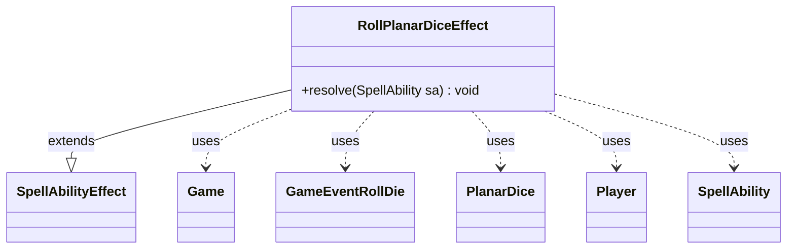

---
aliases:
  - RollPlanarDiceEffect
tags:
  - java/class
  - module/forge-game
  - pkg/forge/game/ability/effects
fqn: forge.game.ability.effects.RollPlanarDiceEffect
package: forge.game.ability.effects
module: forge-game
kind: Class
---

# RollPlanarDiceEffect

**Package:** `forge.game.ability.effects` &nbsp; **Module:** `forge-game` &nbsp; **Kind:** Class



## Relationships
**Extends:**
- [[forge.game.ability.SpellAbilityEffect|SpellAbilityEffect]]
**Uses:**
- [[forge.game.Game|Game]]
- [[forge.game.PlanarDice|PlanarDice]]
- [[forge.game.event.GameEventRollDie|GameEventRollDie]]
- [[forge.game.player.Player|Player]]
- [[forge.game.spellability.SpellAbility|SpellAbility]]


## Design Description

RollPlanarDiceEffect is a concrete `SpellAbilityEffect` that resolves the rolling of the planar die in a Planechase game. It overrides the single `resolve(SpellAbility)` method to slot into Forge's ability-factory framework, extracting the activating `Player` and its `Game` from the passed `SpellAbility`. After guarding against non-Planechase games (no active planes), it optionally increments the turn's planar-dice special-action count, fires a `GameEventRollDie` so the UI plays the roll sound, delegates the random outcome to `PlanarDice.roll`, and reports a localized result through the game's notification channel. The design keeps the class a thin, stateless coordinator: randomization lives in `PlanarDice`, presentation in the event/notification system, and this effect merely orchestrates the interaction between the spell ability and game state.

## Source
`forge-game/src/main/java/forge/game/ability/effects/RollPlanarDiceEffect.java`

```java
package forge.game.ability.effects;

import forge.game.Game;
import forge.game.PlanarDice;
import forge.game.ability.SpellAbilityEffect;
import forge.game.event.GameEventRollDie;
import forge.game.player.Player;
import forge.game.spellability.SpellAbility;
import forge.util.Localizer;

/**
 * TODO: Write javadoc for this type.
 *
 */
public class RollPlanarDiceEffect extends SpellAbilityEffect {

    /* (non-Javadoc)
     * @see forge.card.abilityfactory.SpellEffect#resolve(forge.card.spellability.SpellAbility)
     */
    @Override
    public void resolve(SpellAbility sa) {
        final Player activator = sa.getActivatingPlayer();
        final Game game = activator.getGame();

        if (game.getActivePlanes() == null) { // not a planechase game, nothing happens
            return;
        }
        if (sa.hasParam("SpecialAction")) {
            game.getPhaseHandler().incPlanarDiceSpecialActionThisTurn();
        }
        // Play the die roll sound
        game.fireEvent(new GameEventRollDie());
        PlanarDice result = PlanarDice.roll(activator, null);
        String message = Localizer.getInstance().getMessage("lblPlanarDiceResult", result.toString());
        game.getAction().notifyOfValue(sa, activator, message, null);
    }
}
```

## Python
`forge/game/ability/effects/RollPlanarDiceEffect.py`

```python
from forge.game.Game import Game
from forge.game.PlanarDice import PlanarDice
from forge.game.ability.SpellAbilityEffect import SpellAbilityEffect
from forge.game.event.GameEventRollDie import GameEventRollDie
from forge.game.player.Player import Player
from forge.game.spellability.SpellAbility import SpellAbility
from forge.util.Localizer import Localizer


# TODO: Write javadoc for this type.
class RollPlanarDiceEffect(SpellAbilityEffect):

    # (non-Javadoc)
    # @see forge.card.abilityfactory.SpellEffect#resolve(forge.card.spellability.SpellAbility)
    def resolve(self, sa: SpellAbility) -> None:
        activator = sa.getActivatingPlayer()
        game = activator.getGame()

        if game.getActivePlanes() is None:  # not a planechase game, nothing happens
            return
        if sa.hasParam("SpecialAction"):
            game.getPhaseHandler().incPlanarDiceSpecialActionThisTurn()
        # Play the die roll sound
        game.fireEvent(GameEventRollDie())
        result = PlanarDice.roll(activator, None)
        message = Localizer.getInstance().getMessage("lblPlanarDiceResult", result.toString())
        game.getAction().notifyOfValue(sa, activator, message, None)
```
