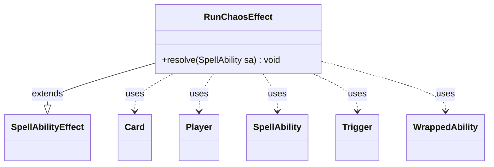

---
aliases:
  - RunChaosEffect
tags:
  - java/class
  - module/forge-game
  - pkg/forge/game/ability/effects
fqn: forge.game.ability.effects.RunChaosEffect
package: forge.game.ability.effects
module: forge-game
kind: Class
---

# RunChaosEffect

**Package:** `forge.game.ability.effects` &nbsp; **Module:** `forge-game` &nbsp; **Kind:** Class



## Relationships
**Extends:**
- [[forge.game.ability.SpellAbilityEffect|SpellAbilityEffect]]
**Uses:**
- [[forge.game.card.Card|Card]]
- [[forge.game.player.Player|Player]]
- [[forge.game.spellability.SpellAbility|SpellAbility]]
- [[forge.game.trigger.Trigger|Trigger]]
- [[forge.game.trigger.WrappedAbility|WrappedAbility]]

## Design Description

RunChaosEffect is a concrete spell-ability effect that implements Magic's "Chaos Ensues" planar mechanic, run when a resolving ability triggers it. Extending `SpellAbilityEffect`, it overrides `resolve` to iterate over each target `Card`'s triggers, selecting those whose mode is `TriggerType.ChaosEnsues`. For each match it copies the trigger's ability for the activating `Player`, then inspects `OptionalDecider` and `Cost` parameters to mark the ability optional and determine which player decides. Each qualifying trigger is wrapped in a `WrappedAbility` and accumulated into a list. Rather than executing the abilities itself, the effect delegates to the activating player's controller via `orderAndPlaySimultaneousSa`, so several simultaneous chaos triggers can be ordered and resolved together. This keeps the class narrowly responsible for discovering and packaging chaos triggers, leaving ordering and presentation to the controller.

## Source
`forge-game/src/main/java/forge/game/ability/effects/RunChaosEffect.java`

```java
package forge.game.ability.effects;

import com.google.common.collect.Lists;
import forge.game.ability.AbilityUtils;
import forge.game.ability.SpellAbilityEffect;
import forge.game.card.Card;
import forge.game.player.Player;
import forge.game.spellability.SpellAbility;
import forge.game.trigger.Trigger;
import forge.game.trigger.TriggerType;
import forge.game.trigger.WrappedAbility;

import java.util.List;

public class RunChaosEffect extends SpellAbilityEffect {

    @Override
    public void resolve(SpellAbility sa) {
        List<SpellAbility> validSA = Lists.newArrayList();
        for (final Card c : getTargetCards(sa)) {
            for (Trigger t : c.getTriggers()) {
                if (t.getMode() == TriggerType.ChaosEnsues) {
                    SpellAbility triggerSA = t.ensureAbility().copy(sa.getActivatingPlayer());

                    Player decider = sa.getActivatingPlayer();
                    if (t.hasParam("OptionalDecider")) {
                        sa.setOptionalTrigger(true);
                        decider = AbilityUtils.getDefinedPlayers(c, t.getParam("OptionalDecider"), sa).get(0);
                    } else if (t.hasParam("Cost")) {
                        sa.setOptionalTrigger(true);
                    }

                    final WrappedAbility wrapperAbility = new WrappedAbility(t, triggerSA, decider);
                    validSA.add(wrapperAbility);
                }
            }
        }
        sa.getActivatingPlayer().getController().orderAndPlaySimultaneousSa(validSA);
    }
}
```
