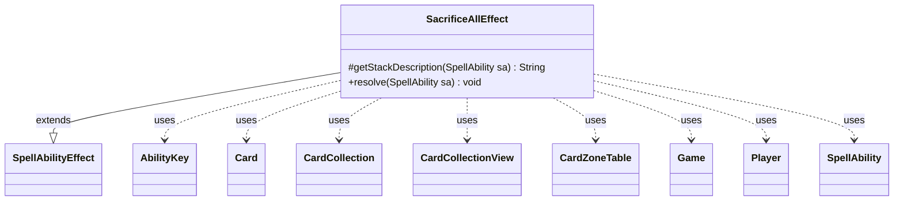

---
aliases:
  - SacrificeAllEffect
tags:
  - java/class
  - module/forge-game
  - pkg/forge/game/ability/effects
fqn: forge.game.ability.effects.SacrificeAllEffect
package: forge.game.ability.effects
module: forge-game
kind: Class
---

# SacrificeAllEffect

**Package:** `forge.game.ability.effects`   **Module:** `forge-game`   **Kind:** Class



## Relationships
**Extends:**
- [[forge.game.ability.SpellAbilityEffect|SpellAbilityEffect]]
**Uses:**
- [[forge.game.Game|Game]]
- [[forge.game.ability.AbilityKey|AbilityKey]]
- [[forge.game.card.Card|Card]]
- [[forge.game.card.CardCollection|CardCollection]]
- [[forge.game.card.CardCollectionView|CardCollectionView]]
- [[forge.game.card.CardZoneTable|CardZoneTable]]
- [[forge.game.player.Player|Player]]
- [[forge.game.spellability.SpellAbility|SpellAbility]]

## Design Description

SacrificeAllEffect implements the resolution logic for "sacrifice all/multiple permanents" style abilities in Forge's MTG engine. As a concrete subclass of `SpellAbilityEffect`, it overrides `getStackDescription` to render a human-readable summary of what is being sacrificed (optionally naming a controlling player or a defined card set), and `resolve` to carry out the effect. Its responsibility is to determine the target set—either an explicitly `Defined` collection or all battlefield permanents filtered by `ValidCards`—then validate each candidate via `canBeSacrificedBy`, refresh cards to current game state to avoid last-known-information staleness, optionally restrict by `Controller`, and order them by owner before sacrificing.

The class collaborates with `Game` and the action system to perform zone changes, using a `CardZoneTable` and `AbilityKey` parameter map to batch and trigger all zone-change events together. Notable design intent includes the LKI refresh pass, owner-based ordering for graveyard placement, and optional remembering or imprinting of sacrificed cards on the host, supporting card-specific follow-up effects.

## Source
`forge-game/src/main/java/forge/game/ability/effects/SacrificeAllEffect.java`

```java
package forge.game.ability.effects;

import java.util.List;
import java.util.Map;

import forge.game.Game;
import forge.game.GameActionUtil;
import forge.game.ability.AbilityKey;
import forge.game.ability.AbilityUtils;
import forge.game.ability.SpellAbilityEffect;
import forge.game.card.*;
import forge.game.player.Player;
import forge.game.spellability.SpellAbility;
import forge.game.zone.ZoneType;
import forge.util.Lang;

public class SacrificeAllEffect extends SpellAbilityEffect {

    @Override
    protected String getStackDescription(SpellAbility sa) {
        // when getStackDesc is called, just build exactly what is happening
        final StringBuilder sb = new StringBuilder();

        if (sa.hasParam("Controller")) {
            List<Player> conts = getDefinedPlayersOrTargeted(sa, "Controller");
            sb.append(Lang.joinHomogenous(conts)).append(conts.size() == 1 ? " sacrifices " : " sacrifice ");
        } else {
            sb.append("Sacrifice ");
        }
        if (sa.hasParam("Defined")) {
            List<Card> toSac = getDefinedCardsOrTargeted(sa);
            sb.append(Lang.joinHomogenous(toSac)).append(".");
        } else {
            sb.append("permanents.");
        }
        return sb.toString();
    }

    @Override
    public void resolve(SpellAbility sa) {
        final Card host = sa.getHostCard();
        final Player activator = sa.getActivatingPlayer();
        final Game game = activator.getGame();

        CardCollectionView list;
        if (sa.hasParam("Defined")) {
            list = AbilityUtils.getDefinedCards(host, sa.getParam("Defined"), sa);
        } else {
            list = game.getCardsIn(ZoneType.Battlefield);
            if (sa.hasParam("ValidCards")) {
                list = AbilityUtils.filterListByType(list, sa.getParam("ValidCards"), sa);
            }
        }

        final boolean remSacrificed = sa.hasParam("RememberSacrificed");
        if (remSacrificed) {
            host.clearRemembered();
        }

        // update cards that where using LKI
        CardCollection gameList = new CardCollection();
        for (Card sac : list) {
            if (!sac.canBeSacrificedBy(sa, true)) {
                continue;
            }
            gameList.add(game.getCardState(sac, null));
        }

        list = gameList;

        // Do controller check after LKI got updated
        if (sa.hasParam("Controller")) {
            list = CardLists.filterControlledBy(list, AbilityUtils.getDefinedPlayers(sa.getHostCard(), sa.getParam("Controller"), sa));
        }

        list = GameActionUtil.orderCardsByTheirOwners(game, list, ZoneType.Graveyard, sa);

        Map<AbilityKey, Object> params = AbilityKey.newMap();
        CardZoneTable zoneMovements = AbilityKey.addCardZoneTableParams(params, sa);

        for (Card sac : game.getAction().sacrifice(list, sa, true, params)) {
            final Card lKICopy = zoneMovements.getLastStateBattlefield().get(sac);
            if (remSacrificed) {
                host.addRemembered(lKICopy);
            }
            if (sa.hasParam("ImprintSacrificed")) {
                host.addImprintedCard(lKICopy);
            }
        }

        zoneMovements.triggerChangesZoneAll(game, sa);
    }

}
```

## Python
`forge/game/ability/effects/SacrificeAllEffect.py`

```python
package = "forge.game.ability.effects"

Let me write the Python port.

The module corresponds to fqn `forge.game.ability.effects.SacrificeAllEffect`.

Imports from Java:
- forge.game.Game -> from forge.game.Game import Game
- forge.game.GameActionUtil -> from forge.game.GameActionUtil import GameActionUtil
- forge.game.ability.AbilityKey -> from forge.game.ability.AbilityKey import AbilityKey
- forge.game.ability.AbilityUtils -> from forge.game.ability.AbilityUtils import AbilityUtils
- forge.game.ability.SpellAbilityEffect -> from forge.game.ability.SpellAbilityEffect import SpellAbilityEffect
- forge.game.card.* -> wildcard; specific used: Card, CardCollection, CardCollectionView, CardZoneTable, CardLists. Relationships lists Card, CardCollection, CardCollectionView, CardZoneTable. CardLists also used but not in relationships. It's used. I should import it. The rules say import specific symbols actually used; their FQNs are in Relationships. CardLists not in relationships but used. I'll import it as forge.game.card.CardLists.
- forge.game.player.Player -> Player
- forge.game.spellability.SpellAbility -> SpellAbility
- forge.game.zone.ZoneType -> ZoneType
- forge.util.Lang -> Lang

Let me write it.from forge.game.Game import Game
from forge.game.GameActionUtil import GameActionUtil
from forge.game.ability.AbilityKey import AbilityKey
from forge.game.ability.AbilityUtils import AbilityUtils
from forge.game.ability.SpellAbilityEffect import SpellAbilityEffect
from forge.game.card.Card import Card
from forge.game.card.CardCollection import CardCollection
from forge.game.card.CardCollectionView import CardCollectionView
from forge.game.card.CardLists import CardLists
from forge.game.card.CardZoneTable import CardZoneTable
from forge.game.player.Player import Player
from forge.game.spellability.SpellAbility import SpellAbility
from forge.game.zone.ZoneType import ZoneType
from forge.util.Lang import Lang


class SacrificeAllEffect(SpellAbilityEffect):

    def getStackDescription(self, sa: SpellAbility) -> str:
        # when getStackDesc is called, just build exactly what is happening
        sb = []

        if sa.hasParam("Controller"):
            conts = self.getDefinedPlayersOrTargeted(sa, "Controller")
            sb.append(Lang.joinHomogenous(conts))
            sb.append(" sacrifices " if len(conts) == 1 else " sacrifice ")
        else:
            sb.append("Sacrifice ")
        if sa.hasParam("Defined"):
            toSac = self.getDefinedCardsOrTargeted(sa)
            sb.append(Lang.joinHomogenous(toSac))
            sb.append(".")
        else:
            sb.append("permanents.")
        return "".join(sb)

    def resolve(self, sa: SpellAbility) -> None:
        host = sa.getHostCard()
        activator = sa.getActivatingPlayer()
        game = activator.getGame()

        list = None
        if sa.hasParam("Defined"):
            list = AbilityUtils.getDefinedCards(host, sa.getParam("Defined"), sa)
        else:
            list = game.getCardsIn(ZoneType.Battlefield)
            if sa.hasParam("ValidCards"):
                list = AbilityUtils.filterListByType(list, sa.getParam("ValidCards"), sa)

        remSacrificed = sa.hasParam("RememberSacrificed")
        if remSacrificed:
            host.clearRemembered()

        # update cards that where using LKI
        gameList = CardCollection()
        for sac in list:
            if not sac.canBeSacrificedBy(sa, True):
                continue
            gameList.add(game.getCardState(sac, None))

        list = gameList

        # Do controller check after LKI got updated
        if sa.hasParam("Controller"):
            list = CardLists.filterControlledBy(list, AbilityUtils.getDefinedPlayers(sa.getHostCard(), sa.getParam("Controller"), sa))

        list = GameActionUtil.orderCardsByTheirOwners(game, list, ZoneType.Graveyard, sa)

        params = AbilityKey.newMap()
        zoneMovements = AbilityKey.addCardZoneTableParams(params, sa)

        for sac in game.getAction().sacrifice(list, sa, True, params):
            lKICopy = zoneMovements.getLastStateBattlefield().get(sac)
            if remSacrificed:
                host.addRemembered(lKICopy)
            if sa.hasParam("ImprintSacrificed"):
                host.addImprintedCard(lKICopy)

        zoneMovements.triggerChangesZoneAll(game, sa)
```
