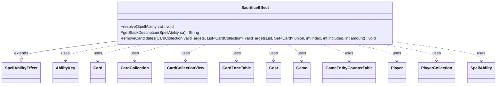

---
aliases:
  - SacrificeEffect
tags:
  - java/class
  - module/forge-game
  - pkg/forge/game/ability/effects
fqn: forge.game.ability.effects.SacrificeEffect
package: forge.game.ability.effects
module: forge-game
kind: Class
---

# SacrificeEffect

**Package:** `forge.game.ability.effects`   **Module:** `forge-game`   **Kind:** Class



## Relationships
**Extends:**
- [[forge.game.ability.SpellAbilityEffect|SpellAbilityEffect]]
**Uses:**
- [[forge.game.Game|Game]]
- [[forge.game.GameEntityCounterTable|GameEntityCounterTable]]
- [[forge.game.ability.AbilityKey|AbilityKey]]
- [[forge.game.card.Card|Card]]
- [[forge.game.card.CardCollection|CardCollection]]
- [[forge.game.card.CardCollectionView|CardCollectionView]]
- [[forge.game.card.CardZoneTable|CardZoneTable]]
- [[forge.game.cost.Cost|Cost]]
- [[forge.game.player.Player|Player]]
- [[forge.game.player.PlayerCollection|PlayerCollection]]
- [[forge.game.spellability.SpellAbility|SpellAbility]]

## Design Description

SacrificeEffect implements the resolution logic for "sacrifice" abilities, extending the abstract `SpellAbilityEffect` base class by overriding `resolve` to mutate game state and `getStackDescription` to render a human-readable summary. Driven entirely by `SpellAbility` parameters, it handles a broad family of effects—plain sacrifice, Echo and Cumulative Upkeep cost payments, optional/random/strict selection, and the Devour and Exploit keywords—as well as a Destroy variant that routes through destruction rather than sacrifice.

It collaborates with `Game` and its action layer to move cards, filters `CardCollection`/`CardCollectionView` candidates by `SacValid` type, and fires triggers via `AbilityKey`-keyed parameter maps. Notable design intent includes using a `CardZoneTable` and last-known-state copies to remember sacrificed cards correctly after they leave the battlefield, and a recursive `removeCandidates` helper that prunes overlapping valid-target sets so multi-type "SacEachValid" choices remain satisfiable.

## Source
`forge-game/src/main/java/forge/game/ability/effects/SacrificeEffect.java`

```java
package forge.game.ability.effects;

import java.util.ArrayList;
import java.util.HashSet;
import java.util.List;
import java.util.Map;
import java.util.Set;

import forge.game.card.*;
import forge.util.Lang;
import org.apache.commons.lang3.StringUtils;

import forge.card.mana.ManaCost;
import forge.game.Game;
import forge.game.GameActionUtil;
import forge.game.GameEntityCounterTable;
import forge.game.ability.AbilityKey;
import forge.game.ability.AbilityUtils;
import forge.game.ability.SpellAbilityEffect;
import forge.game.cost.Cost;
import forge.game.keyword.Keyword;
import forge.game.player.Player;
import forge.game.player.PlayerCollection;
import forge.game.spellability.SpellAbility;
import forge.game.trigger.TriggerType;
import forge.game.zone.ZoneType;
import forge.util.Aggregates;
import forge.util.Localizer;

public class SacrificeEffect extends SpellAbilityEffect {

    @Override
    public void resolve(SpellAbility sa) {
        final Player activator = sa.getActivatingPlayer();
        final Game game = activator.getGame();
        final Card host = sa.getHostCard();

        if (sa.hasParam("Echo")) {
            boolean isPaid;
            if (activator.hasKeyword("You may pay 0 rather than pay the echo cost for permanents you control.")
                    && activator.getController().confirmAction(sa, null, Localizer.getInstance().getMessage("lblDoYouWantPayEcho") + " {0}?", null)) {
                isPaid = true;
            } else {
                isPaid = activator.getController().payCostToPreventEffect(new Cost(sa.getParam("Echo"), true), sa, false, new PlayerCollection(activator));
            }
            final Map<AbilityKey, Object> runParams = AbilityKey.mapFromCard(host);
            runParams.put(AbilityKey.EchoPaid, isPaid);
            game.getTriggerHandler().runTrigger(TriggerType.PayEcho, runParams, false);
            if (isPaid || !host.getController().equals(activator)) {
                return;
            }
        } else if (sa.hasParam("CumulativeUpkeep")) {
            GameEntityCounterTable table = new GameEntityCounterTable();
            host.addCounter(CounterEnumType.AGE, 1, activator, table);

            table.replaceCounterEffect(game, sa);

            Cost payCost = new Cost(ManaCost.ZERO, true);
            int n = host.getCounters(CounterEnumType.AGE);
            if (n > 0) {
                Cost cumCost = new Cost(sa.getParam("CumulativeUpkeep"), true);
                payCost.mergeTo(cumCost, n, sa);
            }

            game.updateLastStateForCard(host);

            boolean isPaid = activator.getController().payCostToPreventEffect(payCost, sa, false, new PlayerCollection(activator));
            final Map<AbilityKey, Object> runParams = AbilityKey.mapFromCard(host);
            runParams.put(AbilityKey.CumulativeUpkeepPaid, isPaid);
            runParams.put(AbilityKey.PayingMana, StringUtils.join(sa.getPayingMana(), ""));
            game.getTriggerHandler().runTrigger(TriggerType.PayCumulativeUpkeep, runParams, false);
            if (isPaid || !host.getController().equals(activator)) {
                return;
            }
        }

        // Expand Sacrifice keyword here depending on what we need out of it.
        final int amount = AbilityUtils.calculateAmount(host, sa.getParamOrDefault("Amount", "1"), sa);
        final boolean sacEachValid = sa.hasParam("SacEachValid");

        String valid = sa.getParamOrDefault("SacValid", "Self");
        String msg;
        if (sa.hasParam("SacMessage")) {
            msg = sa.getParam("SacMessage");
        } else {
            msg = Lang.getInstance().buildValidDesc(List.of(valid.split(",")), false);
        }

        final boolean destroy = sa.hasParam("Destroy");
        final boolean remSacrificed = sa.hasParam("RememberSacrificed");
        final boolean optional = sa.hasParam("Optional");
        Map<AbilityKey, Object> params = AbilityKey.newMap();
        CardZoneTable zoneMovements = AbilityKey.addCardZoneTableParams(params, sa);

        if (valid.equals("Self") && game.getZoneOf(host) != null) {
            if (host.getController().equals(activator) && game.getZoneOf(host).is(ZoneType.Battlefield) &&
                    (!optional || activator.getController().confirmAction(sa, null,
                        Localizer.getInstance().getMessage("lblDoYouWantSacrificeThis", host.getDisplayName()), null))) {
                if (game.getAction().sacrifice(new CardCollection(host), sa, true, params) != null && remSacrificed) {
                    host.addRemembered(host);
                }
            }
        } else {
            CardCollectionView choosenToSacrifice = null;
            for (final Player p : getTargetPlayers(sa)) {
                CardCollection battlefield = new CardCollection(p.getCardsIn(ZoneType.Battlefield));
                battlefield.removeIf(c -> !zoneMovements.getLastStateBattlefield().contains(c));

                if (sacEachValid) { // Sacrifice maximum permanents in any combination of types specified by SacValid
                    String [] validArray = valid.split(" & ");
                    String [] msgArray = msg.split(" & ");
                    List<CardCollection> validTargetsList = new ArrayList<>(validArray.length);
                    for (String subValid : validArray) {
                        CardCollection validTargets = CardLists.filter(AbilityUtils.filterListByType(battlefield, subValid, sa), CardPredicates.canBeSacrificedBy(sa, true));
                        validTargetsList.add(validTargets);
                    }
                    CardCollection chosenCards = new CardCollection();
                    for (int i = 0; i < validArray.length; ++i) {
                        CardCollection validTargets = validTargetsList.get(i);
                        if (validTargets.isEmpty()) continue;
                        if (validTargets.size() > 1 && i < validArray.length - 1) {
                            removeCandidates(validTargets, validTargetsList, new HashSet<>(), i + 1, 0, amount);
                        }
                        choosenToSacrifice = p.getController().choosePermanentsToSacrifice(sa, amount, amount, validTargets, msgArray[i]);
                        for (int j = i + 1; j < validArray.length; ++j) {
                            validTargetsList.get(j).removeAll(choosenToSacrifice);
                        }
                        chosenCards.addAll(choosenToSacrifice);
                    }
                    choosenToSacrifice = chosenCards;
                } else {
                    CardCollectionView validTargets = AbilityUtils.filterListByType(battlefield, valid, sa);
                    if (!destroy) {
                        validTargets = CardLists.filter(validTargets, CardPredicates.canBeSacrificedBy(sa, true));
                    }

                    boolean isStrict = sa.hasParam("StrictAmount");
                    int minTargets = optional && !isStrict ? 0 : amount;
                    boolean notEnoughTargets = isStrict && validTargets.size() < minTargets;

                    if (sa.hasParam("Random")) {
                        choosenToSacrifice = new CardCollection(Aggregates.random(validTargets, Math.min(amount, validTargets.size())));
                    } else if (notEnoughTargets || (optional && !p.getController().confirmAction(sa, null, Localizer.getInstance().getMessage("lblDoYouWantSacrifice"), null))) {
                        choosenToSacrifice = CardCollection.EMPTY;
                    } else {
                        choosenToSacrifice = destroy ?
                                p.getController().choosePermanentsToDestroy(sa, minTargets, amount, validTargets, msg) :
                                    p.getController().choosePermanentsToSacrifice(sa, minTargets, amount, validTargets, msg);
                    }
                }

                choosenToSacrifice = GameActionUtil.orderCardsByTheirOwners(game, choosenToSacrifice, ZoneType.Graveyard, sa);

                if (destroy) {
                    for (Card sac : choosenToSacrifice) {
                        Card lKICopy = zoneMovements.getLastStateBattlefield().get(sac);
                        if (game.getAction().destroy(sac, sa, true, params) && remSacrificed) {
                            host.addRemembered(lKICopy);
                        }
                    }
                } else {
                    for (Card sac : game.getAction().sacrifice(choosenToSacrifice, sa, true, params)) {
                        Card lKICopy = zoneMovements.getLastStateBattlefield().get(sac);
                        if (sa.isKeyword(Keyword.DEVOUR)) {
                            host.addDevoured(lKICopy);
                            final Map<AbilityKey, Object> runParams = AbilityKey.newMap();
                            runParams.put(AbilityKey.Devoured, lKICopy);
                            game.getTriggerHandler().runTrigger(TriggerType.Devoured, runParams, false);
                        }
                        if (sa.isKeyword(Keyword.EXPLOIT)) {
                            host.addExploited(lKICopy);
                            final Map<AbilityKey, Object> runParams = AbilityKey.mapFromCard(host);
                            runParams.put(AbilityKey.Exploited, lKICopy);
                            game.getTriggerHandler().runTrigger(TriggerType.Exploited, runParams, false);
                        }
                        if (remSacrificed) {
                            host.addRemembered(lKICopy);
                        }
                    }
                }
            }
        }

        zoneMovements.triggerChangesZoneAll(game, sa);
    }

    @Override
    protected String getStackDescription(SpellAbility sa) {
        final StringBuilder sb = new StringBuilder();

        final List<Player> tgts = getTargetPlayers(sa);

        String valid = sa.getParamOrDefault("SacValid", "Self");
        String num = sa.getParamOrDefault("Amount", "1");

        if (sa.hasParam("Optional")) { // TODO make boolean and handle verb reconjugation throughout
            sb.append("(OPTIONAL) ");
        }

        final int amount = AbilityUtils.calculateAmount(sa.getHostCard(), num, sa);

        if (valid.equals("Self")) {
            sb.append("Sacrifices ").append(sa.getHostCard());
        } else if (valid.equals("Card.AttachedBy")) {
            final Card toSac = sa.getHostCard().getEnchantingCard();
            sb.append(toSac.getController()).append(" sacrifices ").append(toSac).append(".");
        } else {
            sb.append(Lang.joinHomogenous(tgts)).append(" ");
            boolean oneTgtP = tgts.size() == 1;

            String msg;
            if (sa.hasParam("SacMessage")) {
                msg = sa.getParam("SacMessage");
            } else {
                msg = Lang.getInstance().buildValidDesc(List.of(valid.split(",")), false);
            }

            if (sa.hasParam("Destroy")) {
                sb.append(oneTgtP ? "destroys " : " destroy ");
            } else {
                sb.append(oneTgtP ? "sacrifices " : "sacrifice ");
            }
            sb.append(Lang.nounWithNumeralExceptOne(amount, msg)).append(".");
        }

        return sb.toString();
    }

    private void removeCandidates(CardCollection validTargets, List<CardCollection> validTargetsList, Set<Card> union, int index, int included, int amount) {
        if (index >= validTargetsList.size()) {
            if (union.size() <= included * amount) {
                validTargets.removeAll(union);
            }
            return;
        }

        removeCandidates(validTargets, validTargetsList, union, index + 1, included, amount);

        CardCollection candidate = validTargetsList.get(index);
        if (candidate.isEmpty()) {
            return;
        }

        if (union.isEmpty()) {
            if (candidate.size() <= amount) {
                validTargets.removeAll(candidate.asSet());
            } else {
                removeCandidates(validTargets, validTargetsList, candidate.asSet(), index + 1, included + 1, amount);
            }
        } else {
            Set<Card> unionClone = new HashSet<>(union);
            unionClone.addAll(candidate.asSet());
            removeCandidates(validTargets, validTargetsList, unionClone, index + 1, included + 1, amount);
        }
    }
}
```

## Python
`forge/game/ability/effects/SacrificeEffect.py`

```python
from typing import List, Set, Dict

from forge.game.card.Card import Card
from forge.game.card.CardCollection import CardCollection
from forge.game.card.CardCollectionView import CardCollectionView
from forge.game.card.CardLists import CardLists
from forge.game.card.CardPredicates import CardPredicates
from forge.game.card.CounterEnumType import CounterEnumType
from forge.util.Lang import Lang
from org.apache.commons.lang3.StringUtils import StringUtils

from forge.card.mana.ManaCost import ManaCost
from forge.game.Game import Game
from forge.game.GameActionUtil import GameActionUtil
from forge.game.GameEntityCounterTable import GameEntityCounterTable
from forge.game.ability.AbilityKey import AbilityKey
from forge.game.ability.AbilityUtils import AbilityUtils
from forge.game.ability.SpellAbilityEffect import SpellAbilityEffect
from forge.game.cost.Cost import Cost
from forge.game.keyword.Keyword import Keyword
from forge.game.player.Player import Player
from forge.game.player.PlayerCollection import PlayerCollection
from forge.game.spellability.SpellAbility import SpellAbility
from forge.game.trigger.TriggerType import TriggerType
from forge.game.zone.ZoneType import ZoneType
from forge.util.Aggregates import Aggregates
from forge.util.Localizer import Localizer


class SacrificeEffect(SpellAbilityEffect):

    def resolve(self, sa: SpellAbility) -> None:
        activator = sa.getActivatingPlayer()
        game = activator.getGame()
        host = sa.getHostCard()

        if sa.hasParam("Echo"):
            if (activator.hasKeyword("You may pay 0 rather than pay the echo cost for permanents you control.")
                    and activator.getController().confirmAction(sa, None, Localizer.getInstance().getMessage("lblDoYouWantPayEcho") + " {0}?", None)):
                isPaid = True
            else:
                isPaid = activator.getController().payCostToPreventEffect(Cost(sa.getParam("Echo"), True), sa, False, PlayerCollection(activator))
            runParams = AbilityKey.mapFromCard(host)
            runParams[AbilityKey.EchoPaid] = isPaid
            game.getTriggerHandler().runTrigger(TriggerType.PayEcho, runParams, False)
            if isPaid or not host.getController().equals(activator):
                return
        elif sa.hasParam("CumulativeUpkeep"):
            table = GameEntityCounterTable()
            host.addCounter(CounterEnumType.AGE, 1, activator, table)

            table.replaceCounterEffect(game, sa)

            payCost = Cost(ManaCost.ZERO, True)
            n = host.getCounters(CounterEnumType.AGE)
            if n > 0:
                cumCost = Cost(sa.getParam("CumulativeUpkeep"), True)
                payCost.mergeTo(cumCost, n, sa)

            game.updateLastStateForCard(host)

            isPaid = activator.getController().payCostToPreventEffect(payCost, sa, False, PlayerCollection(activator))
            runParams = AbilityKey.mapFromCard(host)
            runParams[AbilityKey.CumulativeUpkeepPaid] = isPaid
            runParams[AbilityKey.PayingMana] = StringUtils.join(sa.getPayingMana(), "")
            game.getTriggerHandler().runTrigger(TriggerType.PayCumulativeUpkeep, runParams, False)
            if isPaid or not host.getController().equals(activator):
                return

        # Expand Sacrifice keyword here depending on what we need out of it.
        amount = AbilityUtils.calculateAmount(host, sa.getParamOrDefault("Amount", "1"), sa)
        sacEachValid = sa.hasParam("SacEachValid")

        valid = sa.getParamOrDefault("SacValid", "Self")
        if sa.hasParam("SacMessage"):
            msg = sa.getParam("SacMessage")
        else:
            msg = Lang.getInstance().buildValidDesc(list(valid.split(",")), False)

        destroy = sa.hasParam("Destroy")
        remSacrificed = sa.hasParam("RememberSacrificed")
        optional = sa.hasParam("Optional")
        params = AbilityKey.newMap()
        zoneMovements = AbilityKey.addCardZoneTableParams(params, sa)

        if valid == "Self" and game.getZoneOf(host) is not None:
            if (host.getController().equals(activator) and game.getZoneOf(host).is_(ZoneType.Battlefield) and
                    (not optional or activator.getController().confirmAction(sa, None,
                        Localizer.getInstance().getMessage("lblDoYouWantSacrificeThis", host.getDisplayName()), None))):
                if game.getAction().sacrifice(CardCollection(host), sa, True, params) is not None and remSacrificed:
                    host.addRemembered(host)
        else:
            choosenToSacrifice = None
            for p in self.getTargetPlayers(sa):
                battlefield = CardCollection(p.getCardsIn(ZoneType.Battlefield))
                battlefield.removeIf(lambda c: c not in zoneMovements.getLastStateBattlefield())

                if sacEachValid:  # Sacrifice maximum permanents in any combination of types specified by SacValid
                    validArray = valid.split(" & ")
                    msgArray = msg.split(" & ")
                    validTargetsList: List[CardCollection] = []
                    for subValid in validArray:
                        validTargets = CardLists.filter(AbilityUtils.filterListByType(battlefield, subValid, sa), CardPredicates.canBeSacrificedBy(sa, True))
                        validTargetsList.append(validTargets)
                    chosenCards = CardCollection()
                    for i in range(len(validArray)):
                        validTargets = validTargetsList[i]
                        if validTargets.isEmpty():
                            continue
                        if validTargets.size() > 1 and i < len(validArray) - 1:
                            self.removeCandidates(validTargets, validTargetsList, set(), i + 1, 0, amount)
                        choosenToSacrifice = p.getController().choosePermanentsToSacrifice(sa, amount, amount, validTargets, msgArray[i])
                        for j in range(i + 1, len(validArray)):
                            validTargetsList[j].removeAll(choosenToSacrifice)
                        chosenCards.addAll(choosenToSacrifice)
                    choosenToSacrifice = chosenCards
                else:
                    validTargets = AbilityUtils.filterListByType(battlefield, valid, sa)
                    if not destroy:
                        validTargets = CardLists.filter(validTargets, CardPredicates.canBeSacrificedBy(sa, True))

                    isStrict = sa.hasParam("StrictAmount")
                    minTargets = 0 if optional and not isStrict else amount
                    notEnoughTargets = isStrict and validTargets.size() < minTargets

                    if sa.hasParam("Random"):
                        choosenToSacrifice = CardCollection(Aggregates.random(validTargets, min(amount, validTargets.size())))
                    elif notEnoughTargets or (optional and not p.getController().confirmAction(sa, None, Localizer.getInstance().getMessage("lblDoYouWantSacrifice"), None)):
                        choosenToSacrifice = CardCollection.EMPTY
                    else:
                        choosenToSacrifice = (p.getController().choosePermanentsToDestroy(sa, minTargets, amount, validTargets, msg)
                                              if destroy else
                                              p.getController().choosePermanentsToSacrifice(sa, minTargets, amount, validTargets, msg))

                choosenToSacrifice = GameActionUtil.orderCardsByTheirOwners(game, choosenToSacrifice, ZoneType.Graveyard, sa)

                if destroy:
                    for sac in choosenToSacrifice:
                        lKICopy = zoneMovements.getLastStateBattlefield().get(sac)
                        if game.getAction().destroy(sac, sa, True, params) and remSacrificed:
                            host.addRemembered(lKICopy)
                else:
                    for sac in game.getAction().sacrifice(choosenToSacrifice, sa, True, params):
                        lKICopy = zoneMovements.getLastStateBattlefield().get(sac)
                        if sa.isKeyword(Keyword.DEVOUR):
                            host.addDevoured(lKICopy)
                            runParams = AbilityKey.newMap()
                            runParams[AbilityKey.Devoured] = lKICopy
                            game.getTriggerHandler().runTrigger(TriggerType.Devoured, runParams, False)
                        if sa.isKeyword(Keyword.EXPLOIT):
                            host.addExploited(lKICopy)
                            runParams = AbilityKey.mapFromCard(host)
                            runParams[AbilityKey.Exploited] = lKICopy
                            game.getTriggerHandler().runTrigger(TriggerType.Exploited, runParams, False)
                        if remSacrificed:
                            host.addRemembered(lKICopy)

        zoneMovements.triggerChangesZoneAll(game, sa)

    def getStackDescription(self, sa: SpellAbility) -> str:
        sb = []

        tgts = self.getTargetPlayers(sa)

        valid = sa.getParamOrDefault("SacValid", "Self")
        num = sa.getParamOrDefault("Amount", "1")

        if sa.hasParam("Optional"):  # TODO make boolean and handle verb reconjugation throughout
            sb.append("(OPTIONAL) ")

        amount = AbilityUtils.calculateAmount(sa.getHostCard(), num, sa)

        if valid == "Self":
            sb.append("Sacrifices ")
            sb.append(str(sa.getHostCard()))
        elif valid == "Card.AttachedBy":
            toSac = sa.getHostCard().getEnchantingCard()
            sb.append(str(toSac.getController()))
            sb.append(" sacrifices ")
            sb.append(str(toSac))
            sb.append(".")
        else:
            sb.append(Lang.joinHomogenous(tgts))
            sb.append(" ")
            oneTgtP = len(tgts) == 1

            if sa.hasParam("SacMessage"):
                msg = sa.getParam("SacMessage")
            else:
                msg = Lang.getInstance().buildValidDesc(list(valid.split(",")), False)

            if sa.hasParam("Destroy"):
                sb.append("destroys " if oneTgtP else " destroy ")
            else:
                sb.append("sacrifices " if oneTgtP else "sacrifice ")
            sb.append(Lang.nounWithNumeralExceptOne(amount, msg))
            sb.append(".")

        return "".join(sb)

    def removeCandidates(self, validTargets: CardCollection, validTargetsList: List[CardCollection], union: Set[Card], index: int, included: int, amount: int) -> None:
        if index >= len(validTargetsList):
            if len(union) <= included * amount:
                validTargets.removeAll(union)
            return

        self.removeCandidates(validTargets, validTargetsList, union, index + 1, included, amount)

        candidate = validTargetsList[index]
        if candidate.isEmpty():
            return

        if len(union) == 0:
            if candidate.size() <= amount:
                validTargets.removeAll(candidate.asSet())
            else:
                self.removeCandidates(validTargets, validTargetsList, candidate.asSet(), index + 1, included + 1, amount)
        else:
            unionClone = set(union)
            unionClone.update(candidate.asSet())
            self.removeCandidates(validTargets, validTargetsList, unionClone, index + 1, included + 1, amount)
```
