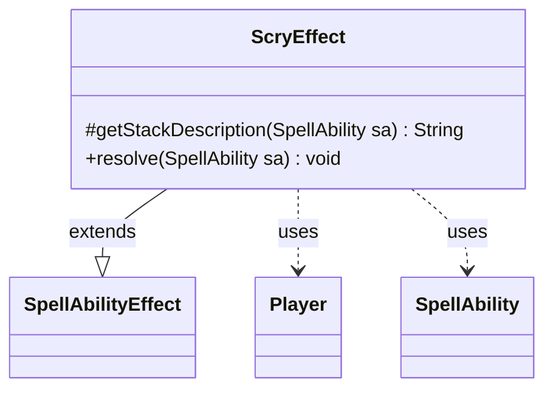

---
aliases:
  - ScryEffect
tags:
  - java/class
  - module/forge-game
  - pkg/forge/game/ability/effects
fqn: forge.game.ability.effects.ScryEffect
package: forge.game.ability.effects
module: forge-game
kind: Class
---

# ScryEffect

**Package:** `forge.game.ability.effects` &nbsp; **Module:** `forge-game` &nbsp; **Kind:** Class



## Relationships
**Extends:**
- [[forge.game.ability.SpellAbilityEffect|SpellAbilityEffect]]
**Uses:**
- [[forge.game.player.Player|Player]]
- [[forge.game.spellability.SpellAbility|SpellAbility]]

## Design Description

Players scry: the targeted players each look at a number of cards from the top of their library and reorder or bin them.

ScryEffect is a concrete spell-ability effect that implements Magic's "scry" keyword action. Extending `SpellAbilityEffect`, it overrides `getStackDescription` to render a grammatically correct stack message (pluralizing "scries"/"scry" by target count) and `resolve` to carry out the action. It reads the optional `ScryNum` parameter via `AbilityUtils` to determine depth, filters target `Player`s to those still in game, and honors an `Optional` flag by prompting each player's controller for confirmation. Rather than manipulating libraries itself, it delegates the actual scry to the game's action layer (`game.getAction().scry`), keeping the effect a thin, declarative adapter between the `SpellAbility` data and the engine's centralized game logic.

## Source
`forge-game/src/main/java/forge/game/ability/effects/ScryEffect.java`

```java
package forge.game.ability.effects;

import java.util.List;

import com.google.common.collect.Lists;

import forge.game.ability.AbilityUtils;
import forge.game.ability.SpellAbilityEffect;
import forge.game.player.Player;
import forge.game.spellability.SpellAbility;
import forge.util.Lang;
import forge.util.Localizer;

public class ScryEffect extends SpellAbilityEffect {
    @Override
    protected String getStackDescription(SpellAbility sa) {
        final StringBuilder sb = new StringBuilder();

        final List<Player> players = getTargetPlayers(sa);
        sb.append(Lang.joinHomogenous(players)).append(" ");

        int num = 1;
        if (sa.hasParam("ScryNum")) {
            num = AbilityUtils.calculateAmount(sa.getHostCard(), sa.getParam("ScryNum"), sa);
        }

        sb.append(players.size() == 1 ? "scries " : "scry ").append(num).append(".");
        return sb.toString();
    }

    @Override
    public void resolve(SpellAbility sa) {
        int num = 1;
        if (sa.hasParam("ScryNum")) {
            num = AbilityUtils.calculateAmount(sa.getHostCard(), sa.getParam("ScryNum"), sa);
        }

        boolean isOptional = sa.hasParam("Optional");
        final List<Player> players = Lists.newArrayList();

        for (final Player p : getTargetPlayers(sa)) {
            if (!p.isInGame()) {
                continue;
            }
            if (!isOptional || p.getController().confirmAction(sa, null, Localizer.getInstance().getMessage("lblDoYouWanttoScry"), null)) {
                players.add(p);
            }
        }
        sa.getActivatingPlayer().getGame().getAction().scry(players, num, sa);
    }
}
```

## Python
`forge/game/ability/effects/ScryEffect.py`

```python
package forge.game.ability.effects

from typing import List

from forge.game.ability.AbilityUtils import AbilityUtils
from forge.game.ability.SpellAbilityEffect import SpellAbilityEffect
from forge.game.player.Player import Player
from forge.game.spellability.SpellAbility import SpellAbility
from forge.util.Lang import Lang
from forge.util.Localizer import Localizer


class ScryEffect(SpellAbilityEffect):
    def getStackDescription(self, sa: SpellAbility) -> str:
        sb = []

        players: List[Player] = self.getTargetPlayers(sa)
        sb.append(Lang.joinHomogenous(players))
        sb.append(" ")

        num = 1
        if sa.hasParam("ScryNum"):
            num = AbilityUtils.calculateAmount(sa.getHostCard(), sa.getParam("ScryNum"), sa)

        sb.append("scries " if len(players) == 1 else "scry ")
        sb.append(str(num))
        sb.append(".")
        return "".join(sb)

    def resolve(self, sa: SpellAbility) -> None:
        num = 1
        if sa.hasParam("ScryNum"):
            num = AbilityUtils.calculateAmount(sa.getHostCard(), sa.getParam("ScryNum"), sa)

        isOptional = sa.hasParam("Optional")
        players: List[Player] = []

        for p in self.getTargetPlayers(sa):
            if not p.isInGame():
                continue
            if not isOptional or p.getController().confirmAction(sa, None, Localizer.getInstance().getMessage("lblDoYouWanttoScry"), None):
                players.append(p)
        sa.getActivatingPlayer().getGame().getAction().scry(players, num, sa)
```
