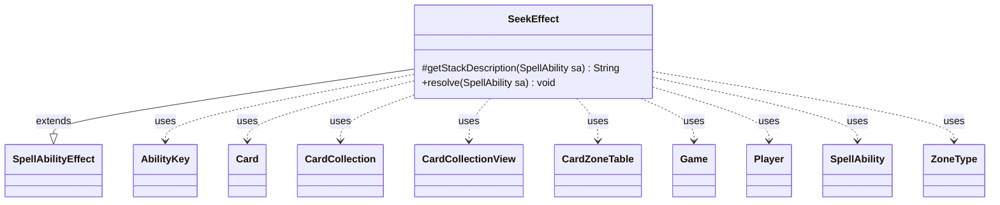

---
aliases:
  - SeekEffect
tags:
  - java/class
  - module/forge-game
  - pkg/forge/game/ability/effects
fqn: forge.game.ability.effects.SeekEffect
package: forge.game.ability.effects
module: forge-game
kind: Class
---

# SeekEffect

**Package:** `forge.game.ability.effects` &nbsp; **Module:** `forge-game` &nbsp; **Kind:** Class



## Relationships
**Extends:**
- [[forge.game.ability.SpellAbilityEffect|SpellAbilityEffect]]
**Uses:**
- [[forge.game.Game|Game]]
- [[forge.game.ability.AbilityKey|AbilityKey]]
- [[forge.game.card.Card|Card]]
- [[forge.game.card.CardCollection|CardCollection]]
- [[forge.game.card.CardCollectionView|CardCollectionView]]
- [[forge.game.card.CardZoneTable|CardZoneTable]]
- [[forge.game.player.Player|Player]]
- [[forge.game.spellability.SpellAbility|SpellAbility]]
- [[forge.game.zone.ZoneType|ZoneType]]

## Design Description

SeekEffect implements the resolution logic for "seek" abilities, where a player randomly retrieves cards matching specified types from their library (or a defined card pool) into their hand. As a concrete subclass of SpellAbilityEffect, it overrides `resolve` to perform the effect and `getStackDescription` to supply the displayed text, fitting Forge's command-style pattern in which each game ability delegates execution to a dedicated effect class. It interprets SpellAbility parameters (Types/Type, Num, DefinedCards, RememberFound, ImprintFound) to drive behavior, using AbilityUtils and CardLists to compute amounts and filter valid candidates and Aggregates.random to pick cards.

Notable design intent: it captures last-known battlefield and graveyard state up front and threads it through move operations via an AbilityKey map, records zone changes in a CardZoneTable so all zone-change triggers fire together at the end, distinguishes cards that actually reached the hand as "sought," and fires the SeekAll trigger per seeker—integrating cleanly with the engine's trigger and zone-tracking subsystems.

## Source
`forge-game/src/main/java/forge/game/ability/effects/SeekEffect.java`

```java
package forge.game.ability.effects;

import com.google.common.collect.Lists;
import forge.game.Game;
import forge.game.ability.AbilityKey;
import forge.game.ability.AbilityUtils;
import forge.game.ability.SpellAbilityEffect;
import forge.game.card.*;
import forge.game.player.Player;
import forge.game.spellability.SpellAbility;
import forge.game.trigger.TriggerType;
import forge.game.zone.ZoneType;
import forge.util.Aggregates;
import forge.util.Localizer;

import java.util.Arrays;
import java.util.List;
import java.util.Map;

public class SeekEffect extends SpellAbilityEffect {

    /* (non-Javadoc)
     * @see forge.game.ability.SpellAbilityEffect#getStackDescription(forge.game.spellability.SpellAbility)
     */
    @Override
    protected String getStackDescription(SpellAbility sa) {
        return sa.getDescription();
    }

    @Override
    public void resolve(SpellAbility sa) {
        final Card source = sa.getHostCard();
        final Game game = source.getGame();

        List<String> seekTypes = Lists.newArrayList();
        if (sa.hasParam("Types")) {
            seekTypes.addAll(Arrays.asList(sa.getParam("Types").split(",")));
        } else {
            seekTypes.add(sa.getParamOrDefault("Type", "Card"));
        }

        int seekNum = AbilityUtils.calculateAmount(source, sa.getParamOrDefault("Num", "1"), sa);
        if (seekNum <= 0) {
            return;
        }

        final CardZoneTable triggerList = new CardZoneTable();
        CardCollectionView lastStateBattlefield = game.copyLastStateBattlefield();
        CardCollectionView lastStateGraveyard = game.copyLastStateGraveyard();

        for (Player seeker : getTargetPlayers(sa)) {
            if (!seeker.isInGame()) {
                continue;
            }

            CardCollection soughtCards = new CardCollection();

            final StringBuilder notify = new StringBuilder();
            for (String seekType : seekTypes) {
                CardCollection pool;
                if (sa.hasParam("DefinedCards")) {
                    pool = AbilityUtils.getDefinedCards(source, sa.getParam("DefinedCards"), sa);
                } else {
                    pool = new CardCollection(seeker.getCardsIn(ZoneType.Library));
                }
                if (!seekType.equals("Card")) {
                    pool = CardLists.getValidCards(pool, seekType, source.getController(), source, sa);
                }
                if (pool.isEmpty()) {
                    if (notify.length() != 0) notify.append("\r\n");
                    notify.append(Localizer.getInstance().getMessage("lblSeekFailed", seekType));
                    continue; // can't find if nothing to seek
                }

                for (final Card c : Aggregates.random(pool, seekNum)) {
                    Map<AbilityKey, Object> moveParams = AbilityKey.newMap();
                    moveParams.put(AbilityKey.LastStateBattlefield, lastStateBattlefield);
                    moveParams.put(AbilityKey.LastStateGraveyard, lastStateGraveyard);
                    Card movedCard = game.getAction().moveToHand(c, sa, moveParams);
                    ZoneType resultZone = movedCard.getZone().getZoneType();
                    if (!resultZone.equals(ZoneType.Library)) { // as long as it moved we add to triggerList
                        triggerList.put(ZoneType.Library, movedCard.getZone().getZoneType(), movedCard);
                    }
                    if (resultZone.equals(ZoneType.Hand)) { // if it went to hand as planned, consider it "sought"
                        soughtCards.add(movedCard);
                    }
                }
            }

            if (notify.length() != 0) {
                game.getAction().notifyOfValue(sa, source, notify.toString(), null);
            }
            if (!soughtCards.isEmpty()) {
                if (sa.hasParam("RememberFound")) {
                    source.addRemembered(soughtCards);
                }
                if (sa.hasParam("ImprintFound")) {
                    source.addImprintedCards(soughtCards);
                }
                final Map<AbilityKey, Object> runParams = AbilityKey.mapFromPlayer(seeker);
                runParams.put(AbilityKey.Cards, soughtCards);
                game.getTriggerHandler().runTrigger(TriggerType.SeekAll, runParams, false);
            }
        }
        triggerList.triggerChangesZoneAll(game, sa);
    }
}
```
